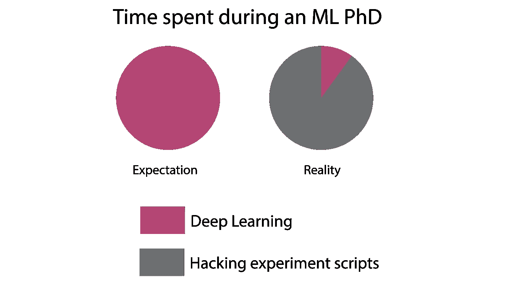

# 我们希望在研究生院拥有的深度学习工具

> 原文：<https://pub.towardsai.net/the-deep-learning-tool-we-wish-we-had-in-grad-school-3107f9a39efa?source=collection_archive---------1----------------------->

## 深度学习

## *如何确定能够修复我们的深度学习基础设施问题*

【作者:】Angela Jiang，Liam Li

机器学习博士生处于一个独特的位置:他们经常需要运行大规模实验来进行最先进的研究，但他们没有工业 ML 工程师可以依赖的平台团队的支持。结果，博士生浪费了无数时间来编写样板代码、临时脚本和组装基础设施，而不是做研究。作为以前的博士生，我们讲述了我们应对这些挑战的亲身经历，并解释了像[这样的开源工具如何决定](https://github.com/determined-ai/determined)会让读研少很多痛苦。

# 我们如何在研究生院进行深度学习研究

Angela Jiang 的照片

当我们作为博士生在卡耐基梅隆大学(CMU)开始研究生学习时，我们认为挑战在于拥有新颖的想法、测试假设和展示研究。相反，最困难的部分是建立运行深度学习实验所需的工具和基础设施。虽然像 Google Brain 和 FAIR 这样的行业实验室拥有工程师团队来提供这种支持，但独立研究人员和研究生只能自己管理。这意味着在我们攻读博士期间，我们的大部分注意力都花在了数百个模型、数十个实验和超参数搜索以及一系列机器上。我们的临时工作流阻碍了我们进行更好的研究，因为开始新的实验和分发培训等任务会给现有工作流和基础架构带来越来越大的压力。

每个项目开始时都是一样的，由一名孤独的研究生负责实现一个研究原型，并进行几乎无穷无尽的实验来测试其前景。几乎没有基础设施、稀缺的资源，也没有流程。因此，我们将开始编写一次性脚本:创建原型的脚本，启动几十个实验的脚本，甚至更多的脚本来解释这些实验的日志。这些脚本运行在我们能找到的任何机器上:实验室的机器、朋友实验室的机器、 [AWS spot 实例](https://docs.determined.ai/latest/topic-guides/elastic-infra/aws-spot.html#aws-spot)，甚至是我们教授的个人机器。因此，我们会有各种格式的千兆字节日志、模型检查点和展示我们结果的 pdf 图形，分散在我们使用的机器的文件系统中。我们很快了解到，要成为 ML 的研究生，精通工程、系统管理和基础设施管理是至关重要的。

由[费伦茨·霍瓦特](https://unsplash.com/@designhorf?utm_source=unsplash&utm_medium=referral&utm_content=creditCopyText)在 [Unsplash](https://unsplash.com/s/photos/messy-office?utm_source=unsplash&utm_medium=referral&utm_content=creditCopyText) 上拍摄的照片

我们每个人第一次意识到不一定要这样，是在做行业实习的时候。作为谷歌大脑这样一个地方的实习生，我们可以接触到谷歌的内部培训基础设施，这使我们能够专注于研究，而不是运营。

> 离开像谷歌这样的地方是令人畏惧的，因为我们知道，作为独立的研究人员，我们将重新管理我们自己的基础设施，而这将以我们的研究为代价。

幸运的是，你不必像我们一样读研究生。用于深度学习培训的开源工具已经成熟，可以让个体研究人员花更少的时间来争论机器、管理文件和编写样板代码，而花更多的时间来形成假设、设计实验、解释结果并与社区分享他们的发现。但是，在进行研究和在研究生院生存的痛苦中，很难投入时间去学习一种新工具，而不能保证它会提高你的生产率。为了帮助未来的研究生克服这一障碍，我们分享了人工智能为我们缓解的 ML 研究痛点。

# 决心如何改变研究经验

在深度学习研究项目的整个生命周期中，你肯定会遇到几个常见的痛点。如今，通过远见和正确的工具，许多问题都可以得到缓解。在本节中，我们将分享我们经常遇到的棘手问题，以及像 Determined 这样的工具是如何帮助我们的。

劳伦·曼克在 [Unsplash](https://unsplash.com/s/photos/desk?utm_source=unsplash&utm_medium=referral&utm_content=creditCopyText) 上的照片

# 监控实验

单个深度学习实验可以运行几天或几周，并且需要持续监控。在研究生院，我们通常通过跟踪日志文件或 SSH 进入集群来监控实验，并使用 tmux 来监控作业的控制台输出。这需要记住在 tmux 会话中开始实验，记录关键指标，并管理输出日志文件的命名和组织。当同时运行几个实验时，这也需要跟踪哪个实验在哪个机器上运行。像 Determined 这样的工具通过自动跟踪和持久化关键指标，并将它们记录到 [TensorBoard](https://docs.determined.ai/latest/how-to/tensorboard.html) 中，从而减少了这种开销。这些结果和更多的结果都可以在网络用户界面中获得，用户可以实时监控他们的实验，并且可以通过一个链接与同行、顾问和社区成员共享。

# 处理失败

实验也可能因为我们无法控制的短暂错误而崩溃。作为一种节约成本的措施，在可抢占的云实例上运行时，这个问题会更加严重。在这些情况下，我们很容易丢失几个小时或几天的工作，然后需要通过 SSH 传递命令来手动重新启动实验。确定后，系统会自动为您重试失败的作业，因此在发生错误时不会浪费时间。自动化实验记录有助于您诊断和跟踪机器故障发生的位置。[检查点保存](https://docs.determined.ai/latest/topic-guides/checkpoints.html)也确保了当失败发生时，几乎没有进度损失。Determined 自动管理检查点:用户可以指定策略来控制检查点的创建频率以及哪些检查点应该保留以备将来使用。

# 管理实验结果

几天和几个小时的实验结果是像日志文件、模型检查点和后续分析结果这样的工件。有必要在项目的所有阶段保持结果，以便向社区追溯报告。最初，通过仔细的命名和文件夹组织，在文件系统上管理这些数据非常简单。但是随着项目的进展，跟踪新出现的数据变得很难操作。对我们来说，不得不重做一个长时间运行和资源密集型的实验是很常见的，因为我们失去了对特定实验图或脚本和模型检查点的跟踪，以重现早期的结果。相反，最好在项目生命周期的早期就开始使用实验跟踪平台，这样所有的实验数据都可以为您管理。使用已确定的模型源代码、库依赖项、超参数和配置设置会自动持久化，从而允许您轻松地重现早期的实验。内置的[模型注册表](https://determined.ai/blog/announcing-the-determined-model-registry/)可以用来跟踪你训练过的模型，并识别有希望或重要的模型版本。

# 分布式培训

深度学习训练需要大量的资源，最先进的结果有时需要[数万个 GPU 小时](https://arxiv.org/pdf/1707.07012.pdf)。几乎不可避免的是，独立研究人员需要将他们自己的训练实验扩展到不止一个 GPU。通过依赖本地 PyTorch 或 TF 分发策略，我们仍然需要完成一些任务，比如在机器之间建立网络，减少机器故障和掉队带来的错误。在 Determined，[分布式培训](https://determined.ai/blog/distributed-deep-learning-that-actually-works/)由基础设施专家为您推出。通过以 Determined 的试用 API 格式编写您的模型代码，您可以[通过一个简单的配置文件更改](https://docs.determined.ai/latest/how-to/distributed-training.html?highlight=distributed%20training)来分发您的代码。Determined 负责提供机器、建立网络、机器之间的通信、高效的分布式数据加载和容错等工作。

# 管理实验成本

许多深度学习实践者依赖像 AWS 和 GCP 这样的云平台来运行资源密集型实验。然而，当在紧张的学术预算内运行时，云平台通常非常昂贵。相反，我们将在没有保证正常运行时间的情况下运行更便宜的 spot 实例。因此，我们不得不手动重启停止的实例，不断检查实验，否则会丢失结果。为了最大限度地利用可用资源，Determined 根据队列中的作业自动为用户管理云计算资源。当使用 [AWS spot 实例](https://docs.determined.ai/latest/topic-guides/elastic-infra/aws-spot.html#aws-spot)或 [GCP 可抢占实例](https://determined.ai/blog/scale-your-model-development-on-a-budget/)来降低成本时，Determined 通过容错检查点保持再现性。

# 超参数调谐

超参数调整是实现一流模型性能的必要步骤。然而，这些是最难进行的实验之一，因为它们扩大了之前讨论的所有棘手问题。进行网格搜索在理论上很简单，但最终会比传统培训花费更多、时间更长。像沙和 ASHA 这样采用提前停止的算法可以显著提高效率，但是很难实现[。(嗯，对发明这些算法的利亚姆来说不是，但对我们其他人来说很难！)超参数搜索还会产生更多需要管理的实验性元数据，并且在出错时更难重新运行。有了确定的 AI，你可以](https://determined.ai/blog/why-does-no-one-use-advanced-hp-tuning/)[通过改变配置文件用最先进的算法运行超参数搜索](https://docs.determined.ai/latest/how-to/hyperparameter-tuning.html)。就像常规培训一样，您可以获得现成的实验跟踪、分布式培训和资源管理。您还可以随时暂停、恢复或重新启动超参数调整作业。

# 确保再现性

无论是我们自己还是更广泛的社区，基于经验结果的构建都需要能够可靠地重现所述结果。再现性正成为 ML 研究社区的首要目标，像再现性挑战或人工制品评估这样的倡议。在我们读博士期间，我们发现很难预测所有需要的数据来确保我们结果的完全可重复性。例如，我们可能从保存导致特定结果的实验脚本和代码(通过 git SHA)开始，结果却发现如果不知道实验在什么机器上运行，我们就无法可靠地再现结果。有了确定的 AI，您需要用于[再现性](https://determined.ai/blog/reproducibility-in-ml/)的数据会自动为您持久化，包括用于创建模型的代码、模型权重、用于训练模型的完整环境以及数据预处理代码。

如果你和我们一样，你可能会发现自己大部分时间都花在运营上，而不是研究上。幸运的是，随着 ML 基础设施工具的出现，您不必像我们一样进行 ML 研究。像 Determined 这样的工具为研究人员提供了构建最先进甚至生产级模型的基础。如果你觉得你可以从一个训练平台的支持中获益，我们鼓励你尝试一下。要开始，查看我们的[快速入门指南](https://docs.determined.ai/latest/tutorials/quick-start.html)。如果您在此过程中有任何问题，请加入[我们的社区 Slack](https://join.slack.com/t/determined-community/shared_invite/zt-cnj7802v-KcVbaUrIzQOwmkmY7gP0Ew) 或访问[我们的 GitHub 资源库](https://github.com/determined-ai/determined)——我们很乐意提供帮助！

*原载于 2020 年 11 月 5 日*[*https://determined . ai*](https://determined.ai/blog/deep-learning-tools-grad-students/)*。*