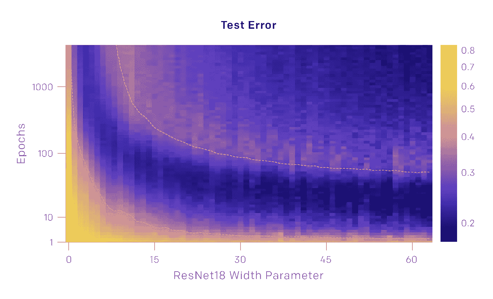
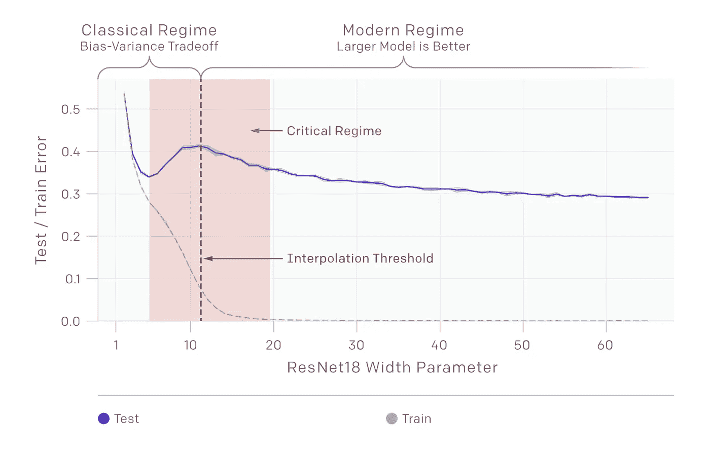
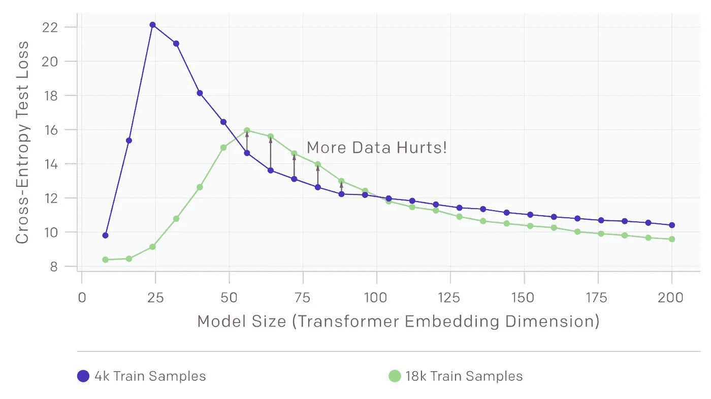

# 双重下降假说解释了更大的模型如何损害性能

> 原文：<https://pub.towardsai.net/the-double-descent-hypothesis-explains-how-bigger-models-can-hurt-performance-7b28ab327ba7?source=collection_archive---------0----------------------->

## [机器学习](https://towardsai.net/p/category/machine-learning)

## OpenAI 的研究显示了一种现象，这种现象挑战了传统的统计学习理论和机器学习从业者的传统智慧。

图片来源:OpenAI

> 我最近创办了一份专注于人工智能的教育时事通讯，已经有超过 10 万名订户。《序列》是一份无废话(意思是没有炒作，没有新闻等)的 ML 导向时事通讯，需要 5 分钟阅读。目标是让你与机器学习项目、研究论文和概念保持同步。请通过订阅以下内容来尝试一下:

 [## 序列

### 订阅人工智能世界中最相关的项目和研究论文。受到 110，000+的信任…

thesequence.substack.com](https://thesequence.substack.com/) 

越大越好当然适用于现代深度学习范式。拥有数百万个参数的大型神经网络通常比专注于特定任务的小型网络集合表现更好。过去几年中一些最著名的模型，如谷歌 BERT，微软图灵模型或 OpenAI 的 GPT 家族，都非常庞大，以至于它们的计算成本结果对大多数组织来说都是禁止的。然而，模型的性能并不随着其大小线性增加。双重下降是一种现象，当我们增加模型规模时，性能先变坏，然后变好。该领域最有创意的想法之一来自[open ai，在一项研究中详细描述了许多现代深度学习模型容易受到双下降现象](https://arxiv.org/abs/1912.02292)的影响。

模型的性能和它的大小之间的关系无疑已经困扰了深度学习研究人员多年。在传统的统计学习中，偏差-方差权衡表明，更高复杂性的模型具有更低的偏差但更高的方差。根据这一理论，一旦模型复杂性超过某个阈值，模型就会“过度拟合”,方差项将主导测试误差，因此从这一点开始，增加模型复杂性只会降低性能。从这个角度来看，统计学习告诉我们*“更大的模型更糟糕”*。然而，现代深度学习模型挑战了这一传统智慧。

与偏差-方差权衡相比，具有数百万个参数的深度神经网络已被证明优于较小的模型。此外，许多这些模型随着更多的训练数据而线性改进。因此，深度学习从业者中的传统观点是*“更大的模型和更多的数据总是更好的”*。

哪个理论是正确的？统计学习还是深度学习模型的经验证据？双重下降现象向我们表明，这两种理论是可以调和的，但它的一些假设也是错误的。

# 深度双重下降

思考双重下降现象的一个简单方法是

> *“在训练深度学习模型时，事情变得更糟”。*

在许多传统的深度学习模型中，如 CNN、RNNs 或 transformers，我们可以注意到，性能峰值可预测地出现在“临界状态”，其中模型几乎无法适应训练集。随着神经网络中参数数量的增加，测试误差最初会减小、增大，并且就在模型能够拟合训练集时，会经历第二次下降。

深度双下降理论的要点是，无论是经典统计学家的传统智慧“*太大的模型更糟糕”*，还是现代深度学习范式“*更大的模型更好”*都不支持。这完全取决于模型的状态。OpenAI 在一个非常简单的数学模型中概述了这一概念，该模型被称为双重下降假设。

## 双重下降假说

让我们为训练过程 T 引入有效模型复杂度(EMC)的概念。T 的 EMC 或 EMC(T)将是 T 平均达到大约 0 训练误差的最大样本数 n。使用该定义，我们可以将深度学习模型分为三种关键状态:

**欠参数化:**如果 EMC(T)充分小于 n，T 的任何增加其有效复杂度的扰动都会降低测试误差。

**过参数化:**如果 EMCD(T)充分大于 n，T 的任何增加其有效复杂度的扰动都会降低测试误差。

**临界参数化:**如果 EMCD(T) ≈ n，那么增加其有效复杂性的 T 的扰动可能减少或增加测试误差

通过限定模型的状态，深度双体面假设揭示了优化算法、模型大小和测试性能之间的相互作用，并有助于调和关于它们的一些相互竞争的直觉。在参数化不足的情况下，模型复杂性与样本数量相比较小，作为模型复杂性函数的测试误差遵循由经典偏差/方差权衡预测的 U 型行为。然而，一旦模型复杂度大到足以进行插值，即达到(接近)零训练误差，那么增加复杂度只会降低测试误差，遵循“模型越大越好”的现代直觉。

根据深度双重下降假说，OpenAI 在模型的学习生命周期中观察到三个关键状态。

**1)****Model-Wise Double Descent:**描述模型越大越差的状态。

**2)** **历元双下降:**描述训练时间越长，越适应的状态。

**3)** **样本态非单调性:**描述了更多样本损害模型性能的状态。

## 模型式双重下降

模型式双下降描述了模型参数不足时的现象。在这种状态下，测试误差的峰值出现在插值阈值附近，此时模型刚好大到足以适合训练集。模型式双下降现象还表明，影响插值阈值的变化(例如改变优化算法、训练样本的数量或标签噪声的量)也相应地影响测试误差峰值的位置。

来源:[https://openai.com/blog/deep-double-descent/](https://openai.com/blog/deep-double-descent/)

## 时代式双重下降

逐时双下降描述了一种状态，其中足够大的模型在训练过程中从欠参数化过渡到过参数化。在这种状态下，足够大的模型可以经历“双下降”行为，其中测试误差首先减小，然后在插值阈值附近增大，然后再次减小。相比之下，对于“中等大小”的模型，训练到完成仅勉强达到接近 0 的误差水平，作为训练时间的函数的测试误差将遵循经典的 U 形曲线，在该曲线处最好尽早停止。太小而达不到近似阈值的模型将保持在“参数化不足”状态，其中增加训练时间单调地减少测试误差。

资料来源:https://openai.com/blog/deep-double-descent/

## 样本非单调性

样本非单调性是指添加更多训练样本会损害模型性能的状态。具体来说，增加样本数量对测试误差与模型复杂度图有两种不同的影响。一方面，(如预期的那样)增加样本数量会缩小曲线下的面积。另一方面，增加样本数量也会产生“曲线右移”的效果，并增加测试误差达到峰值时的模型复杂性。

来源:[https://openai.com/blog/deep-double-descent/](https://openai.com/blog/deep-double-descent/)

双下降假说增加了一些有趣的背景，有助于理解深度学习模型随着时间的推移而表现出来的性能。实践实验表明，无论是经典统计学家的传统智慧“*太大的模型更糟糕”*还是现代深度学习范式“*模型越大越好”*的统计学习理论都不完全正确。对深度学习实践者来说，将深度双下降现象考虑在内可能是一个重要的工具，因为它强调了选择正确的数据集、架构和训练程序来优化模型性能的重要性。