# 以数据为中心的人工智能的要素

> 原文：<https://pub.towardsai.net/the-elements-of-data-centric-ai-deacadb60e94?source=collection_archive---------0----------------------->

## [数据科学](https://towardsai.net/p/category/data-science)

## 追求数据卓越

在我的上一篇[帖子](https://medium.com/@nilesh.raghuvanshi/data-excellence-through-data-centric-ai-ed0d476cc55e)中，我概述了以数据为中心的人工智能。在本帖中，我们将讨论以数据为中心的人工智能的各个元素。以数据为中心的人工智能是一种 ***系统化和原则性的方法，通过在机器学习项目的整个生命周期中提高数据质量来实现数据卓越。*** 数据质量是一个广泛的话题，在数据工程中有着坚实的基础。因此，以数据为中心的人工智能的要素主要有助于测量、工程和提高数据质量。

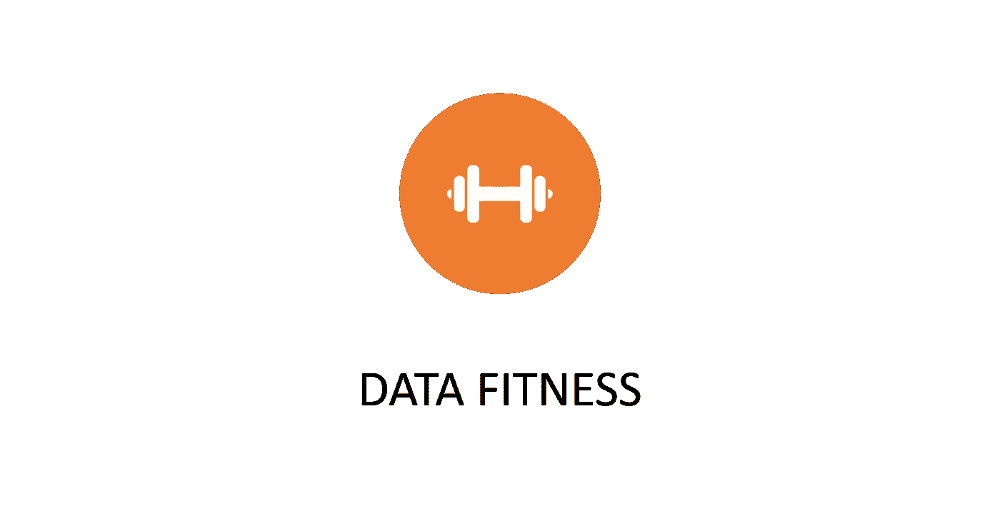

首先也是最重要的是数据适用性。在特定的上下文中，适合度由数据回答特定问题的适合性决定。换句话说，手头的数据代表你正在分析的现象的程度。**效度**、**信度**和**代表性**表征了所讨论数据的适用性。

数据的**有效性**是它衡量它应该达到的程度。在数据集中，给定测量的**可靠性**描述了其准确性和稳定性。在相同的环境下进行多次精确的测量，每次都会得到相似的结果吗？最后，**代表性**是一种衡量的手段，如果你正在研究的样本是你计划应用你的发现的更广泛人群的真实代表。

当数据不符合目的时，发生的事情被称为**上下文崩溃**，这条推文很好地总结了这一点。

高质量的数据既符合目的，又具有高度的完整性。高完整性数据

*   总是最新的
*   **属于**已知谱系，**也就是说，您拥有关于谁编制了数据、使用了什么方法以及收集数据的最初目的是什么的信息**
*   **由**丰富的元数据**支持，以帮助解释技术特征和业务环境的详细信息，例如，对于视觉检测数据集，每个图像的元数据，如时间、工厂 id、生产线 id、摄像机设置等。**

**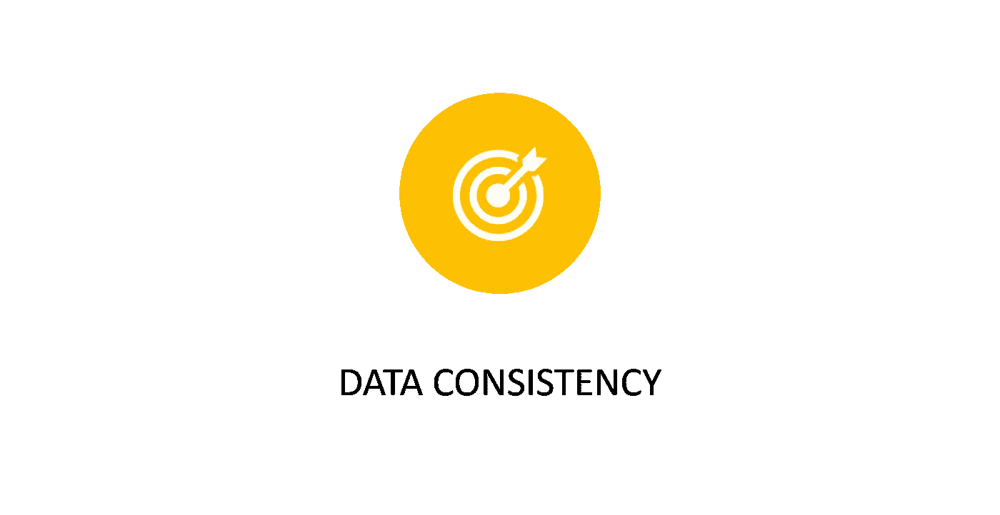**

**另一个重要因素是数据一致性。当我们说您的数据需要保持一致时，这意味着什么；例如，如果您正在处理时间序列数据，记录的**频率应该是一致的。假设您每隔 1 秒或 5 秒收集一次数据，那么您的数据集应该反映出这一点，如果没有，就应该调查数据收集过程本身的缺陷。****

**同样，对于文本数据，指向同一个术语的**多种拼法**或**缩写**在被使用前应该被规范化。一致性问题也可能由于**不一致的测量单位**而突然出现，同时聚合来自多个来源的数据或者**解码某个东西在一段时间内的价值**，例如，分析十年来最卖座的电影。**

**这里另一个重要的方面是**数据标注一致性**。如你所知，ML 算法基本上学习输入和输出之间的映射。因此，一般来说，如果要素和标注之间存在确定性映射，并且数据被一致标注以反映该映射，则算法学习该函数会更容易。**

**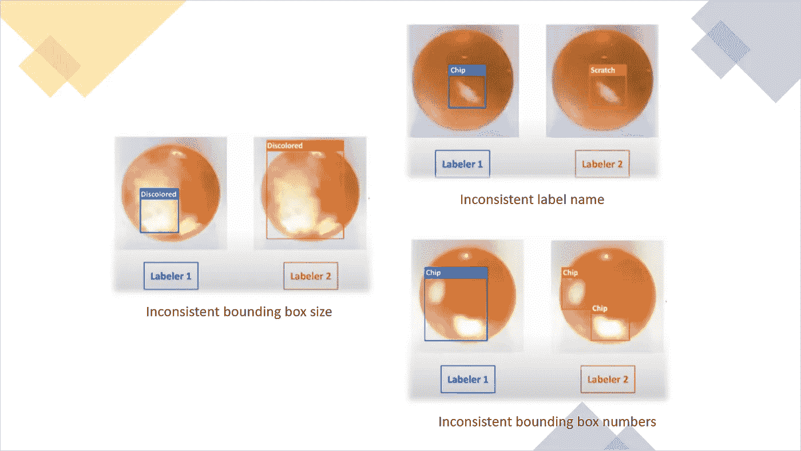**

**数据标签不一致(图片由作者提供)—灵感来自 [1](https://www.youtube.com/watch?v=Yqj7Kyjznh4)**

****

**数据覆盖是关于**重要案例**尤其是**边缘案例**的覆盖。你的数据集应该有给定案例的不同变体。我们希望我们的数据是**多样化的**和**随机的**，**包括我们试图解决的问题的变化**。**

**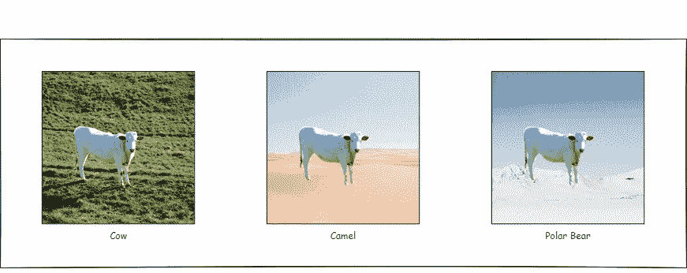**

**虚假关联(图片由作者提供)鸣谢 [1](https://unsplash.com/photos/JJnvZYDi-Ms) 、 [2](https://unsplash.com/photos/R9OS29xJb-8) 、 [3](https://unsplash.com/photos/0vw4InAC-yM)**

**这是一个取自一项研究的例子，在这项研究中，一个神经网络试图对奶牛、骆驼和北极熊进行分类。现在，你可以想象，大部分的训练样本都是在牛吃草的时候拍摄的，所以背景是草。但是，当他们开始用同样的牛，但不同的背景(如沙漠或雪地)来评估模型时，模型分别预测了骆驼和北极熊。**

****数据中缺少变化**，尤其是关于**非因果特征的**，例如红绿灯下的**亮度**(白天/夜晚)或**背景**(草地、沙地或雪地)，可能对模型不利。它需要有意识地使用以数据为中心的方法来处理，如**域随机化**或**数据扩充**。简而言之，我们**在数据中引入随机噪声或方差**而不改变输出，以便模型将学习**开发数据中这些特征的不变性**。**

**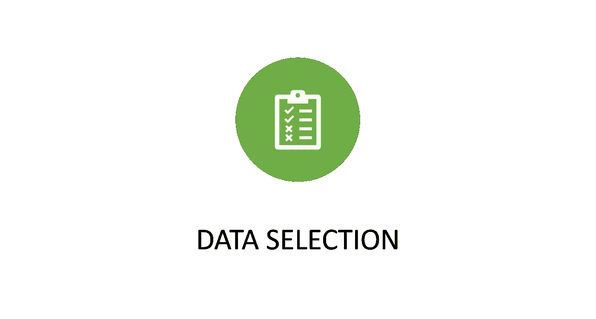**

**大数据伴随着昂贵的计算和标记等问题。数据选择技术旨在帮助从大数据转移到好数据，并关注质量而不是数量。同样，这对于工业人工智能来说非常有价值，因为我们经常面临数据稀缺的问题。数据选择技术有助于回答以下问题**

*   **我们如何有效地识别最有价值的培训案例？**
*   **我们应该在哪里添加更多的数据，以使性能影响最大化？**

**数据选择或评估是关于量化每个数据点对最终模型的贡献。这种量化在各种情况下都是有用的，例如:**

1.  **了解我们的培训示例的价值可以帮助我们在需要时引导**有针对性的数据收集**。**
2.  **型号**可说明性**或**调试****
3.  ****当检测到这样的子组时，丢弃坏的例子**。顺便提一下，这有时会产生收集新特性的想法，以减少坏例子的影响。**
4.  **当[对个人](https://www.reuters.com/article/us-tech-conference-data-trfn-idUSKBN1XO06S)的数据贡献进行补偿时，也称为**数据红利**，例如，搜索引擎用户贡献其浏览数据或患者贡献其医疗数据**

****

**在我作为人工智能传播者的角色中，我经常会收到一个问题，“我需要多少数据(来训练一个模型)？”而我一般会回答:“看情况！”。这是一个合理的问题，因为收集数据是一个昂贵的过程。数据预算有利于回答以下问题**

*   **给定足够的训练数据，ML 模型的最终表现如何？即**预测最终性能****
*   **达到最终性能的最小训练数据量是多少？即**预测所需的训练数据量****

**详情请查看本[试点研究](https://youtu.be/Cu-evqwsxpc?t=1906)。**

**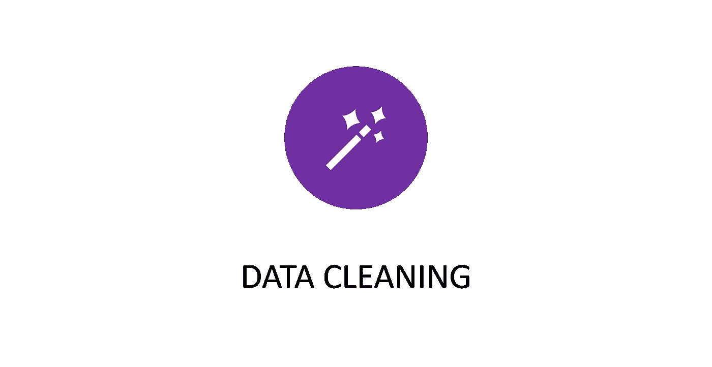**

**好吧，这是显而易见的。我们听了好几次，垃圾进垃圾出。脏数据会导致不正确的决策和不可靠的分析。因此，数据清洗是机器学习项目中必不可少的一部分。市场上有一些很棒的工具**

*   **[远大前程](https://docs.greatexpectations.io/docs/)**
*   **[TensorFlow 数据验证](https://www.tensorflow.org/tfx/guide/tfdv)或 TFDV**
*   **[数据准备](https://docs.dataprep.ai/)**

**但是在这个研究领域，新的类别正在出现。**

*   ****约束或基于 ML 的数据清理—** 通用数据清理&不考虑模型或应用的错误识别方法。这些方法包括**约束或基于参数的**数据清理方法或那些使用**机器学习**如聚类或主动学习来检测和解决数据错误的方法。**
*   ****模型感知数据清理—** 数据清理技术，旨在帮助正在接受训练的模型。**
*   ****应用感知数据清理—** 基于下游应用中由于模型预测而观察到的错误的数据清理。因此，最终用户将有某种方式向系统提供反馈，这将用于数据清理目的。**

**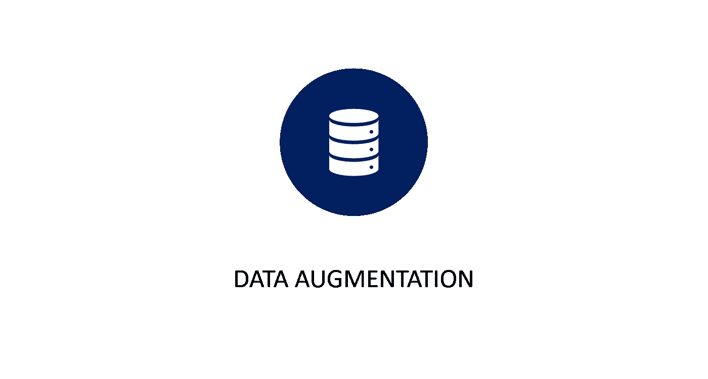**

**现在我们讨论了数据覆盖和数据预算等元素。收集足够大的数据集来捕捉现实世界中的各种现象是一项艰巨的任务。在大多数情况下，人工数据增强可以作为一种廉价但有前途的途径。中心思想是转换训练数据集中的示例，以增加模型所看到的数据的多样性，从而帮助进行归纳。数据扩充的成功使其成为 ML 管道的默认部分，用于图像、音频、文本等领域的各种任务。**

**数据扩充也已经成为一种**常用技术，通过在模型中为某些非因果领域属性建立不变性来提高模型**的稳健性。现在，我说的“为某些非因果领域属性建立不变性”是什么意思。还记得背景是绿草的奶牛的例子吗？在这种情况下，背景是一个非因果的领域属性，我们需要告诉我们的模型。我们如何做到这一点？通过向该域属性添加随机化，即添加更多具有随机背景但标签相同的示例，例如，具有沙漠背景或雪地背景的奶牛。这样，我们的模型将理解背景并不重要，因为我的目标标签是相同的，并将建立对非因果特征的不变性。**

****

**数据扩充(图片由作者提供)演职员表 [1](https://unsplash.com/photos/XjZ0jwwlvIc) 、 [2](https://unsplash.com/photos/uyQiHjUNM-s)**

**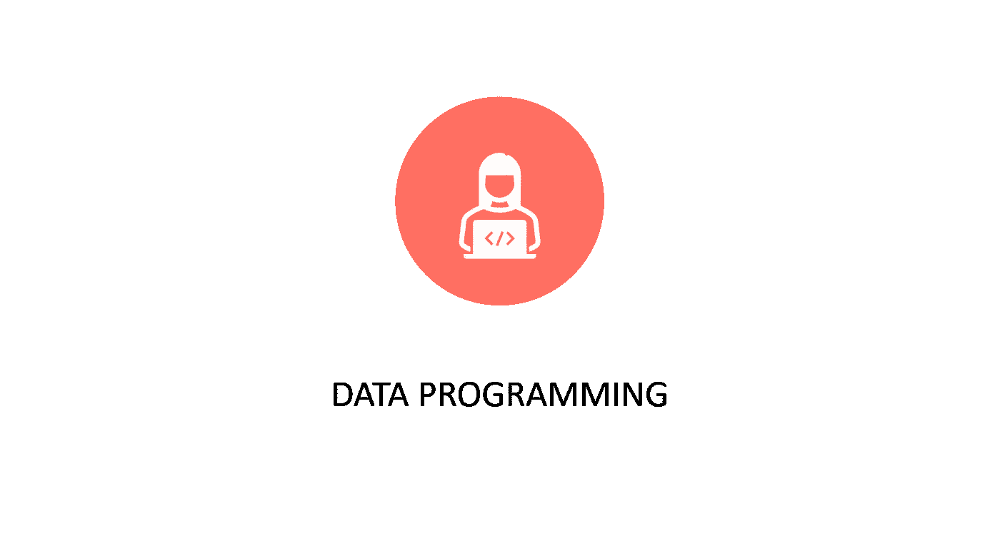**

**最近机器学习的大多数成功都是由监督学习推动的，其中**标记的数据是一个瓶颈**。建立这样一个数据集是一件既费时又费钱的事情。**

**弱监管或数据编程试图通过使用户能够编写**标记函数**来解决这个问题，利用组织知识，如内部模型、领域试探法、经验法则、遗留规则、知识图、现有数据库、本体等。[通气管](https://www.snorkel.org/)和[飞行液体](https://arxiv.org/abs/2002.11955)是体现数据编程的框架，数据编程是以数据为中心的人工智能的基本元素。但是，正如您可能已经想到的，标注函数只是具有不同精确度、覆盖范围甚至相关性的噪声估计。尽管如此，浮潜使用一种新颖的理论基础技术来学习准确的标签。**

**编写代码来标记数据的能力也有助于它与数据本身分离，从而改善数据隐私。**

**除了标记之外，浮潜还支持以数据为中心的人工智能的其他元素，即使用**转换函数**和**切片函数**的数据扩充(如我们之前所学)和子集识别(我们将很快了解更多)。**

**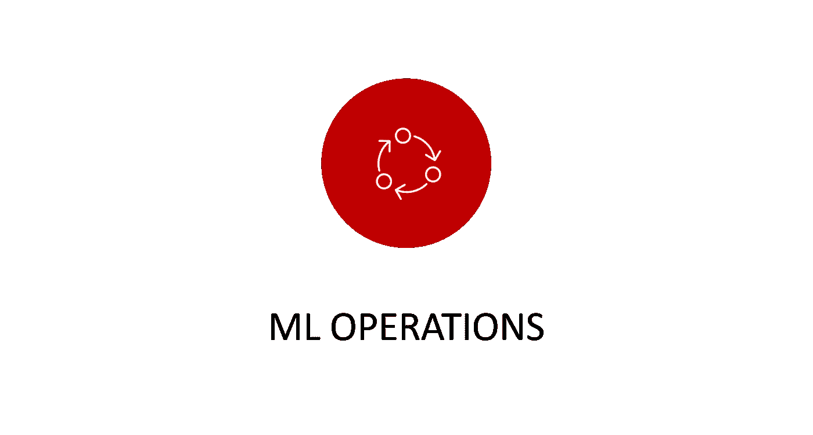**

**MLOps 是以数据为中心的人工智能的一个重要前沿，使其成为一个高效和系统的过程。MLOps 融合了文化实践和生命周期管理、模型监控和验证的原则方法。MLOps 在开发和生产过程中处理机器学习模型的整个生命周期。它通常由管理特定的培训前和培训后阶段以及监控和调试方面的组件组成。它还支持模型和数据集的版本控制、实验跟踪和高效部署。**

**众所周知，生产中活动模型的准确性通常会随着时间的推移而降低。其主要原因是新的实时测试数据和最初用于训练模型的数据之间的分布变化。这个问题最突出的补救方法仍然是使用新的训练数据定期(有时每天或甚至每小时)重新训练模型。然而，这是一项非常昂贵的工作，可以通过使用漂移检测器来避免，漂移检测器是 MLOps 工具的另一个基本组件。**持续学习**或**终身学习**是一个新兴领域，试图使生产中的 ML 系统能够自动适应数据/概念漂移，而无需从头开始重新培训。**

**MLOps 工具还应该支持流水线中任何阶段的调试，以确保可持续性。ML 管道中的错误发生在不同的阶段，如数据清理、特征生成或建模。如果不能确保管道中所有步骤的可见性，ML 管道是不可持续的，也不容易调试。因此，MLOps 工具应该促进端到端的日志记录和监控，并提供查询接口来探测 ML 管道的健康状况。**

**谈到 MLOps，市场上有[过多的选择](https://www.stateofmlops.com/)，但没有明确的赢家，这个领域仍在发展。**

**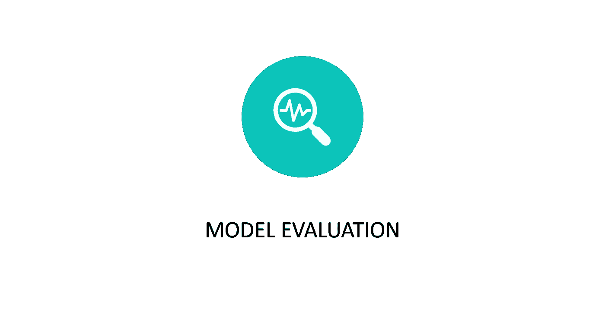**

**评估训练好的模型在开发机器学习应用中是至关重要的。评估有助于评估模型的质量，并帮助我们预测它是否会在现实世界中发挥作用。虽然这对于从业者来说并不陌生，但是以数据为中心的方法促使它变得更加精细。例如，不要将我们自己局限于平均性能的标准度量，如 F1 或准确性，而是要了解模型如何在数据的各个子集上执行。这种精细的评估有助于模型所有者清楚地理解他们的模型能力和缺陷。作为从业者，应该主动学习在数据集中寻找不同的子集或切片。来自主题专家(SME)的输入对于发现给定问题的数据集中最相关的部分可能是至关重要的。
由于在数据集中找到模型可能表现不佳的切片成为一个重要步骤，这也鼓励研究人员发现有助于系统地执行这一发现的方法。这里的想法是找到那些**易于解释**和**与手头任务相关**的切片。**

**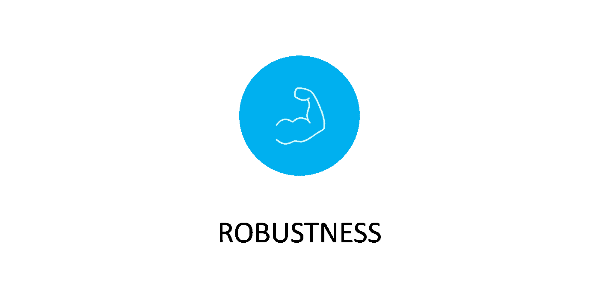**

**我们在验证 ML 模型时遵循的最佳实践之一是检查它们在最初搁置的测试数据上的性能。我们还必须确保测试数据与训练数据来自相同的分布。然而在现实中，我们经常会遇到数据分布的变化。分布变化以各种形式出现。例如，如果训练数据中的高容量子集表现出不适用于低容量子集的关系，则该模型可能学习到特定特征和目标之间的错误相关性。**

**另一个例子是当表征相同标记的类的例子的分布时(例如，看起来像狗的猫，狗的不同子类/品种，例如，拉布拉多、吉娃娃等等)。)有很高的变异。在这两种情况下，模型很可能在代表性不足的子集上表现不佳。估计子集并通过数据扩充([模型修补](https://arxiv.org/abs/2008.06775))或学习群体不变表示来平衡这些子集是推动这一方向研究的关键思想。**

****

**我把它放在最后，好像只有一件事你可以从这篇文章中学到，那就是这个。获取领域专业知识是构建健壮的机器学习应用程序的关键。作为从业者，接触领域专家和访问数据一样重要。领域专家在实现以数据为中心的人工智能方法方面发挥着关键作用，因为他们可以帮助我们获得数据。**

## **参考**

**[1] [以数据为中心的人工智能:现实世界的方法](https://www.youtube.com/watch?v=Yqj7Kyjznh4) (2021)**

**[2] [MLOps:从以模型为中心到以数据为中心的人工智能](https://www.deeplearning.ai/wp-content/uploads/2021/06/MLOps-From-Model-centric-to-Data-centric-AI.pdf) (2021)**

**[3] [通往软件 2.0 或以数据为中心的人工智能之路](https://hazyresearch.stanford.edu/data-centric-ai) (2021 年)**

**[4] [斯坦福海以数据为中心的人工智能虚拟研讨会—第 1 天](https://www.youtube.com/watch?v=-AMZ8lUI1O0) (2021)**

**[5] [斯坦福海以数据为中心的人工智能虚拟研讨会—第 2 天](https://www.youtube.com/watch?v=Cu-evqwsxpc) (2021)**

**[6] [以数据为中心的人工智能使能器。2022 年最佳以数据为中心的 MLOps 工具](https://www.activeloop.ai/resources/5124Tw2FhGPxgjI92BRoX5/data-centric-ai-enablers:-best-data-centric-mlops-tools/) (2021)**

**[7] [用 Raha 和 Baran 进行半监督数据清洗](https://www.youtube.com/watch?v=zHSe8uPnFrQ) (2021)**

**[8] [HoloClean:一个用于数据丰富的机器学习系统](https://github.com/HoloClean/holoclean)**

**[9] [实用 Python 数据角力与数据质量](https://www.oreilly.com/library/view/practical-python-data/9781492091493/)**