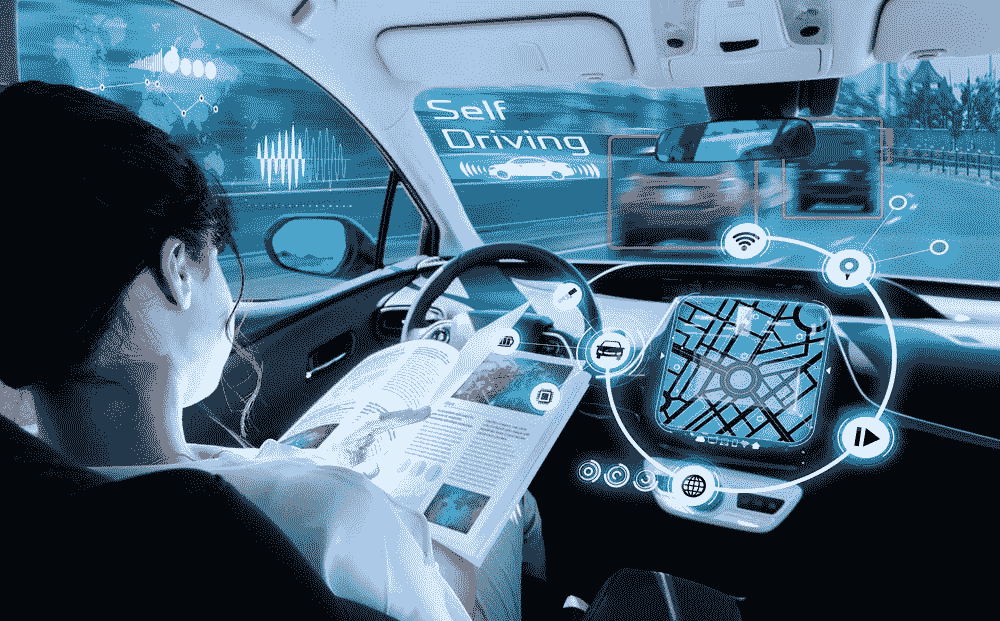
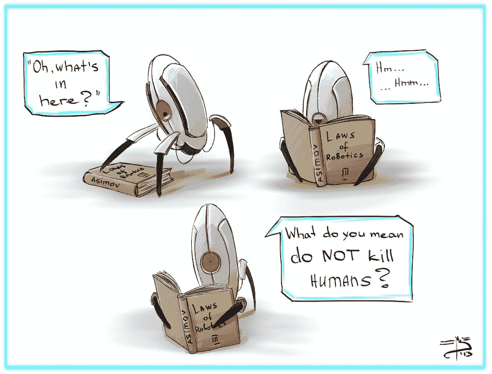
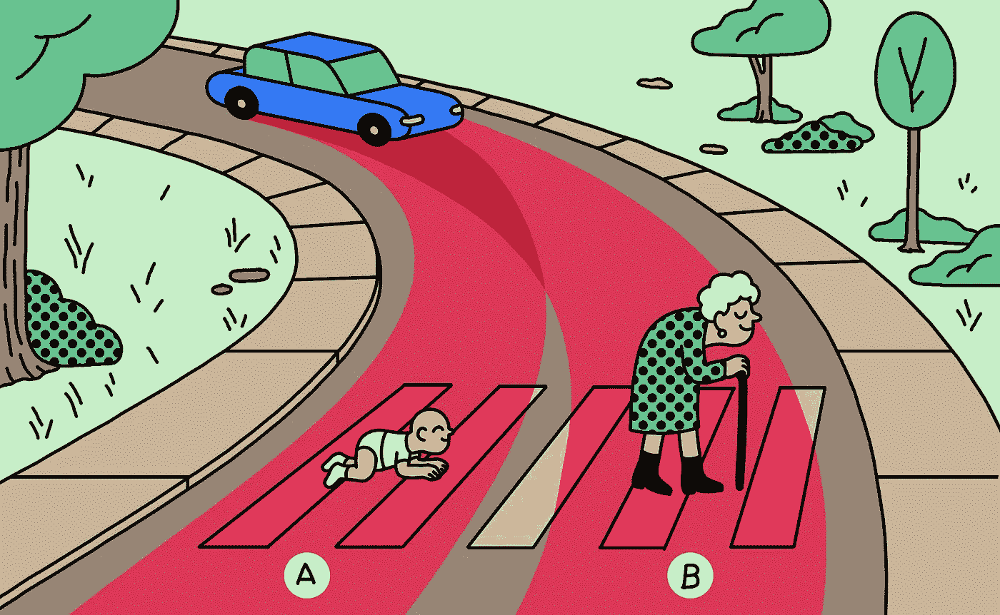
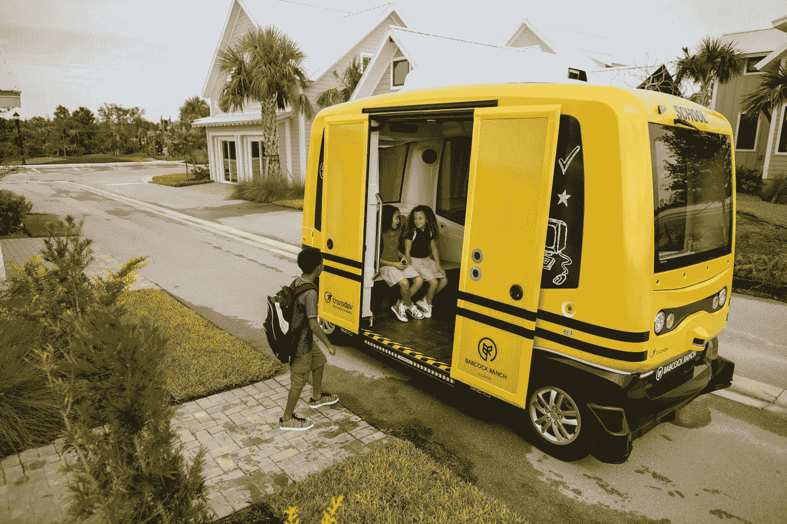
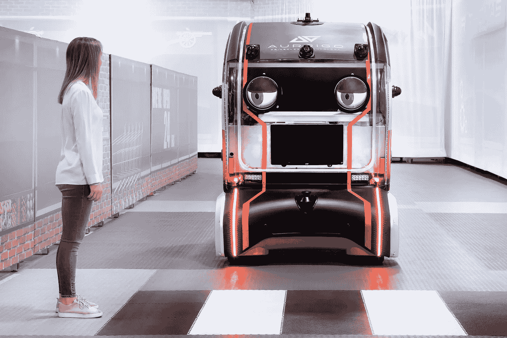
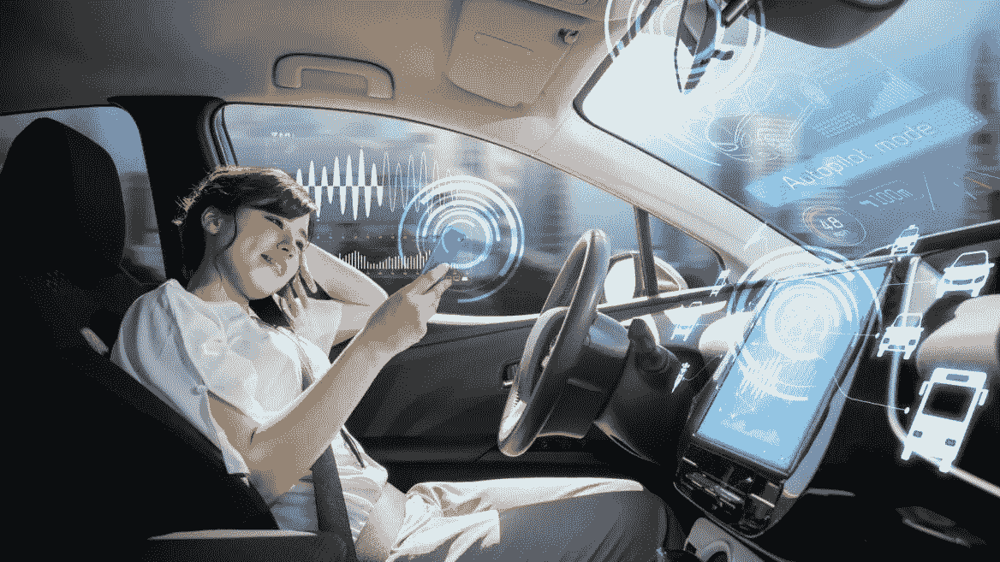
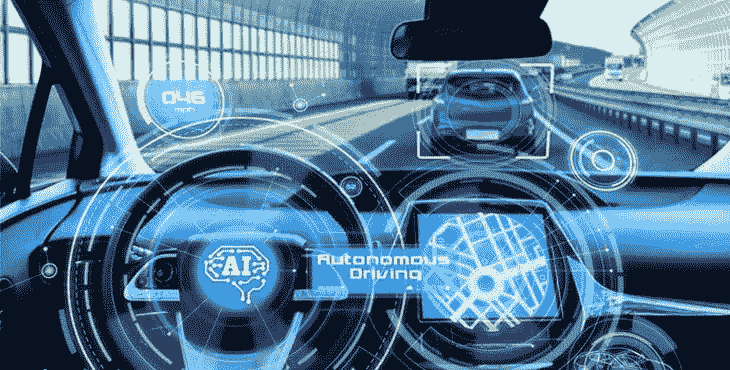

# 人工智能和自动驾驶汽车的伦理

> 原文：<https://pub.towardsai.net/the-ethics-of-ai-and-autonomous-vehicles-5ddfa0fa2726?source=collection_archive---------3----------------------->

## [伦理](https://towardsai.net/p/category/ethics)、[观点](https://towardsai.net/p/category/opinion)、[自动驾驶汽车](https://towardsai.net/p/category/self-driving-cars)

## 在一个完美的世界中，人工智能应该被开发以避免不道德的问题，但这可能是不太可能的，因为这些问题并不总是可以预测的。在自动化社会，人类将比今天更有责任互相支持和保护。

在最多样化的社会部门，人工智能(AI)正在发挥重要作用。

我们没有回归点，人工智能将融入我们的日常生活，无论是职业还是社交，融入我们的未来。

随着新月体技术的采用，一些伦理问题由“会思考的计算机”的概念引起，它可以像人类一样做决定。

必须研究和检查人工智能采用的实际方法，本文开始探索智能和自主系统使用的伦理准则。

人工智能(AI)已经在我们中间广泛应用，对人类有潜在的巨大好处，但与此同时，关于人工智能的不道德使用的一些担忧正在增长。

在一个理想的世界中，人们应该配置 AI 以避免不道德的策略，但这可能是不切实际的，因为它无法预先定义。研究可以用来帮助监管者、执法人员和其他人识别可能在大型战略室中丢失的问题敏感解决方案。

这也表明，重新思考人工智能如何在广阔的战略空间中工作，可能适合明确拒绝学习过程中不道德的结果。

来源:[https://steamcommunity.com/sharedfiles/filedetails/?id=208332246](https://steamcommunity.com/sharedfiles/filedetails/?id=208332246)

# 从阿西莫夫和超越

随着人工智能的发展，它越来越多地应用于各个领域，给我们带来了巨大的潜力来改善我们的环境，改变我们的日常生活，并使地球更加成功。与此同时，随着人工智能变得越来越主流，很难忽视机器人领域伦理和道德专家的问题。当人工智能只是科幻作品中的一个概念时，许多人质疑其应用的局限性。著名作家兼哲学家[艾萨克·阿西莫夫](https://en.wikipedia.org/wiki/Isaac_Asimov)在他的论文中创造了“[机器人三定律](https://en.wikipedia.org/wiki/Three_Laws_of_Robotics)”，旨在使人类和智能机器人共存成为可能:

> 第一定律:机器人不得伤害人类，也不得坐视人类受到伤害。
> 
> 第二定律:机器人必须服从人类的命令，除非这些命令与第一定律相冲突。
> 
> 第三定律:机器人必须保护自己的存在，只要这种保护与第一或第二定律不冲突。

阿西莫夫后来补充了“零定律”，它高于其他定律，并规定:

> 一个机器人可能不会伤害人类，除非他找到一种方法来证明所造成的伤害最终会造福全人类！

关于面对伦理道德问题如何“对话”人工智能的讨论非常全面。在一个完美的世界中，人工智能应该被开发以避免不道德的问题，但是这可能是不太可能的，因为那些问题不能被预先定义。

资料来源:西蒙·兰德莱因

# 一些伦理问题和自动驾驶汽车困境的例子

如果有任何可能导致一些人死亡，自动驾驶车辆应该怎么办？唯一的另一个选择是悬崖，那么这辆车在做什么？多年来，哲学家们一直在讨论类似的道德困境。尽管如此，随着自动驾驶汽车的出现，这一讨论有了新的实际应用，预计自动驾驶汽车将在未来几年成为道路上的标准。

另一个备受讨论的问题是**无轨电车问题**:想象一下，一辆给定的自动驾驶汽车有六到五名乘客，你必须拉动操纵杆才能切换到另一条车道，在这条车道上只有一个人。你会为了救他们五个而杀人吗？

其他情况会加重这种道德责任。比如你在马路对面的人行天桥上，可以看到一辆五人车。你身后有一个大个子，你知道他的体重足以让车停下来。为了救那五个人把他赶下桥是道德的事情吗？

我知道这些问题不容易回答。当非哲学人士被问及无人驾驶汽车应该如何应对乘客或司机死亡迫在眉睫的情况时，大多数人表示，汽车应该被设计成防止乘客受伤。你可以在这里阅读更多关于它的信息

由图卢兹经济学院心理学家 Jean-Fran ois bonne fon 领导的研究人员在他们的[道德机器实验](https://www.nature.com/articles/s41586-018-0637-6.epdf?sharing_token=TGwC6RnBlLTWcbw42PZwKdRgN0jAjWel9jnR3ZoTv0OR8PKa5Kws8ZzsJ9c7-2Qpul1Vc1F8wY0eIbuOUfmConm9MpvB9JNjnmyrCoj2uOCRbTFI3tmUdV2tYqE2L6ify1SZts3Cab8akrcYXippa3cy4tK1fym-RW4nmcUaeIs1bLH-k1CI_SLsScR2FRE8_TNMpVKFZvm3lLwkIOol58Nxp3Q5Ig6GRBHC6DAs7VoAvKDUT-4BdRHQdXlTMCNQXROh0xU95qwb24i2UjIgnGDcUwC71cUbs67m4dp4SzMpnFVTLdmAFC5sBjOneMasJvLsFcQn85Eb1rJMjco9rp-fNcIM2YoTSEWJmzr1VXM%3D&tracking_referrer=www.technologyreview.com)中，这是一个在线实验平台，旨在探索自动驾驶汽车面临的道德困境。

该平台收集了来自 233 个国家数百万人的 10 种语言的 4000 万个决定，表明这些差异与现代制度和深层文化特征相关。

当谈到自动驾驶汽车时，该实验向 900 多名参与者展示了一系列碰撞场景，得出的结论是，75%的人认为汽车总是会偏离并摧毁乘客，即使只是为了拯救一名路人。

我相信好的活动能给人们带来最大的快乐。基于这一逻辑，应该采取任何可能拯救最大数量的人的行动。

当谈到自动驾驶汽车时，如果有大量的人因即将发生的碰撞而处于危险之中，那么继续行驶可能是一个道德和理性的决定，即使这意味着伤害无辜的行人。

一些反对电车问题的哲学家认为，在这样一个复杂的问题面前，这种方法过于简单化，因为这个问题需要对行为的后果及其道德归属进行广泛的评估。

正如[斯德哥尔摩大学实用哲学教授 Helen Frowe](https://www.helenfrowe.com/) 曾经说过的，自动驾驶汽车制造商必须制造汽车来保护无辜的乘客，考虑到汽车中的人无论如何都应该被认为在事故发生时“更”有责任，因为他们负责决定汽车应该去哪里以及何时去。

[https://www . the verge . com/2018/10/22/18008828/自驾-校车-nhtsa-transdev-stopped](https://www.theverge.com/2018/10/22/18008828/self-driving-school-bus-nhtsa-transdev-stopped)

# 儿童和自动驾驶汽车呢？

我知道这是个热门话题。我在这里再提出一个伦理问题:让我们考虑一下，一辆自动驾驶汽车可以在后座上容纳四名乘客或两名儿童。按照我之前的想法，如果车辆乘客都是成年人，就应该负责避让一个行人。

但是如果车内唯一的乘客是早上上学的孩子会发生什么？用同样的逻辑，我们能认为这些孩子在致命事故中负有道德责任吗？或者换个角度，比如说，为了救两个孩子的命，在街上杀死一个老人，我们应该觉得道德上可以接受吗？

有些人应该争辩说，在只有成年人在车上的情况下，我们应该拯救大量的人，使一名乘客的死亡合乎伦理、道德和可以接受。

# 人类是可预测的吗？

如果一名行人行为不负责任，将自己放在自动驾驶汽车前面，意图使其偏离，导致乘客死亡，该怎么办？考虑到自动驾驶汽车不会判断骑自行车的人和骑自行车的人的行为，这一法律方面将很难考虑在内。

尽管有数百篇文章涉及每一个伦理细节，哲学家们还远未找到解决方案。例如，按照道德应该优化满意度的规范观念，故意让一个路人的车转向，是否比什么都不做而让车到达一群人那里更不道德？

老实说，我认为人类有责任支持和保护他人。故意造成伤害或死亡的行为在伦理上比任何可能阻止它们的行为都更糟糕。

自动驾驶汽车只能在只有两条行动路线的情况下很少相遇。总有一天，该系统将不得不选择是伤害一名路人还是一名司机，这远非不可能。

当然，汽车只能在只有两种行动的情况下很少相遇，并且车辆可以 100 %确信任何决定都会导致死亡。但这些车辆可能有一天不得不选择是伤害路人还是司机。我们必须设计新的软件、系统和算法，考虑这些问题并做出符合伦理的决定。

汽车制造商可能在这个问题上负有最大的责任。全球市场中的大多数顶级参与者仍在“等待”对这些道德问题发表看法，这可能是因为鉴于在这些问题上缺乏一致意见，找到满意的答案似乎很复杂。

# 人工智能伦理问题和我们负责任的未来。

计算机的决策为法律矛盾和错误留下了空间。

人工智能法律争议中有几个问题。许多国家急于以多种方式发展工业和军事技术，而伦理委员会和机构则负责对人工智能进行限制和监管，以使其处于控制之下。

专门小组可以审查并在某些情况下阻止学术界和私营公司的提案，但在不阻碍技术进步的情况下应对新技术威胁的合理方式是通过国会专家共识。

最近，欧盟公布了一份文件，透露该协会正在考虑在公共场所禁止面部识别三到五年。今年，微软和 IBM 已经同意走这条路。同时，我希望需要更严格的规则。

# 结论

人类正开始广泛使用人工智能(AI)，这可能会带来巨大的好处。然而，关于人工智能不道德使用的问题正在增加。

在一个完美的世界中，人工智能应该被开发以避免不道德的问题，但是这可能是不太可能的，因为那些问题不能被预先定义。

关于伦理的研究可以帮助决策者、合规官员和其他机构找到在我们社会的大部分领域缺乏的对问题敏感的方法。

无人驾驶汽车预计将在未来几年成为道路上的标准，这项技术也无法避免监管矛盾和道德问题。

在自动化社会中，人类将比今天更有责任相互支持和保护，人工智能驱动的故意造成伤害或死亡的行为将被认为在道德上比任何可能阻止它们的行为都更糟糕。我们需要现在就开始考虑这个问题！

贾伊尔·里贝罗

[https://www.thinkers360.com/tl/jairribeiro](https://www.thinkers360.com/tl/jairribeiro)