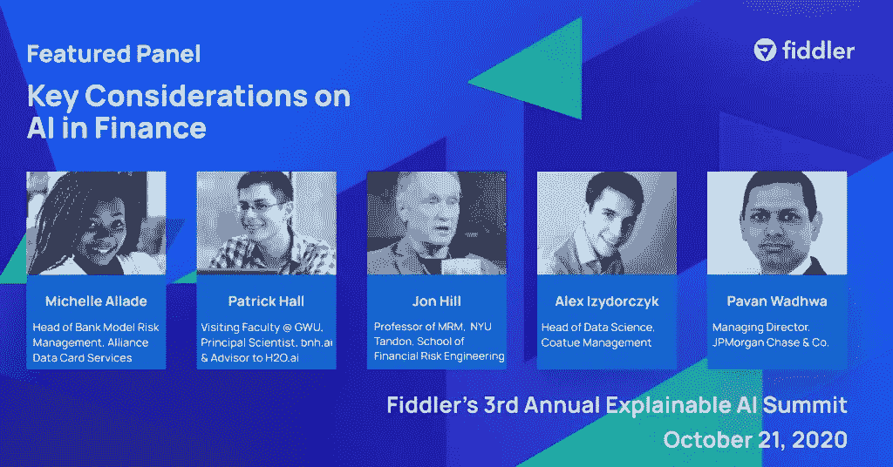

# 在金融领域实现负责任的人工智能的影响

> 原文：<https://pub.towardsai.net/the-impact-of-achieving-responsible-ai-in-finance-8a807ae14be0?source=collection_archive---------4----------------------->

## [人工智能](https://towardsai.net/p/category/artificial-intelligence)

为了利用人工智能和机器学习，金融机构必须在世界上监管最严格的行业之一实施复杂的新技术。2020 年 10 月，Fiddler 的第三届年度可解释人工智能峰会聚集了来自金融服务行业的小组成员，讨论负责任的人工智能的影响和发展，以及评估模型风险的演变方式。我们摘录了以下要点，你可以在这里观看整个录音对话[。](https://www.youtube.com/watch?v=kgBB_tHGSrU)

# 金融模型的风险管理

2011 年，美联储发布了一份名为 SR 11–7 的文件，该文件仍然是模型风险管理(MRM)的标准监管文件。MRM 团队是金融机构的一项关键职能，在投入生产之前评估风险和验证模型。随着 AI 和 ML 模型的出现，MRM 领域已经发展并继续发展，以融入新的工具和流程。与传统的统计模型相比，人工智能模型更复杂、更不透明(它们经常被比作“黑匣子”)，在几个关键领域需要考虑更多风险:

*   **设计与诠释:**模型是否服务于其预期目的？解释模型结果的人知道设计模型的人所做的任何假设吗？
*   **数据:**模型的数据源是否符合隐私法规？是否存在任何数据质量问题？
*   **监控和事件响应:**模型的预测在生产中是否继续表现良好？当出现故障时，我们如何应对？
*   **透明度和偏见:**模型的决策是否可以向合规或监管机构解释？我们是否确保了该模型不会对某些人群产生固有的偏见？
*   **治理:**谁负责模型？它在机构内部的“模型生态系统”中有任何相互依赖性吗？

# 设计和解释

对模型输入和输出的解释往往比用于得出结果的精确机器学习方法重要得多。事实上，验证更多的是证明模型没有错，而不是证明模型是正确的(因为没有 100%正确的模型)。错误的决策可能来自不正确的假设或对模型的局限性缺乏了解。

假设您有关于餐饮业总消费支出的数据，并且您想要设计一个模型来预测收入。数据科学家可能决定按季度汇总支出数据，将其与公司的季度报告进行比较，并得出收入预测。但是财务分析师会知道这种方法没有意义。例如，Chipotle 拥有他们所有的商店，但麦当劳是特许经营企业。虽然在 Chipotle 花费的每一美元确实与收入直接相关，但在麦当劳，花费的每一美元与收入并不直接相关，甚至不一定呈线性相关。

# 数据

传统金融模型受到所谓“维数灾难”的限制，这意味着建立这些模型的人只能在复杂性变得不可控制之前处理一定数量的数据和变量。另一方面，机器学习模型对数据的胃口几乎是无止境的。

因此，金融机构经常向他们的模型提供各种各样的高基数数据集，这些数据集可能包含市场行为的线索(例如点击流数据、消费者交易、企业购买数据)。组织必须确保他们在使用这些数据时遵守隐私法。质量是另一个关键问题，尤其是在处理不寻常的定制数据源时。金融机构还必须防范那些试图利用洗钱数据作为攻击媒介的恶意行为者。

# 监控和事故响应

一旦模型被部署到生产中，金融行业及其监管者就会寻求稳定性和高质量的预测。然而，生产可能充满问题，如数据漂移、数据管道中断、延迟问题或计算瓶颈。

正如我们为飞机坠毁做准备一样，为模型失败做准备也很重要。模型可能会以复杂且不可预测的方式发生故障，而现有的法规可能并不总能满足应对故障的要求。金融机构制定应急计划很重要。MRM 团队这样做的一种方式是参与整个模型生命周期，从设计到部署和生产监控，而不仅仅是参与验证阶段。

# 管理

模型治理是一个更广泛的风险类别。除了验证单一模型之外，金融机构还需要管理模型和数据之间的相互依赖关系。然而，由于他们缺乏集中管理模型的良好工具(并且可能有在监管之外“在雷达下”开发模型的动机)，许多金融机构很难跟踪他们当前使用的所有模型。模型所有权也不总是明确定义的，所有者可能不知道他们所有的用户是谁。当下游的依赖关系没有被清点时，一个模型中的变化可能会破坏另一个模型，而没有人会注意到。

# 透明度和偏见

监管机构要求人工智能/人工智能模型的输出能够得到解释，这是一个挑战，因为这些是高度复杂的多维系统。由于采用了新的可解释技术，现在减轻监管问题并不像几年前那么困难。三、四年前，人工智能不可能做出信贷决策，而今天，有了正确的可解释的人工智能工具，这是可能的。

模型风险经理也使用可解释的人工智能技术来调查数据和模型输出水平上的偏差问题。ML 中的偏见是一个真正的问题，最近导致了对苹果通过算法确定的信用卡限额中性别歧视的指控和 [UnitedHealth 的算法在病人护理中种族歧视的调查](https://www.bizjournals.com/twincities/news/2019/10/29/unitedhealth-algorithm-accused-of-racial-bias-gets.html)。线性模型也会有偏差。但机器学习模型更有可能隐藏数据中的潜在偏见，它们可能会引入特定的局部歧视。与许多其他风险领域一样，金融机构需要更新其现有的验证流程，以处理机器学习和更传统的预测模型之间的差异。

# 人工智能/人工智能在金融领域的未来

在未来几年，金融领域现有的模型验证基础设施以及在法规和约束下工作的文化意味着，这些机构甚至可能比大型科技公司更有能力在金融领域实现负责任的人工智能。

# 自动化模型验证

我们可以期待看到的一个变化是模型验证更加自动化。在许多金融机构，尤其是资源较少的小机构，验证的方式仍然停留在 20 世纪。这涉及到许多手工步骤:验证者生成他们自己独立的场景测试，手工检查数据质量，等等。通过仔细的监督和先进的工具，通过将预测与基准模型进行比较，在人工智能的帮助下验证模型是可能的。这将减少模型风险管理所需的开销，允许验证者关注更高层次的任务。

# 人工智能的更多应用

随着大规模数据的可用性，以及可解释人工智能在帮助缓解监管问题方面的进步，金融业在过去几年中推动了人工智能在欺诈分析和信用额度分配等领域的应用。即使在人工智能还不能被信任来做金融决策的地方，它也被用来缩小潜在决策的范围。例如，在一家公司寻求投资的情况下，人工智能可以用来提出最佳建议，并帮助公司优先考虑其时间。

零售银行可能会继续看到新人工智能技术的最早采用，因为与其他类型的金融服务相比，这一业务领域的数据访问更多。投资银行可能是下一个采用人工智能的领域，资产和财富管理以及商业银行紧随其后。

# 可解释的人工智能仍然是当务之急

金融利益相关者要求并将继续要求可解释性——无论是监管者需要知道模型如何做出信用决策，还是客户要求对模型的交易决策做出解释。作为银行致力于这一领域的一个例子，摩根大通开发了一个卓越的[机器学习中心](https://www.jpmorgan.com/insights/technology/applied-ai-and-ml#machine-learning)，它有一个研究分支，研究围绕可解释性的方法，还有一个开发分支，就开发有效且可解释的模型的最佳方式向模型设计者提供建议。

# 结论

金融行业在政府监管和公众监督的极端水平下运营，这对实施人工智能来说可能是一个挑战——但也可能是塞翁失马焉知非福。为了让负责任的人工智能正确，组织需要有一种创建透明模型的文化，理解数据隐私，解决歧视问题，以及无情地测试和监控。虽然还有更多工作要做，但金融机构可能比大型科技公司更有准备来实现负责任的人工智能。

这篇文章基于 2020 年 10 月 21 日 Fiddler 第三届年度可解释人工智能峰会的一次对话，这次对话聚集了来自金融机构的小组成员。您可以在此查看[的对话录音。](https://www.youtube.com/watch?v=kgBB_tHGSrU)

**小组成员:**

Michelle Allade，联盟数据卡服务部银行模型风险管理负责人

Patrick Hall，GWU 大学客座教授，bnh.ai 首席科学家，H2O.ai 顾问

乔恩·希尔，NYU·坦登金融风险工程学院模型风险管理教授

Coatue Management 数据科学主管 Alexander Izydorczyk

Pavan Wadhwa，摩根大通董事总经理。

由 Fiddler 创始人兼首席执行官 Krishna Gade 主持

*原载于 2020 年 12 月 15 日*[*https://blog . fiddler . ai*](https://blog.fiddler.ai/2020/12/achieving-responsible-ai-in-finance/)*。*