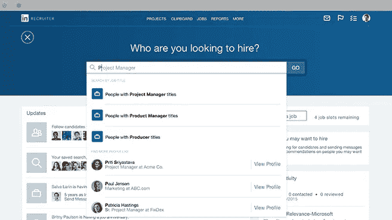
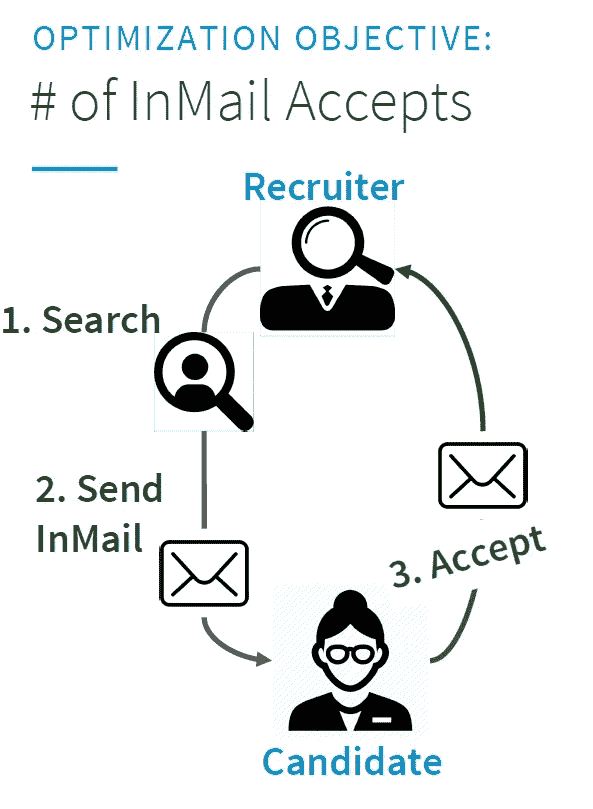
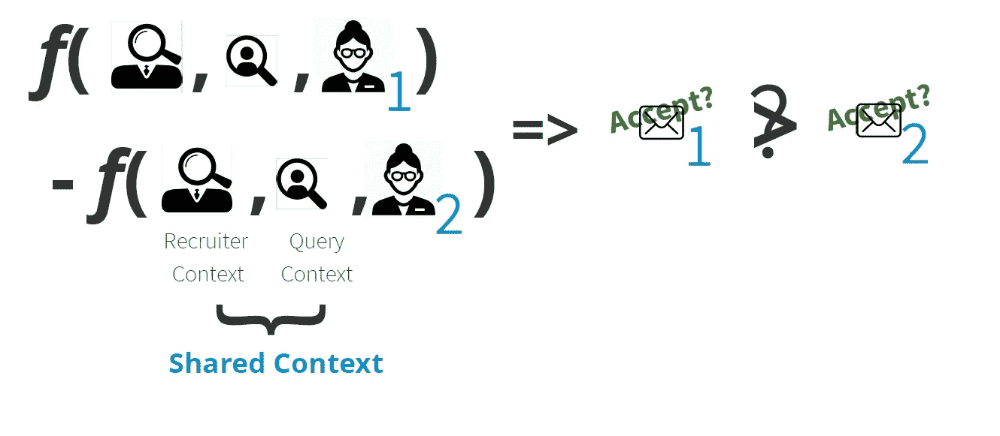
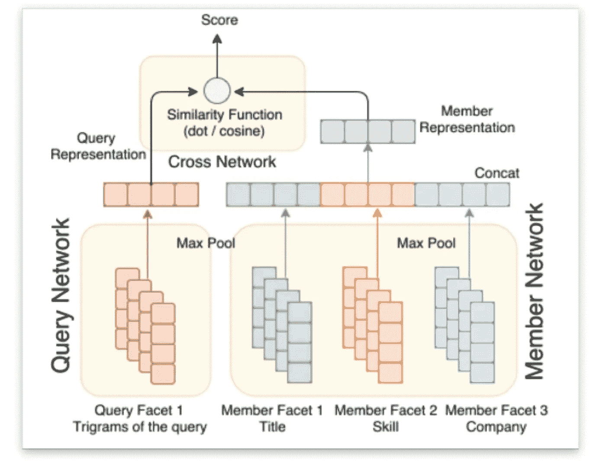
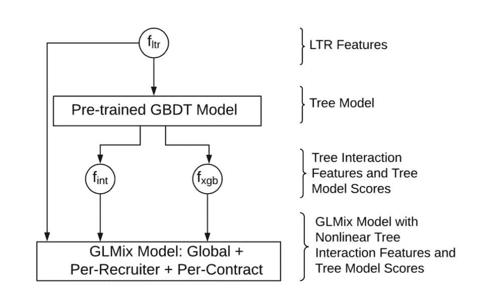
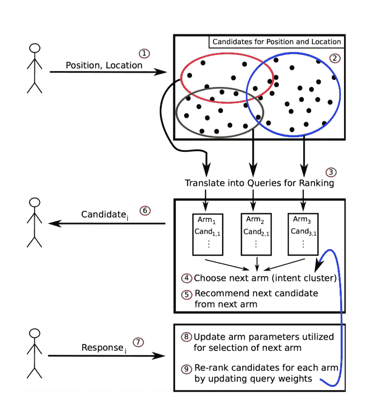
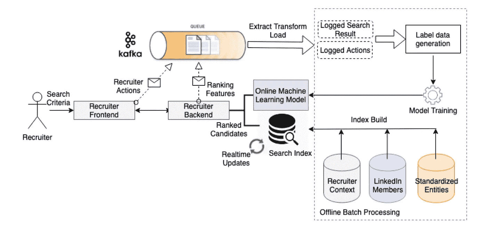
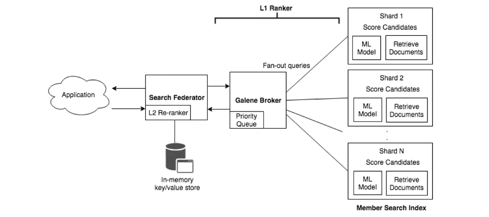

# LinkedIn 的机器学习为招聘推荐提供了动力

> 原文：<https://pub.towardsai.net/the-machine-learning-powering-recruiting-recommendations-at-linkedin-2d8d6e5a2e7b?source=collection_archive---------2----------------------->

## [机器学习](https://towardsai.net/p/category/machine-learning)

## LinkedIn Recruiter 背后的机器学习架构和技术概述。

图片来源:[https://www . computer world university . es/actualidad/diez-gigantes-tecnologicos-ganan-la-batalla-del-talento-en-LinkedIn](https://www.computerworlduniversity.es/actualidad/diez-gigantes-tecnologicos-ganan-la-batalla-del-talento-en-linkedin)

> 我最近创办了一份专注于人工智能的教育时事通讯，已经有超过 10 万名订户。《序列》是一份无废话(意思是没有炒作，没有新闻等)的 ML 导向时事通讯，需要 5 分钟阅读。目标是让你与机器学习项目、研究论文和概念保持同步。请通过订阅以下内容来尝试一下:

 [## 序列|克塞尼亚·塞梅诺娃|子堆栈

### 订阅人工智能世界中最相关的项目和研究论文。受到 110，000+的信任…

thesequence.substack.com](https://thesequence.substack.com/) 

LinkedIn 是市场上最受欢迎的招聘平台之一。每天，来自世界各地的招聘人员都依靠 LinkedIn 来寻找和筛选特定职业机会的候选人。具体来说， [LinkedIn Recruiter](https://business.linkedin.com/talent-solutions/recruiter) 是一款帮助招聘人员建立和管理人才库的产品，可以优化成功招聘的机会。LinkedIn Recruiter 的有效性是由一系列令人难以置信的复杂搜索和推荐算法推动的，这些算法利用了最先进的机器学习架构和现实世界系统的实用主义。

LinkedIn 一直是推动机器学习研究和开发边界的软件巨头之一，这不是什么秘密。除了培育世界上最丰富的数据集之一，LinkedIn 还一直在不断试验尖端的机器学习技术，以使人工智能(AI)成为 LinkedIn 体验的一等公民。他们招聘人员产品中的推荐体验需要 LinkedIn 的所有机器学习专业知识，因为这被证明是一个非常独特的挑战。除了处理难以置信的庞大且不断增长的数据集，LinkedIn Recruiter 还需要处理任意复杂的查询和过滤，并提供与特定标准相关的结果。搜索环境是如此动态，以至于很难将结果建模为机器学习问题。在招聘人员的案例中，LinkedIn 使用三因素标准来构建搜索和推荐模型的目标。

1) **相关性:**搜索结果不仅需要返回相关的候选人，还需要显示可能对目标职位感兴趣的候选人。

2) **查询智能:**搜索结果不仅应该返回符合特定标准的候选人，还应该返回相似的标准。例如，搜索机器学习应该会返回在其技能组合中列出数据科学的候选人。

3) **个性化:**通常情况下，为一家公司寻找理想的候选人是基于不符合搜索标准的匹配属性。其他时候，招聘人员不确定使用什么标准。个性化搜索结果是任何成功的搜索和推荐体验的关键要素。

LinkedIn 招聘人员搜索和推荐体验的第四个关键标准不像前三个那么明显，它专注于简单的指标。为了简化推荐体验，LinkedIn 建立了一系列关键指标的模型，这些指标是成功招聘的有形指标。例如，被接受的邮件数量似乎是判断搜索和推荐过程有效性的一个明确的标准。从这个角度来看，LinkedIn 将这些关键指标作为最大化其机器学习算法的目标。

图片来源:LinkedIn

# 科学:从线性回归到梯度推进决策树

LinkedIn Recruiter 最初的搜索和推荐体验是基于线性回归模型的。虽然线性回归算法易于解释和调试，但它们无法在 LinkedIn 这样的大型数据集中找到非线性相关性。为了改善这种体验，LinkedIn 决定体验[梯度增强决策树(GBDT)](https://en.wikipedia.org/wiki/Gradient_boosting#Gradient_tree_boosting) 以在更复杂的树结构中组合不同的模型。除了假设空间更大之外，GBDT 还有其他一些优点，如很好地处理要素共线性、处理具有不同范围和缺失特征值的要素等。

GBDT 本身对线性回归提供了一些切实的改进，但也未能解决搜索体验的一些关键挑战。在一个著名的例子中，当搜索模型优先考虑求职候选人时，对牙医的搜索会返回具有软件工程头衔的候选人。为了改善这一点，LinkedIn 基于一种称为成对优化的技术添加了一系列上下文感知功能。本质上，这种方法通过成对排序目标扩展了 GBDT，以比较相同上下文中的候选项，并评估哪个候选项更适合当前搜索上下文。

图片来源:LinkedIn

LinkedIn 招聘人员体验的另一个挑战是将候选人与相关头衔进行匹配，如“数据科学家”和“机器学习工程师”。仅仅使用 GBDT 很难实现这种关联。为了解决这个问题，LinkedIn 引入了基于网络嵌入语义相似性特征的表征学习技术。在这个模型中，搜索结果将根据查询的相关性，用具有相似标题的候选来补充。

图片来源:LinkedIn

可以说，LinkedIn 招聘人员经历中最难解决的挑战是个性化。从概念上讲，个性化可以分为两大类。实体级个性化侧重于在招聘流程中整合不同实体的首选项，如招聘人员、合同、公司和候选人。为了应对这一挑战，LinkedIn 依赖于一种著名的统计方法，称为[广义线性混合(GLMix)](https://www.kdd.org/kdd2016/papers/files/adf0562-zhangA.pdf) ，它使用推理来改善预测问题的结果。具体来说，LinkedIn Recruiter 使用了一种结合了学习排名功能、树交互功能和 GBDT 模型分数的架构。学习-排序特征被用作预训练的 GBDT 模型的输入，该模型生成被编码成树交互特征和每个数据点的 GBDT 模型分数的树集合。然后，使用原始的从学习到排名的特征及其以树交互特征和 GBDT 模型分数的形式的非线性变换，GLMix 模型可以提供招聘人员级别和合同级别的个性化。

图片来源:LinkedIn

LinkedIn 招聘人员体验所需的另一种类型的个性化模型更侧重于会话体验。利用离线学习的模型的缺点是，当招聘人员检查推荐的候选人并提供反馈时，该反馈在当前搜索会话期间没有被考虑。为了解决这个问题，LinkedIn 招聘人员依靠一种被称为[多臂土匪模型](https://en.wikipedia.org/wiki/Multi-armed_bandit)的技术来改善不同候选人群体之间的推荐。该架构首先将工作的潜在候选人空间分成技能组。然后，基于招聘人员的当前意图，利用多臂 bandit 模型来理解哪个组更合乎需要，并且基于反馈来更新每个技能组内的候选人的排名。

图片来源:LinkedIn

# 建筑

LinkedIn 招聘人员的搜索和推荐体验基于一个名为 [Galene](https://engineering.linkedin.com/search/did-you-mean-galene) 的专有项目，该项目建立在 Lucene 搜索栈之上。前一节中描述的机器学习模型有助于为不同的实体建立索引，这些实体被用作搜索过程的一部分。

图片来源:LinkedIn

招聘人员搜索体验的排名模型基于具有两个基本层的架构。

*   **L1:** 进入人才库，对候选人进行评分/排名。在这一层，候选检索和排序是以分布式方式完成的。​
*   **L2:** 使用外部缓存，优化入围人才，以应用更多动态特性。​

图片来源:LinkedIn

在该架构中，Galene 代理系统将搜索查询请求分散到多个搜索索引分区。每个分区检索匹配的文档，并将机器学习模型应用于检索到的候选。每个分区对候选对象的子集进行排序，然后代理收集排序后的候选对象并将它们返回给联邦。联盟使用附加的排名特征进一步对检索到的候选人进行排名，并且结果被传送到应用。

LinkedIn 是一直在大规模构建机器学习系统的公司之一。LinkedIn Recruiter 使用的推荐和搜索技术的想法与不同行业的许多类似系统极其相关。LinkedIn 工程团队[发布了一份详细的幻灯片](https://www.slideshare.net/QiGuo19/talent-search-and-recommendation-systems-at-linkedin-practical-challenges-and-lessons-learned-127365935?from_action=save)，为他们构建世界级推荐系统的旅程提供了更多见解。