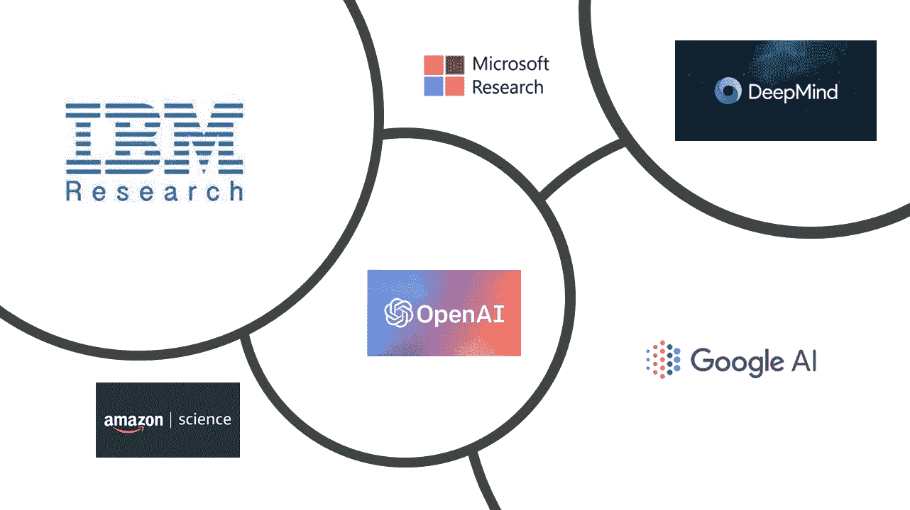

# 世界上最大的人工智能实验室支持的机器学习学校

> 原文：<https://pub.towardsai.net/the-machine-learning-schools-championed-by-the-biggest-ai-labs-in-the-world-217345335f52?source=collection_archive---------0----------------------->

## [人工智能](https://towardsai.net/p/category/artificial-intelligence)

## 谷歌、微软、脸书、DeepMind、OpenAI、亚马逊和 IBM 如何看待人工智能的未来。

> 我最近创办了一份专注于人工智能的教育时事通讯，已经有超过 80，000 名订户。《序列》是一份无废话(意思是没有炒作，没有新闻等)的 ML 导向时事通讯，需要 5 分钟阅读。目标是让你与机器学习项目、研究论文和概念保持同步。请通过订阅以下内容来尝试一下:

 [## 序列

### 订阅人工智能世界中最相关的项目和研究论文。受到 85，000 多人的信任…

thesequence.substack.com](https://thesequence.substack.com/) 

最近，我的一个学生问我一个问题，DeepMind 是否只在强化学习应用方面工作。答案显然是否定的，但这个问题仍然有效，因为它植根于这样一个事实，即 DeepMind 的大多数高度宣传的工作，如 AlphaGo、MuZero 或 AlphaFold，都是基于强化学习的。令人着迷的是，你可以将同样的观点推广到世界上最大的人工智能(AI)实验室。

虽然谷歌、脸书或微软等公司肯定在深度学习的所有领域开展工作，但它们也已经成为特定方法和学科的冠军。我发现这种运动有点令人着迷，因为在某种程度上，它告诉我们世界上最大的人工智能实验室认为哪些技术是人工智能未来的关键。在不试图独占的情况下，这里是世界上一些最大的人工智能技术公司倡导的深度学习的一些最有趣的新领域。

**DeepMind——强化学习:**毫无疑问，deep mind 就是强化学习的同义词。Alphabet 子公司在这一领域取得了重大突破，如 AlphaGo、MuZero 和最近的 AlphaFold。

**脸书——自我监督学习:**在都灵奖获得者 Yann LeCun 的领导下，脸书人工智能研究中心(FAIR)已经成为自我监督学习技术方面无可争议的冠军。最近，FAIR 发布了语言和计算机视觉的自我监督学习模型，代表了该领域的重大进步。

OpenAI——变形金刚:《GPT 3》让变形金刚模型成为了流行文化的一部分，但 open ai 并没有就此止步。继其在自然语言处理方面的突破之后，人工智能发电站继续将变压器模型应用于新领域，如计算机视觉，并取得了令人兴奋的成果。

谷歌不仅是自动机器学习(AutoML)的先驱之一，而且已经成为该领域最大的研究人员和技术生产商之一。谷歌正在推进 AutoML 高度多样化的领域，如时序分析或计算机视觉。

**微软——机器教学:**微软相信机器教学，而不是机器学习。微软研究院已经成为世界上首屈一指的人工智能实验室，在语音分析和计算机视觉等领域开创了机器教学研究和技术。

**亚马逊——迁移学习:**Alexa 数字助理的工作使亚马逊成为迁移学习技术的领先研究中心之一。从跨不同语言模型转移知识到更好的机器翻译技术，亚马逊一直在以令人难以置信的速度推动转移学习领域的研究。

**IBM——量子机器学习:** IBM 已经成功地在许多机器学习领域开创了技术，然后将领导地位让给了其他科技公司。IBM 正在拓展研究领域并做出积极贡献的一个最新领域是量子机器学习。目前，IBM 拥有市场上最复杂的量子计算堆栈，并积极使用它来评估新的深度学习技术。

这个列表绝对是独家的，但让你很好地了解了世界上一些最大的公司是如何看待深度学习的未来的。像优步、英伟达或网飞这样的公司也应该在这个名单中，但他们的研究领域更加多样化。真是有趣的时光。