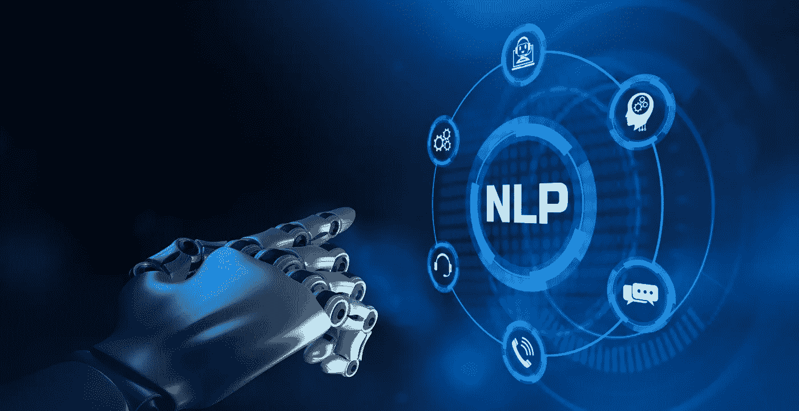

# 机器学习和自然语言处理在系统性文献综述偏倚评估中的价值

> 原文：<https://pub.towardsai.net/the-merits-of-machine-learning-and-natural-language-processing-for-bias-evaluation-in-systematic-5a806f1ce8f2?source=collection_archive---------1----------------------->

## [自然语言处理](https://towardsai.net/p/category/nlp)

系统文献综述(SLR)是循证医学基础的一部分( [EBD](https://www.capestart.com/resources/blog/using-nlp-to-improve-pico-element-identification-and-extraction/) )，它结合了对最新证据、临床经验和患者具体情况的客观评估，以确定最有效的医学治疗或干预措施。

然而，这种证据通常在非结构化的临床文献中发现——这本身就是一种挑战，但过去几年文献量的大规模增加又加剧了这种挑战。根据 [Nature](https://www.nature.com/articles/d41586-020-03564-y) 的报道，2020 年 2 月至 5 月间，向出版商 Elsevier 提交的健康和医疗数据同比增长高达 92%——数据量在去年之前就已经在增长。

数据的非结构化性质，加上不断增长的数据量，使得医学文献中传统的偏倚评估变得更加耗时:[大多数偏倚评估](https://www.ncbi.nlm.nih.gov/pmc/articles/PMC6771536/)每篇文章大约需要 20 分钟。偏见评估是由两个独立的评论者进行的，这增加了更多的时间，而且大多数评论包含数百篇甚至数千篇文章。

在过去的几年里，研究人员已经部署了机器学习(ML)和自然语言处理(NLP)模型来识别随机对照试验(RCT)并确定医学文献中的偏倚。结果提高了评估效率——对于已经因为其他耗时的单反步骤而捉襟见肘的研究人员来说，这是一笔巨大的奖金。

## ML 和 NLP 改进了临床证据中偏倚的检测

最近的几项研究表明，ML 和 NLP 模型如何成为人类评论者在数百篇复杂、密集和非结构化的科学文章中确定偏见的不可或缺的工具:

1. [Soboczenski 等人](https://www.ncbi.nlm.nih.gov/pmc/articles/PMC6505190/)。(2019)使用开源 ML 系统(RobotReviewer，简称 RR)来半自动进行偏倚评估，并评估与手动方法相比节省的时间。将 [Cochrane 偏倚风险](https://www.ncbi.nlm.nih.gov/books/NBK132494/bin/appf-fm1.pdf)工具应用于四篇随机选择的 RCT 文章，以确定每篇文章中的潜在偏倚，并突出显示任何支持其决策的相关文本。

使用 RR 对其中两篇文章进行了评估，以建议偏倚评估并提供支持性文本重点。这种半自动的方法不仅比手工方法更快，评审者还接受了超过 90%的 RR 的偏倚风险(RoB)判断和支持文本高亮。ML 系统提出的建议的召回率为 0.90，精确度为 0.87——这使得研究人员得出结论，使用 ML 的半自动“可以提高证据合成的效率。”

2.[王等](https://www.biorxiv.org/content/10.1101/2021.06.04.447092v1)。(2021)通过对近 8000 个全文文档应用几种不同的模型类型进行了类似的评估，包括基线(如支持向量机和随机森林)、神经模型(如分层神经网络)和 [BERT](https://towardsdatascience.com/bert-explained-state-of-the-art-language-model-for-nlp-f8b21a9b6270) 模型(包括句子提取)。研究人员确定，根据 [F-1 分数](https://en.wikipedia.org/wiki/F-score)，神经和 BERT 模型明显优于正则表达式。两种模型类型在不同的应用中都表现得更好(例如，神经模型在识别利益冲突方面最为有效)。

3.在这些近期研究的几年前，米勒德等人。(2015)使用文本挖掘技术和监督学习来自动化临床文档中的偏倚风险评估。研究人员确定了相关的句子来训练两个不同的模型:第一个模型预测文章和句子的相关性，第二个模型使用[逻辑回归](https://en.wikipedia.org/wiki/Logistic_regression#:~:text=Logistic%20regression%20is%20a%20statistical,a%20form%20of%20binary%20regression).)为每篇文章应用偏差风险值。研究人员确定，利用这种方法，文章确实成功地进行了偏倚风险排序。大约三分之一的 ML 辅助的文章评估只需要一个评审员(而不是通常的两个)。

也就是说，人类不是唯一有偏见的实体。ML 和 NLP 模型也可能包含[固有偏差](https://towardsdatascience.com/evaluating-machine-learning-models-fairness-and-bias-4ec82512f7c3)，一个完整的子领域——被称为“[模型公平](https://medium.com/sfu-cspmp/model-transparency-fairness-552a747b444)”——已经涌现出来解决这个相关问题。

## CapeStart 的机器学习模型和偏差检测

CapeStart 的经验丰富的综合团队[由机器学习工程师、数据科学家和医学主题专家组成，帮助组织在通常分配的一半时间内生产出尖端的单反相机——确保所有的艰苦工作在你发布系统综述时不会过时。我们可以部署定制或预训练的 ML 和 NLP 模型，以帮助更快、更准确地进行复杂的 SLR。我们先进的神经、BERT 和其他 ML 模型使研究机构能够在堆积如山的科学数据中滑行，半自动化 SLR 过程，包括偏倚风险评估。](https://www.capestart.com/solutions/nlp-aided-systematic-literature-review/)

要了解有关 CapeStart 的机器学习功能如何改善您组织的 SLR 流程的更多信息，[今天就联系我们](https://www.capestart.com/about-us/capestart-is-your-end-to-end-data-annotation-machine-learning-and-software-development-partner/)并开始免费试用。