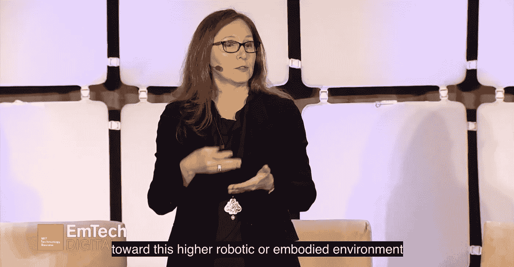

# IBM 人工智能伦理摇摇欲坠的三脚架

> 原文：<https://pub.towardsai.net/the-rickety-tripod-of-ibms-ai-ethics-76dd99e3cfe0?source=collection_archive---------2----------------------->

EmTech 2017/麻省理工学院

英语最大的好处就是它最大的弱点。同一个词可以用得非常精确，也可以用得非常不精确，有时会产生令人困惑甚至致命的后果。

我曾经从一个外科医生那里听说过这个故事。一名疑似肠道堵塞的患者需要手术来找出原因。她写下病例笔记，并把它们交给外科主任。然后，她不得不因为家庭事务紧急离开医院，并且在离开前没有机会与首席外科医生交谈。五天后，当她回来时，令她惊恐的是，那个男人并没有动手术。首席外科医生解释说，她的病历既没有说服力，也没有足够的描述来证明手术的合理性。该男子随后接受了手术，但死亡。

虽然有些极端，但它充分说明了语言是如何帮助或伤害人的。

伦理就是这样一个词。

医学伦理关注的是全民医疗保健权、安乐死、堕胎或医用大麻；建筑行业伦理是零伤害，生物伦理争论人类生殖系基因改造或异种移植的好处和时机，人工智能伦理似乎主要致力于说服社区人工智能是真实和安全的**、**而不是令人毛骨悚然的**、T3，其议程是“先部署，后解决”:**

*   亚马逊拥有的漏洞百出的环形安全设备被宣传为安全，随后被发现是[非隐私](https://www.gizmodo.com.au/2019/12/rings-hidden-data-let-us-map-amazons-sprawling-home-surveillance-network/)和[令人毛骨悚然](https://www.thesun.co.uk/news/10627821/ring-amazon-sued-creepy-hacking-kids-camera/)，但随后亚马逊指责客户未能应用正确的隐私设置；
*   特斯拉汽车软件故障可能要对迄今为止造成 [113](https://www.tesladeaths.com/) 人死亡负责，因为需要真实世界的数据来为 60 万辆已部署车辆的 DNN 提供动力，以及荒谬的安全建议，即在自动驾驶仪运行时把手放在方向盘上，即使在那里也无法实现该功能；
*   DeepMinds AlphaGo Zero 消除了任何孩子玩古代围棋的理由；和
*   DeepFakes 用于恶意欺骗，MelNet 用于模仿声音；

这些被滥用的技术越来越多，已经以股东利益的名义损害了人类的生活、工作和隐私。

几年前，ANZ 银行首席执行官 Mike Smith 对利润平衡法进行了最简洁的总结，他说首席执行官的工作就是在股东、客户和员工的需求之间取得平衡。与此同时，每年的 NPAT 回报率高达 50 亿澳元。

虽然伦理本身是一个哲学概念，但最令人担忧的是，许多对此进行辩论的人大多不是哲学家本人，如[丹·丹尼特](https://en.wikipedia.org/wiki/Daniel_Dennett)博士或[尼克·博斯特伦](https://nickbostrom.com/)博士，而是事实上被*不知何故*任命为顾问职位、拥有浮夸头衔的技术从业者。

意大利帕多瓦大学的弗朗切斯卡·罗西博士就是这样一位杰出人士。谁是 IBM 的人工智能伦理全球领导者和杰出的研究员。

虽然 Rossi 博士即将在 2020 年麻省理工学院的 EmTech 上发表演讲，但在 2017 年的 EmTech 上，在她的演讲“人工智能和社会责任的艺术”中，她谈到了她如何在“大约 3 年前”对人工智能的伦理感兴趣，并介绍了人工智能如何在这里，人工智能不是 ML，从体育，医疗和税收的应用范围，以及人工智能将如何使用这种关于人工智能如何“创造”知识的想象理论来增强(而不是取代)人类决策:

> “人工智能可以感知它的环境——理解数据，将数据转化为知识，在知识的基础上进行推理，然后决定采取哪些行动，做出哪些决定，然后适应新的情况，然后采取行动，在物理上朝着这个更高的机器人或嵌入式环境行动……需要将这些系统与你认为适合特定任务的道德价值观保持一致”

正如伊萨克·牛顿爵士一生都在寻求点石成金一样，罗西博士代表 IBM Watson 试图说服我们，不仅人工智能代理可以将数据转化为人类知识，而且它们可以在伦理上与某些人(谁的？)行为集！

这一有缺陷的论点的整个本质是由使 IBM 的人工智能研究看起来友好所驱动的，并建立在三个谬误的摇摇欲坠的三脚架上:

1.  人工智能可以*感知*和*理解*数据，人工智能和人类将一起工作并成为一个[团队](https://medium.com/towards-artificial-intelligence/dont-believe-scomo-what-ai-means-for-us-in-2020-51355ae77b4c)——拟人化傀儡谬论；
2.  伦理可以以某种方式被“注入”到代码中，并通过外部化的行为来衡量——物理主义和[p-僵尸谬误](https://medium.com/the-digital-ethicist/from-computational-tool-to-artificial-intelligence-friend-mitsuku-p-zombies-and-the-blockhead-45189e7d1e2a)；和
3.  到底是谁的伦理价值集——[功利主义](https://medium.com/@adhart81/it-wont-happen-to-me-the-ethics-behind-tesla-s-autopilot-47df88ece7a1) &法西斯谬论。

令人难以置信的是，像她这样的荣誉和学术地位的人，获得了哈佛大学拉德克利夫奖学金，却使用如此不可信和薄弱的后验假设，并被允许在麻省理工学院作为真理宣扬。

但是，既然 Rossi 博士的认识论是计算科学，是 IBM Watson 认知计算，而不是哲学，也许她应该被原谅，因为她的心是对的，她正在努力？

这里的动力是像 IBM 这样的盈利企业，它们通过使用道德这个词作为营销工具，并在顾问角色中吸收备受称赞的学者，来寻求使人工智能增强人类决策看起来安全(甚至是好的)，因为你知道，所有的学者都是道德的。

试图告诉那些在美国国立卫生研究院把猪心缝在肠子里的狒狒，那些学者是有道德的。

虽然医学伦理学谈论人权，但在所有这些中，权利在哪里？虽然领先的遗传学家至少在谈论自愿暂停种系基因修改，因为他们不能完全预测后果是什么，但这种思想在人工智能伦理话语中的位置在哪里？

对可自由获得的信息的基本阅读表明，康德伦理学把伦理说成是一种*义务*来判断一系列行为本身是对还是错——而不是简单地评估行为的好或坏后果，并且只有善意才是唯一好的东西。康德的绝对命令是用来评估行动的动机，而不是行动的结果。

如果它的开发者的价值观或动机甚至不是你的，你会让特斯拉在你的脑袋里放一个 Neuralink 吗？

如果一个启用了 Neuralink 的人或一辆自动驾驶的特斯拉 3 说，基于功利主义，三分之一的儿童在不可避免的碰撞中被撞倒，从而拯救了成年乘客，这是道德的吗？当然不是。对成年司机来说，更道德的做法是撞上一堵墙或一根柱子，让车停下来，拯救所有的孩子，因为保护孩子的生命是成年人的责任，而不是他们自己的。

事实上，在这种情况下，对我来说合乎道德的事情，可能会被像自恋者这样只看重自己的人视为完全疯狂，因为我不会把自己的幸福置于他人之上。或者屏幕上出现一个按钮，写着“即将发生碰撞，救救 a)旁观者或 b)自己”？伦理可以只是由 AI 开发者预先确定的，或者由焦点小组确定的二元或 ABCD 选择题值集吗？如果我不同意任何选项怎么办？

衡量行动的动机是判断某件事是否道德的方式，而人工智能没有动机或意愿。在最复杂的表达中，它写下了自己的规则，目前是基于一系列的奖励和惩罚。至少首席执行官史密斯先生坦率地说出了他试图平衡的动机，也足够诚实地说他并不总是做对。

代表 IBM 的全球人工智能伦理领袖罗西得出的谬误关系是，一个有伦理的人工智能将是一个安全和良好的人工智能。

胡扯。

我们永远不可能拥有一个本质上合乎道德的人工智能系统。

我们可以让*的研究人员*出于伦理动机制造人工智能，比如非营利的[开放人工智能](https://openai.com/)？我相信你应该有一个能够[害怕](https://medium.com/swlh/should-ai-be-taught-to-fear-935adda749aa)的人工智能，它对错误的行为有一个存在性的惩罚。但是为了狂妄自大而制造 AI 是错误的。

我认为在 2020 年，道德这个词似乎被技术界的一些人非常不精确和不道德地使用，等同于一种普遍的友好行为集，但实际上只是被误用为安全人工智能的营销用语，这是绝对可耻的。

要让人工智能服务于人类的需求，而不仅仅是那些拥有发达技术的人的利润动机，它必须只被视为一种工具；使用任何工具的危险在于对其来源、目的、参数和用法的不正确理解。