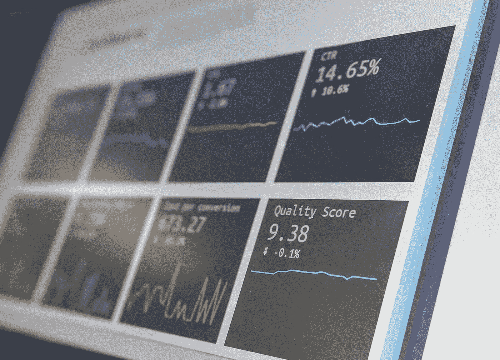

# 小型企业需要的小型数据革命

> 原文：<https://pub.towardsai.net/the-small-data-revolution-needed-for-small-businesses-1fad3c8734d9?source=collection_archive---------1----------------------->

## 虽然大数据正在扰乱企业，但小数据如何才能与机器学习、人工智能等新时代技术相结合。扰乱小企业？跟着读！

斯蒂芬·道森在 [Unsplash](https://unsplash.com?utm_source=medium&utm_medium=referral) 上拍摄的照片

拉胡尔(化名)是一家硬件制造商，他的公司制造存储产品，如笔驱、RAM 等。他预见了 2000 年的计算机革命，并从中获得了体面的生活。随着业务的增长，他在 21 世纪初开始实施 ERP(事实上的商业软件)。但是，直到现在，在三次软件转移之后，他才能够获得 ERP 的好处。Rahul 拥有最新的高端 Android 手机(他已经不再使用 iPhone 了),并使用微软 Surface Pro 来运行他心爱的古老账目，以进行会计核算，并从他引以为豪的新 ERP 中获取报告。

正如我们所料，Rahul 可能熟悉机器学习、数据科学等。但令我们惊讶的是，他没有。他很惊讶地听说，他的银行报表可以用最新的数据科学技术自动与他的会计账簿进行核对，准确率接近 90%。他震惊了。与拉胡尔的这次个人遭遇让我想到了一个问题:我们的小企业需要什么样的数据革命？我们如何帮助中小企业提高业务效率？

# 为什么是一场小型数据革命？

最新的技术，比如大数据处理和算法，都是写出来的，把财富 500 强和 1000 强的组织更大的数据集记在心里。数据科学人才也大多致力于处理更大数据集的问题。尽管问题与大型组织相似，但小型企业面临许多挑战:技能较差的人才、较低的预算、更多的非结构化数据等。更重要的是，他们处理更小的数据集。印度等国家的企业甚至还没有在工作场所广泛使用电脑。大多数工作仍然通过笔和纸，使用寄存器来完成。

与此同时，计算机视觉(CV)、机器学习(ML)、自然语言处理(NLP)等先进技术现在可以以更低的成本解决商业问题——这使得小企业投资这些技术变得可行。然而，让这些技术为小型企业的较小数据集工作可能具有挑战性，因此，我们当前的方法和思维需要一场革命。

# 为什么是现在？

再来看银行对账单对账本身的问题。五年前，不可能进行模糊匹配来核对银行对账单。为什么？以下是几个原因:

(1)ML 和 NLP 等新的数据科学技术刚刚出现，因此，复杂的模型是一个梦想

(2)部署这种需要大量训练数据的算法的廉价方式是不可能的(去云吧！)

(3)没有足够的数据优先来训练这样的模型。

现在，这三个都很容易实现。

> 现在，机器学习和数据科学算法正在以低得多的成本被创建和部署，这使得小企业投资此类算法以简化业务流程变得可行。

# 数据专业人员能做什么？

我认为中小企业使用最新的数据科学工具箱可以更好地解决以下几个问题:

(1) **库存管理** —好的企业总是在努力管理库存。及时了解需要再订购多少库存来跟上生产进度可以防止前所未有的损失。由于一家企业可能会处理大量物品，因此知道何时再订购哪些物品并得到物品到期和保修日期的通知是一项挑战。使用计算机视觉最大限度地减少数据输入可以显著提高小型企业的生产力。简单的 ML 算法可以自动重新排序，并随着时间的推移学习，以防止任何重新排序错误。

(2) **合规管理—** 印度一家典型的小型企业需要创建财务报告、GST 申报、所得税申报、电子账单提交以及其他合规性文件，以保持其认证的完整性并避免处罚。对于小企业主来说，合规可能令人望而生畏。NLP 可以帮助验证信息是否正确填写，跨企业部署的机器学习算法可以帮助小企业避免此类文档中的类似错误，从而为商人节省大量时间。

(3) **更好的客户关系管理**——虽然数字业务有一个中心点，但对于制造商和小贸易商等线下小企业来说，没有一种方法可以很好地管理客户。一个小企业主可能要与 100 多个客户打交道，以确保按时付款、正确生成和发送发票、按时共享下一批订单的报价等。帮助小企业预测哪些客户可能会按时付款，哪些客户可能会放弃，根据他们的销售和收据模式，可以改变生活。此外，帮助企业主对客户进行分类并提供适合客户的折扣可以提高企业的客户忠诚度。

(4) **预测业务成果—** 使用内部数据来帮助企业所有者了解业务期末的利润/损失、他们的应收账款在未来可能受到的影响以及他们是否能够实现业务目标，可以避免企业表现不佳，并更好地规划他们的业务运营。

虽然小企业，尤其是印度的小企业，可能已经跳过了电脑革命，手里拿着一台智能手机形式的迷你电脑，但许多企业正在拥抱数字革命。不买我？查看 Play Store，你会发现许多下载量超过 100k 的商业应用。如果我们能够帮助消除小企业主每天做出的微观决策，我们就能让他们的运营变得相当高效。

您对中小型企业有什么想法吗？我很想在 richa@restat.co 听到你的声音！