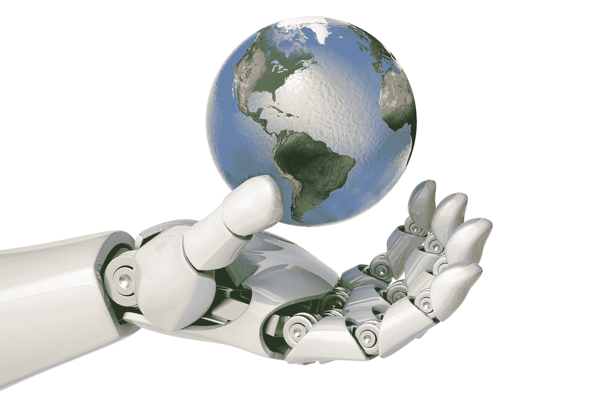
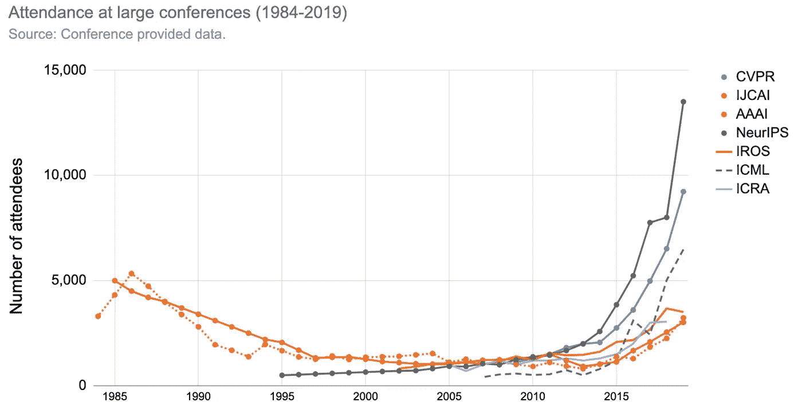
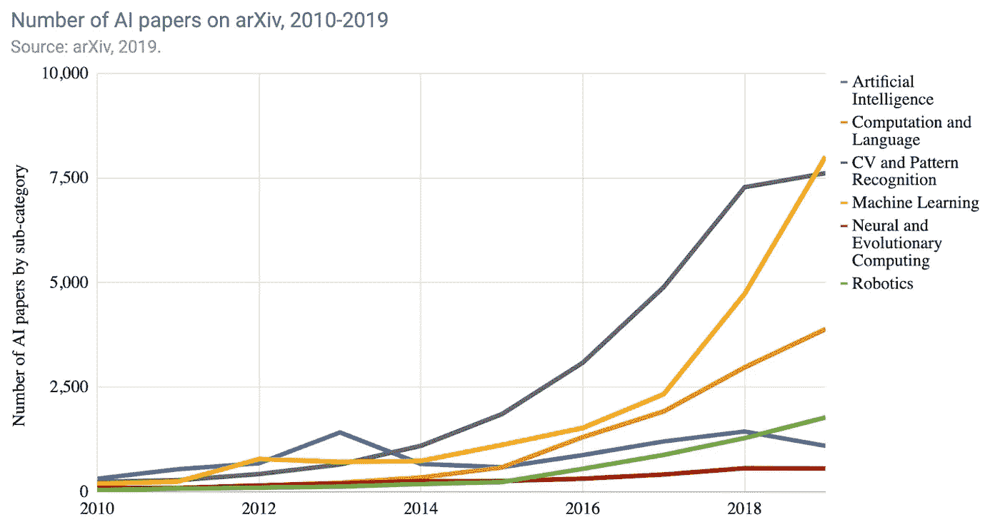
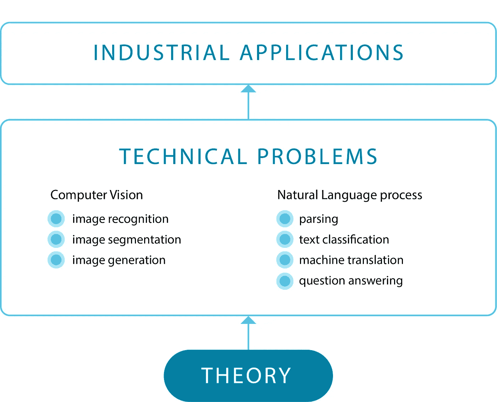
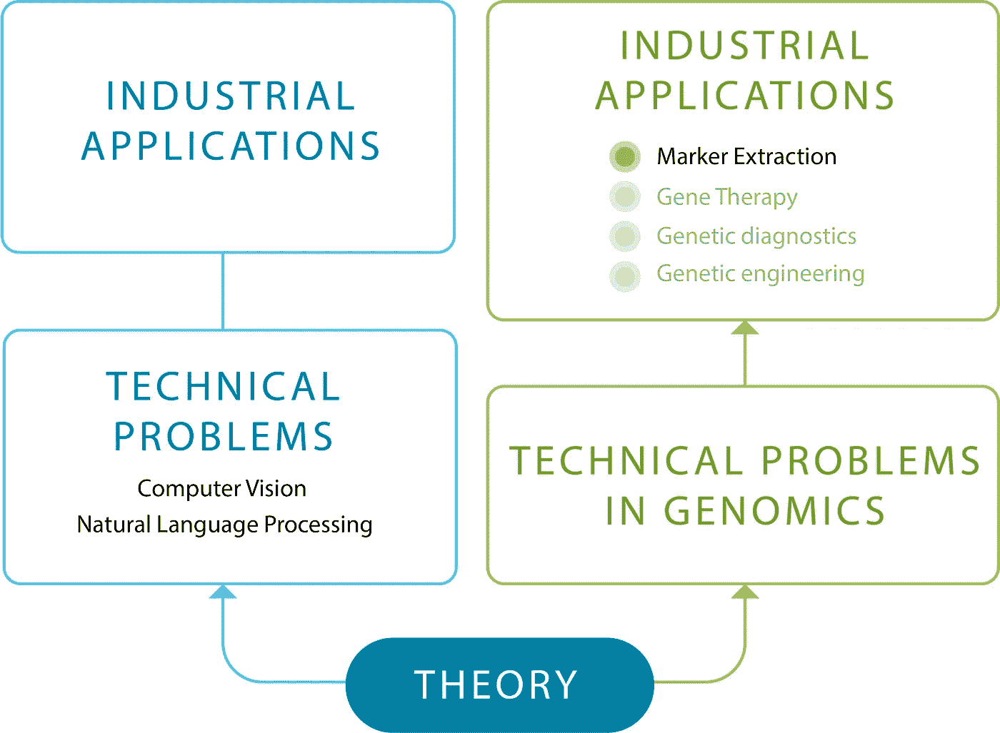

# 太小的人工智能世界

> 原文：<https://pub.towardsai.net/the-too-small-world-of-artificial-intelligence-553c0ee05856?source=collection_archive---------0----------------------->

## 人工智能世界过度拥挤和被忽视的部分

在过去的八年里，我作为人工智能(AI)社区的内部人员，为不同的公司工作，担任不同的角色。在 [DeepTrait](https://www.deeptrait.ai) ，我们专注于人工智能在基因分析和工程方面的应用，我从一个非常不同的角度看待同一个人工智能社区。在这里，我从内部和外部的角度传达我对人工智能的看法。

2012 年 [AlexNet](https://papers.nips.cc/paper/4824-imagenet-classification-with-deep-convolutional-neural-networks.pdf) 在 [ImageNet 竞赛](http://www.image-net.org/challenges/LSVRC/)上的成功预示着神经网络的重生和该领域新的激动人心的周期的开始。我在 2011 年开始参与机器学习(ML)，就在它流行起来之前，并见证了它这些年的发展。顶级 ML 会议之一的 ICML 2013 在佐治亚州亚特兰大的一家酒店安静地举行，有数百名与会者。2018 年，同一场会议是在瑞典斯德哥尔摩举行的一场大型活动，汇集了来自世界各地的五千名与会者。2019 年 12 月，该主题最大的会议 NeurIPS 聚集了惊人的 1.3 万名人工智能研究人员和工程师。

*图一。出席大型会议，* [*AI 指数 2019*](https://hai.stanford.edu/ai-index/2019)

随着资助和参与的增长，ML 研究蓬勃发展。由于历史原因，几乎所有的人工智能论文都是免费的，可以在 arXiv 上获得。今天，有超过六万篇人工智能论文在那里发表，自 2012 年以来，数量呈指数增长(图 2)。

*图二。arXiv 上 AI 论文数量按子类别，* [*AI 指数 2019*](https://hai.stanford.edu/ai-index/2019)

2013 年，一个坚定的行业人工智能专家可能熟悉她所在子领域的所有出版物。在 2019 年，这将是不可能的。如今，业内绝大多数的 AI 工程师都依赖于“最佳论文”等入围名单。

在这样一个热门和快速增长的领域工作，给人的印象是人工智能无处不在。如果你需要一个用于物体识别的神经网络——没问题，只需看看图像识别的最新技术，然后选择符合你要求的架构。如果您需要用于情感分析的工具，同样的情况，只需浏览关于这个问题的出版物，并选择适合您的数据、您的硬件和所需性能的解决方案。即使针对您的特定问题的现有出版物或相关解决方案不存在，它也涉及“子问题的子问题”例如，标准扩充技术不能为数据集产生理想的结果。或者，你最喜欢的神经网络的架构在你收集的数据上表现不佳。或者同类最佳的单词嵌入技术不能很好地处理您的任务的特定词汇表。诸如此类。

这些年来，认识这些子问题的子问题的经验导致了一种印象，即 AI 的所有大问题都在很大程度上得到了解决。越来越多的已发表论文集中在不断缩小的范围上，这种印象得到了加强。

自然，当我们开始 DeepTrait 开发用于基因组分析的 AI 系统时，我们探索了现有的文献。我们认为，在深度学习中，一切都必须经过详细探索，更不用说异构数据分析的各种相关问题了。今天，基因组分析是人类研究中最有前途和最重要的领域之一，在该领域的整个生命周期中，已经有超过 6 万篇人工智能论文发表。一定有大量的工作已经完成，对吗？

不对。在 2019 年 12 月 12 日访问 arXiv，键入“深度学习”，有 22，140 篇论文。现在，将查询改为“深度学习基因组”，你会发现只有 76 个，其中许多没有涉及基因组数据，但提到基因组是潜在的、未来的或相关的应用。

在包括 bioRxiv 在内的所有其他来源中搜索基因组学的所有深度学习论文后，我们找到了略多于两百篇的论文。他们中的绝大多数使用过时的神经网络架构和训练技术。他们中的相当一部分人不恰当地使用了这些工具，例如，将卷积神经网络应用于 SNP 等异构数据。这导致了一个表现不佳的模型——这是任何人工智能专家都可以轻松预测的。我们发现这是一个重复的模式。

那些正确使用人工智能工具的人这样做是为了分析基因组的小序列，如启动子或蛋白质结合位点。他们的输入数据长度最多在 1 到 2 万个核苷酸之间。拟南芥 基因组中甚至没有接近 1.35 亿个核苷酸——这是我们在第一次主要测试中的目标。对于这种规模的序列，我们没有任何可以依赖的东西，没有例子，没有神经网络结构，也没有训练技术。什么都没有！我们不得不从头开始。

# 大家都去哪了？

这让我很好奇。了解基因组有巨大的潜力。高通量测序产生了大量的数据，而人工智能似乎是理解这一切的显而易见的工具。尽管如此，以论文的比例来衡量，基因组学仍然获得了大约 1%的人工智能研究关注。剩下的 99%在哪里？这显然是一个机会。如果这样一个成熟的机会可能被忽视，也许还有更多。

我回到 arXiv 寻找其他潜在的革命性人工智能应用。例如，现代天文学产生了大量高度可变的数据。图像数据、无线电频率、天空中每一个微小部分的注释天体等等。以及可能改变我们对宇宙的理解的巨大问题，比如“暗物质是什么？”而我们自己，比如著名的恩利克·费密的“[人都去哪了](https://en.wikipedia.org/wiki/Fermi_paradox)？”。通过探测我们宇宙的综合天文数据，利用人工智能的力量来解决这些关键的谜团应该是一个显而易见的想法，对吗？

尽管如此，一个 arXiv 查询“深度学习暗物质”今天给你 20 个结果。

接下来呢？材料科学怎么样？现代强化学习模型可以击败围棋和星际争霸 2 中最优秀的人类棋手。这些模型是如此之好，以至于 [AlphaGo](https://deepmind.com/research/case-studies/alphago-the-story-so-far) 的胜利被刊登在 *Nature* 上，最近世界上最好的围棋选手 Lee Sedol 退役了，[说“AI 不能被打败。”](https://www.bbc.com/news/technology-50573071)

这应该是鼓舞人心的，对不对？把同样的方法应用于材料科学怎么样？人类已经对物理和化学有了相当多的了解。我们可以建立一个模拟器，在其中强化学习可以学习如何自己创造新材料，如石墨烯。这些新材料可以实现新的飞机和轮船设计、太空电梯、水下空间站，甚至可能是外星人类聚居地。这应该是一个令人兴奋的问题。

然而《深度学习晶体结构》给出了 16 篇关于 arXiv 的论文。

# 小世界

事实证明，几乎所有现代人工智能研究和工业应用都围绕着两个子领域的十几个技术问题:计算机视觉和自然语言处理(图 3)。

*图 3。人工智能创新的倒金字塔*

我们可以用倒金字塔来模拟人工智能世界。每一个较低的层次都支持较高的层次，塑造它，并在某种意义上定义它。

在最底层，有很深的基础科学和技术。它涉及对神经网络、优化算法、统计特性和这些工具的概率性质的理论理解。

中间是技术问题层面。这里存在着我前面提到的十几个技术子问题。对于计算机视觉，它们是图像识别、图像分割和自然语言处理的图像生成——解析、文本分类、机器翻译和问题回答。后者以[通用语言理解评测](https://gluebenchmark.com) (GLUE)基准为代表。

大多数研究人员和行业专家都生活在这个水平。当然，并不是所有人都专注于招募胶水或视觉任务，如果你是一个例外，你可能有理由不同意我的观点。然而，作为一个局内人，你也可以很好地想象我们中有多少人，生活在这个层次，在这个任务列表之外的工作，它的重新制定，或组合。

理论科学的底层限制了中间层的界限。任何在底层产生的新想法，如梯度下降、记忆单元或卷积滤波器，都可以在技术问题层实现一系列新的运动。

正如理论科学的进步能够实现一系列的技术扩展一样，解决一个技术问题能够实现金字塔顶端的一系列工业应用。

这个模型说明了这个行业的一个基本限制:虽然将产品想法从技术问题层面转化为工业应用相对简单，但反过来很容易被证明是不可能的。把应用程序的流程想象成一系列单向箭头。如果我们在技术层面上只有十几个特定的计算机视觉和自然语言处理工具，许多工业应用将超出他们的能力范围。事实上，绝大多数是这样的。一个专注的人工智能专家从设计工业应用的需求开始她的旅程，可能希望在技术问题层的某个地方结束她的旅程，但实际上可能会以更广泛和更令人兴奋的东西结束。

# 人工智能的起源

技术问题和工业化实践的当前状态使得从这个漏斗之外的应用程序到现有的技术水平工具的逆向路径几乎是不可能的。现有的工具箱是为计算机视觉和 NLP 中非常具体的应用量身定制的，工具越先进，它的关注范围就越窄。

一个例子是数据的大小。例如，在植物基因组学中，我们从拟南芥的 1.35 亿个“字母”基因组开始。如果你批量打印，一个*拟南芥*基因组每个数据点需要 150 个体积。这仅仅是开始。番茄基因组会给你 9.5 亿个“字母”文本或 1055 册印刷本，大麦会给你 53 亿个“字母”或 5888 册，小麦会给你 170 亿个“字母”或 18888 册。当前的 NLP 不能处理任何接近这个大小的东西。所有现代的 NLP 深度学习工具，如 transformer-like 网络，只能处理长达数千个元素的序列。

再比如数据的性质。基因组由四个独立的核苷酸组成，分别用四个“字母”来表示:A、C、T 和 g。一个核苷酸不能“稍微多一点 T”或“稍微少一点 T”。此外，将一个 T 改变为 A 可能会导致完全不同的表型、致命的疾病或致命的情况。这限制了为连续数据开发的计算机视觉技术的使用。数据大小在这里也增加了:一个人类基因组表示为一个正方形的四通道“图像”，分辨率为 54，772×54，772“像素”，远远超过现代计算机视觉神经网络可以处理的任何东西。

基因组数据的性质和规模将所有最先进的深度学习技术工具从我们的列表中删除。没有现有的神经网络架构或训练实践可以从计算机视觉或 NLP 世界中借鉴来解决我们的问题。

快速概述表明，天文学、化学、材料科学都是具有相同问题的数据丰富的应用程序:它们无法使用来自非常狭窄的计算机视觉和 NLP 解决方案集的现有人工智能工具集。有几种流行的解决方法，如将任何十六进制数据转换成图像，调整其大小并输入计算机视觉工具，但它们没有多大帮助。

在这一点上，那些足够坚持不懈地寻求解决方案的人没有其他选择，只能去 AI 的最深层次，理论的层次。人工智能生态系统的这个根源提供了许多关于深度神经网络如何工作、不同的架构如何影响它们的行为、不同的激活函数如何与特定的数据分布相关联等等的发现。换句话说，这里生活的工具，让您创建自己的工具箱，适用于您关心的工业应用。

这是一个艰难的旅程，需要时间、深厚的专业知识、奉献精神和一点运气，但最终，你将在人工智能生态系统中开发一个全新的技术问题级别。尽管这种新工具集是为特定的工业应用而构建的，但它也支持一系列其他应用，就像解决图像识别一样，为各种各样的产品和产品原型开辟了道路，从 x 射线分析到自动驾驶系统，如特斯拉 Autopilot。

图 4。新的技术问题层支持一系列新的工业应用

# 蓝色海洋

致力于计算机视觉和 NLP 的技术问题是一条非常安全、可预测和稳妥的道路。有很多研究小组、创业公司和成熟的公司在这些领域工作。其中最大的一家为刚从大学毕业就加入他们的人工智能队伍的工程师提供了一大笔钱。专攻计算机视觉或 NLP 也能保证你获得优秀的工具:数据集、GPU 技术和框架，以及大量开源存储库，包括样本、库、基准和其他有用的资源。它们使我们的工作不那么费力，而且更有成效。也许，这解释了人工智能人才在这两个特定领域的聚集。

另一方面，为天文学、遗传学、化学、材料科学、地球科学或经济学寻找自己的人工智能工具箱是一个充满挑战、有时令人沮丧的孤独旅程，在这个旅程中，你只能依靠自己和你的团队。然而，它承诺的奖励是整个领域，大到足以建立另一个十亿美元的公司或整个研究机构。

人类现在面临着成百上千至关重要但尚未解决的问题。对他们中的许多人来说，勇敢的先驱研究人员已经收集了比他们能够分析的还要多的数据。他们有一个狭窄的目的，收集数据，然后继续前进。这些数据就在那里，在开放的访问中，等待着有人来理解它们，有时是几年后。许多这些问题仍然没有答案，因为它们已被证明是不可能明确解决的。然而，人工智能技术正是因为这一点而闻名，因为它能够学习如何解决明显无法解决的问题。

远离拥挤的小径，有整个世界，被人工智能社区忽视，等待他们的先驱几十年。未经测绘和探索，他们承诺将他们所有的宝藏给那些将这一探索进行到底的人。