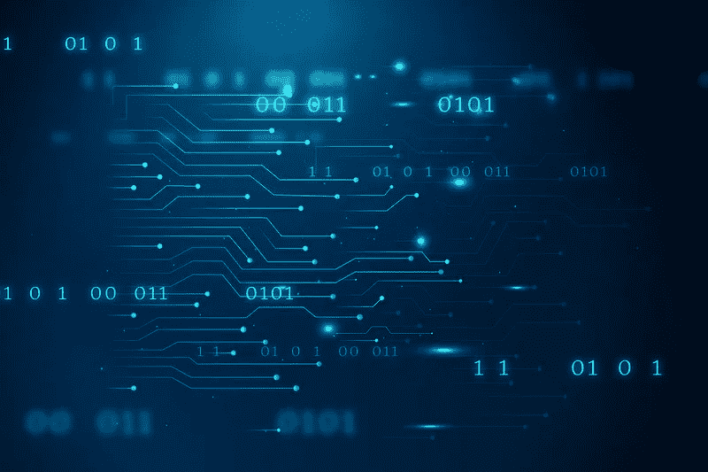

# 人工智能的终极挑战:跨越数字/物理障碍

> 原文：<https://pub.towardsai.net/the-ultimate-challenge-for-ai-crossing-the-digital-physical-barrier-b5ec9078daf3?source=collection_archive---------3----------------------->

## [人工智能](https://towardsai.net/p/category/artificial-intelligence)

## 人工智能是如何从一个好东西变成一个必须品的

图片由 [Rawpixel](https://www.rawpixel.com/image/1055165/technology-background-illustration) 提供

那是 2012 年夏天，谷歌在[的一次媒体大曝光](https://www.bbc.com/news/technology-18595351)中，展示了它的人工智能是如何*“训练一个由 1000 台计算机组成的网络，像大脑一样识别猫。”*神经网络，或其最近的更名“深度学习”，已经在数十年的研究和无数现实世界应用的支持下建立起来。但在 2012 年，整个世界都注意到了这一点，当然还有大量的猫。

人工智能在计算神经科学、计算机科学和物理学的交叉领域产生了深度学习的分支——专注于密切研究和模仿神经元如何连接和放电——最终变得更加强大。一个关键因素是:训练这些系统所需的大量数字数据和计算能力最终可供人工智能科学家普遍使用，而 primis 中的*则可供谷歌等公司使用。*

从那时起，人工智能的应用已经充斥了消费者和企业领域。例如，人工智能可以用于使智能手机图片更漂亮，删除垃圾信息，识别人脸，翻译语言，使视频游戏更具吸引力，以及优化销售活动等。

上述应用都是数字资产(例如，在智能手机上拍摄的原始图片，或意大利语的段落)通过深度学习模型增强的例子，以产生另一种数字资产(例如，专业渲染的图片，或从意大利语到英语的清晰翻译)。这些可以被认为是人工智能的“数字对数字”应用。也就是说，AI 使用数据来制作更有用、更有意义或者偶尔更漂亮的数据。

虽然这些都是人工智能的有价值的事业，但我们应该把所有的时间、精力和金钱都花在防止垃圾邮件、网络攻击和翻译我们不会说的语言上吗？还有更多人工智能“溢出”到物理世界的应用，这些应用更密切地影响着我们，或者从某种意义上说，影响着我们的身体。

人工智能的这些“数字到物理”的应用更具挑战性，因为它们需要从更受约束、不那么“凌乱”的环境(问题域已被很好地表征)迁移到结构化程度更低、不可预测且不太合作的现实世界环境。

打破这一数字壁垒，让人工智能成功地与物理系统互动，这有多大的挑战性？可以说，今天，人工智能可以在国际象棋、围棋、Jeopardy 甚至视频游戏等游戏中击败人类——所有这些游戏都有一个共同的特点，即环境和动作可能很复杂，但定义良好且有限。然而，人工智能驱动的机器很难打开一扇简单的真实世界的门，那里的把手有各种形状、形式和位置。现实世界是美好的，但对于 AI 来说，却是一团乱麻。

在 Neurala，我们在许多年前与 NASA 合作时了解到这一点。我们为类似火星漫游车的机器人开发了大脑，给它们配备了人工大脑，让它们完全自主地驾驶漫游车。但当我们想到今天溢出到物理世界的人工智能应用时，我们会想到送货机器人、无人机和自动驾驶汽车。

然而，还有许多其他非常真实的应用，虽然不那么超前，但对我们的日常生活仍然很重要。随着世界应对各种紧急状态，我们拥有的最“实体”的行业之一——制造业正处于危机之中。随着全球供应链和工厂陷入困境，企业面临着加快运营的压力，以便消费者能够充分获得他们需要的产品。

在制造业，对新技术的需求——特别是人工智能——已经飙升。工业厂商都在生产线上抢着实施[工业 4.0 举措](https://www.bdo.com/getmedia/05a51282-b62d-41cd-b337-a24c39121d96/ADV_MM-Industry-4-Report_WEB.pdf)，比如 AI。质量检查就是一个需要人工智能的物理功能的例子。在疫情之前，质量检查的任务传统上是由工人来完成的。当时，该行业的劳动力短缺意味着要加倍工作才能完成工作。随着疫情的爆发，这些努力变得更加复杂。新的社会距离要求限制了同时在工厂工作的工人数量。那么，这对人工智能来说将是一个多大的壮举呢？有人估计有 3500 万工人在进行质量检测，这大约是加拿大在生产车间从事这一基本工作的总人数。

通过跨越数字/物理障碍和实施人工智能支持的视觉质量检查，行业可以缓解危机和劳动力短缺。人工智能的使用消除了通常会减缓技术采用的障碍，因为它具有成本效益，易于集成，并且不需要经过专门培训的员工来操作。

基于人工智能的视觉检测目前用于检测金属发动机部件的缺陷，检查地毯/地毯的完整性，评估原材料(如肉类)是否有外来污染物(如塑料颗粒)，检查塑料食品托盘中是否有正确的物品，检查烘焙食品(面包/馒头)的质量，确定疫苗瓶的完整性等等。这些都是现实世界中，人工智能技术在具有挑战性的物理环境中的任务关键型应用。

人工智能的数字到物理应用的价值是显而易见的，以及它们如何应用于制造业——那么下一步是什么？对于任何希望在整个组织中实施人工智能的人来说，接下来的步骤很简单。首先，你需要看看你的具体工作流程，并确定哪些流程可以受益于人工智能——是质量检查，是预测性维护，还是其他什么？在此基础上，您应该与当地的专家合作来确定该任务的最佳解决方案，以便他们可以帮助您将其集成到您的运营中。

面对所有挑战，2021 年将是人工智能的关键时刻:许多制造流程面临的紧迫性需要现实世界的创新技术来帮助应对疫情中断。

尽管它的早期实现只是简单地关注识别没有意识的猫，但当这项技术对我们每天使用的物理对象产生积极影响时，人工智能的最大投资回报——以及真正的成年仪式——将会实现，从食物、衣服、家具，一直到我们正在阅读本文的设备的实际屏幕……

人工智能终于跨越了数字障碍，让我们的物理世界(而不是我们许多数字化的美好活动中的一些)成为一个更好的地方。