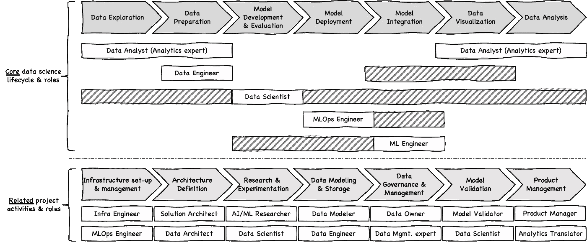
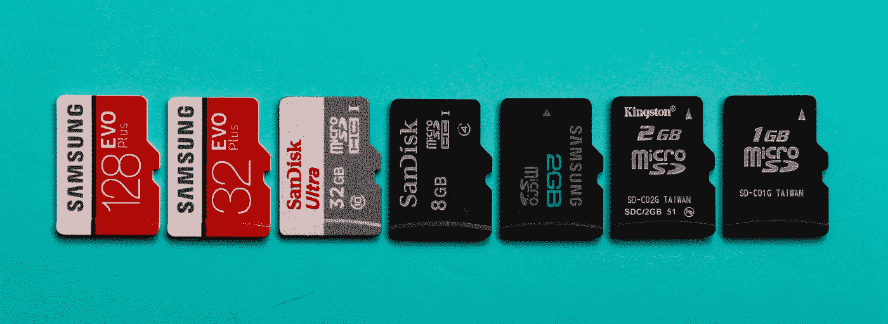

# “数据科学”角色的世界

> 原文：<https://pub.towardsai.net/the-universe-of-data-science-roles-demystified-b13dd00dc212?source=collection_archive---------0----------------------->

## 数据科学家 vs .数据分析师 vs .数据工程师 vs. ML 工程师 vs. MLOps 工程师 vs .[在此插入您喜欢的职位]…

数据科学生命周期中核心和支持角色的可视化概述—按作者分类的图片

让我先澄清一下，我不认为自己是数据科学家，也不是技术专家，但我通过领导人工智能和数据科学项目以及建立和管理数据科学家和分析专业人员团队的经验，对这个领域的各种角色有了务实的看法。

我相信视觉插图的力量，所以**如果你只有 1 分钟的空闲时间，就放在上面的图片上，这是本博客的视觉总结，描绘了数据科学生命周期中的核心和支持角色**。

对于数据科学领域的众多角色及其各自的责任，存在许多不同的、有时甚至是相互矛盾的观点。我并不声称自己有正确的答案，但我试图用简单的术语突出最常见的角色，以揭开围绕“加载”标题的一些炒作的神秘面纱。

这些角色之间自然会有很多重叠，我不会假装它们是 MECE(相互排斥，总体来说是详尽无遗的)，但我已经尝试强调了每个角色的关键区别元素，以帮助他们定位。此外，我相信随着行业的成熟，这些角色自然会变得更加标准化和通用化，尤其是考虑到其中一些角色甚至在 3-4 年前还不存在。

# “核心”数据科学角色概述

我使用术语“核心”只是为了强调在谈论数据科学时最常提到的角色。“核心”当然应该**而不是**理解为“更重要”，因为这些角色都有自己的位置，没有它们，任何数据科学项目的成功都可能受到影响。

跨越大多数数据科学角色的常见技术技能是数据建模、机器学习理论和统计、软件开发和数据可视化。主要区别在于每项技能对一个角色的重要程度，如下所示:

跨数据科学角色的通用技能—按作者分类的图片

我有目的地保持下面的描述简洁明了，以便更容易区分每个角色；写一份详尽的职责清单和完整的工作描述超出了这篇博客的范围。

## 数据分析师(分析专家)

*   **重点:**数据分析师有时也被称为数据分析专家，他们将大部分时间用于探索、争论和准备数据，以及创建报告、仪表盘和可视化，主要目的是提供可操作的见解。
*   **关键技术栈:** Microsoft Excel(用于数据探索)、Alteryx(或其他类似的可视化数据准备工具)、Tableau/Power BI/Qlikview(及其他类似的仪表板/可视化工具)、基本 Python(如 Pandas、NumPy 等)

## 数据工程师

*   **重点:**数据工程师本质上是软件工程师，专门从事数据(包括大数据)管道的开发。他们主要负责从各种系统中获取、转换和集成大型数据集，并将它们转换成所需的结构/数据模型，供数据分析师和数据科学家使用。
*   **关键技术栈:**高级 Python(如 Pandas、NumPy)、高级 SQL、大数据技术/语言(如 Spark、PySpark、Scala、Hadoop、Hive)、ETL 平台(如 Informatica、IBM InfoSphere)

## 数据科学家

*   **主要关注点:**数据科学家的主要关注点通常在“模型开发&评估”阶段，他们负责通过特征工程、模型训练、模型评估和性能优化的迭代和实验过程来开发机器学习管道。然而，在实践中，许多数据科学家参与数据科学生命周期的所有阶段，有时被称为全栈数据科学家。
*   **关键技术栈:**高级 Python，包括 ML 库(如 Pandas、NumPy、Tensorflow、Scikit-learn、PyTorch、Matplotlib 等。)、NLP 库(例如 NLTK、BERT、spaCy 等。)，使用 SQL 和 NoSQL 数据库、数据科学平台(例如，Dataiku、Azure ML、Databricks、Domino Data Lab、KNIME、RapidMiner 或 Jupyter Notebook/JupyterLab)

## MLOps 工程师

*   **重点:**机器学习操作(MLOps)工程师实际上是 DevOps 工程师，他们专门从事机器学习模型的部署和 CI/CD 管道。MLOps 实践在许多方面不同于传统的 DevOps 实践。例如，它们通常需要开发环境中的生产数据、可扩展的基于云的基础设施(通常包括用于模型训练的 GPU 驱动的服务器)、具有模型注册服务的模型版本控制、模型容器化以及在可扩展的编排基础设施上的部署，以及能够持续监控生产中的输出的管道、自动重新训练和动态重新部署模型的输出馈送机制等。)
*   **关键技术栈:** Docker 容器或类似，Kubernetes 服务或类似，GitLab 或类似，CI/CD 管道，Linux/Unix，Fiddler，MLflow 等。

## ML 工程师

*   **关键焦点:**机器学习(ML)工程师是最有争议的角色之一，关于其范围的观点经常相互矛盾。有人将其视为数据科学家的同义词，有人将其视为全栈开发人员；然而，实际上，它们介于两者之间。ML 工程师是经过培训的软件工程师，他们也对机器学习概念和管道有着深入的了解。他们的职责包括将模型输出集成到下游系统中，将 ML 管道重新分解为生产就绪代码(有时使用 Java 或 C++等低级编程语言)，开发包装模型并使其解耦为微服务的 API，开发集成模型输出的应用程序，等等。
*   **关键技术栈:**高级编程(Java、C++、Python)、高级微服务和 API 知识(如 Java Spring Boot、Flask、FastAPI 等)。)，了解 MLOps 相关的技术栈(如 Docker、Kubernetes、GitLab 等)。)

# 与数据科学项目相关的其他支持角色概述

约翰·施诺布里奇在 [Unsplash](https://unsplash.com?utm_source=medium&utm_medium=referral) 上的照片

在交付数据科学项目时，有几个相关的角色经常与上述核心角色相互作用。它们大致分为三类:

1。其中一些是标准的工程角色，如基础设施工程师、解决方案架构师和产品经理，他们是任何 IT 交付项目所必需的。

2。任何与数据相关的项目都需要其他人，如数据架构师、数据建模师、数据所有者和数据管理专家，无论是否使用了高级 AI/ML 技术。

3。最后一类是那些更具体的数据科学领域，如 AI/ML 研究人员、模型验证人员和分析翻译人员。他们的职责有时包含在上述核心角色中，但也可以作为独立角色存在，尤其是在大型组织中。例如:

*   **AI/ML 研究员:**类似于数据科学家的技术能力，但主要侧重于研究和试验数据科学领域最新和最大的发展，然后再将其用于实际生产环境
*   **模型验证者:**通常在高度管制的环境中需要，例如金融服务，在这种环境中，模型及其假设的独立验证需要由模型开发人员之外的人来完成
*   **Analytics Translator:** 这个角色位于非技术业务 SME(主题专家)和技术数据科学家的交汇处，充当连接这两个世界的“翻译”。他们对数据科学概念和相关行话有很好的理解，但也能说业务语言，为非技术人群构建数据科学问题和好处。

# 关于数据科学角色演变的最终思考

由 [Unsplash](https://unsplash.com?utm_source=medium&utm_medium=referral) 上 [Supratik Deshmukh](https://unsplash.com/@supratikdeshmukh?utm_source=medium&utm_medium=referral) 拍摄的照片

这些角色很多都存在了很久，只是在所谓的“数据科学时代”之前，只是被冠以不同的称谓而已。这些角色绝不是过时的，本质上仍然存在，但大部分已经发展/合并为上述数据科学角色之一。

例如， **ETL 开发人员**(提取-转换-加载)，已经发展成为**数据工程师**，拥有更现代的技术栈，如 PySpark、Scala 和 Hive，而不是 ETL 工具，如 Informatica。同样，**商业智能(BI)工程师**已经发展成为**数据分析专家**，他们专注于使用最新的可视化和仪表板工具从数据中提取洞察力。

我毫不怀疑，当前的数据科学角色也将继续发展，尤其是考虑到这一领域的快速发展。**我在这里提到的一些角色很可能会过时，或被其他新的角色合并**，或被重新定位，承担与我们当前期望完全不同的职责。

例如，采用 **Auto-ML 技术**的趋势越来越明显，这种技术能够从数据中自动生成 1000 个特征，并使用不同的超参数训练 100 个 ML 模型，以找到特定问题的最佳解决方案。**随着这些技术越来越成熟和被接受，数据科学角色的性质也需要发展。例如，将更加强调框架问题和专家微调，而不是花费大量精力从零开始开发特征工程管道和 ML 实验。**

目前的 ML 框架/库(如 Tensorflow、Pytorch 和 Keras)已经是这种情况，这些框架/库使数据科学家几乎不用花时间从零开始开发底层 ML 算法(如神经网络、XGBoost 等)。)和**花更多的时间应用那些算法来解决他们的问题**。因此，我们很自然地会期待这种趋势会继续下去，新的框架/库会自动化数据科学生命周期的更大一部分。

**期待您对 1)我对这些角色的定位是否符合您的理解/经验，以及 2)是否有任何其他角色值得强调的评论。**