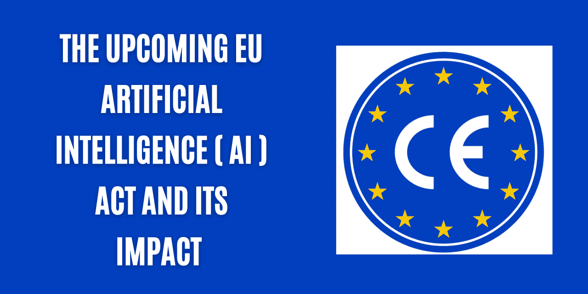
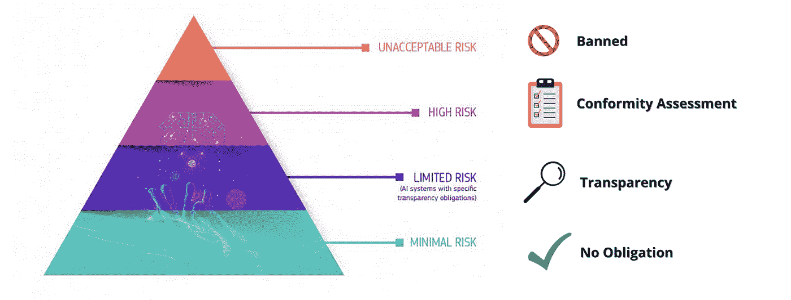
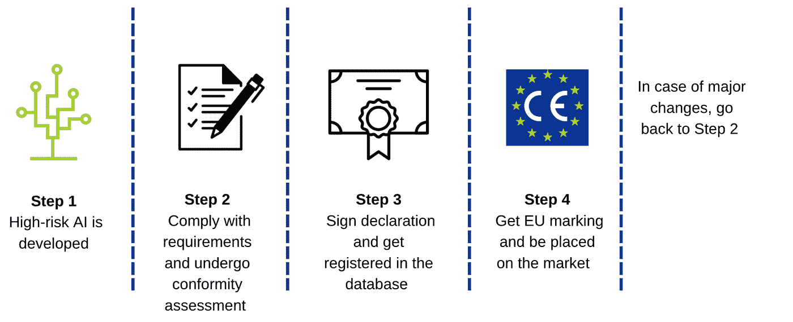

# 即将到来的人工智能法案及其对你的影响

> 原文：<https://pub.towardsai.net/the-upcoming-a-i-act-and-how-it-will-impact-you-6682bceb9a1?source=collection_archive---------6----------------------->

## 即将到来的法案将为人工智能做 GDPR 为隐私所做的事情

在我以前的帖子中，我谈到了人工智能风险如何不存在于真空中，以及为什么有控制措施来阻止意外或故意滥用人工智能是如此重要。

 [## 如何为你的公司创建一个实用的人工智能风险管理框架

### 以结构化方式降低人工智能风险的简单步骤

pub.towardsai.net](/how-to-create-a-practical-a-i-risk-management-framework-for-your-company-e6d77e5e6c29) 

可悲的事实是，公司通常优先考虑利润而不是控制，并将尽可能降低成本。

如果保护一个人工智能系统的成本太高，那么公司可能会干脆决定不做！

> **这是法规强制遵守每个人都必须遵守的最低标准的时候了**

监管很重要，因为它们让企业承担责任，并有助于确保人工智能作为一种技术，在所有领域都有最低限度的保护措施。

不遵守的后果可能是监管罚款，甚至是将人工智能系统从市场上移除。

另一方面，遵守法规可以帮助公司将其产品作为“完全合规”的产品进行营销，从而使他们获得相对于其他公司的竞争优势。

# 全球人工智能监管格局

制造人工智能系统的企业在历史上一直依赖于自我监管，而没有太多的监督。

当时没有具体的法规，人工智能系统被置于其他法规的保护之下，如数据或消费者保护。

看到所涉及的潜在风险，世界各国政府正在迎接挑战，并制定新的法规，以确保人工智能风险得到识别和适当缓解。

美国、阿联酋、中国和其他国家正在通过几项立法，以在人工智能竞赛中占据领先地位。

**迄今为止，最重要的法规，也是预计将对世界产生最大影响的法规，来自欧盟委员会，该委员会于 2021 年 4 月发布了一份新的** [**法案提案，以规范人工智能**](https://eur-lex.europa.eu/legal-content/EN/TXT/?uri=CELEX%3A52021PC0206) **。**

与 2018 年《通用数据保护条例》(GDPR)为全球数据隐私法奠定基础类似，该法案预计将在全球范围内产生深远影响。

> 欧盟的规则通常最终会为世界其他地区设定标准，因为所有的公司都在其中工作，所以我们可以预计这一法案将成为其他国家制定自己的人工智能法律的蓝图。

# 欧盟人工智能法案—你需要知道的

作为世界上第一个规范人工智能(AI)的具体提案，欧盟的人工智能法规草案将对人工智能以及公司未来如何采用人工智能的辩论产生巨大影响。该法案本身采取了基于风险的方法来监管人工智能，并将人工智能系统分类如下:

1.  **不可接受的风险**
2.  **高风险**
3.  **有限风险**
4.  **低风险**

基于风险的基本原则是，人工智能系统带来的风险越高，公司就有越多的义务向监管机构证明该系统是如何构建的，以及将如何使用。

> 被标记为不可接受的人工智能的系统被简单地禁止，例如那些使用面部识别技术的系统，用于根据可信度对人们进行排名的社交评分系统，以及操纵人们或利用特定群体漏洞的系统

该法规的大部分内容集中在高风险的人工智能系统上，这些系统必须符合一系列深入的技术、监控和合规要求，我们将很快详细研究这些要求。

被归类为有限风险的系统需要遵守透明度义务，而其余的最低风险系统没有义务，但建议纳入行为准则，以确保遵循良好做法。

人工智能法案如何根据风险对需求进行分类

# 欧盟法案提案下的“高风险”人工智能系统

该法案将人工智能系统确定为“高风险”，当它们可能危及人的生命或健康或他们的基本权利时。该法案还列出了一系列高风险人工智能系统，其中一些提到如下:

1.  *关键基础设施。*
2.  *教育和职业培训。*
3.  *就业。*
4.  *获得和享受基本的私人服务和公共服务及福利。*
5.  *移民、庇护和边境管制管理；和*
6.  *司法和民主程序。*

对高风险人工智能系统的关键要求将是进行符合性评估，在欧盟的数据库中注册，并签署声明确认其符合性。将符合性评估视为一项审计，在该审计中，将对照法规要求检查人工智能系统，如下所列:

风险管理系统的实施。

技术文件和记录保存。

*●透明度。*

*●人为疏忽。*

*●网络安全。*

*●数据质量。*

*●上市后监控；和*

*●合格评定*

*●和报告义务。*

这些审计可以由制造人工智能的公司进行自我评估，也可以由第三方进行评估(目前只有生物识别系统中使用的人工智能需要进行第三方符合性评估，而其他人可以直接进行自我评估)。如果系统在评估后发生变化，那么流程必须重做。

下图说明了这一过程:

评估通过后，您的产品上将会有一个漂亮的 ce 标志，表明您的产品已经准备好进入欧盟市场。

# 谁必须遵守？

与 GDPR 一样，监管的范围不仅仅局限于欧盟也如同与 GDPR 相似，法律可以跨越国界并适用于:

●在欧盟将人工智能系统投放市场或投入服务的提供商。

●位于欧盟的人工智能系统的用户。

●位于第三国的人工智能系统的提供商和用户，人工智能系统的输出在欧盟使用(这对向欧盟销售其产品的公司非常重要)

# 你应该如何准备？

如果你曾经实施过欧盟的 GDPR，那么你就会明白，当涉及到不遵守时，欧盟不会乱来，并可以对违反规则的行为处以严厉的罚款。

> 新的人工智能法案也顺应了这一趋势，对使用被禁止的人工智能系统(那些带来不可接受风险的系统)的罚款可高达 3000 万€，或全球年收入的 6%(远高于 GDPR 规定的最高罚款)。

向当局提供误导性信息的公司也可能被处以最高 1000 万€或全球收入 2%的罚款。

如果你的人工智能系统受到新法案的管辖，那就不能掉以轻心。

尽管一些人批评欧盟的新规定过于严格，导致欧洲可能在人工智能竞赛中落后于其他国家，但该法案很有可能会得到执行，因此最好现在就开始准备，而不是留待以后。现在采取具体行动将确保你在这项法规实施时站在正确的一边。

第一步也是最有效的一步是针对此法规进行差距评估，看看您的组织处于什么位置，以及您必须做些什么才能完全符合法规。您的公司可能不具备进行这些评估的相关专业知识，因此您需要联系能够为您提供指导的第三方摘录。另一个步骤是在您的组织中创建一个人工智能治理框架，以便在人工智能风险出现时管理和减轻它们。

> 我希望你喜欢读这篇文章。如果你觉得这个话题有趣，可以看看我在[开设的人工智能治理和网络安全](https://cloudsecguy.gumroad.com/l/aigovernance)课程，该课程讲述了新型人工智能风险以及如何减轻这些风险。

Taimur Ijlal 是一位多次获奖的信息安全领导者，在金融科技行业的网络安全和 IT 风险管理方面拥有 20 多年的国际经验。泰穆尔可以在 [LinkedIn](https://www.linkedin.com/in/taimurijlal/) 或他的 YouTube 频道“[云安全专家](https://www.youtube.com/c/CloudSecurityGuy)上联系，他定期在上面发布关于云安全、人工智能和一般网络安全职业建议的帖子。

*你可以通过下面的链接注册，每月只需 5 美元就可以获得所有的媒体报道:*

 [## 通过我的推荐链接加入 Medium—tai mur Ijlal

### 阅读 Taimur Ijlal(以及媒体上成千上万的其他作家)的每一个故事。您的会员费直接支持…

taimurcloud123.medium.com](https://taimurcloud123.medium.com/membership)