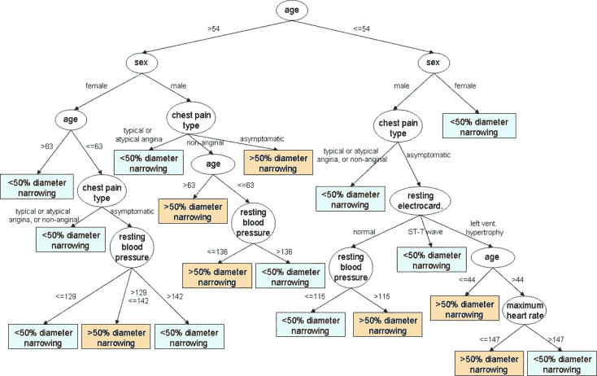
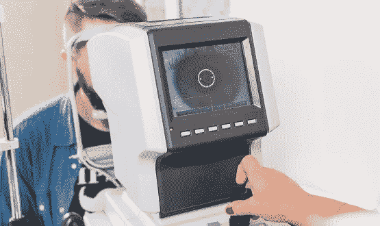

# 机器学习在诊断医疗保健中的效用

> 原文：<https://pub.towardsai.net/the-utility-of-machine-learning-in-diagnostic-healthcare-7a6489322ad0?source=collection_archive---------2----------------------->

[【图片来源】](https://www.forbes.com/sites/tomtaulli/2019/10/12/ai-artificial-intelligence--whats-the-next-frontier-for-healthcare/)

过去十年，人工智能和机器学习在医学领域的应用显著增加。然而，如果要取代当前的传统方法，必须仔细考虑这些工具的伦理、可靠性和适用性。在这里，我将考虑机器学习可能有利于医疗保健的 3 种方式:

## 1.重新定义和证明疾病和障碍的风险阈值

目前，在诊断中，许多疾病(如心脏病)的风险阈值倾向于仅通过单变量考虑而非多变量意义上的考虑来确定。例如，在诊断心力衰竭或心肌病时，射血分数低于 40%的证据长期以来一直是金标准。然而，研究发现，大约一半的心力衰竭病例出现射血分数保留，这给诊断和治疗带来了严重的挑战，特别是在区分这种情况与其他原因引起的报告症状如呼吸困难(呼吸困难)[1]。当涉及到此类疾病的症状前、风险中或早发患者时，即使使用多个变量，它们也倾向于由临床医生在独立和关联的意义上任意组合[2]。

据推测，如果在个案基础上使用多个变量的条件阈值进行诊断，诊断的准确性将会提高，这意味着一个变量的阈值可能依赖于另一个变量的值。例如，假设患者年龄为 40 岁，男性，收缩压为 120 mmHg，总胆固醇为 4 mmol/L，高于哪个左心室质量阈值将指示心力衰竭的早期发作？或者，给定参数值的这种组合，患者未来发病的概率是多少？今天，即使是 NHS 在其电子健康记录(EHR)系统中使用的最先进的基于人工智能规则的决策支持，目前也缺乏这种精确度[4]

图 1:用于诊断心脏病的决策树图示例([来源](https://www.sciencedirect.com/science/article/abs/pii/S0957417412006707)

实现这一目标的一种方法是通过使用基于树的分类算法。让我们从理论上来说，一些疾病的潜在机制——例如主动脉狭窄——取决于一套复杂的条件相互关系和逻辑规则，这些规则适用于某些情况，而不适用于其他情况。例如，我们已经观察到，只有当患者超过一定年龄并且内脏脂肪量超过特定值和一些其他条件时，高左心室质量(肥大)才是问题。基于树的算法，如决策树和随机森林，使用在其树的分支之间变化的条件决策规则，明确地学习和建模这些子分组，为不同的患者提供不同的逻辑集。同时，以特性重要性和树形图的形式促进了可解释性(如图 1 所示)。

值得注意的是，并非所有的机器学习分类算法都允许推断相同类型的底层逻辑。使用单一曲线拟合方法，其他判别算法如 SVM、K-最近邻或逻辑回归不能学习这种类型的条件逻辑，除非预先编程。

在过去的几十年里，我们已经看到了各种基于规则的医疗诊断系统的方法。从 20 世纪 70 年代早期的用于使用由专家输入的~600 条规则的知识库和推理机从多个变量诊断血源性细菌感染的 MYCIN，到用于癌症诊断的 IBM Watson，到今天使用的 NHS EHR；最大的挑战是关于如何最好地表示不确定性的争论，特别是对大量条件概率的估计，以及如何处理这些编程规则中出现的冲突或循环逻辑[4]。

即使像 MYCIN 这样的规则系统已经实现了与医学专家不相上下的预测，我们还没有看到这种系统的广泛成功或采用，以设定诊断评估的标准，这也是因为与现有临床系统的集成较差，以及对错误预测的法律责任的担忧。

## 2.为临床医生开发精确度更高的自动诊断系统

随着对大量数据的访问和进一步的鲁棒性测试，机器学习分类器可能能够比临床医生自己更快更准确地确定心脏疾病的风险和发作。虽然(1)着眼于如何使用机器学习更好地定义风险阈值和疾病诊断，并将其用作临床医生的决策支持，但另一个用例可能是可解释性不太重要或不相关的单一任务。

[【图片来源】](https://www.digitalhealth.net/2020/06/deepmind-ai-system-detects-risk-of-developing-serious-eye-condition/)

对于简单和特定的成像诊断，如检测色素性皮肤病变的恶性肿瘤， [Tschandl 等人(2019)](https://www.sciencedirect.com/science/article/abs/pii/S147020451930333X) 发现，分类器优于 27 名具有十年以上经验的人类专家的判断，平均正确诊断数为 25.43 对 18.78 (P < 0.0001)。同样，通过训练人工智能进行视网膜扫描，DeepMind 能够正确识别多种视网膜疾病，准确率达到 94%，超过了顶级人类专家[5]。然而，在其他领域，与人类相比，有限的数据和影响因素背后更大的复杂性目前阻碍了机器学习的准确性和可靠性。同样，由于预测失误的法律责任问题，对这些自动方法的信任将需要更长的时间来建立。就目前而言，用这样一种理念来对待机器学习的任何应用似乎是最明智的，即它应该与人类决策合作并对其进行补充，而不是完全取代人类决策。

## 3.为医学研究发现新的见解和理论

在预测性能与可解释性的权衡方面，机器学习和传统统计学之间经常存在二分法，即机器学习的设计更强调高精度预测，而统计学主要设计用于推断变量之间的关系[6]。

然而，随着机器学习可解释性和可解释性工具(例如，特征重要性、SHAP 和贝叶斯网络)的发展，机器学习有可能实现高预测准确性和深刻解释。应用于医学研究的背景下，人们可以设想学术界的未来，其中大量的患者数据被算法利用来生成因果模型，该模型提出了新的理论和诊断变量之间的关联。开始时，这些推论将作为对预先存在的和完善的医学理论的验证，但随着对这些算法的准确性和智慧的信心增加，它们可能开始被用作新理论的来源，以供进一步的患者研究或体外试验研究和补充。

虽然这种在医学中进行数据挖掘和知识发现的尝试自 20 世纪 90 年代就已经存在，但从数据中推断和证明因果关系的方法存在局限性，同时还面临着如何推导、解释和呈现信息的普遍挑战。不幸的是，引用最近[评论](https://link.springer.com/chapter/10.1007/978-3-662-43968-5_1)的作者的话，“生物医学研究淹没在数据中，却渴望知识。”[7]

## **参考文献:**

[1] [“射血分数正常的心力衰竭:诊断、机制和管理的最新概念”](https://heart.bmj.com/content/108/17/1342)

[2]乔纳森·g·里钦斯、恰兰·m·李和绍拉布·乔里。"[利用因果机器学习提高医疗诊断的准确性](https://www.nature.com/articles/s41467-020-17419-7)"

[3] C .休斯[医学专家系统中不确定性的表示](https://pubmed.ncbi.nlm.nih.gov/2695713/)

[4]托马斯·达文波特和拉维·卡拉科塔[“医疗保健中人工智能的潜力”](https://www.rcpjournals.org/content/futurehosp/6/2/94)

[5][https://www . moorfields . NHS . uk/content/breakthrough-ai-technology-improve-care-patients](https://www.moorfields.nhs.uk/content/breakthrough-ai-technology-improve-care-patients)

[6]达尼洛·布兹多克，娜奥米·奥特曼&马丁·克日温斯基。[“统计学对机器学习”](https://www.nature.com/articles/nmeth.4642)

[7]安德烈亚斯·霍尔辛格和伊戈尔·尤里察。[“生物医学信息学中的知识发现和数据挖掘:未来是综合的、交互式的机器学习解决方案”](https://link.springer.com/chapter/10.1007/978-3-662-43968-5_1)