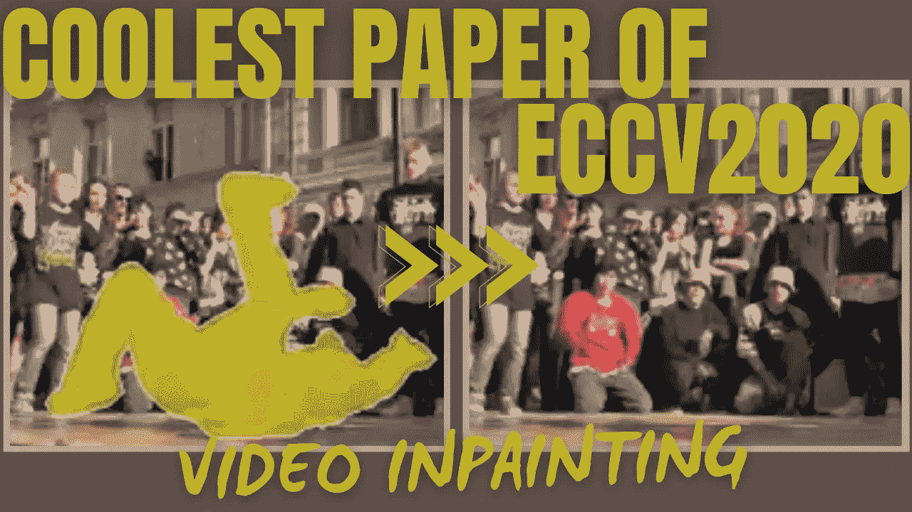
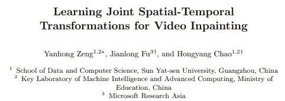
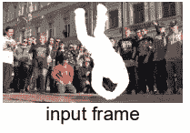
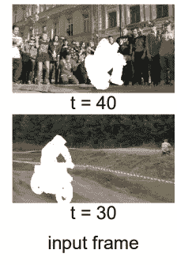
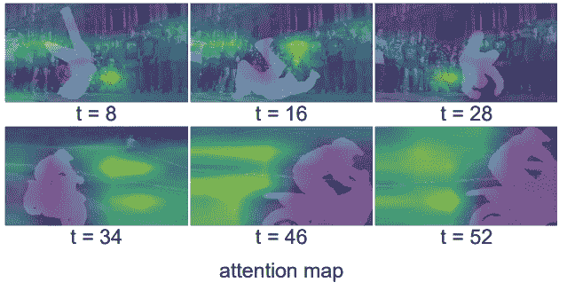
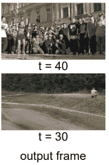

# 这个 AI 拍摄一个视频，并填充一个对象后面缺失的像素！

> 原文：<https://pub.towardsai.net/this-ai-takes-a-video-and-fills-the-missing-pixels-behind-an-object-video-inpainting-9be38e141f46?source=collection_archive---------1----------------------->

## [计算机视觉](https://towardsai.net/p/category/computer-vision)

## 视频修复—微软研究院

这种人工智能可以填充移动物体背后的缺失像素，并以比当前最先进的方法更准确、更少模糊的方式重建整个视频！让我们看看这个人工智能到底有什么能力，以及研究人员是如何实现这一点的。

本文涉及的[论文](https://arxiv.org/abs/2007.10247)

中国中山大学的研究人员最近发表了一篇被 ECCV2020 大会接受的论文，涵盖了一种新的视频修复技术，他们称之为“学习联合时空变换”。ECCV，或欧洲计算机视觉会议，是图像分析领域的顶级欧洲会议。

图片来自[报](https://arxiv.org/abs/2007.10247)

在图像分析中，视频修补是完成视频帧中缺失区域的过程。这是机器学习中一项具有挑战性的任务。当前最先进的方法使用注意力模型，以便通过从参考帧中搜索内容来找到帧的丢失像素。
然后，逐帧重建整个视频。使用这种注意力技巧，我在[之前的视频](https://www.youtube.com/watch?v=sMCHC7XFynM)中提到过，有一些问题。正如他们在论文中解释的那样，它可能会受到空间和时间维度上不一致的注意结果的影响。这通常会导致视频模糊和伪像，就像你在这张图片中看到的那样。

图片来自[论文](https://arxiv.org/abs/2007.10247)

他们提议使用一种叫做时空转换网络(STTN)的方法来代替注意力工作。简而言之，他们使用自我关注来同时填充所有输入帧中的缺失区域，在这些区域中前景的对象已经被移除。
我在之前提到的的[视频中也解释了注意力和自我注意力的区别。
如果你有兴趣，下面的描述框里有这个视频的链接。然后，他们使用这种 STTN 的优化版本，该版本将邻近和远处的帧作为输入，并使用对抗训练同时填充所有输入帧中的缺失区域。](https://www.youtube.com/watch?v=sMCHC7XFynM)

这个网络由三个主要部分组成:

首先，有一个帧级编码器，顾名思义，它将视频的所有帧编码成三个 1×1 维的值，下一步将详细介绍。该编码器只是堆叠在一起的几个二维卷积层，旨在对每帧的低层像素的深层特征进行编码。

图片来自[纸](https://arxiv.org/abs/2007.10247)

然后，这些输出被发送到一个多层、多头时空转换器，这些转换器被设计用来填充前面提到的所有输入帧中的空洞。但是，详细地说，单个变换器使用多个头部在各种各样的尺度上匹配查询(Q)和关键字(K ),使得检测由孔覆盖的相关区域的值(V)成为可能。在这些多头变压器中使用的各种各样的比例允许网络使用大尺寸的小块来完成静止的背景，以及捕捉视频中任何位置的深度对应，以便从较小的小块移动前景对象。所述小块都是通过在第一步中从所有帧中提取的空间小块中匹配查询和关键字来计算的。这是网络从所有输入帧中搜索连贯内容的关键部分。这一关键步骤中解释的一切都可以用这个短语来概括:学习深度编码空间中所有缺失区域的联合时空变换。

而且这些变压器的头都是并行运行的，使得这个网络速度极快。最后一步是将转换器找到的多层特征发送到帧级解码器，以便根据这些特征重建视频帧。现在我们对它的工作原理有了更好的了解，让我们来看一些使用这种技术制作的惊人的例子。

图片来自[纸](https://arxiv.org/abs/2007.10247)

如上所述，它能够从视频中移除对象，并使用背景和时间信息填充其下的区域。只要看看下面的视频，看看在他们的方法中模糊有多不明显。他们还可以用同样的信息填充整个视频中固定的孔洞。

**看看视频中的这些例子:**

如果你喜欢我的工作并想支持我，我会非常感谢你在我的社交媒体频道上关注我:

*   支持我最好的方式就是在 [**中**](https://medium.com/@whats_ai) 关注我。
*   订阅我的 [**YouTube 频道**](https://www.youtube.com/channel/UCUzGQrN-lyyc0BWTYoJM_Sg) 。
*   在 [**LinkedIn**](https://www.linkedin.com/company/what-is-artificial-intelligence) 上关注我的项目
*   一起学习 AI，加入我们的 [**Discord 社区**](https://discord.gg/SVse4Sr) ，*分享你的项目、论文、最佳课程、寻找 Kaggle 队友等等！*

**参考文献**

**关注&自我关注视频:**[https://www.youtube.com/watch?v=sMCHC7XFynM](https://www.youtube.com/watch?v=sMCHC7XFynM)
**论文:**[https://arxiv.org/abs/2007.10247](https://arxiv.org/abs/2007.10247)