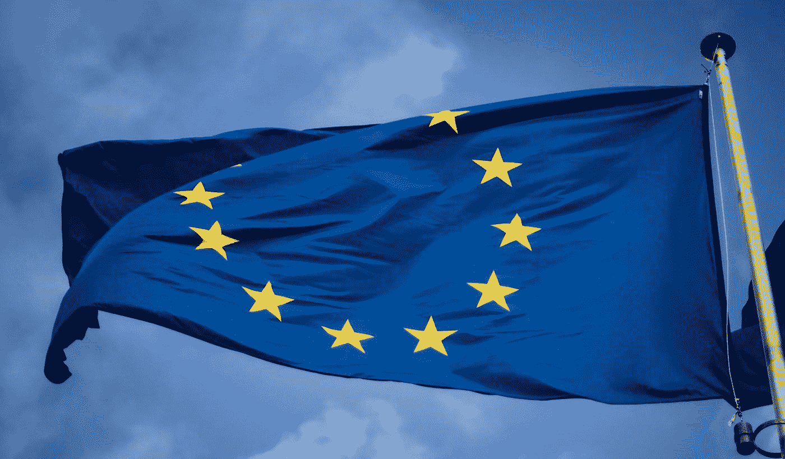
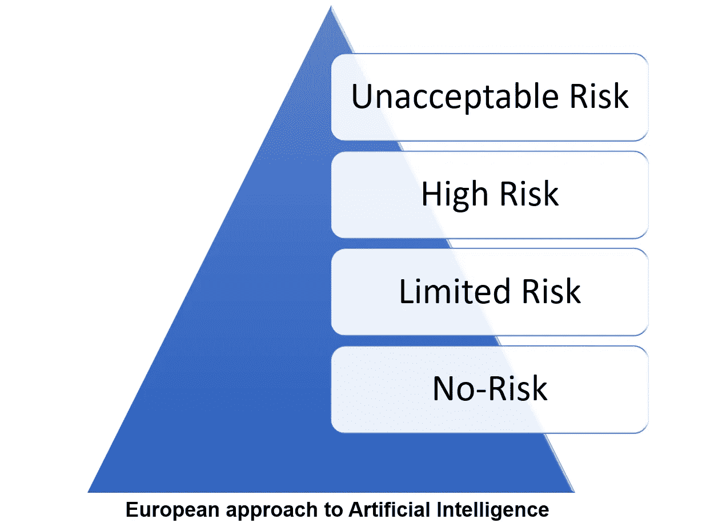

# 这就是欧盟计划如何更严格地管理欧洲的人工智能

> 原文：<https://pub.towardsai.net/this-is-how-the-european-union-is-planning-to-regulate-a-i-in-europe-more-strictly-8b47ee6c4d18?source=collection_archive---------0----------------------->

克里斯蒂安·卢在 [Unsplash](https://unsplash.com?utm_source=medium&utm_medium=referral) 上的照片

## [未来](https://towardsai.net/p/category/future)

## 欧盟正在对人工智能在各种活动中的使用进行限制。

欧盟今天(2021 年 4 月 21 日)公布了管理人工智能使用的严格规定，这是首个此类政策，概述了公司和政府如何使用一项被视为近年来最重要但充满伦理道德的科学突破之一的技术。

在布鲁塞尔的新闻发布会上提交的规则草案将限制人工智能在各种活动中的使用，包括自动驾驶汽车、招聘决策、学校招生选择和考试评分。

它还将涵盖执法和法院系统对人工智能的使用，这两者都被视为“高风险”，因为它们可能危及人们的安全或基本权利。

> “欧盟正在领导新的全球规范的发展，以确保人工智能可以被信任，”欧盟委员会负责数字政策的执行副主席玛格丽特·韦斯塔格尔(Margrethe Vestager)说。

一些应用，如公共场所的实时面部识别，将被完全禁止，但出于国家安全和其他目的的一些应用除外。

这些规则对亚马逊、谷歌、脸书和微软等主要科技公司以及许多在医疗保健、保险和金融领域使用人工智能的其他公司具有深远的影响。政府已经在刑事司法和公共服务分配中使用了各种版本的技术。

来源:作者图表

欧盟提出的法律框架不会严格看待人工智能技术本身。但它将考虑如何在应用程序中使用人工智能，以及用于什么目的。

它将采用基于风险的比例方法，特定人工智能可能导致的风险越高，对所有成员国的规则就越严格:

不可接受的风险:被认为对安全、生计和人民权利构成明显威胁的人工智能系统将被禁止，例如操纵人类行为以规避自由意志的人工智能应用程序和允许政府授予“社会分数”的系统。

> “……就使用语音辅助操纵儿童做危险事情的玩具而言。这种用途在欧洲没有立足之地。因此，我们提议禁止它们”——玛格丽特·韦斯塔格尔

**高风险**:与关键基础设施、职业教育或培训、产品安全组件、就业和工人管理、基本公共和私人服务(信用评分)、执法活动(可靠性评估测试)、移民管理、庇护和边境控制以及司法相关的用例在投放市场之前将受到约束

> “评估某人是否有资格从银行获得抵押贷款的系统。或者自动驾驶汽车或医疗设备中使用的软件，这可能会给我们的安全和健康带来新的风险。这些人工智能系统将受到一套新的五项严格义务的约束，因为它们可能会对我们的生活产生巨大影响。”—玛格丽特·韦斯塔格尔

**有限风险**:对使用 [IA](https://www.linkedin.com/feed/hashtag/?keywords=ia) 有特定透明要求的系统，如聊天机器人。

> “……人工智能的用途，例如聊天机器人可以帮助我们订票或找到最近的商店来购买我们想要的东西。这些也是允许的，但要遵守透明度义务。”—玛格丽特·韦斯塔格尔

**无风险**:允许不受限制地使用视频游戏或垃圾邮件过滤器等应用程序。

> “我们的法律框架允许免费使用此类应用程序，在现有的保护消费者的法律规则之上没有任何限制。”—玛格丽特·韦斯塔格尔

# 新法规的影响

违反新法规的公司可能面临高达全球销售额 6%的罚款，这将需要几年的辩论和实施。

人工智能，即通过研究大量数据来训练机器独立执行任务，被技术专家、商业领袖和政府官员视为世界上最具变革性的技术之一。

然而，随着系统变得越来越复杂，确定技术为什么做出决定可能变得更具挑战性，这可能会随着计算机变得越来越强大而恶化。研究人员对它的使用提出了伦理问题，声称它可能会延续社会偏见，侵犯隐私，或导致更多的工作自动化。

> “在人工智能领域，信任是必须的，而不是一件好事，”欧盟委员会负责数字政策的执行副主席玛格丽特·韦斯塔格尔(Margrethe Vestager)说。“有了这些历史规则，欧盟正在引领新的全球规范的发展，以确保人工智能可以被信任。”—玛格丽特·韦斯塔格尔

# 结论

我在这里的观点是，欧盟试图通过引入规则草案，进一步确立自己作为世界上最积极的科技行业监管机构的地位。

欧盟已经颁布了全球最严格的数据隐私法规，目前正在讨论其他反垄断和内容监管立法。

公司需要积极准备自己合规，重新审视他们如何确保属于高风险领域的人工智能相关应用程序将被要求允许外部审计和第三方评估，以确保这些应用程序是根据欧盟建议的原则开发的。

此外，正如我们在其他全球监管倡议中看到的那样，这套原则可以直接影响其他国家和地区，可能会根据欧盟启动或调整他们关于负责任的人工智能的法规。

> “欧洲可能不是上一波数字化浪潮的领导者，但它完全有能力引领下一波数字化浪潮。它将以工业数据为基础。它将把人工智能引入制造业、清洁能源和医疗保健等欧洲擅长的行业。所以我们必须确保尽快把它做好。因此，无论技术发展得多快，人工智能总是与我们的身份和立场保持一致。”—玛格丽特·韦斯塔格尔

# 还有一点

如果你想阅读更多关于负责任和可解释的人工智能和人工智能伦理的文章，下面的文章可能会让你感兴趣:

1.  我们能解释人工智能吗？可解释人工智能导论。
2.  [责任 AI 或 rAI 快速介绍](https://towardsdatascience.com/a-quick-introduction-to-responsible-ai-or-rai-ae75fad526dc)
3.  [介绍商业领袖负责任人工智能的 4 项原则](https://medium.com/codex/introduction-to-the-4-principles-of-the-responsible-ai-for-business-leaders-b7f5c8df5ba9)
4.  [根据微软的说法，如何将负责任的人工智能原则应用到实践中](https://medium.com/mlearning-ai/how-to-bring-the-principles-of-responsible-ai-to-the-practice-according-to-microsoft-c0d2b905ca2b)

# 资源

1.  [执行副总裁 Vestager 在关于培育欧洲人工智能方法的新闻发布会上的讲话](https://ec.europa.eu/commission/presscorner/detail/en/SPEECH_21_1866)
2.  [欧洲人工智能方法法规提案](https://digital-strategy.ec.europa.eu/en/library/proposal-regulation-european-approach-artificial-intelligence)