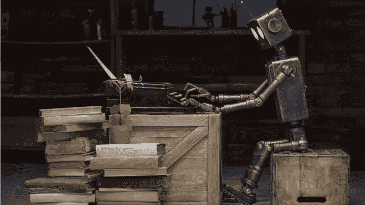
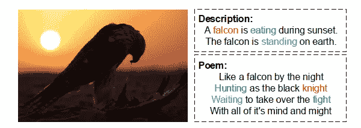
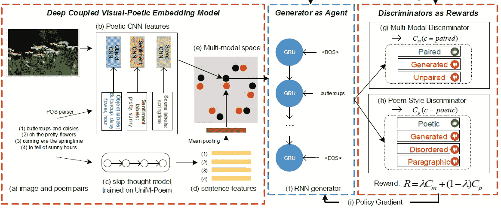
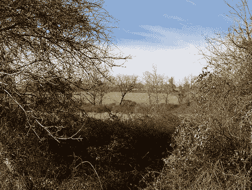

# 这个微软神经网络可以从图像中创作诗歌

> 原文：<https://pub.towardsai.net/this-microsoft-neural-network-can-create-poetry-from-images-2c47bd2a35d1?source=collection_archive---------0----------------------->

## [深度学习](https://towardsai.net/p/category/machine-learning/deep-learning)

## 这项研究以一种模拟人类创造力的巧妙方式结合了语言、计算机视觉。

来源:[https://www . ifl science . com/technology/ai-is-now-writing-poem-and-its-Hilary-worthy/](https://www.iflscience.com/technology/ai-is-now-writing-poetry-and-its-hilariously-terrible/)

> 我最近创办了一份专注于人工智能的教育时事通讯，已经有超过 10 万名订户。《序列》是一份无废话(意思是没有炒作，没有新闻等)的 ML 导向时事通讯，需要 5 分钟阅读。目标是让你与机器学习项目、研究论文和概念保持同步。请通过订阅以下内容来尝试一下:

 [## 序列

### 订阅人工智能世界中最相关的项目和研究论文。受到 102，000 多人的信任…

thesequence.substack.com](https://thesequence.substack.com/) 

最近，我在语言和计算机视觉的交叉领域做了一些工作，并回顾了许多太空研究。这让我想起了微软研究院在 2018 年发表的一篇非常有趣的论文，该论文以模拟人类创造力的方式结合了计算机视觉和诗歌生成。

创造力一直被认为是人类认知技能之一，人工智能难以复制。在创造力的光谱中，诗歌被认为是最纯粹和最少被理解的创造性思维之一。诗歌的创作依赖于许多不同认知技能的结合，如抽象思维、象征主义、情感、特殊的语言处理以及许多其他神经科学几乎不理解的领域。我们如何定义诗歌语言，是什么激发了诗歌？如果我们几乎不能回答这些问题，想象一下在人工智能系统中重建诗歌会有多困难。2018 年，来自微软[的一组研究人员发表了一篇研究论文，提出了一种非常有创意的深度学习方法，用于从图像中生成诗意的语言](https://www.microsoft.com/en-us/research/publication/beyond-narrative-description-generating-poetry-from-images-by-multi-adversarial-training/)。

# 神经网络诗歌的挑战

从图像中生成自然语言是一个在深度学习社区中吸引了很多关注的领域。然而，与图像字幕和转述相比，从图像生成诗意语言是一个非常具有挑战性的问题。这主要是由于一个特定的意象和能够产生诗歌的诗歌符号之间的差距。对于字幕神经网络来说，图像中的男人只是一个男人，但从诗歌的角度来看，它可以代表许多符号:“希望”、“人性”、“未来”…

图片来源:微软研究院

从深度学习的角度来看，从图像生成诗歌的过程提出了三个主要挑战:

a) **跨模态:**这种挑战产生于从图像中提取主题和使用那些主题作为诗意符号之间的差距。从图像生成诗歌的一种直观方式是首先从图像中提取关键字或标题，然后像从主题生成诗歌一样将它们视为诗歌生成的种子。然而，关键字或题注会遗漏图像中的许多信息，更不用说对诗歌生成很重要的诗歌线索了。

b) **主观性:**与图像字幕和图像分段相比，从图像生成诗歌是更主观的任务，这意味着图像可以从各个方面与几首诗歌相关，而图像字幕/分段更多的是描述图像中的事实并产生相似的句子。

c) **诗歌风格:**有数百种诗歌风格结合了不同的模式，如节奏、韵律或诗歌结构。因此，评价一首诗的质量仍然是非常主观的任务。

# 在意象-诗歌模式中

为了应对上述挑战，微软研究团队依赖于通过策略梯度的多对手训练技术。多对抗神经网络(mGANs)将对抗网络(GANs)的基本原理扩展到多个鉴别器。微软深度学习模型由两个主要部分组成:

1)深度耦合的视觉-诗意嵌入模型，以从图像中学习诗意表示。

2)政策梯度优化的多对手训练程序。一个基于 RNN 的发生器作为代理，两个有区别的网络为政策梯度提供奖励。

结合这两个元素，微软建立了一个神经网络架构，以一种非常聪明的方式结合了卷积、递归和对抗性神经网络。

图片来源:微软研究院

在上图所示的模型中，深度耦合的视觉-诗歌嵌入由带注释的图像-诗歌对训练。该模型使用 CNN 来学习将图像特征与诗歌符号进行匹配。模型中的下一层是由两个鉴别器(多模态和诗歌风格)训练生成的基于 RNN 的句子，这两个鉴别器基于生成的句子的质量产生不同的奖励。

让我们更详细地探讨一下该架构的一些组件。

## 深度情侣视觉-诗意嵌入

深度耦合视觉诗意嵌入(DCVPE)模型的目标是学习一个嵌入空间，不同模态、图像和句子的点可以被投射到该嵌入空间。为了实现这一点，DCVPE 使用三种不同的 CNN 用于对象、场景和情感，这有助于缩小图像主题和诗歌之间的差距。学习到的嵌入用于训练神经网络架构中的下一个组件:诗歌生成器。

## 诗歌生成器

生成模型包括用于图像编码器的 CNN 和用于诗歌解码器的 RNN。显然，在语言方面使用 RNN 而不是 CNN 的原因是，它可以更好地编码诗歌中广泛存在的长句的结构依赖语义。由两个不同的鉴别器产生的输出和奖励中的发生器因子被用于改进诗歌的质量。

## 歧视者

由生成器层创建的任何诗歌都必须满足两个主要标准:

1)与输入图像的相关性。

2)正确的诗歌结构，包括适当的长度，诗歌的语言风格，句子之间的一致性等因素。

为了优化这些元素，微软的模型包括两个不同的鉴别器:

a) **多模态鉴别器:**多模态鉴别器用于引导生成的与对应图像相关的诗歌。它被训练成将一首诗分成三类:成对的作为正例，不成对的，生成的作为反例。

b) **诗歌风格鉴别器:**诗歌风格鉴别器的目标是引导生成的诗歌类似人类写的诗歌。鉴别者将把一首诗分为四类:生成的诗将被分为四类:诗化的、无序的、段落的和生成的。

# 机器中的诗人

使用多重对抗训练来进行诗歌创作是应对这一挑战的一个非常聪明的方法。微软团队用不同的图像数据集评估了他们的诗歌生成模型，产生了出色的结果。让我们来看看从下图生成的这首诗:

图片来源:微软研究院

*阳光灿烂*
*风移动*
*裸树*
*你跳舞*

生成的诗具有人类诗歌的所有成分。它是模棱两可的，隐喻性的，它有一些美。诗歌被视为人类创造力最纯粹的形式之一，但阅读这首人工智能生成的诗歌，我们可以希望有一天机器将匹配我们的诗歌技能。