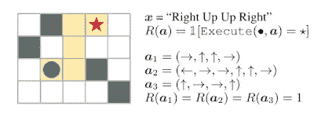
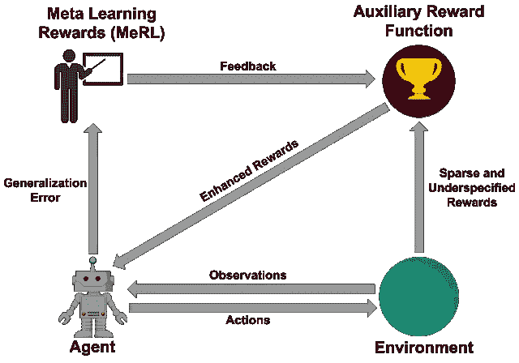
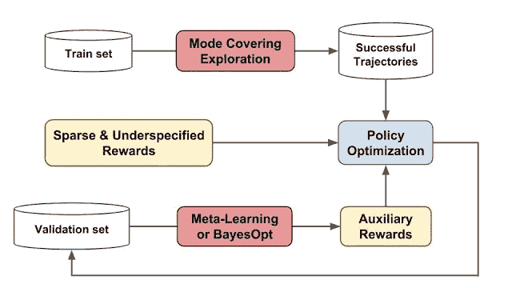
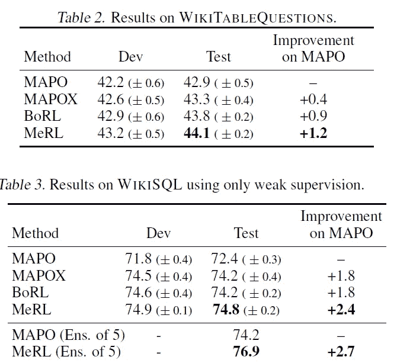

# 这种由谷歌创造的强化学习方法可以通过最少的演示来学习

> 原文：<https://pub.towardsai.net/this-reinforcement-learning-method-created-by-google-can-learn-with-minimum-demonstrations-f68afc2ae8cd?source=collection_archive---------0----------------------->

## [人工智能](https://towardsai.net/p/category/artificial-intelligence)

## 这种被称为元奖励学习的新方法是强化学习中一个非常有趣的发展。

【https://builtin.com/machine-learning/reinforcement-learning】来源:

> **我最近创办了一份专注于人工智能的教育时事通讯，已经有超过 80，000 名订户。《序列》是一份无废话(意思是没有炒作，没有新闻等)的 ML 导向时事通讯，需要 5 分钟阅读。目标是让你与机器学习项目、研究论文和概念保持同步。请通过订阅以下内容来尝试一下:**

** [## 序列

### 订阅人工智能世界中最相关的项目和研究论文。受到 85，000 多人的信任…

thesequence.substack.com](https://thesequence.substack.com/) 

强化学习一直是过去五年中一些最大的人工智能(AI)突破的核心。在掌握围棋、雷神之锤 3(Quake III)或星际争霸(StarCraft)等游戏时，强化学习模型证明了它们可以超越人类的表现，并创造出前所未有的独特长期战略。强化学习的魔力部分依赖于定期奖励导致更好结果的行动。这种模型在密集的奖励环境中非常有效，比如游戏，在游戏中，几乎每一个动作都对应一个特定的反馈，但如果反馈不可用，会发生什么呢？在强化学习中，这被称为稀疏回报环境，不幸的是，这是大多数现实世界场景的代表。最近，来自谷歌[的研究人员发表了一篇新论文，提出了一种在稀疏奖励环境中使用强化学习实现泛化的技术](https://arxiv.org/abs/1902.07198)。

稀疏回报环境中强化学习的总体挑战依赖于在有限反馈的情况下实现良好的泛化。更具体地说，在稀疏回报环境中实现鲁棒泛化的过程可以概括为两个主要挑战:

1) **探索-利用平衡:**使用稀疏回报操作的代理需要平衡何时采取导致直接结果的行动与何时进一步探索环境以收集更好的情报。探索-开发困境是引导强化学习主体的基本平衡。

2) **处理未指定的奖励:**一个环境中奖励的缺失和未指定奖励的浮现一样难以管理。在稀疏奖励场景中，代理并不总是接受特定类型奖励的培训。在接收到一个新的反馈信号后，强化学习代理需要评估这个信号是否表示成功或失败，这并不总是无关紧要的。

稀疏回报环境存在于各种人工智能场景中，但没有一个像自然语言理解(NLU)任务那样突出。许多 NLU 任务是基于将复杂的自然语言结构映射到目标动作，并接收二元成功-失败反馈。NLU 环境中的回报既稀少又不确定，这导致强化学习代理面临难以置信的挑战。让我们用几个例子来说明这一点。

考虑一个“盲人”代理，其任务是通过遵循一系列自然语言命令(*例如*“右，上，上，右”)到达迷宫中的目标位置。给定输入文本，代理(绿色圆圈)需要解释命令，并根据这种解释采取行动，以生成行动序列(a)。如果达到目标(红星)，代理人将获得 *1* 的奖励，否则将获得 *0* 的奖励。因为代理无法访问任何视觉信息，所以代理解决此任务并归纳出新颖指令的唯一方法是正确解释指令。

**图片来源:谷歌研究**

另一个例子使用问答配对的语义解析，其中向代理呈现自然语言问题 x，并要求代理生成类似 SQL 的程序 a。如果在相关数据表上执行程序 a 导致正确答案(例如，USA)，则代理接收奖励 1。由于虚假程序(例如，a2；a3)也可以达到 1 的奖励。

**图片来源:谷歌研究**

在上述两种情况下，强化学习代理需要学习从稀疏回报中进行归纳，在稀疏回报中，只有少数轨迹转化为非零回报。类似地，一些奖励可能是未指定的，没有区分偶然的和有目的的成功。在这种情况下学习归纳需要两个主要的成就:

1)寻找成功轨迹的有效探索。

2)排除虚假轨迹以学习可概括的行为。

# 介绍陨石色

元奖励学习(MeRL)是 Google 提出的一种方法，用于教授强化学习代理在奖励稀疏的环境中进行归纳。MeRL 的关键贡献是在不影响代理人概括表现的情况下，有效地处理未指定的奖励。在我们的迷宫游戏的例子中，一个代理可能偶然得到一个解决方案，但是，如果它在训练中学会了执行虚假的动作，当提供看不见的指令时，它很可能失败。为了应对这一挑战，MeRL 优化了一个更精细的辅助奖励函数，该函数可以根据行动轨迹的特征区分意外和有目的的成功。通过元学习，通过最大化经过训练的代理在坚持验证集上的性能来优化辅助奖励。

**图片来源:谷歌研究**

让我们在第二个 NLU 例子的上下文中举例说明莫尔。在语义解析游戏中，代理的目标是学习复杂的自然语言句子和 SQL 语法之间的映射。例如，在“*这个问题中，哪个国家获得了最多的银牌？*”和[一个相关的维基百科表](https://en.wikipedia.org/wiki/Athletics_at_the_1991_All-Africa_Games#Medal_table)，代理需要生成一个类似 SQL 的程序，该程序会产生正确的答案(*即*“尼日利亚”)。

**图片来源:谷歌研究**

将 MeRL 应用于语义解析游戏场景有效地将组合搜索和探索从健壮的策略优化中解脱出来。在高层次上，MeRL 模型将利用模式覆盖探索方法来在记忆缓冲区中收集一组不同的成功轨迹。然后使用元学习或贝叶斯优化技术来学习辅助奖励函数，以排除虚假轨迹。在实践中，MeRL 方法在 [WikiTableQuestions](https://nlp.stanford.edu/blog/wikitablequestions-a-complex-real-world-question-understanding-dataset/) 和 [WikiSQL](https://github.com/salesforce/WikiSQL) 基准测试中取得了最先进的结果，比[之前的工作](https://arxiv.org/abs/1807.02322)分别提高了 *1.2%* 和 *2.4%* 。此外，MeRL 自动学习辅助奖励功能，无需任何专家示范 *s* 。语义分析游戏场景中的 MeRL 模型的一般构建块如下图所示:

**图片来源:谷歌研究**

在该实验中，如下表所示，MeRL 优于现有技术的强化学习模型:

**图片来源:谷歌研究**

MeRL 是解决强化学习解决方案中两个关键挑战的首批尝试之一。首先，它提供了一个探索组合搜索空间的模型，以找到罕见的成功，同时它也有助于区分偶然的成功和有目的的成功。MeRL 的原则可以帮助将强化学习的采用扩展到更主流的场景，例如今天需要禁止数量的训练数据的对话式人工智能。**