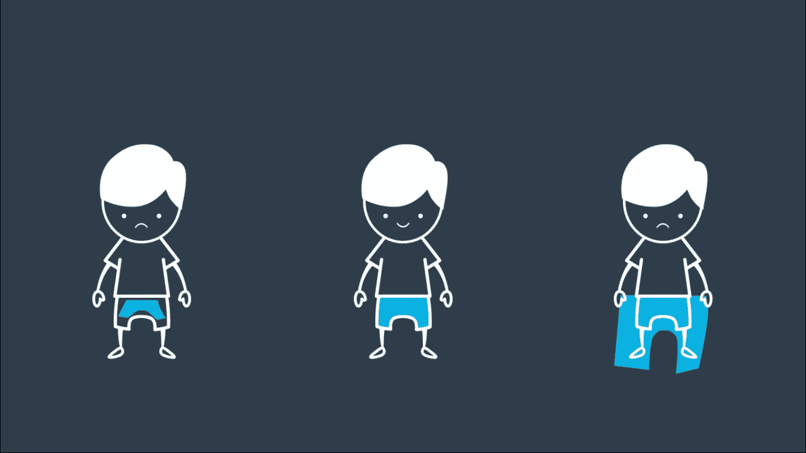

# 三个疯狂简单的方法来对抗深度学习模型中的过度拟合

> 原文：<https://pub.towardsai.net/three-crazily-simple-recipes-to-fight-overfitting-in-deep-learning-models-e67db6380106?source=collection_archive---------0----------------------->

## [深度学习](https://towardsai.net/p/category/machine-learning/deep-learning)

## 这三个基本思想应该在任何机器学习建模实验中落实到位。

来源:[https://towards data science . com/over fitting-vs-under fitting-DDC 80 C2 fc 00d](https://towardsdatascience.com/overfitting-vs-underfitting-ddc80c2fc00d)

> 我最近创办了一份专注于人工智能的教育时事通讯，已经有超过 80，000 名订户。《序列》是一份无废话(意思是没有炒作，没有新闻等)的 ML 导向时事通讯，需要 5 分钟阅读。目标是让你与机器学习项目、研究论文和概念保持同步。请通过订阅以下内容来尝试一下:

 [## 序列

### 订阅人工智能世界中最相关的项目和研究论文。受到 85，000 多人的信任…

thesequence.substack.com](https://thesequence.substack.com/) 

过度拟合被认为是现代深度学习应用中最大的挑战之一。从概念上讲，当模型生成的假设过于适合特定数据集的数据，从而无法适应新数据集时，就会发生过度拟合。理解过度拟合的一个有用的类比是将其视为模型中的幻觉。本质上，当一个模型从一个数据集推断出不正确的假设时，它会产生幻觉/过度拟合。在机器学习的早期，已经有很多关于过度拟合的文章，所以我不会假设有任何聪明的方法来解释它。然而，我想利用这篇文章提出三种实用的方法来思考深度学习模型中的过度拟合。

使过度拟合如此具有挑战性的一个方面是，很难跨不同的深度学习技术进行归纳。卷积神经网络倾向于开发与观察到的递归神经网络不同的过拟合模式，这些模式不同于生成模型，并且该模式可以外推到任何类别的深度学习模型。有点讽刺的是，过度拟合的倾向随着深度学习模型的计算能力线性增加。由于深度学习代理可以几乎没有成本地生成复杂的假设，过度拟合的倾向增加了。

# 对抗过度拟合的三个简单策略

虽然没有防止过度拟合的灵丹妙药，但实践经验表明，一些简单、几乎是常识的规则有助于防止深度学习应用中的这种现象。从已经发表的防止过度拟合的几十个最佳实践中，有三个基本思想包含了其中的大部分。

## 数据/假设比率

当一个模型产生了太多的假设而没有相应的数据来验证它们时，通常会发生过度拟合。因此，深度学习应用程序应该尝试在测试数据集和应该评估的假设之间保持适当的比例。然而，这并不总是一种选择。

有许多深度学习算法，如归纳学习，依赖于不断生成新的，有时更复杂的假设。在这些情况下，有一些统计技术可以帮助估计正确的假设数量，以优化找到接近正确的假设的机会。虽然这种方法不能提供精确的答案，但它有助于在假设的数量和数据集的组成之间保持统计上的平衡。哈佛大学教授莱斯利·瓦里安在他的书《可能大致正确》中精彩地解释了这个概念。

## 偏爱简单的假设

防止深度学习模型中过度拟合的一个概念上琐碎但技术上困难的想法是不断生成更简单的假设。当然啦！简单总是更好，不是吗？但是在深度学习算法的背景下，什么是更简单的假设呢？如果我们需要把它归结为一个量化的因素，我会说一个深度学习假设中的属性数量和它的复杂程度成正比。

在计算和认知方面，较简单的假设往往比其他具有大量属性的假设更容易评估。因此，简单的模型比复杂的模型更不容易过度拟合。太好了！现在，下一个明显的头痛问题是如何在深度学习模型中生成更简单的假设。一种不太明显的技术是根据算法的估计复杂度，对算法附加某种形式的惩罚。这种机制倾向于更简单、近似准确的假设，而不是更复杂、有时更准确的假设，当新数据集出现时，这些假设可能会分崩离析。

## 偏差/方差平衡

偏差和方差是深度学习模型中的两个关键估计量。从概念上讲，偏差是我们模型的平均预测值和我们试图预测的正确值之间的差异。具有高偏差的模型很少关注训练数据，并且过度简化了模型。它总是导致训练和测试数据的高误差。或者，方差是指给定数据点或告诉我们数据分布的值的模型预测的可变性。高方差模型非常重视训练数据，不会对以前没有见过的数据进行归纳。结果，这样的模型在训练数据上表现得非常好，但是在测试数据上有很高的错误率。

来源:[https://www . kdnugges . com/2016/08/bias-variance-trade off-overview . html](https://www.kdnuggets.com/2016/08/bias-variance-tradeoff-overview.html)

偏差和方差与过度拟合有什么关系？简而言之，概括的艺术可以通过减少模型的偏差而不增加其方差来总结。深度学习模型中的一个良好实践是定期将产生的假设与测试数据集进行比较，并评估结果。如果假设继续输出相同的错误，那么我们有一个大的偏差问题，我们需要调整或替换算法。相反，如果错误没有明确的模式，问题就在于方差，我们需要更多的数据。

与防止深度学习系统中的过度拟合相关的大多数最佳实践可以总结为前述策略的排列。前面的论点的简单性质可以帮助设计有效的策略来防止深度学习程序中的过度拟合，而不需要复杂的工具或框架。