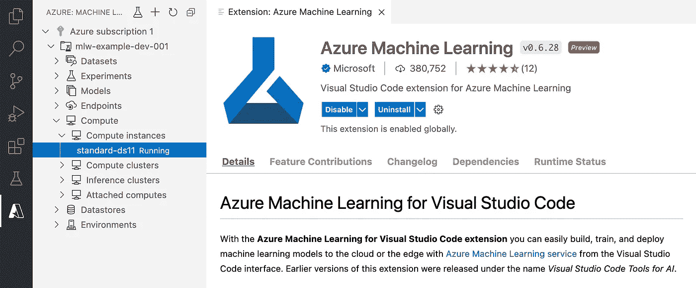
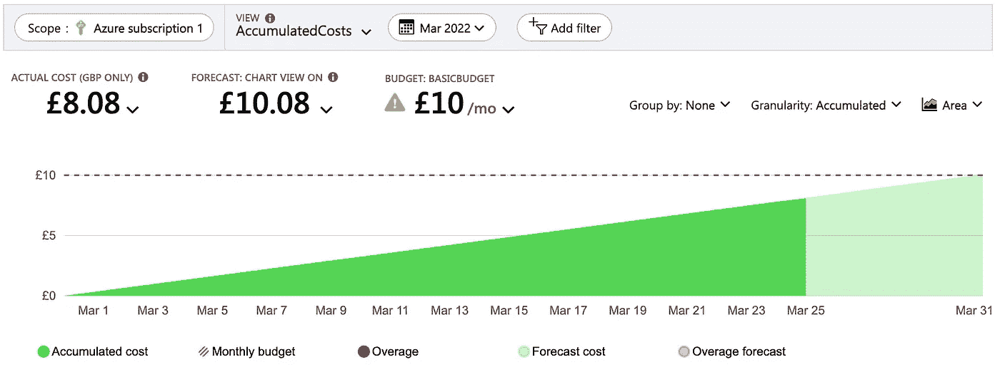

# Azure 机器学习入门提示

> 原文：<https://pub.towardsai.net/tips-for-using-azure-machine-learning-5dfde2df0313?source=collection_archive---------1----------------------->

## 准备 DP-100 Azure 数据科学助理考试。


艾伦·沃伯顿/英国广播公司/更好的人工智能图像/自然/ CC-BY 4.0

数据科学模型的端到端管道是多样且曲折的。在探索性数据分析、模型训练、部署和管理这些模型之间，有许多活动的部分。Azure Machine Learning 是微软的云服务，旨在帮助开发者踏上这一旅程。它提供了一套广泛的工具来跟踪您的模型的开发、版本化您的数据、安全地部署您的模型等等。

我认为许多好的 API 和软件都有一些共同点。其中之一是他们擅长预测你的欲望，或者至少了解用户想要如何与系统互动。当我写代码时，我想“哦，天哪，我希望有一种方法可以非常容易地做到这一点”，然后偶然发现这种语言的一个功能在一行中完成了同样的事情，我觉得这个库的作者做了一些非常特别的事情。我想这在 Python 中经常发生，Pandas 或 Numpy 的设计方式似乎能理解我想要如何与之交互(除了时间和日期，它们会吸收所有的东西)。

目前，我正在准备 DP-100，这是一个关于使用 Azure ML 做数据科学的微软考试。我花了很多时间来学习生态系统，了解它是如何运作的。我发现自己思考了很多关于它的设计有多好的问题。许多功能如何让我的生活变得更加轻松，消除了我编写大量代码的需要，因为他们已经实现了一个智能功能来完成这些工作。

我以前没有真正写过关于数据科学的文章，但我想在这里尝试一下。已经有很多关于 DP-100 的好东西了，所以我想尝试一些稍微不同的东西。这是一个称赞 DP-100 的列表，与教学大纲很好，或者在某些情况下，我认为它非常简洁。这不是关于如何使用这些特性的完整教程，而是一些值得关注的建议。尽情享受吧！

## Visual Studio 代码

好的，这有时会在教学大纲中提到。然而，我会再次提到它，因为它已经很好地融入其中。



通过安装面向 VSCode 的 Azure 机器学习扩展，您可以访问它的大部分功能！当所有的微软产品都很好地相互配合时，这不是很好吗？我想看维姆做这个。来源:图片由作者提供。

在 Visual Studio 代码中，Azure 机器学习插件允许你访问你的工作空间、数据集和计算等。基本上，它允许你使用 VSCode 作为你的 IDE，同时保留 Azure ML 的功能。一旦你连接到一台正在运行的计算机上，你就可以访问存储在其上的文件，并像在本地机器上一样运行你的代码。在 Azure ML 浏览器上，你只能使用笔记本，而在这里你可以随心所欲地编写脚本！

## 标准化

从我学习编程的经验来看，我认为编程技能可能有“硬”和“软”之分。我将把“硬”技能称为纯编码:语言本身。“软”的东西实际上是它周围的一切。我甚至不确定这是否是一个好的区分，事实上，将这些一分为二可能会导致更糟糕的代码。然而，我提到它是因为我认为有时候当你学习编码时，你被巧妙地训练来区分这两者。根据我的经验，编程课程和教科书几乎只关注“硬”技能，而把“软”的东西留给读者练习。

我不是一个很好的程序员，我仍然有很大的进步空间。我认为我变得更好的大部分原因来自于拥抱柔软的一面，以及对“坚硬”的深思熟虑和明智的拒绝。我的很多问题都是典型的——“哎呀，我 3 个月前写了这段代码，却忘了它是做什么的”，“哎呀，我希望我能回到代码的早期版本”或者“哎呀，我得到了别人的代码，却不知道如何使用它”。我觉得很多问题不是通过编写更快的函数来解决的，而是通过 DevOps 和标准来解决的。

无论如何，这是一个简单的介绍:尝试标准化的东西。微软已经为 Azure recourses 推荐了[命名约定](https://docs.microsoft.com/en-us/azure/cloud-adoption-framework/ready/azure-best-practices/resource-abbreviations)，也有[模板](https://cookiecutter.readthedocs.io/en/1.7.2/)用于设计你的编码项目(我在 [Github](https://github.com/andrewblance/roci) 上玩得很糟糕)。通过标准化事物，它帮助新人进入一个项目，当你进入一个你从未参与过的项目时帮助你，当你回到你多年未见的代码时帮助你自己。事物将总是以一致的方式命名，项目将以熟悉的方式布局。

例如，每个项目都有一个追索权组，命名如下:

```
rg-example-dev-001
```

这已经告诉了你很多信息:你知道它是一个追索权团队(`rg`)，你知道它的目的(它是为了一个叫做`example`的项目)，你知道它是为了`dev`的构建(而不是`uat`或`prod`)。现在，在这里你可以创建一个 Azure 机器学习工作区，并将其命名为:

```
mlw-example-dev-001
```

这种风格可以用于其他任何东西，并且应该意味着所有的东西都是整洁的。

## CI/CD

使用某种版本控制是绝对重要的。这是代码被送到“仓库”保管的时候。能够跟踪代码的变更和修订绝对是救命稻草。我认为这是很多编码教程和教科书都没有提到的东西，我承认我确实花了太长时间从来没有使用过 Git(这是一个极其可怕的错误)。

持续集成是指每当代码被发送到 repo 中时都会被自动检查。这可能包括自动运行您编写的所有测试，检查代码是否可以构建，或者运行 linter。

在工作中，我们使用 Azure DevOps，它为项目管理跟踪事物提供了许多乐趣。我用 Github 处理我所有的个人物品，它有一个很棒的功能，你可以通过点击键盘上的`.`键在浏览器中启动笔记本。太神奇了。两者都有强大的 CI/CD 产品:Github 有 Github Actions，Azure DevOps 有 Pipelines，但两者的工作方式相似。

在 Github 中，您可以创建一个文件`.github/workflows/main.yml`,看起来像:

```
name: Linting and Testingon: [push]jobs:
  build:
    runs-on: ubuntu-latest
    strategy:
      matrix:
        python-version: [3.7, 3.8, 3.9]
    steps:
    - uses: actions/checkout@v2
    - name: Set up Python ${{ matrix.python-version }}
      uses: actions/setup-python@v2
      with:
        python-version: ${{ matrix.python-version }}
    - name: Install dependencies
      run: |
        python -m pip install --upgrade pip
        pip install -r requirements.txt
    - name: Test with pytest
      run: |
        pytest --ignore=docs 
```

这段代码，每次你推送你的代码都会基于`requirements.txt`的内容用包创建一个 Python 实例`3.7`、`3.8`或者`3.9`，然后运行`pytest`。现在，当您检查项目的 Github 页面时，您可以在接受 pull 请求之前考虑 CI 管道的结果。Azure 管道使用非常相似的语法。这是确保代码在被接受之前通过某些测试的好方法。

ps，微软请为 Azure DevOps 发布`.`的东西！

## 共享环境

对于每个项目，我都为它创建了一个 Python 环境。这由一个`requirements.txt`文件驱动。如上所述，这个文件也用于创建用于 CI/CD 管道的 Python 环境。

当您使用`run`方法在 Azure Machine Learning 中提交作业时，您需要指定要使用的环境。当时我(错误地)想象我必须创造一个全新的环境。我想我必须通过循环我的需求文件来完成，一次传递一个`.add_pip_package()`的内容。最终，这将创造出和其他地方一样的环境。然而，它比那容易得多。

首先，你可以使用`.from_pip_requirements()`,将整个需求文件一次性传递给它。或者，如果您已经创建了一个 conda 环境，您可以在`.from_existing_conda_environment()`中指定它。

然后，如果你注册了这个环境，你就可以在 Azure ML 的“环境”标签中看到它了！现在，您应该在项目的所有部分拥有一致的环境。

## 制定预算

我很抱歉地告诉你:有一天你*会*让一台虚拟机或计算机或其他你认为已经关闭的东西继续运行。这可能是一个小时，或几个星期，但它会发生。我试着不去想我不小心花了多少钱，这样不好…

在您的资源组或订阅中，您可以设置[预算](https://docs.microsoft.com/en-us/azure/cost-management-billing/costs/tutorial-acm-create-budgets)，这可以帮助您在问题出现之前阻止它。你可以输入你认为你应该花多少钱，并设定一个点，当你开始接近这个点时，你希望得到警告。



这个月到目前为止我已经花了多少钱，以及我预计要花多少钱。是啊，看起来我要比我想的多花一点钱了。来源:图片由作者提供。

## 最后的想法

这是我在使用 Azure 机器学习时发现的一些有用的东西。每一点都可以成为它自己的一篇文章——我已经把所有的点都做了，真的！我还发现了很多我认为很棒的东西(Azure ML、Labeller 和 Synapse 中的“模型”选项卡)，我也很想谈谈。如果人们感兴趣，我可能会回来写更多的东西！

然而，这 5 样东西:VSCode、标准化、CI/CD、环境管理和预算都是构建 DP-100 内容的好工具！我以后可能会回到这些事情上进行更深入的探索，但是希望您喜欢这里的内容！

Andrew 是 IT 咨询公司 Waterstons 的数据科学家。他主持了一个名为 [*大脑在外面*](https://brainontheoutside.buzzsprout.com/) 的愚蠢播客，并加入了一个名为*立体布景*的真正可怕的乐队。无论如何，杜伦大学认为他足够明智，让他成为粒子物理学(以及机器学习和量子计算)的博士。他能以相当快的速度跑完 5 公里(22:05)，并认为现代《星际迷航》并不像人们描述的那样糟糕。