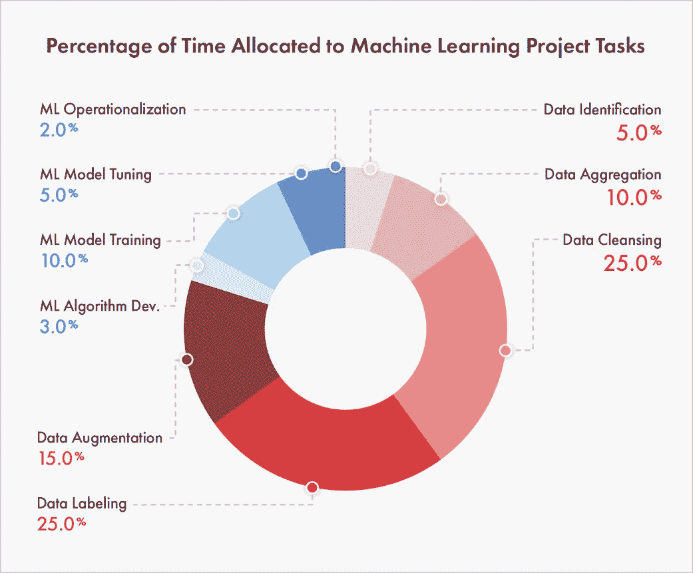
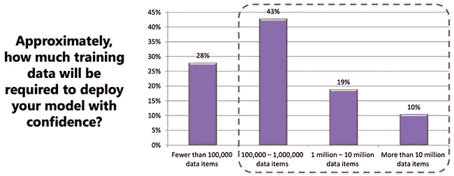

# 87%的机器学习项目失败的 10 大原因？

> 原文：<https://pub.towardsai.net/top-10-reasons-why-87-of-machine-learning-projects-fail-82cb59dba4fa?source=collection_archive---------2----------------------->

## [机器学习](https://towardsai.net/p/category/machine-learning)，[观点](https://towardsai.net/p/category/opinion)

## 一堂关于人工智能采用灾难的令人震惊的原因的课。

乔纳森[博尔巴](https://unsplash.com/@jonathanborba)在 [Unsplash](https://unsplash.com/photos/xRDuEeG1TVI) 拍摄的照片

我们到处都能看到关于机器学习的新闻。的确，机器学习有很大的潜力。根据 [Gartner 的预测](https://blogs.gartner.com/andrew_white/2019/01/03/our-top-data-and-analytics-predicts-for-2019/),“*到 2020 年，80%的人工智能项目将仍然是炼金术，由天才不会在组织中规模化的巫师运行”*和[VentureBeat 的 Transform 2019](https://venturebeat.com/2019/07/19/why-do-87-of-data-science-projects-never-make-it-into-production/)预测 *87%的人工智能项目将永远无法投入生产*。

为什么会这样？为什么这么多项目失败？

# 专业知识不足

其中一个原因是这项技术对很多人来说还是新的。此外，大多数组织仍然不熟悉软件工具和所需的硬件。

> 似乎今天，任何从事数据分析或软件开发工作、做过一些样本数据科学项目的人，在参加了在线的短期课程后，都在给自己贴上数据科学家的标签。

事实是，需要经验丰富的数据科学家来处理大多数机器学习和人工智能项目，特别是在定义成功标准、最终部署和持续监控模型时。

# 数据科学和传统软件开发之间的脱节

数据科学和传统软件开发之间的脱节是另一个主要因素。传统的软件开发更容易预测和测量。

> 然而，数据科学仍然是部分研究和部分工程。

数据科学研究通过多次迭代和实验向前推进。*有时，整个项目将不得不从部署阶段返回到规划阶段*，因为所选择的指标并没有驱动用户行为。

传统的基于敏捷的项目交付可能无法从数据科学项目中获得。这将会给那些在正常软件开发项目的每一个任务周期结束时都处理清晰的交付的领导者造成大规模的混乱。

# 数据的数量和质量

大家都知道，数据集越大，AI 系统的预测就越好。除了数据量增加的直接影响之外，随着数据量的增加，还会出现许多新的挑战。

在许多这样的情况下，您将不得不合并来自多个来源的数据。一旦你开始做，你会意识到很多时候它们并不同步。这会导致很多混乱。有时*你会合并不应该合并的数据，*这将导致具有相同名称但不同含义的数据点。

> 坏数据充其量只会产生不可操作或不具洞察力的结果。糟糕的数据也会导致误导性的结果。

[来源](https://dzone.com/articles/an-introduction-to-data-labeling-in-artificial-int)

# 数据的标记

标记数据的不可用性是另一个挑战，它阻碍了许多机器学习项目。根据[麻省理工学院斯隆管理评论](https://sloanreview.mit.edu/projects/reshaping-business-with-artificial-intelligence/)，

> 76%的人通过尝试自己标记和注释训练数据来应对这一挑战，63%的人甚至尝试构建自己的标记和注释自动化技术。

这意味着这些数据科学家的大部分专业知识都在标注过程中丢失了。这是有效执行人工智能项目的一个主要挑战。

这就是许多公司将贴标任务外包给其他公司的原因。然而，如果需要足够的领域知识，将标记任务外包出去是一个挑战。如果公司需要保持跨数据集的质量和一致性，他们将不得不投资于正式和标准化的注释者培训。

如果要标记的数据很复杂，另一种选择是开发自己的数据标记工具。然而，这通常需要比机器学习任务本身更多的工程开销。

# 组织是孤立的

数据是机器学习项目中最重要的实体。在大多数组织中，这些数据会以不同的安全约束和不同的格式(结构化、非结构化、视频文件、音频文件、文本和图像)驻留在不同的位置。

将这些数据以不同的格式保存在不同的地方本身就是一个挑战。*然而，当组织是孤立的，负责任的个人不能相互协作时，挑战会加倍。*

照片由[德米特里·德米多夫](https://www.pexels.com/@dmitry-demidov-515774)在[像素](https://www.pexels.com/photo/brown-puzzle-pieces-3852577/)上拍摄

# 缺乏合作

不同团队(如数据科学家、数据工程师、数据管家、BI 专家、开发人员和工程人员)之间缺乏协作是另一个主要挑战。这对于物联网到数据科学的工程方案中的团队来说尤其重要，因为他们的工作方式和完成项目所使用的技术有很多不同之处。

*是工程团队要实现机器学习模型，并带到生产中去。*因此，他们之间需要有适当的理解和强有力的协作。

# 技术上不可行的项目

由于机器学习项目的成本往往非常昂贵，大多数企业倾向于瞄准一个雄心勃勃的“登月”项目，该项目将彻底改变公司或产品，并给予超大的回报或投资。

> 这样的项目将永远无法完成，并将把数据科学团队推向极限。

最终，企业领导会对项目失去信心，停止投资。

> 最好是专注于一个具有适当范围的、可实现的项目，并瞄准一个离散的业务挑战。

# 技术和业务团队之间的协调问题

很多时候，ML 项目是在业务和数据科学团队之间没有明确的期望、目标和项目成功标准的情况下开始的。

> 这些类型的项目将永远停留在研究阶段，因为他们永远不知道他们是否取得了任何进展，因为他们从来不清楚目标是什么。

在这里，数据科学团队将主要关注准确性，而业务团队将对财务收益或业务洞察力等指标更感兴趣。*最终，业务团队没有接受数据科学团队的成果。*

[来源](https://www.helpnetsecurity.com/2019/05/28/applying-machine-learning/)

# 缺乏数据策略

根据麻省理工学院斯隆管理评论(MIT Sloan Management Review)，只有 50%的超过 100，000 名员工的大型企业最有可能拥有数据战略。在开始机器学习项目之前，制定一个可靠的数据策略至关重要。

作为数据策略的一部分，您需要清楚地了解以下内容，

*   你在公司的全部数据
*   这些数据中有多少是项目真正需要的？
*   所需的个人如何访问这些数据，这些个人访问这些数据的难易程度如何？
*   关于如何将不同来源的数据整合在一起的具体策略
*   如何清理和转换这些数据。

> 大多数公司开始时没有计划，或者没有开始考虑他们没有数据。

# 缺乏领导支持

> 人们很容易认为“你只需要在这个问题上投入一些资金和技术，结果就会自动出现”

我们看不到领导层为确保成功所需的条件而给予的正确支持。有时，企业领导对数据科学家开发的模型没有信心。

> 这可能是因为业务领导者缺乏对人工智能的理解，以及数据科学家无法向领导层传达该模型的业务优势。

最终，领导者需要理解机器学习是如何工作的，以及人工智能对组织真正意味着什么。