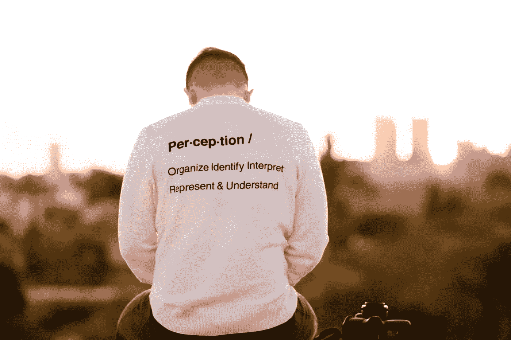

# 2022 年命名实体识别的五大方法(NER)

> 原文：<https://pub.towardsai.net/top-5-approaches-to-named-entity-recognition-ner-in-2022-38afdf022bf1?source=collection_archive---------0----------------------->

## 对于 NER，前 5 名的方法，前 7 名的 python 库，和 10 个最常见的功能。

来自 Unsplash 的 Bradley Pisney

命名实体识别(NER)是一个识别文本中的命名实体并将它们分类到预先构建的类别中的过程(这些类别根据其详细程度因型号而异)，例如人名、位置、组织、时间表达式、数量、货币值和百分比。 **NER 是自然语言处理(NLP)的一个领域，专注于识别和分类文本中的专有名词。**

在高层次上，NER 是对文本中的命名实体进行识别和分类的过程；这个过程可以通过几种方式实现，每种方式都有其优点和缺点。首先，可以通过查找特定的关键字或关键短语来识别命名实体。这种方法实现起来很简单，但是如果文本包含许多不知名的命名实体，其准确性就会受到限制。另一种方法是使用监督机器学习算法，该算法可以从标记数据的训练集中学习识别命名实体。在这种情况下，需要花费更多的精力来设置，但这比单独使用关键字更准确。最后，另一种实现方法是使用基于规则的系统，该系统基于系统开发者定义的一组规则来识别命名实体。

由来自 Pexels 的[卡罗琳娜·格拉博斯卡](https://www.pexels.com/@karolina-grabowska/)

# **以下是 10 种最常见的 NER 功能，并简要说明了它们的工作原理:**

1.标记化:这是将文本分解成单个标记(单词、短语等)的过程。).这是大多数 NLP 任务的必要步骤，包括 NER。

2.词性标注:这涉及到给文本中的每个单词分配一个词性标签。这对于 NER 是有帮助的，因为某些专有名词更有可能作为某些词类(例如，名词)出现。

3.词形分析:用于识别单词的词根形式(其词条)——许多专有名词都是从其他单词中派生出来的(例如，“John”来自“Johns”)。

4.句法分析:这是分析句子句法结构的过程；例如，许多专有名词在它们的句法短语中是中心词(例如，“约翰是医生”中的“约翰”)。

5.语义分析:分析文本的意义；例如，许多专有名称与特定的概念或实体相关联(例如，“John”作为人名)。

6.语篇分析:这是分析一篇文章是如何组织的过程——许多专有名词被用来指语篇中的特定实体(例如，“约翰”是故事中主角的名字)。

7.语用分析分析一篇文章如何在语境中使用。这对 NER 很有帮助，因为在使用的上下文中，许多专有名词被用来指代特定的实体(例如，“约翰”是在对话中被称呼的人的名字)。

8.世界知识使用关于世界的背景知识来帮助解释文本。这里的分析是有多少专有名词与可以通过世界知识识别的特定实体相关联(例如，“约翰”作为美国总统的名字)。

9.领域知识:如何使用特定领域的背景知识来帮助解释文本—许多专有名称都与不同的实体相关联，这些实体可以通过领域知识来识别(例如，“John”是电影中某个角色的名称)。

10.统计方法(下一节还会有更多的介绍):使用统计方法识别数据模式的过程；例如，许多专有名称与可以通过统计分析识别的特定模式相关联(例如，“John”是更可能是男性的人的名字)。

NER 有几种方法，包括基于规则的系统、统计模型和神经网络。每种方法都有其优点和缺点。

来自 Pexels 的 Karolina Grabowska

# **前往 NER 的 5 条途径:**

1.基于规则的系统通常基于由领域专家编写的手工规则。这些规则可以基于文本模式、词汇信息或句法结构。虽然规则在某些领域可能非常有效，但它们的开发和维护可能具有挑战性，并且它们通常不能很好地推广到新的领域或语言。

2.统计模型基于这样一种想法，即命名实体可以通过它们所保持的公司(即，往往出现在它们周围的单词)来与文本中的其他单词区分开来。已经为 NER 开发了几种统计模型，包括隐马尔可夫模型(HMMs)、最大熵(Maxent)模型和支持向量机(SVMs)。这些模型可能是有效的，但它们通常需要大量的训练数据，这可能具有挑战性。

3.神经网络是可用于 NER 的机器学习算法的子集。神经网络非常适合这种类型的分析，因为它们可以学习数据中的复杂模式。然而，神经网络需要大量的训练数据来学习这些模式。

4.混合系统:这些系统结合了多种 NER 方法。例如，系统可以使用基于规则的方法来识别人名，使用统计方法来识别组织。混合系统可能是有效的，因为它们可以利用每种方法的优势。

5.语义角色标注:语义角色标注(SRL)是一项相关的任务，旨在识别每个单词在句子中的角色。这通常通过分析句子的句法结构和句子中实体的上下文来完成。例如，在句子“蒂姆把工具给了朱莉”中，蒂姆是“给予者”，工具是“对象”，朱莉是“接受者”通过为命名实体提供额外的上下文，SRL 可用于改进 NER。

此外，实体链接是将文本中的命名实体与其在数据库或本体中的对应条目相连接的过程。这通常通过将文本中实体的上下文与已知实体的数据库进行比较来完成。作为实体链接的一部分，实体解析是一个必须了解的过程(当多个实体具有相同的名称时，如何确定一个实体的正确身份)。通过将文本中的实体的上下文与已知实体的数据库进行比较来完成由于多个实体而导致的这种级别的确定。

来自 Pexels 的 Karolina Grabowska

# 以下是使用 Python 实现的几个 NER 库:

斯坦福大学核心实验室:standfordnlp.github.io/CoreNLP/ner.html

空间:[https://spacy.io/usage/linguistic-features](https://spacy.io/usage/linguistic-features)

NLTK:【https://www.nltk.org/book/ch07.html 

https://textblob.readthedocs.io/en/dev/

Polyglot:[http://Polyglot . readthe docs . io/en/latest/namedentityrecognition . html](http://polyglot.readthedocs.io/en/latest/NamedEntityRecognition.html)

Apache OpenNLP:[https://opennlp.apache.org/](https://opennlp.apache.org/)

神经 ref:[https://huggingface.co/coref](https://huggingface.co/coref)

还添加了 Gensim，这是一个用于 Python 的主题建模库，实现了流行的技术，如潜在的 Dirichlet 分配(LDA)和 Word2Vec。

如果您有任何编辑/修改建议或关于进一步扩展此主题的建议，请考虑与我分享您的想法。

# **另外，请考虑订阅我的每周简讯:**

 [## 周日报告#1

### 设计思维与 AI 的共生关系设计思维能向 AI 揭示什么，AI 又能如何拥抱…

pventures.substack.com](https://pventures.substack.com/) 

参考资料:

1.纳多，大卫，和关，聪。命名实体识别和分类综述。Lingvisticae Investigiones 30(1)，2007 年。

2.拉蒂诺夫，列夫和罗斯，丹。命名实体识别中的设计挑战和误解。2011 年社交媒体语言研讨会会议录。

3.曼宁，克里斯托弗 d，苏尔迪努，米哈伊，鲍尔，约翰，芬克尔，珍妮，贝瑟德，史蒂文 j。和麦克罗斯基，大卫。斯坦福 CoreNLP 自然语言处理工具包。计算机械协会通讯 56(2)，2013。

4.朱拉夫斯基，丹，马丁，詹姆斯 h。语音和语言处理。培生教育，2014 年。

5.什么是命名实体识别(NER)？—来自 WhatIs.com 的定义。[https://www . techtarget . com/what is/definition/named-entity-recognition-NER](https://www.techtarget.com/whatis/definition/named-entity-recognition-NER)

6.事件提取的神经方法:【https://tel.archives-ouvertes.fr/tel-01943841/document 

7.事件提取的简要综述:方法和应用。【https://arxiv.org/pdf/2107.02126.pdf 