# 使用惊人的注意力转换器训练文本分类器

> 原文：<https://pub.towardsai.net/train-a-text-classifier-using-the-amazing-attention-transformers-175a7c738f77?source=collection_archive---------1----------------------->

## [自然语言处理](https://towardsai.net/p/category/nlp)

## 从头开始建造和训练一个变形金刚

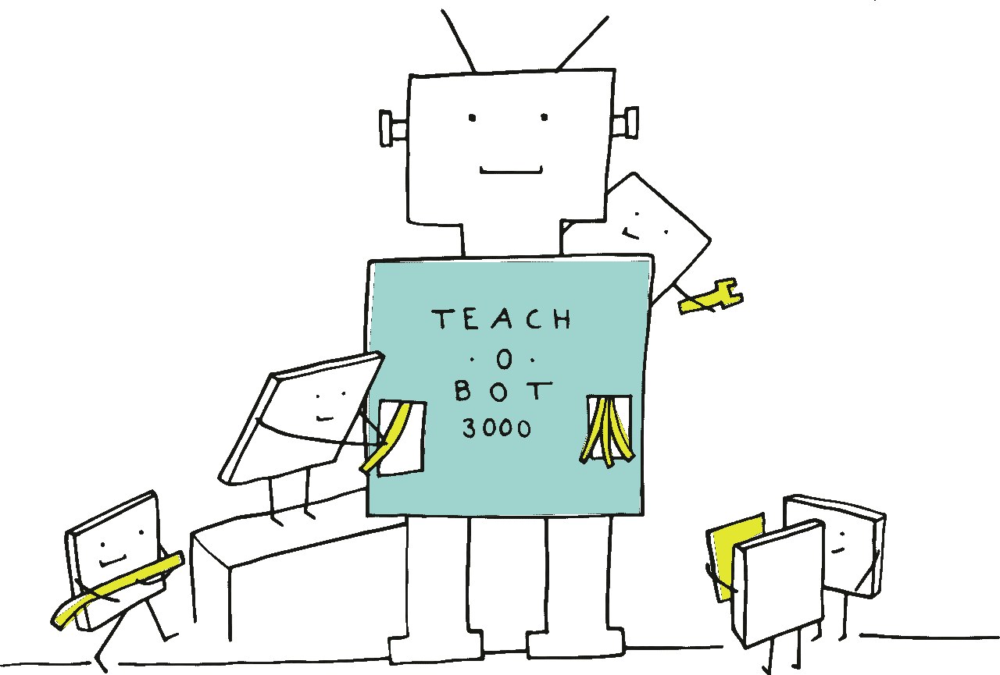

来源: [Pixabay](https://pixabay.com/vectors/pixel-cells-techbot-teach-o-bot-3947912/)

继续从[最后一部分](/text-classification-using-transformers-a2c6b3395ce3)开始，在这一部分中，我们将着眼于两种不同的技术来训练自我注意力转换网络，以将一段文本*(在我们的例子中是一个问题)*分类成两个不同的类别，每个类别包含一些类别。我们将使用我们在上一部分中使用的**编码器-解码器**模块对变压器网络进行编码，然后对其进行训练。

# 技术— 1: N 级磁头分类变压器

我们的最终目标是为给定的问题提供两个不同的类名。这里，我们可以将从自注意转换器的 ***编码器-解码器*** 层提取的特征传递给两个完全连接的线性层；一个预测主类，另一个预测子类。

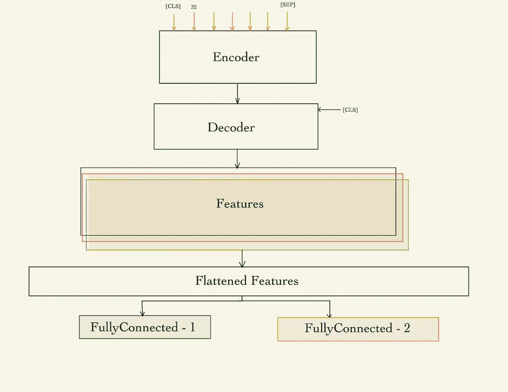

作者图片

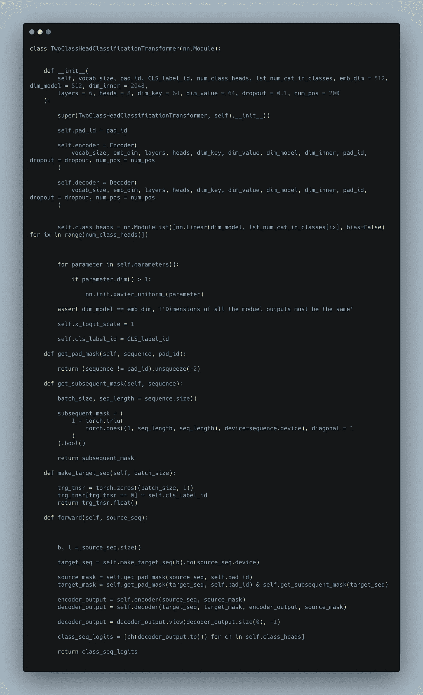

作者图片

## 训练模型

*   *用于模型训练的数据集类*

我们在第一部分中预处理的数据在一个字典列表中，列表中的每个字典以`question-tokens`、`question-class`和`question-subclass`为关键字，表示标记化的问题、问题的类别和问题的子类。在`Dataset`对象中，我们将把`question-tokens`填充到问题中令牌的最大长度，在我们的例子中，它是 100。我们将返回键`source_seq`下的填充`question-tokens`以及带有标签`class`和`subclass`的填充序列的类和子类。

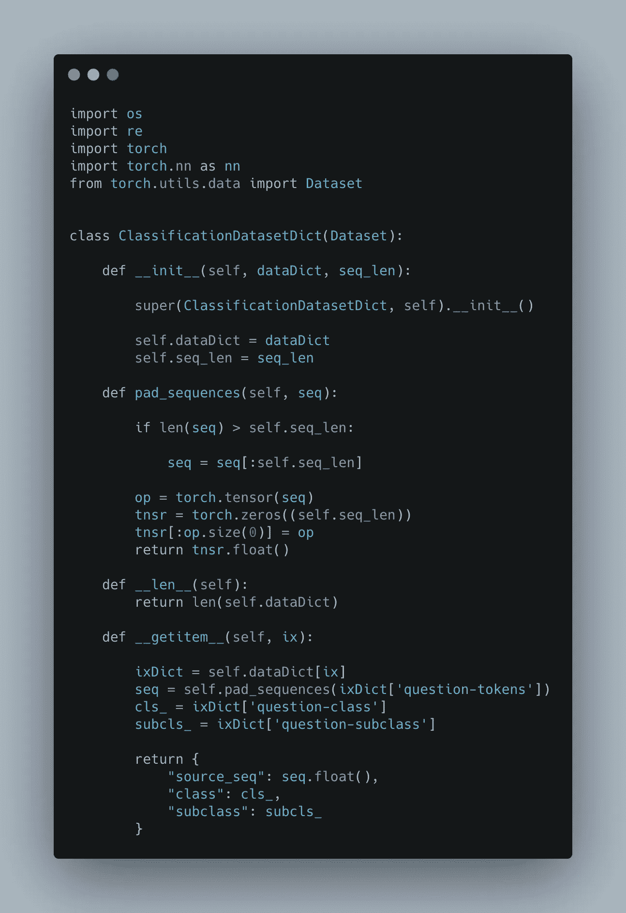

作者图片

**训练步骤**

1.  导入、播种和伐木

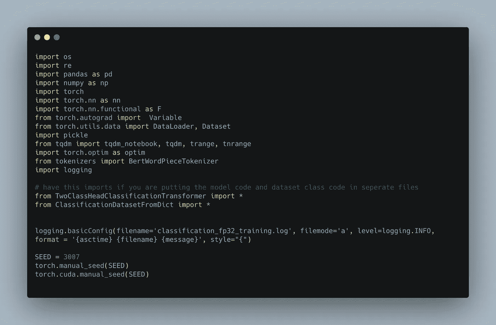

作者图片

2.公用事业

实用程序部分下的功能包括选择加载模型和数据的设备的功能、计算可训练模型参数的功能、计算批量训练后模型性能的功能以及加载一些 pickle 文件的功能。

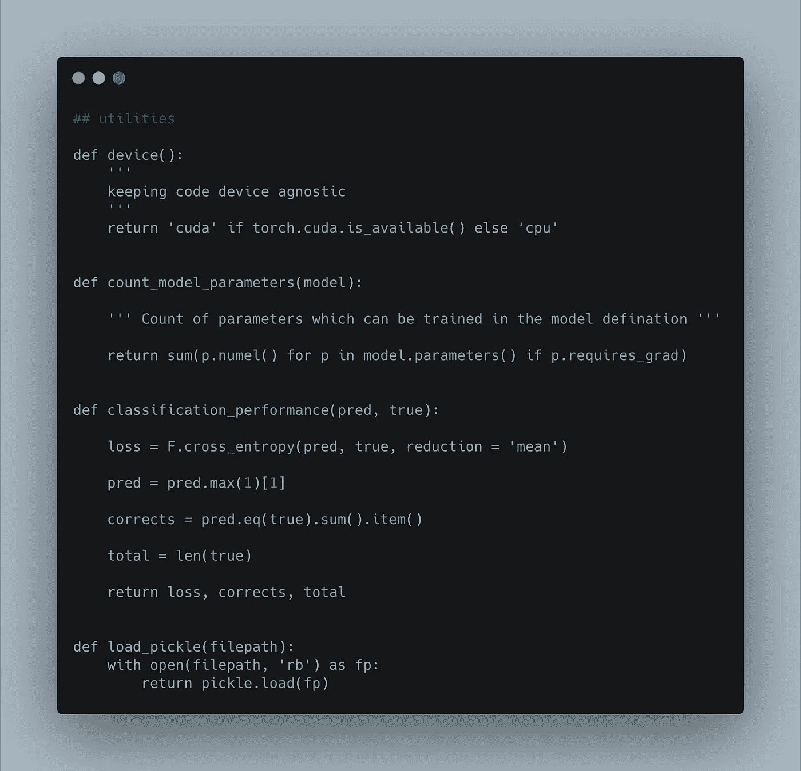

作者图片

3.数据和标记器加载

作者图片

4.模型初始化

我们将初始化模型参数，如词汇表的大小、填充 id、类标签 id ( `[CLS]`)、每个类别中的类的数量、由数据形成的序列的最大长度、用于训练的批量大小以及用于训练的工人数量。

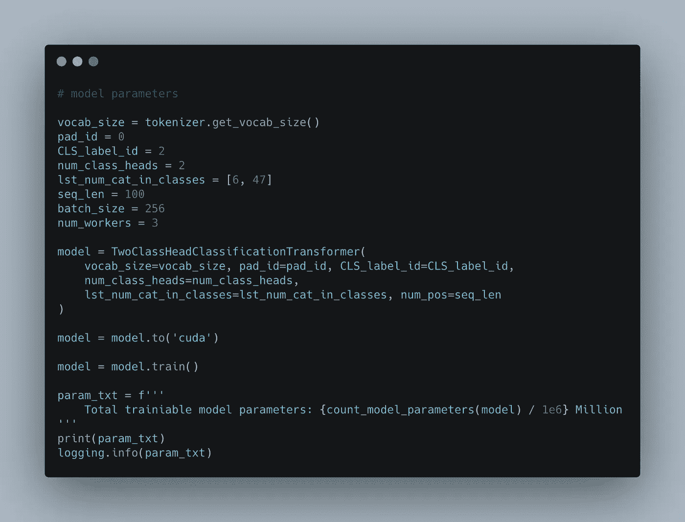

作者图片

5.数据加载器和优化器

作者图片

6.以最佳精度训练和保存

作者图片

培训日志

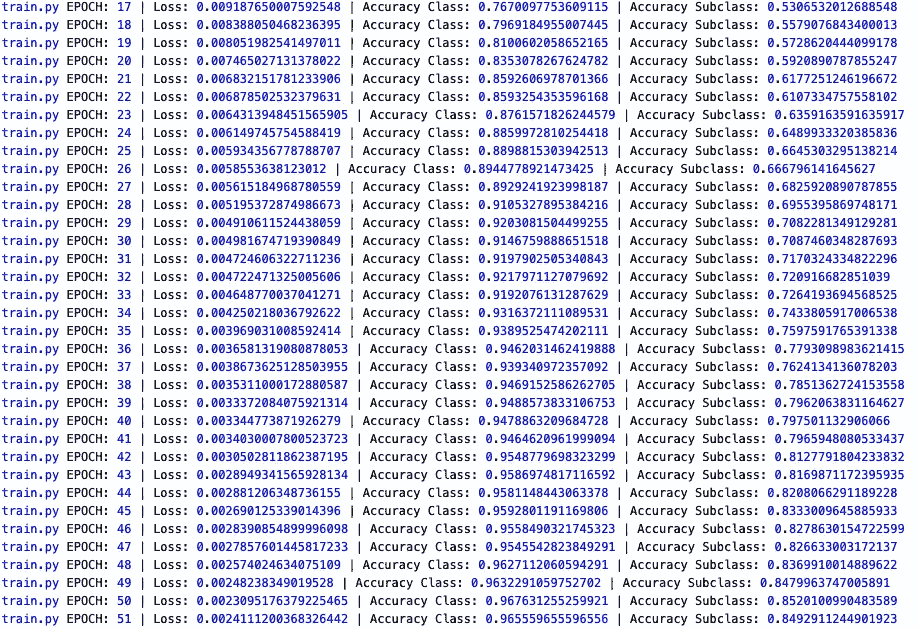

作者图片

**使用训练好的模型进行推理**

由于索引列表的子类名称有大约 47 个值，我已经将它们保存在 pickle 文件中，所有内容都将在 [GitHub](https://github.com/vatsalsaglani/QuestionClassification) repo 中可用。

*   *加载类名细节*

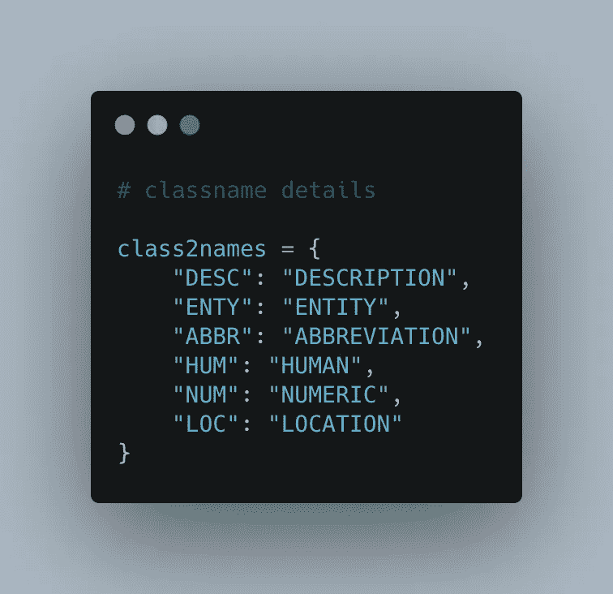

作者图片

*   *加载子类和细节，以及类的索引和子类的索引*

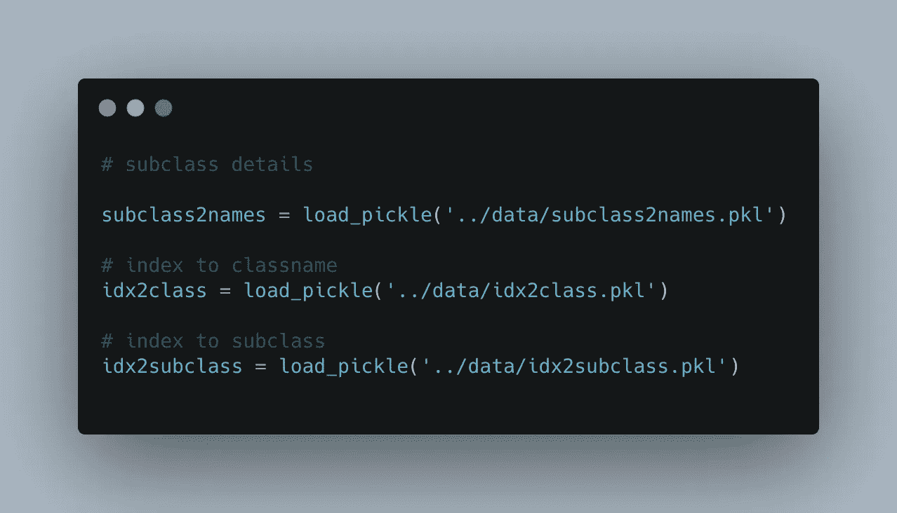

作者图片

*   *预测功能*

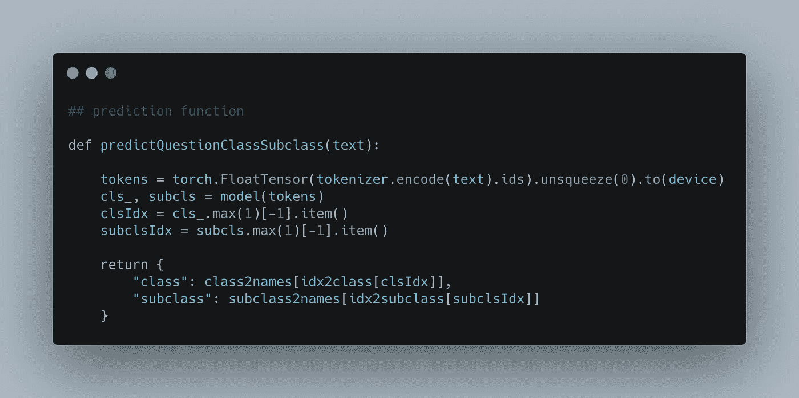

作者图片

有了更多关于问题及其类和子类的数据或预训练的 transformer 模型，可以通过几个时期的微调快速获得更好的性能。但是对于某些用例，很难找到任何预训练的模型，如果没有那么多时间来完成预训练过程和微调，有时可能需要使用大量数据来训练转换器。

# 技术— 2:一个编码器 N 解码器分类转换器

在这里，我们将看看另一种利用自我注意力转移模型的方法，将一段文本分成两个不同的类别，每个类别包含一些类别。我们将有两个解码器和一个编码器，其中编码器将提取问题特征并将其传递给具有`[CLS]`索引的第一个解码器，然后将编码器特征传递给具有该问题的类别索引的第二个解码器。从两个解码器中提取特征，然后通过两个完全连接的**层；一个获取**类逻辑**，另一个获取**子类逻辑**。**

分类转换器模型看起来像这样，

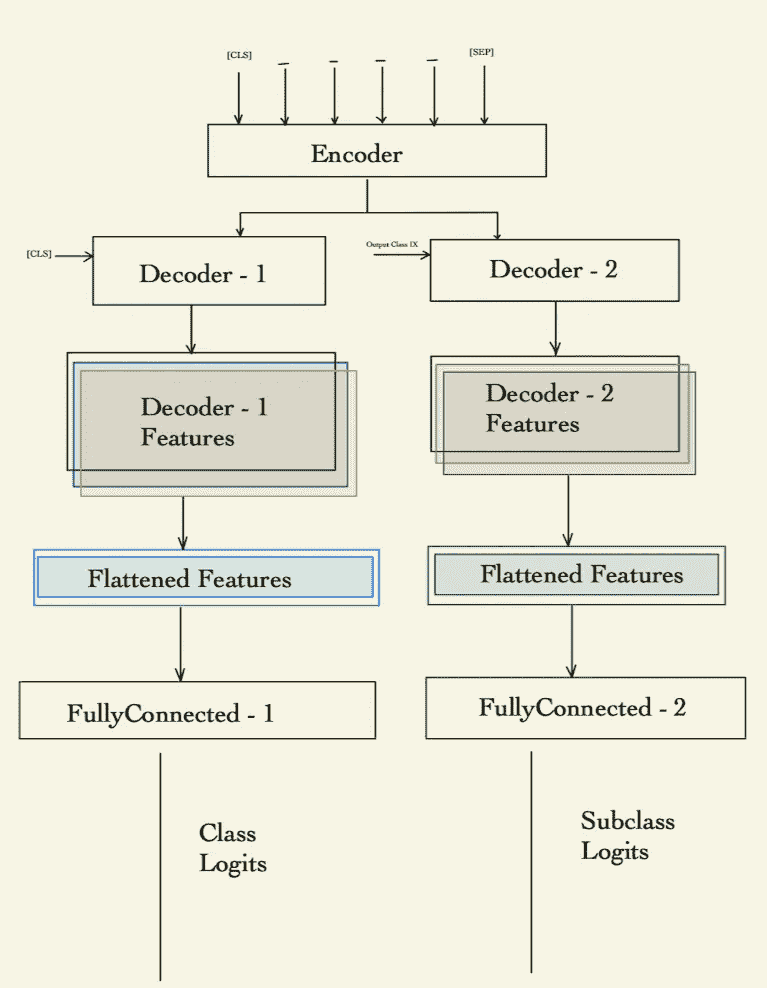

作者图片

当一个*子类*属于一个父*类*类别时，可以称之为**一个编码器** `**N**` **-解码器**方法。而在先前的模型(*技术-1*)中，只有一个*解码器*层，其中模型的输入只是问题；这里，在这个方法中，需要提供*问题文本*和*主类标签*。*主类标签*不会显示给**第一解码器**，只会显示给**第二解码器**。

*我们来举个例子。假设问题是****Google 是什么时候创立的*** *？*

对于这个问题，`class`是`**NUMERIC**`，而`subclass`是`**date**`。

我们模型的输入将是**问题文本(*Google 成立于何时？* )** 和**类标签(** `***NUMERIC***` **)。**类标签(`NUMERIC`)不会传递给**解码器- 1** ，因为**解码器- 1** 功能将预测**类名。**类别标签(`NUMERIC`)将仅被传递给**解码器- 2** ，以便*第二解码器*了解哪些子类类别可以归入一个类别类别。我知道这很复杂😅。

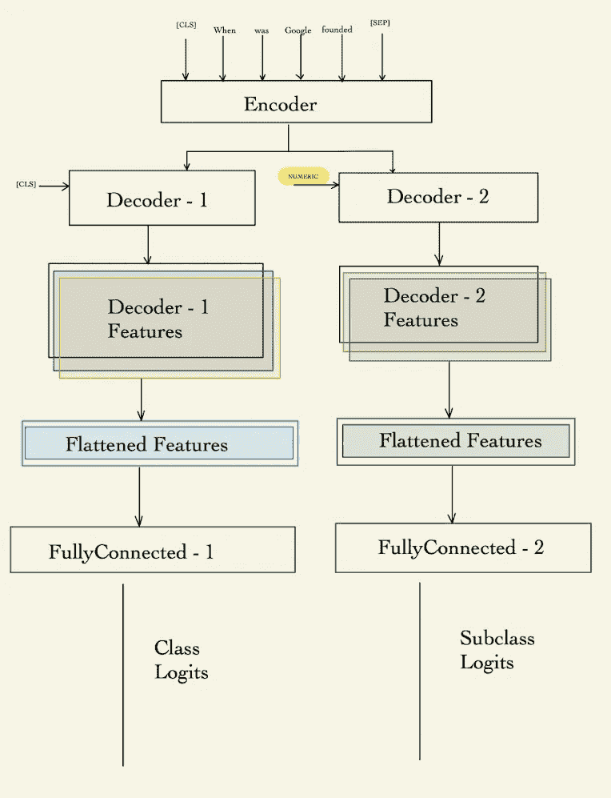

作者图片

编码器和解码器部分将保持不变，但是如上所述，分类转换器将包含两个解码器。您可以检查编码器和解码器代码的前一部分(*部分— 1* )。

# 分类变压器

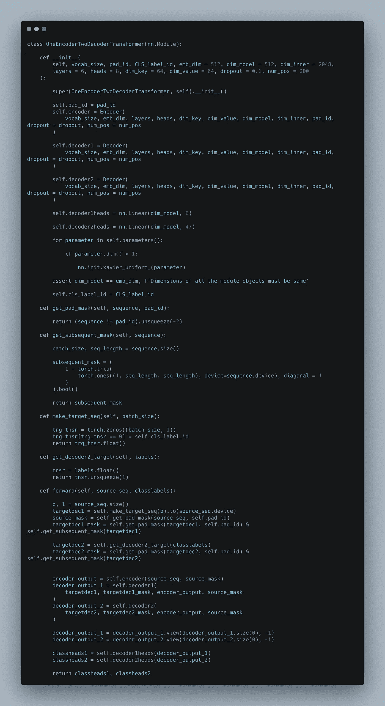

作者图片

数据集对象也将保持与上述第一种技术相同。

**训练模型**

*   *导入、播种和记录*

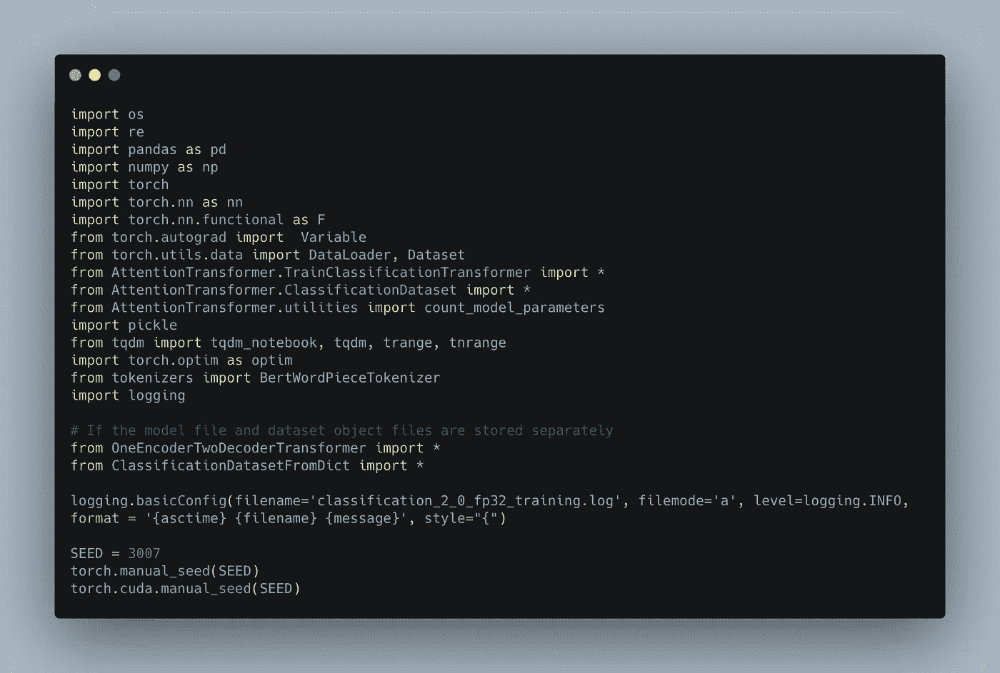

作者图片

*   *实用程序*

作者图片

*   *数据和标记器*

作者图片

*   *模型初始化*

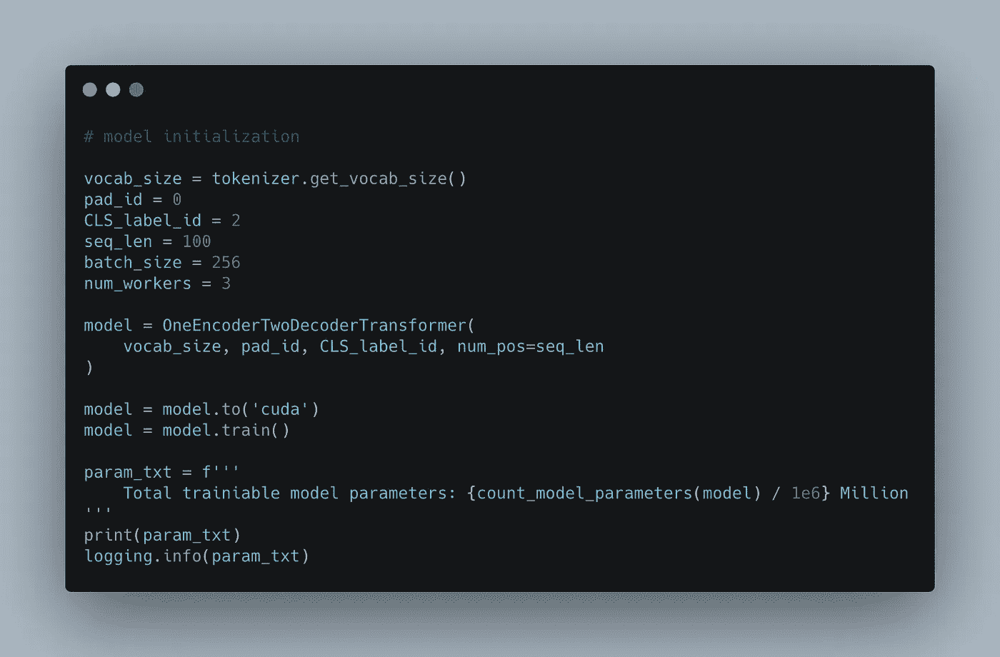

作者图片

*   *训练*

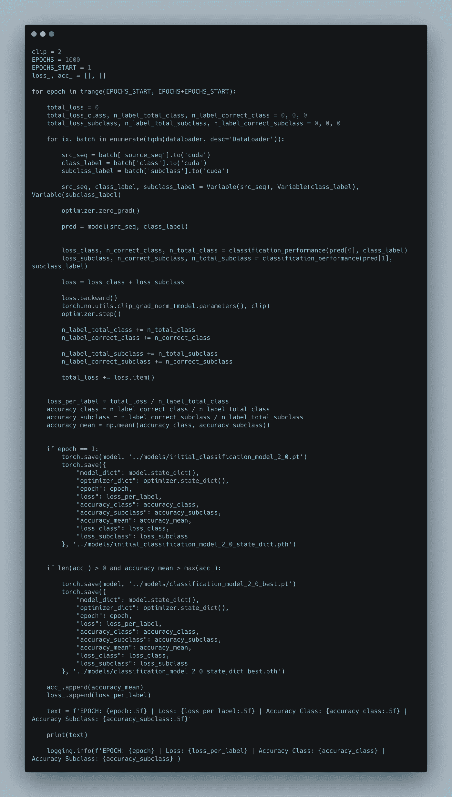

作者图片

训练日志看起来会像这样

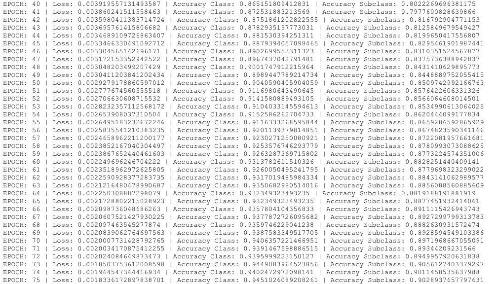

作者图片

# 推理

如以上部分所讨论的，模型输入将是**问题文本**和**类别标签**。开始时，我们没有问题文本的**类标签**，所以我们将通过。从**解码器— 1** 获得的特征，并将其传递给解码器— 1 的**全连接层，然后获得**类别标签**。获得类别标签后，问题文本和类别标签将被传递到**解码器-2**，从它们获得的特征将被传递到**解码器-2 的全连接层**，并且将获得子类标签。让我们看看代码。**

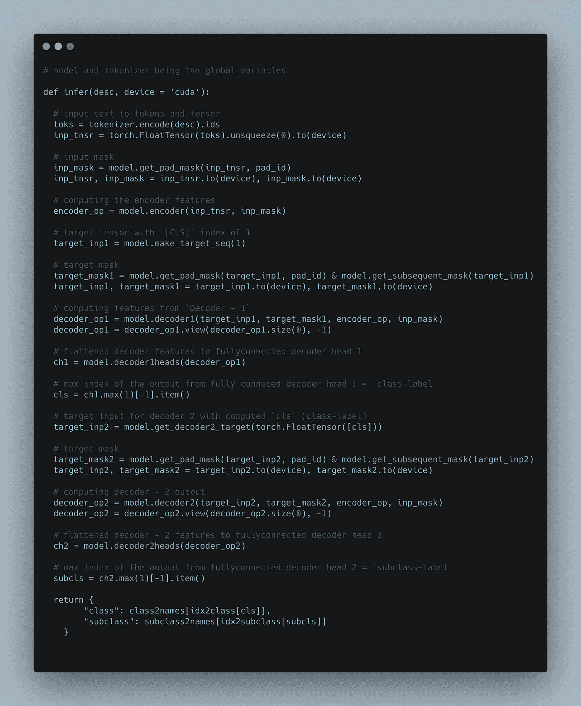

作者图片

*一些推论的例子*

作者图片

作者图片

作者图片

*通过这一部分，我们将结束这个关于使用自我注意力变压器和不同分类技术进行文本分类的博客系列，其中有* `*N*` *类别，每个类别有几个类别。*

所有零件的代码都可以在[这个 GitHub repo](https://github.com/vatsalsaglani/QuestionClassification) 中找到。

你可以点击查看模型[的现场版本。](https://classifyquestions.herokuapp.com/)