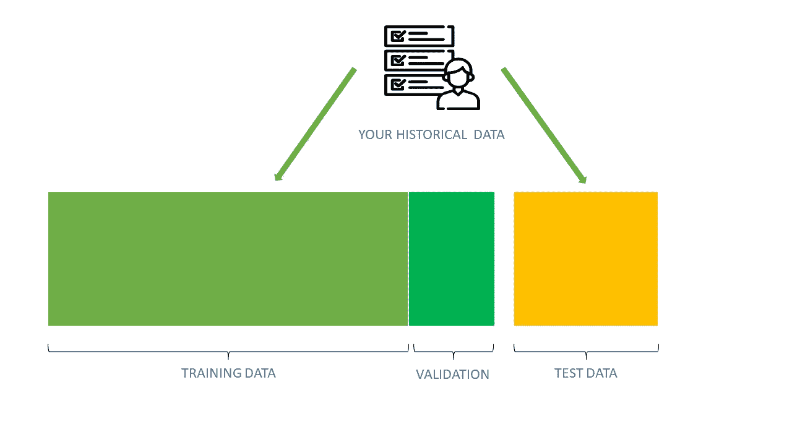
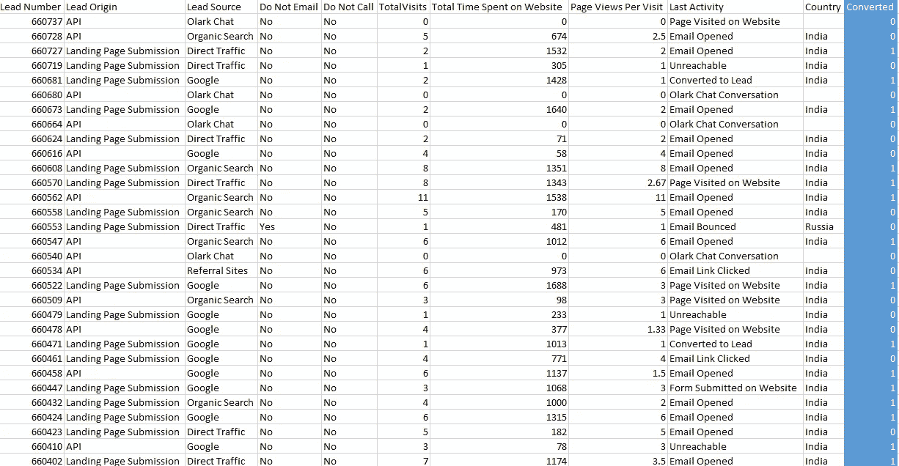
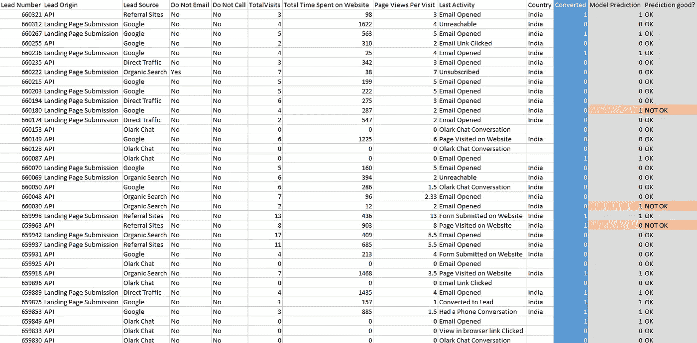
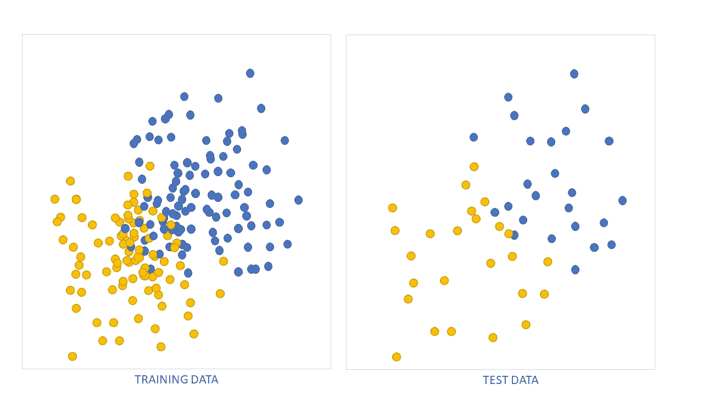

# 机器学习中的训练数据与测试数据——基本指南

> 原文：<https://pub.towardsai.net/training-data-vs-test-data-in-machine-learning-essential-guide-c58404849cea?source=collection_archive---------1----------------------->

## 请继续阅读，了解机器学习中训练数据与测试数据的区别。

了解两者的区别并确保你以正确的方式使用这两者是至关重要的。在本文中，我们将讨论训练数据和测试数据，并对它们进行更多的解释。

它旨在为任何需要在训练机器学习模型时了解各种数据集分割之间的差异的人提供介绍。

# 机器学习—软介绍

机器学习(ML)是人工智能(AI)的一个分支，它使用数据和算法来模拟现实世界的情况，以便组织可以预测、分析和研究人类的行为和事件。

ML 的使用让组织了解客户行为，发现与流程和操作相关的模式，并预测趋势和发展。事实上，许多公司已经将 ML 作为他们运营的一个组成部分。

构建 ML 算法取决于它们将如何收集数据。通常情况下，收集的信息分为三种类型。

机器学习过程在创建算法时使用三个数据集:

*   训练数据，
*   验证数据，
*   和测试数据。

让我们把它们区别开来。

作者图片:训练数据 vs 测试数据 vs 验证数据

# 机器学习中的训练数据集是什么？

[训练数据](https://www.techopedia.com/definition/33181/training-data)用于训练模型以预测预期结果。

结果基于回归或分类问题的结果，例如，流失预测、销售线索评分预测或时间序列预测。

因此，算法的设计侧重于预期或预测结果的结果。

> *训练数据是我们用来* ***训练*** *模型的实际数据集。我们可以说模型和数据。*

训练数据教授一种算法来提取结果的相关方面。它通常是用来使程序理解如何应用不同的特性、方面和技术来达到预期结果的初始数据集。

让我们看看预测销售线索转化的训练数据集示例应该是什么样的:

作者提供的图片:用于预测销售线索转化的训练数据集示例

该模型将使用特征(列)来训练结果(目标变量，“已转换—是/否”)。

训练模型需要运行训练数据集，并将结果与目标或预期结果进行比较。使用该比较作为指导，调整模型的参数，直到达到期望的目标。

# 验证数据集

[验证数据集](https://machinelearningmastery.com/difference-test-validation-datasets/#:~:text=A%20validation%20dataset%20is%20a,skill%20while%20tuning%20model's%20hyperparameters.)是用于检查训练数据所用模型的准确性和质量的数据集。它的意义不是教一个模型，即使接受训练的机器看到了。相反，它只揭示了偏差，因此可以调整模型以产生无偏的结果。

> *我们可以说验证集影响了一个模型，但只是间接的。有时，验证集也称为开发集，因为该数据集在模型的开发阶段会有所帮助。*

# 什么是测试数据集？

[测试数据集](https://deepchecks.com/glossary/test-set-in-machine-learning/)用于对算法进行真实的检查。它确认 ML 模型是否准确，是否可用于预测和预测分析。

根据我们之前预测销售线索转化的示例，我们设想测试数据集应该是这样的:

作者图片:预测销售线索转化的测试数据集示例

因为我们确切地知道结果应该是什么(转换为是或否)，所以我们可以看到模型的性能和准确性。**机器学习模型计算模型正确预测目标结果(“转换”)的次数。**

> *测试数据类似于验证数据，但与后者在培训期间使用不同，测试数据仅在最终模型上使用一次。*

使用训练和验证数据集来完全训练最终模型。

测试集通常用于评估竞争模型，这意味着它确定哪个模型提供更好的结果。

# 训练数据与测试数据:训练/测试分割

正如您可能已经从上面的训练、验证和测试数据的定义中收集到的，教授 ML 模型需要将您的数据分成两个主要数据集——一个用于训练，另一个用于测试。

数据分割确保算法模型可以帮助分析师[找到影响结果或结果的特征或方面](https://machinelearningmastery.com/train-test-split-for-evaluating-machine-learning-algorithms/)。

大概最标准的数据分割方式是分类

*   80%的数据是训练数据集
*   剩下的 20%将组成测试数据集。

> *在 ML 中，这意味着整个数据集的 80%被分类为训练数据，而剩余的 20%成为测试数据。但是为什么是 80:20 呢？*

你听说过[帕累托原理](https://towardsdatascience.com/finally-why-we-use-an-80-20-split-for-training-and-test-data-plus-an-alternative-method-oh-yes-edc77e96295d)吗？它也被称为“80/20 法则”，即 80%的结果来自 20%的原因。它一直被应用于财富分配，因为从统计上看，它确实接近于解释许多人类、机器和环境现象。因此，分析师也开始将该规则应用于 ML 模型。

# 机器学习中我们为什么要拆分数据？

如果您想知道为什么需要拆分数据，这很简单——当用户没有预期的结果或结果时，您需要评估模型的性能。

始终确保您的测试数据集满足以下条件:

*   它大到足以产生有统计意义的结果。
*   它代表了整个数据集。这意味着不要选择与训练集特征不同的测试集。

图片由作者提供:测试数据集应该代表整个数据集

# 创建培训数据时的最佳实践

建立一个训练数据集不仅仅意味着收集数据，然后通过人工智能算法来运行数据，以查看模型是否有效。它要求分析师遵循特定的实践，以确保数据环境模拟真实世界的情况。如果模型提供的预测或预言不可信，那么它们就不可信。

以下是为算法创建训练数据集时可以遵循的一些最佳实践。

1.  避免目标泄漏，并确保训练数据集仅包含与预期结果相关的数据。当模型中使用的变量不是实现目标结果的因素时，就会发生泄漏。当模型使用不可用的数据或被认为是看不见的数据时，就会发生这种情况。
2.  防止培训服务偏差。确保不对训练数据、最终测试数据集和服务管道进行任何更改。当使用的数据从用于培训到提供服务发生变化时，就会出现偏差。
3.  使用时间信号。如果您希望模式随时间推移而变化，您需要为算法提供时间信号信息，以适应模式变化。
4.  在需要的地方包括清楚的信息。如果数据集需要明确的解释，请包含可让算法清楚理解该信息的要素。这些数据可能包括电子邮件地址、位置或电话号码。
5.  避免偏见。请确保您的训练数据代表了您将用于开发预测的潜在数据。
6.  提供足够的训练数据。如果您没有足够的数量，模型的性能可能不符合您的目标输出。

# 构建更好的机器学习算法

一个算法的好坏取决于输入给它的训练数据。如果它没有使用足够的数据进行训练，你最终会得到不切实际的分析和预测。

# 我需要多少训练数据？

确保您的训练数据集中[至少有 1000 个数据行。](https://analyticsindiamag.com/best-practices-on-setting-up-development-and-test-sets-for-ml/)

或者，另一个经验法则是数据集中的行数比列数至少多 20 倍**。**

您需要尽可能多的与目标结果相关的特征(列)的训练数据。否则，当用户超过训练量时，如果模型是使用小数据集训练的，则不能确保模型按预期工作。

# 数据质量

训练数据必须模拟真实世界中发生的情况。它可以包括 CRM 数据、文档、数字、图像、视频和对您的目标结果至关重要的事务。

如果不是这样，那么算法的结果将是不现实的。

# 结论

要执行任何机器学习任务，拥有高质量的训练数据是必不可少的。您需要正确质量和数量的训练数据来训练您的模型。

现在，您已经更多地了解了机器学习中的[训练数据与测试数据](https://graphite-note.com/training-data-vs-test-data-in-machine-learning)及其重要性，您可以创建自己的预测模型了。