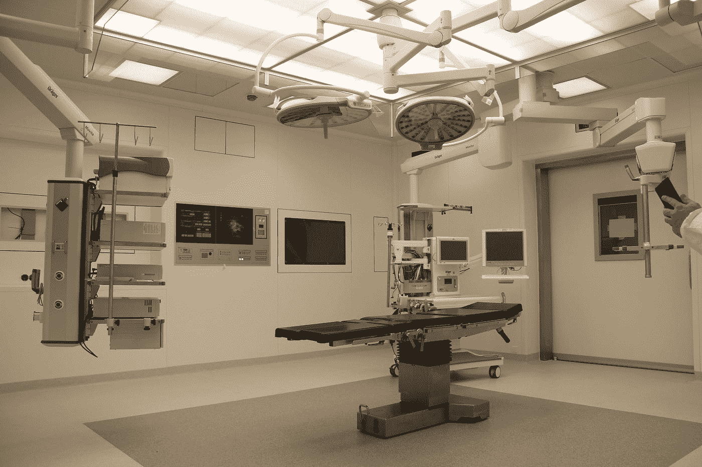
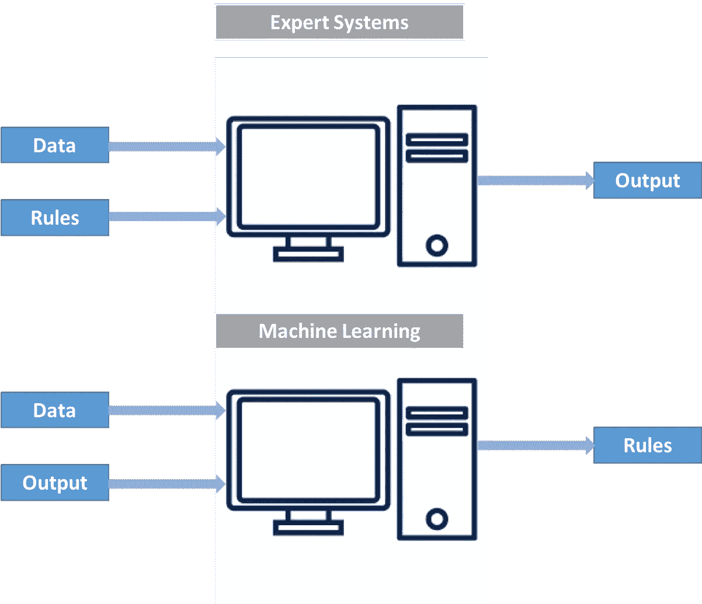
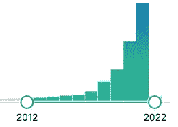

# 医学影像与诊断中的迁移学习

> 原文：<https://pub.towardsai.net/transfer-learning-in-medical-diagnosis-cab5d26409c3?source=collection_archive---------3----------------------->

Marcel Scholte 在 [Unsplash](https://unsplash.com?utm_source=medium&utm_medium=referral) 上拍摄的照片

## [深度学习](https://towardsai.net/p/category/machine-learning/deep-learning)

到目前为止已经做了什么和未来的方向…

在医学成像中使用人工智能(AI)并不是一个新趋势。它自 20 世纪 70 年代以来就已经存在，当时人工智能的第一步主要包括“如果-否则”语句、数学建模和旨在分析人类实施的规则的系统。

当时这个系统被称为人工智能，然而，今天，我们称之为专家系统，这与我们今天拥有的人工智能技术有很大的不同。主要区别在于，专家系统是用人类定义和知道的规则实现的，例如逻辑语句(“if-else”)、数学方程和其他允许计算机解决通常留给人类的任务的计算机算法。这意味着我们向计算机显示数据和执行任务的规则，计算机输出将是最终结果。

今天的人工智能非常不同，计算机能够找到解决某项任务的方法，而无需人类告诉确切的使用规则。也就是说，我们向计算机展示数据，我们向计算机展示最终结果。计算机将“学习”该任务，并将输出规则(模型)来执行该任务。对于大多数模型，由于它们的复杂性，人类不可能知道它们。然而，这些模型纯粹基于数学和逻辑运算(通常是矩阵运算)，这需要数百万次计算，只有在现代计算机的处理能力下才有可能。这叫做机器学习。

图片来自作者。

迁移学习(TF)是一种机器学习技术，其中模型不是从头开始训练的，而是将在不同数据集中训练的预训练卷积神经网络(CNN)模型应用于新数据。使用 TF 的优点是可以使用更小的数据集(数百或数千个图像而不是数百万个)，并且训练模型的时间显著减少(数小时而不是数天或数周)。

在过去的几年里，TF 在医学文献中的使用急剧增加。在 PubMed 中用过去 10 年的术语(“迁移学习”或“迁移学习”)进行快速搜索，向我们展示了一幅清晰的画面。2012 年和 2013 年每年只有 16 篇文章，2014 年这一数字增加到 27 篇，第二年 43 篇，2016 年有 54 篇，2017 年有 100 篇。2018 年，这些数字开始大幅增长，发表了 231 篇文章，2019 年 395 篇，2020 年 771 篇，最终 2021 年 1281 篇。我在 2022 年 1 月 4 日做了这项研究，到目前为止，已经有 31 篇文章发表了。另一个值得注意的事实是，这些出版物中超过 90%的日期是 2018 年或更晚。

图片来自作者。

迁移学习在医学领域已经显示出有希望的结果，即使医学成像与训练该模型的真实世界图像(例如 ImageNet 数据集)非常不同。然而，由于所有图像都具有共同的特征，例如曲线、直线或颜色，因此在这些图像中学习到的参数可以转换为医疗数据。

来自 [Morid](https://arxiv.org/abs/2004.13175) (2020)的一篇文章总结了最常用的医学图像分类模型。作者报告称，Inception-V3 (19%)、VGG-16 (18%)、AlexNet (15%)和 ResNet-50 (13%)是医学图像分类任务中最常用的选择。最常用的医学图像类型是 x 光和核磁共振成像。

目前为止的结果显示了有希望的结果，这些机器学习模型能够有效地对医学图像进行分类和分层。二元分类的结果最好，据报道，迁移学习技术的准确率超过 80% (Yadav，2019)。当将迁移学习用于图像分割或非二进制分类时，结果不是很好，据报道准确率在 60%到 70%之间(Cai，2020)。

尽管有这些有希望的结果，但不能预期人工智能会很快取代卫生工作者。迄今为止，已发表的结果有一些局限性，这意味着还不可能大规模应用这些结果。

一些限制包括:

***(1)*** ***数据仅从一个医疗中心*** 或更少的互联中心收集。由于特定的人口变化、使用的特定技术、设备品牌和模型变化，这限制了结果的外推…这些变量会导致人工智能模型表现更差。

***②可用数据有限。*** 即使最近的一些论文在使用成千上万的标记图像，但仍然无法与训练机器学习模型所需的数百万张图像相提并论。获取更多标记的医学图像是昂贵的，这是由于图像分类和分割的必要工作只能由人工完成(这与计算机需要支付的费用相反)。

***③不平衡数据可用。*** 为了训练机器学习模型，不同类别中的数据必须平衡。这意味着我们需要相同数量的不同类别的图像。在医学成像中，事实并非如此，因为图像通常是不平衡的，大多数图像是“正常”或“健康”的，并且当呈现“不健康”或“异常”的图像时，具有来自同一患者的多个图像的可能性更高。在 TF 中使用不平衡数据有三种选择:(a)用不平衡数据进行研究，这可能导致模型欠拟合；(b)选择仅使用具有较少代表性的类别中的图像数量，这导致数据浪费；以及(c)执行数据扩充，这可能导致模型过度拟合。

***(4)不同模型之间没有可靠的基准*** ，也就是说对于一个特定的任务，我们仍然不知道哪个模型更好。一个基本模型可能更适合 x 射线图像，但不同的模型可能更适合 MRI。但在没有对不同模型进行大量测试的情况下，我们仍然不知道它。

***(5)迁移学习真的比从零开始训练一个模型好吗？*** 医学领域的图像分类和分割的机器学习的大部分出版物使用 TF 技术，而不是从零开始训练一个模型。当从零开始训练模型时，据报道结果比使用 TF 时更差(Raghu，2019)。然而，这值得进一步研究，因为从头训练一个模型所需的图像数量远远高于迁移学习所需的数量，因此限制了这种比较。

总之，使用 ImageNet 作为非医学数据集的迁移学习可能是处理医学图像分类任务的有效方法。然而，研究差距仍然阻碍着人工智能在医疗系统中更有意义的实施，包括模型之间的一些严肃的基准测试以及利用来自不同中心的图像建立的更大数据集的可用性。

感谢您的阅读。

如果:你喜欢这篇文章，别忘了关注我，这样你就能收到关于新出版物的所有更新。

如果你想了解更多，你可以通过[我的推荐链接](https://cdanielaam.medium.com/membership)订阅媒体会员。它不会花你更多的钱，但会支付我一杯咖啡。

**其他:**谢谢！

参考资料:

Morid，a . Borjali 和 g . Del Fiol(2021 年)。基于 ImageNet 的医学图像分析迁移学习研究综述。*生物和医学中的计算机*、 *128* ，104115。DOI: 10.1016/j

Yadav，s .，& Jadhav，S. (2019 年)。用于疾病诊断的基于深度卷积神经网络的医学图像分类。*大数据期刊*、 *6* (1)。DOI:10.1186/s 40537–019–0276–2

蔡，李，高，赵，(2020)。深度学习在医学图像分类和分割中的应用综述。*转化医学年鉴*， *8* (11)，713–713。DOI: 10.21037/atm

Raghu，m .，Zhang，c .，Kleinberg，j .，& Bengio，S. (2019)。输血:理解医学成像的迁移学习。第 33 届神经信息处理系统会议。