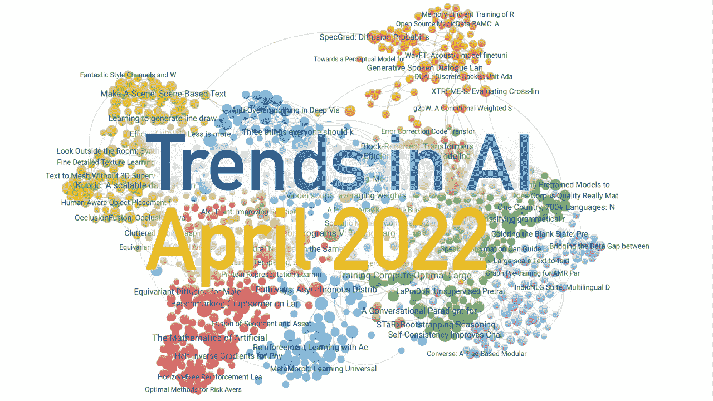
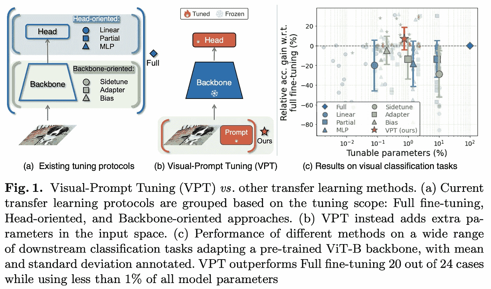
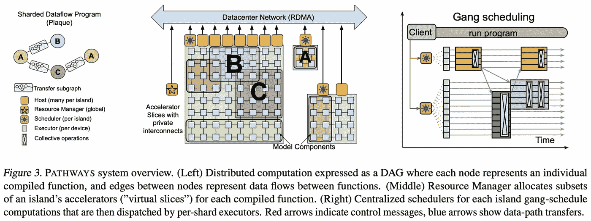
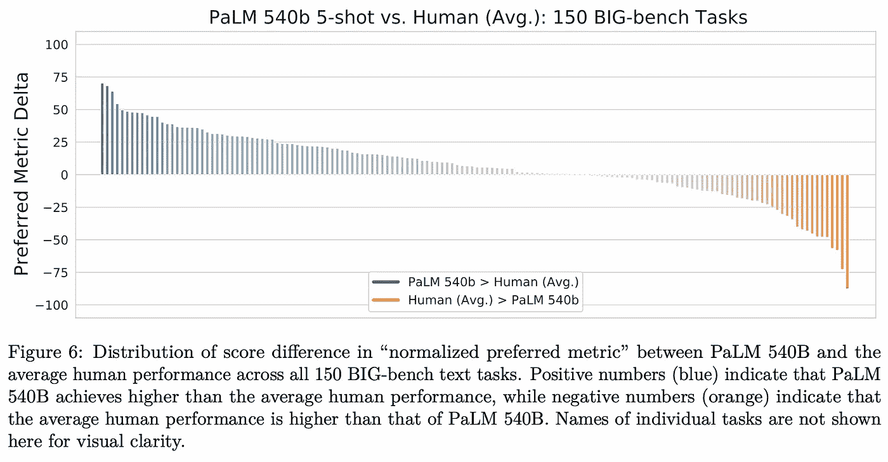
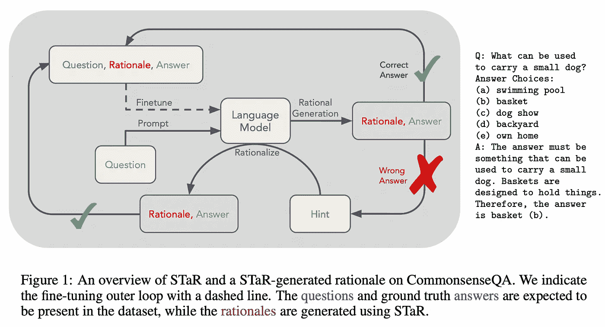
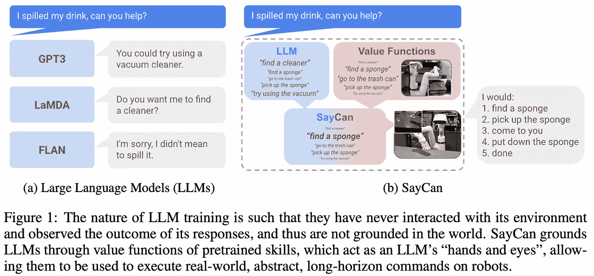
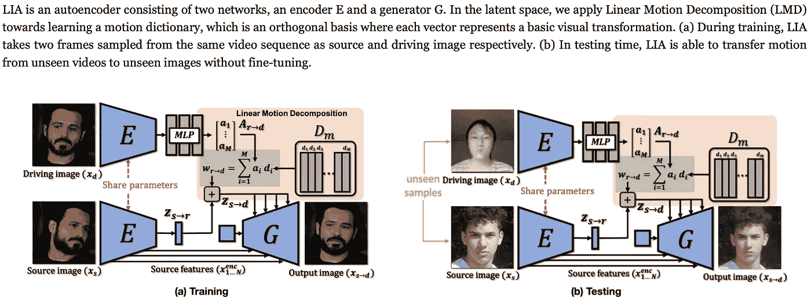
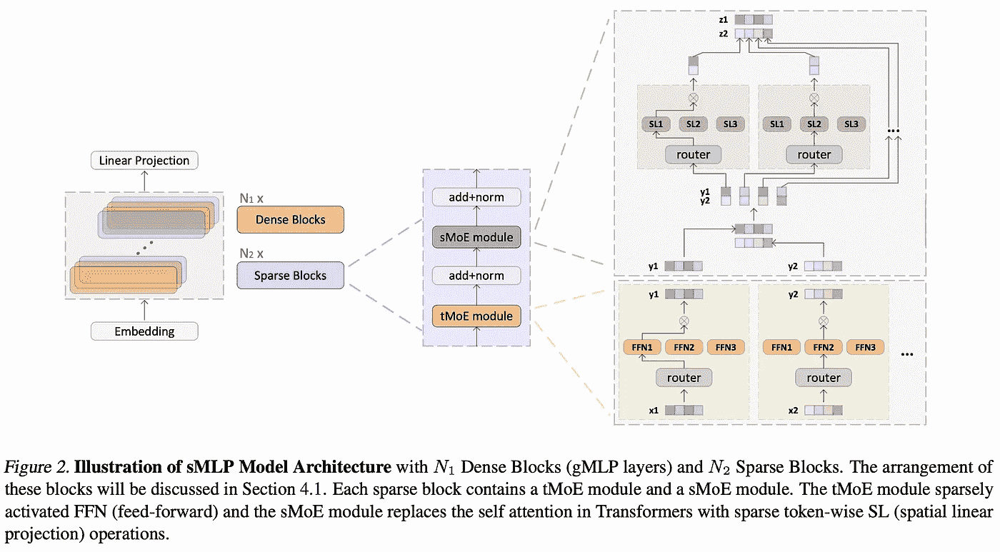
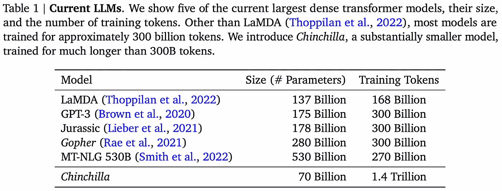

# 人工智能趋势—2022 年 4 月

> 原文：<https://pub.towardsai.net/trends-ai-april-2022-8e6cc75aedba?source=collection_archive---------1----------------------->

## ML 研究论文和新闻每月精选:NVidia 的新 H100 GPU，谷歌的 5400 亿参数 PaLM，Pathways，Kubric，张量程序，用推理引导推理，稀疏全 MLP 架构，用深度学习制作人脸动画，等等。

图片由 Zeta Alpha 提供。

《人工智能世界》又过了一个月，它留下了一大堆有新闻价值的公告。

*   新 [NVidia H100 张量核 GPU](https://www.nvidia.com/en-us/data-center/h100/) 公布。设计时考虑了现代神经架构，如变压器，它在训练和推理方面实现了几乎一个数量级的加速。
*   [Inflection 是由 Reid Hoffmann](https://www.cnbc.com/2022/03/29/inflection-ai-reid-hoffmans-start-up-poaches-staff-from-google-meta.html) (Linkedin 联合创始人)、Mustafa Suleyman (Deepmind 联合创始人)和 Karén Simonyan(人工智能研究员)合作的最新一家致力于人工智能人机交流的大公司。
*   [BigScience](https://bigscience.huggingface.co) 是一个为期一年的合作研究研讨会，从社区驱动的方法出发，从头开始训练一个大型多语言语言模型。[最终的 1750 亿参数模型的训练目前正在进行中](https://bigscience.huggingface.co/blog/model-training-launched)，您[将跟踪并现场观看其进展](https://huggingface.co/bigscience/tr11-176B-ml-logs/tensorboard)。
*   [斯坦福人工智能指数](https://aiindex.stanford.edu/report/)发布:一份长达 200 多页的报告，从研究、工业、商业、监管、地缘政治等角度阐述了人工智能的现状。

# 🔬研究

我们分析了最近的研究文献，并编辑了 10 篇您不应错过的论文，主题包括超参数调优、强化学习、推理语言建模、高性能并行计算等。

## [1。张量程序 V:通过零触发超参数转移调整大型神经网络](https://arxiv.org/abs/2203.03466)

*Greg Yang、Edward J. Hu 等人*

**❓为什么→** 超参数调整是创建 SOTA 模型的关键因素。不幸的是，对于大型模型，这通常需要惊人数量的计算资源，这进一步排斥了资源有限的小型玩家。这项工作展示了如何更有效地进行超参数调整，如果这是真的，那将是巨大的。

**💡关键见解→** 为了成功训练神经网络，必须选择合适的超参数。不久前，超参数还屈指可数(例如，固定学习率、卷积核大小、步幅等。)但如今，超参数空间已经变得更加复杂:热身、学习速度的安排、优化、可变掩蔽率、注意力头的数量、隐藏维度……等等。

您可以缩小一个神经网络，这样当您扩大网络时，最佳超参数将保持不变，或者这些参数将发生可预测的变化。这种方法能够在小型模型中找到最佳超参数，然后增长模型以运行最终的资源密集型训练运行。这种称为μTransfer 的方法基于理论分析，并可证明在某些条件下有效，但作者也根据经验表明，通过在现代变压器上使用该技术，这种方法可以更广泛地应用。

来源:https://arxiv.org/pdf/2203.03466.pdf

正如作者自己认识到的那样，这种方法仍然有许多局限性，但它为大型模型的训练提供了一个有趣的方向，甚至可以进一步优化现有模型，甚至支持惠普在数万亿参数范围内调整下一代更大的模型。

## [2。视觉提示调谐](https://arxiv.org/abs/2203.12119)

*贾梦琳，唐等*

**❓为什么→** ML 显然正在向这样一个方向发展:人们不会从头开始构建模型，而是使用预先训练好的模型来引导您的实现。在这种环境下，能够在下游任务中最大限度地利用大型预训练模型，同时计算成本低廉的技术将是关键。提示就是这样一种技巧。

**💡关键见解→** 作者探讨了各种“部分调优”技术在调优参数百分比/性能比方面的比较。直到最近，大型预训练模型都是通过使用标记数据和在整个架构中传播梯度来进行微调的。然而，在过去的一年中，即时调整成为了一种可行的替代方案:保持预训练模型权重不变，并在输入中预先考虑一组嵌入，这些嵌入可以通过梯度下降和一些标记数据来学习。

这项技术已被证明在 NLP 任务中是有效的，现在正被用于图像分类，它不仅在效率方面，而且在绝对精度方面都表现出非常有竞争力的性能。也许更重要的是，快速调优在少数几次调优中表现最出色，在这种情况下，完全微调往往会遇到困难。即时调整的一个额外好处是，它允许您将预训练的模型概念化为输入/输出黑盒，潜在地支持训练只能通过 API 访问的模型(或者使用无梯度 optimization⁷，或者在梯度可用时使用梯度下降)，这是行业发展的方向。

来源:https://arxiv.org/pdf/2203.12119.pdf

相关: [Delta Tuning:对预训练语言模型的参数有效方法的综合研究](https://arxiv.org/abs/2203.06904)

## [3。路径:ML](https://arxiv.org/abs/2203.12533) 和 [PaLM 的异步分布式数据流:用路径](https://storage.googleapis.com/pathways-language-model/PaLM-paper.pdf)扩展语言建模

*保罗·巴勒姆等人*

**❓为什么→** 如果你真正需要的是大规模，那么大规模扩展的工具将是人工智能未来不可或缺的一部分，这是谷歌的版本，以及其最新的 5400 亿参数转换器。

**💡关键见解→** 本文是 Google 的 Pathways 蓝图，“一个面向硬件加速器的大规模编排层，能够在数千个加速器上实现异构并行计算，同时协调专用互连上的数据传输。”

现有的加速器框架擅长在数据的不同部分并行运行相同的计算，然后进行同步(也称为单程序多数据，SPMD)。相反，Pathways 被设计成能够并行计算更多的异构计算(又名多程序多数据，MPMD)。

来源:[https://arxiv.org/pdf/2203.12533.pdf](https://arxiv.org/pdf/2203.12533.pdf)

这使得训练和托管模型成为可能，比如刚刚发布的 5400 亿参数(密集)[palm:scaling language modeling with pathways](https://storage.googleapis.com/pathways-language-model/PaLM-paper.pdf)⁶，它是在跨多个 pod 的 6144 个 TPU v4 芯片上训练的。这个密集模型是该公司的最新旗舰产品，在许多零、一和少数镜头的 NLP 任务中实现了最先进的水平，在此过程中击败了许多人类基线。

来源:https://arxiv.org/pdf/2203.12533.pdf

## [4。明星:自学的推理者。带推理的自举推理](https://arxiv.org/abs/2203.14465)

埃里克·泽利克曼、怀玉·吴和诺亚·d·古德曼。

**❓为什么→** 逻辑推理经常被认为是大型语言模型(LMs)的一个弱点:虽然它们有时可能做对了，但它们经常在基本的常识推理上失败。这篇论文暗示了一个很有前途的方向，可以释放普通语言建模的潜力，用于更高级的类人推理。

**💡关键见解→** 基本原理是对为什么持有信念或采取行动的明确逻辑解释。虽然以前的工作已经显示了显式推理如何在几个 scenarios⁵中提高 LMs 性能，但这项工作显示了推理能力如何能够在不依赖于大规模人工标注的情况下得到提升。

在这项工作中，作者仅使用问题解决语料库(没有人类推理)，但使 LM 为其答案生成推理，只要答案是正确的，这些推理就被认为是有效的，并得到相应的训练。根据作者的说法，这是一个协同过程，其中基本原理生成的改进改进了训练数据，训练数据的改进改进了模型的基本原理生成。当模型未能解决训练数据中的任何新问题时，为了防止该过程饱和，答案被提供给模型，该模型然后生成向后的基本原理，该基本原理然后被添加为训练数据。

实验结果不是非常广泛，但它们显然有乐观的迹象:更快的学习和与 30 倍大的 GPT-3 模型相当的推理性能。此外，STaR 系统明显优于只针对问题-解决方案对进行训练的普通无理由系统。

来源:[https://arxiv.org/pdf/2203.14465.pdf](https://arxiv.org/pdf/2203.14465.pdf)

## [5。做我能做的，而不是我说的(SayCan):机器人启示中的基础语言](https://arxiv.org/abs/2204.01691) | [项目页面](https://say-can.github.io)

*迈克尔·安等人*

**❓为什么→** 缺乏现实世界的基础是对现有语言模型的一个普遍批评:如果没有与视觉等其他形式的观察和交互相结合，任何模型如何能够对语言有任何有意义的理解？

**💡关键见解→** 人类用户向机器人提供一条指令，这条指令可能很长，很抽象，甚至模糊不清。LM 的作用是将指令分解成更短的原子步骤。这与之前使用预先训练的语言模型将高级指令映射为低级动作的⁰非常相似，但通过包括现实世界的机器人制定计划，而不是仅仅依赖模拟，这一工作更进了一步。

来源:[https://arxiv.org/pdf/2204.01691.pdf](https://arxiv.org/pdf/2204.01691.pdf)

另一项有趣的近期工作是使用预先训练的语言模型来指导图像的学习表示[将语言指导集成到基于视觉的深度度量学习](https://arxiv.org/abs/2203.08543)。

## [6。潜像动画制作师:学习通过潜像空间导航制作图像动画](https://arxiv.org/abs/2203.09043)

*作者:王耀辉、杨堤、弗朗索瓦·布莱蒙德和安提察·丹切娃。*

**❓为什么→** 具有深度学习的真实感动画非常酷，如果它取得进展，它可以成为游戏和虚拟现实等应用的使能技术。

**💡关键见解→** 现有的基于深度学习的图像动画框架通常依赖于图像的结构化表示:人体关键点、光流、3D 网格等等。这项工作提出了一个潜像动画(LIA)，它只依赖于一个自我监督的图像自动编码器，没有任何显式结构化的表示。相反，他们定义了线性运动分解，旨在通过一组学习到的运动方向和幅度的线性组合，将视频中的运动描述为潜在路径。

该方法包括两个模型，一个编码器和一个生成器。为了训练，2 帧视频被用作自我监督的数据源，让模型将对象的不同视图编码成其*身份*和可分解的运动部分，生成器利用其输出图像，从该图像导出重建损失。为了推断，源和驾驶图像被替换为不同的人，为此，模型生成具有源的身份但驾驶图像的姿态的输出图像。

来源:https://wyhsirius.github.io/LIA-project/

## [7。使用稀疏全 MLP 的高效语言建模](https://arxiv.org/abs/2203.06850)

*作者于萍等人*

**❓为什么→** 架构在 ML 中的作用会进一步缩小？我认为是的。

**💡关键见解→** [注意 MLP](https://arxiv.org/abs/2105.08050)已经向我们展示了“无注意架构”在语言建模中具有竞争力，其中跨标记的信息通过更基本的 MLP 组合来传播。现在，这项工作将这一想法扩展到稀疏的专家混合环境中，这种环境具有更强的缩放行为。

在这项工作中，我们分析了 MLPs 在表达能力方面的局限性，并提出了稀疏激活的 MLPs，在特征和输入(token)两个维度上都具有混合专家(MoEs)。与之前针对 vision 的“全 MLP 架构”类似，跨令牌和令牌内的信息混合是通过应用全连接(FC)层*令牌方式*，然后转置/混合，然后应用 FC 功能方式(见下图)。

来源:[https://arxiv.org/pdf/2203.06850.pdf](https://arxiv.org/pdf/2203.06850.pdf)

## [8。Kubric:一个可扩展的数据集生成器👾](https://arxiv.org/abs/2203.03570)[代号](https://github.com/google-research/kubric)

*克劳斯·格雷夫等人*

**❓为什么→** 当自然标记的数据很难获得或很昂贵时，合成数据可以拯救我们。这是最新的合作努力，旨在建立一个能够实现计算机视觉数据的端到端创建的库。

**💡关键见解→** 数据生成软件不如建模软件成熟，这就是为什么作者认为在数据生成工具方面需要付出更多努力的原因。Kubric 是一个开源的 Python 框架，它与 PyBullet(物理模拟引擎)和 Blender(渲染引擎)接口，以生成具有细粒度控制和密集注释的照片级逼真场景。

典型的数据生成管道(见下图)结合了从资产源获取资产、使用这些资产组成场景以及相机定位、在环境上运行物理模拟，以及使用所需的注释和元数据将其渲染为不同的层。

该库还旨在跨分布式计算进行扩展，以在 HPC 环境中生成大量数据。作者通过创建 13 个具有新视觉挑战问题的数据集来展示该库，这些问题从 3D NeRF 模型到具有基准结果的光流估计。

来源:https://arxiv.org/pdf/2203.03570.pdf

## [9。训练计算优化的大型语言模型](https://arxiv.org/abs/2203.15556)

*乔丹·霍夫曼、塞巴斯蒂安·博格多、阿瑟·门施等人*

**❓ Why →** BERT 是一个巨大的成功，尽管是大规模的 underoptimized⁴，而新模型远离其真正的潜力似乎是一个规则，而不是例外，当谈到新颖的大型语言模型。有没有可以泛化并适用于大范围大规模模型的优化规则来最小化这一点？似乎是这样。

**💡关键见解→** 这里的研究轴是模型大小和预训练中看到的标记数量:给定一个固定的计算预算，你应该在不太多的标记上预训练一个较大的语言模型，还是在更多的标记上预训练一个较小的模型？

有趣的是，他们发现计算优化缩放几乎与缩放数据一样缩放模型。大体上来说，现有的作品在训练两个少数记号和拥有太大的模型方面存在错误。例如，作者展示了当在足够大的语料库上训练时，比 GPT-3 小 10 倍的模型如何实现性能对等。

由此产生的模型系列被命名为 ***龙猫。***

来源:[https://arxiv.org/pdf/2203.15556.pdf](https://arxiv.org/pdf/2203.15556.pdf)

## [10。制作场景:基于场景的文本到图像生成，具有人类先验知识](https://arxiv.org/abs/2203.13131)

*奥兰·加夫尼等人*

**❓为什么→** 在可控图像生成领域又向前迈进了一步。

**💡关键见解→** 我们已经习惯了文本引导的图像生成，特别是自从 OpenAI 的 DALLE⁸在 2021 年初成名以来。这项工作属于基于离散标记的似然图像生成的同一家族:学习图像块的离散表示(使用 VQ-VAE⁹或类似方法)，然后使用文本-图像对的下一个标记的自回归预测进行训练和推断，类似于语言建模。该系统有 3 个关键的新颖组件使其与众不同:

*   能够添加场景(图像分割)作为提示的一部分。
*   使用改进的 VQ-GAN⁹模型来学习包含感知损失的高保真离散小块表示。
*   无分类器指导的添加消除了对后生成过滤的需要。

看看他们的故事展示吧！

你可能会喜欢的其他最近关于图像分割的计算机视觉论文是[通过提取特征对应的无监督语义分割](https://arxiv.org/abs/2203.08414)或[对象发现和表示网络](https://arxiv.org/abs/2203.08777)。

*参考文献*

*[1]《关注传销》刘韩啸等 2021。*

*【3】《BERT:用于语言理解的深度双向转换器的预训练》Jacob Devlin 等人 2018。*

*【4】《RoBERTa:一种稳健优化的 BERT 预训练方法》刘等 2019*

*【5】《思维链提示引发大型语言模型中的推理》Jason Wei 等人 2022*

*【6】《PaLM:用通路来缩放语言建模》Aakanksha Chowdhery 等人 2022。*

*【7】《语言模型即服务的黑盒调优》孙天翔等 2022*

*【8】Aditya Ramesh 等人的“零镜头文本到图像生成”*

*[9]“驯服变压器实现高分辨率图像合成”，Patrick Esser、Robin Rombach 和 bjrn Ommer；2020.*

*【10】《语言模型作为零距离规划者:为具身代理人提取可操作的知识》，作者:、Pieter Abbeel、Deepak Pathak、Igor Mordatch2022.*