# 人工智能趋势—2022 年 3 月

> 原文：<https://pub.towardsai.net/trends-in-ai-march-2022-18774a13c101?source=collection_archive---------0----------------------->

## Zeta Alpha 每月 ML 论文精选:音频生成、无背景投影的渐变、专家混合、多模态、信息检索等等。

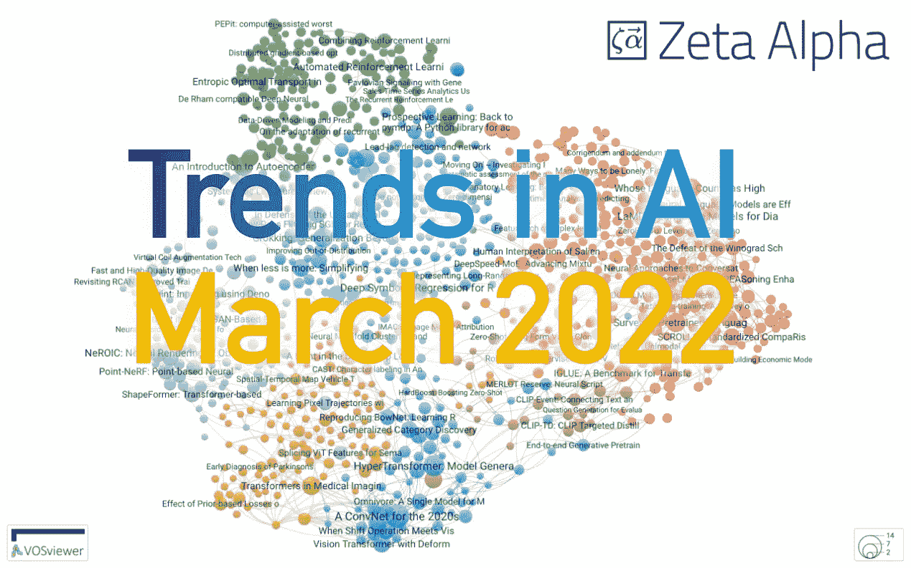

图片由 [Zeta Alpha](https://www.zeta-alpha.com/) 提供。

三月已经到来，充满了人工智能世界的发展:出版物和会议不断出现，例如刚刚结束的 [WSDM 会议](https://www.wsdm-conference.org/2022/)和 [AAAI 也刚刚结束](https://aaai-2022.virtualchair.net/index.html)。但让我们先来强调一些最近的新闻:

*   [DeepMind 宣布他们已经成功利用深度学习在聚变科学中控制等离子体](https://deepmind.com/blog/article/Accelerating-fusion-science-through-learned-plasma-control)(参见《自然》杂志上的[论文)。聚变能源一直是人类即将实现的能源生产梦想:小星星产生廉价清洁的能源。这一进展有望让科学家们更好地理解等离子体在聚变反应堆中的行为。](https://www.nature.com/articles/s41586-021-04301-9)
*   [arXiv 现在正式支持以响应网页的形式查看论文](https://blog.arxiv.org/2022/02/21/arxiv-articles-as-responsive-web-pages/)，为了试用，在任何论文 URL 中将 *arxiv* 替换为 *ar5iv* 。这是在 LaTeXML 项目(LaTeX 到 XML 的翻译器)的支持下，与 KWARC 研究小组合作的结果。我们怀疑这是否会挑战已经根深蒂固的 PDF 作为数字科学传播的标准，但是这个选项是一个非常受欢迎的补充！
*   [PyTorch 发布 torch rec](https://pytorch.org/blog/introducing-torchrec/)([GitHub repo](https://github.com/pytorch/torchrec)):一个“为提供大规模推荐系统所需的公共稀疏性&并行性原语而构建的领域库”。

杂: [evojax](https://github.com/google/evojax) (硬件加速神经进化的库)[优步现在用深度学习做 ETA](https://eng.uber.com/deepeta-how-uber-predicts-arrival-times/) ， [MuZero 做视频压缩](https://deepmind.com/blog/article/MuZeros-first-step-from-research-into-the-real-world)。

# 🔬研究

Zeta Alpha 监测人工智能研究的趋势，帮助你确定什么值得阅读。在它的帮助下，**我们选择了 10 篇论文，它们体现了不同人工智能子领域的关键发展:**信息检索，多路复用，神经渲染，视觉语言多模态，反向传播的替代方案，等等。尽情享受吧！

## [1。变压器存储器作为可区分的搜索索引](https://arxiv.org/abs/2202.06991)

*Yi Tay 等人*

**❓为什么→** 自从*神经革命*最终跟上以来，信息检索在过去的 4 年里取得了巨大的进步。差异化搜索指数(DSI)是一个非常独特的想法，从长远来看可能是不相关的，或者是范式转换？

**💡关键见解→** 当一个实体可能有不同的名称或者一个给定的名称在没有上下文的情况下可能有歧义时，识别实体是相关的(例如 *Manchester* 是指城市还是其足球俱乐部？).以前，通常使用某种信息检索方法从已知实体的索引中检索文本中出现的实体的身份。[自回归实体链接](https://arxiv.org/abs/2010.00904) ⁶ (AEL)提出通过自回归生成实体的规范标识符(例如，它们的全名字符串)来识别文本中的实体，从而挑战了这一过程。

现在，可区分搜索索引(DSI)受到 AEL 的启发，将其应用于文献检索。不是通过做一些词汇匹配、嵌入最近邻搜索或通过交叉编码重新排序来检索文档；模型*简单地*学习**自动生成与给定查询**相关的文档 id 列表。这是一个令人惊讶的先验，因为文档 id 不包含语义相关的信息:如果一个新文档出现并被赋予一个新的 id，您无法推断出它的内容。

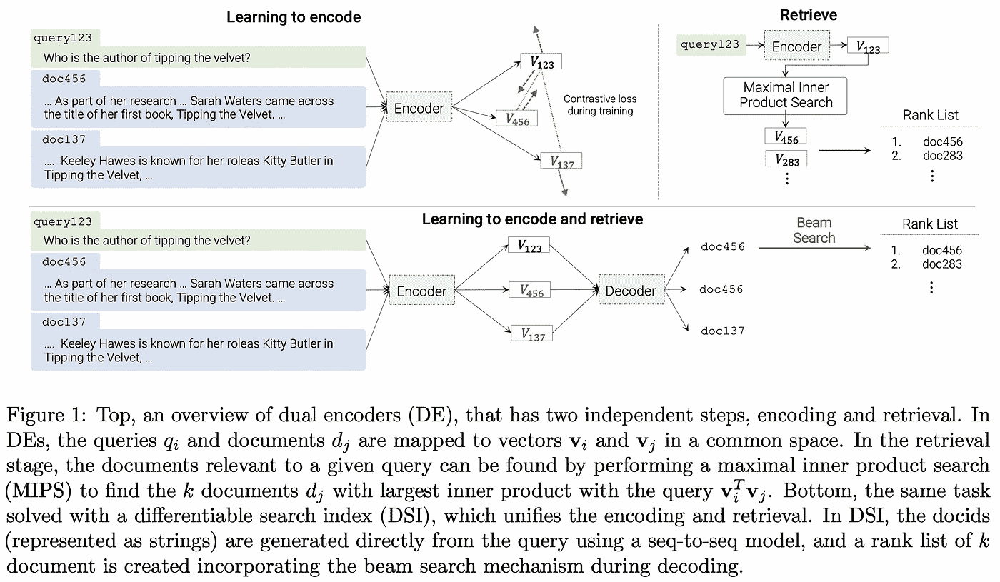

来源:[https://arxiv.org/pdf/2202.06991.pdf](https://arxiv.org/pdf/2202.06991.pdf)

直观地说，您可以将这看作是来自整个语料库的文档语义被编码到模型的参数中，这样模型就充当了查询和文档 id 之间的映射。结果，在推理中，模型执行检索**而不需要*查看*它从**检索的语料库。

实验结果包括对文档 id 的不同设计选择:例如，将每个文档的唯一标记与依赖于分层导航来标识文档的结构化语义文档 id 进行比较。总而言之，在[自然问题数据集](https://research.google/pubs/pub47761/) ⁷上的结果非常有希望，改善了 T5 和 BM25 等可靠基线。有趣的是，随着模型尺寸的增加，结果显著改善；这符合人们的直觉预期:毕竟，整个语料库需要被“记忆”到模型参数中！

尽管如此，许多问题仍然存在:这在多大程度上可以转化为非常大的索引？注释的稀疏性呢？这能在某种程度上处理变化的索引和新颖的文档吗？未来的研究将会告诉我们，这很令人兴奋。

## [2。DataMUX:神经网络的数据复用](https://arxiv.org/abs/2202.09318)

*作者:Vishvak Murahari，Carlos E. Jimenez，Runzhe Yang，Karthik Narasimhan。*

**❓为什么→** 以很小的*性能代价加速推理…？*嗯，老实说，只有一点是对结果的乐观解读，但这仍然是一个令人信服的实际想法！

**💡关键见解→** 数据复用是信号处理中广泛使用的一种方法，它将多个信号组合成一个信号，目的是通过一个通道更高效地传输。本文的作者提出了一个模拟过程的离散表示中使用的 ML。这个过程在概念上很简单:

*   通过线性变换和合并，将一个非常大的批次向下采样到一个可行的大小(例如 640 → 64)
*   通过您的模型运行批处理。
*   将每个样本的预测向上采样到原始大小(例如 640)。

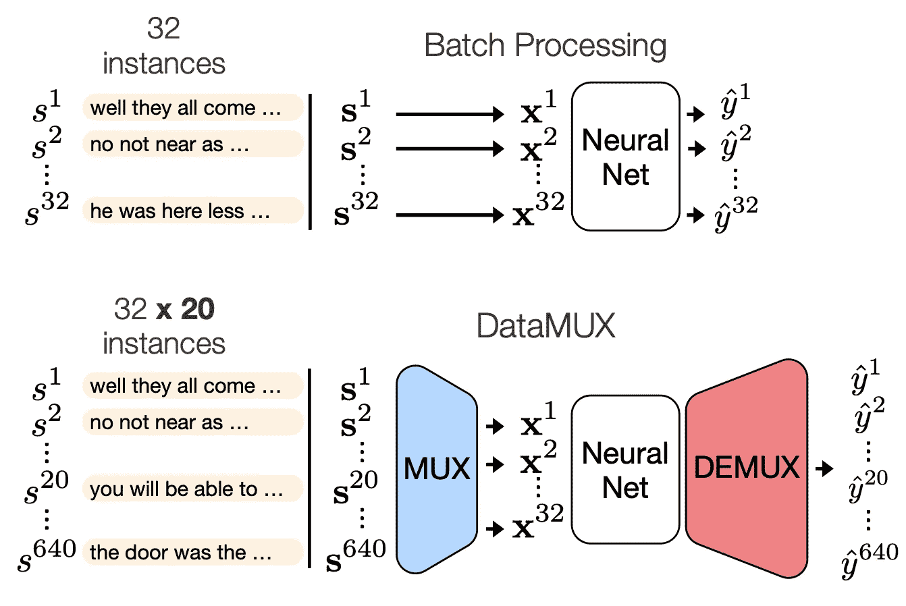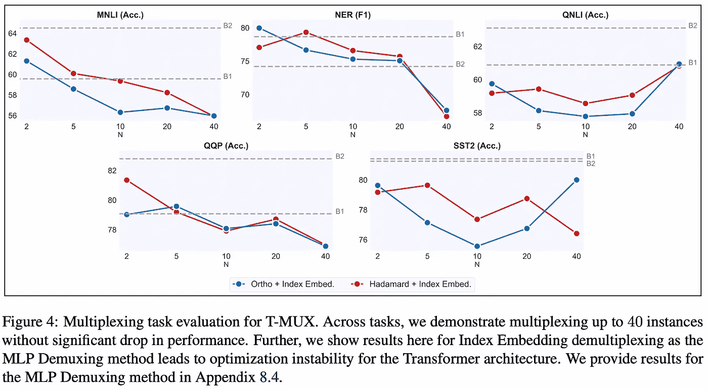

资料来源:https://arxiv.org/pdf/2202.09318.pdf

这种方法的主要优势是不言而喻的:如果您运行的是性能非常重要的批量推理，那么您可以通过这种处理实现大规模加速。该论文还包括一些关于注意机制如何工作以对已经融合到单个嵌入中的输入进行建模的理论分析，尽管该过程是架构不可知的。

当进行 10-20 倍的下采样时，他们测试的 NLP 任务(情感分析、自然语言推理、命名实体识别)的性能下降了几个百分点。虽然不是急剧下降，但尚不清楚这将如何转化为其他任务和模式，因为这些 NLP 任务对于现代大型模型来说“不是特别具有挑战性”。

此外，本文中的实验依赖于具有复用数据的模型的完整端到端训练；在我看来，一个有趣的问题是:给定一个基于常规推理(非复用)训练的冻结模型，这能做得多好。这可能与将多路复用应用于现有的非常大的模型的情况有关，这些模型的重新训练成本非常高。

## [3。是生的！利用状态空间模型的音频生成](https://arxiv.org/abs/2202.09729)

*作者卡兰·戈埃尔、阿尔伯特·古、克里斯·多纳休和克里斯托弗·雷*

**❓为什么→** (非常)长期——几千个步骤——序列建模中的依赖性仍然是机器学习中的一个挑战。在原始音频生成中，这是一个问题，因为数字波形是以大约 40kHz 的频率采样的，这使得非常长距离的依赖性成为常态。

**💡关键见解→** [状态空间表示法](https://en.wikipedia.org/wiki/State-space_representation)是物理系统的数学模型，通常用于控制理论，它根据系统的状态、时间导数、输入和输出来描述系统。这种类型的表示(依赖于矩阵和向量)非常适合线性代数工具集，这使得它非常适合于对系统的动力学、稳定性和模式进行分析证明和推理。

将这种表示应用于深度学习模型的问题是其计算的易处理性。最近，[使用结构化状态空间有效地模拟长序列](https://arxiv.org/abs/2111.00396)提出了一种将 SSM 参数化到神经网络中的新方法——命名为 S4——它包括几个数值技巧，使计算易于处理。

本文将该模型应用于 raw 无条件音频生成(称为生鱼片),旨在解决 raw 音频生成的三大挑战:全局一致性、计算效率和采样效率。此外，使用 SSM 模拟波形的额外好处是，它可以作为 CNN(快速用于非自回归、可并行生成)和 RNN(快速用于纯自回归生成)来计算。

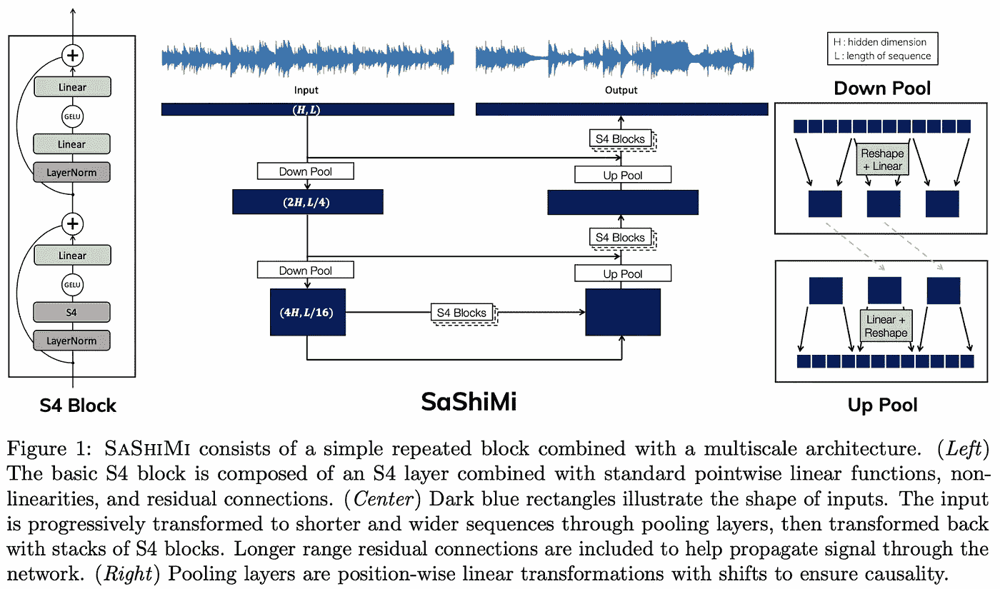

来源:[https://arxiv.org/pdf/2202.09729.pdf](https://arxiv.org/pdf/2202.09729.pdf)

当谈到经验结果时，生鱼片似乎可以稳定地训练，并且比 WaveNet 和 SampleRNN 等架构达到更好的负对数可能性。有趣的是，作者还展示了如何简单地将 DiffNet 的体系结构换成 SASHIMI(参数匹配)来提高性能，而无需任何调优。

## [4。VLP:视觉语言前期培训调查](https://arxiv.org/abs/2202.09061)

*作者车等*

**❓为什么→** 几个月来，我们一直在强调多模态 ML 视觉语言作品。空间变得如此之大，以至于很难导航，所以这里有一些帮助。

**💡关键见解→** 这个简短的调查是这个子领域的一个快照，它包括一个分类法，带有现有方法的相关定义特征，以及它们的介绍和

*   训练目的
*   视觉特征和语言特征
*   模态融合的类型
*   下游任务应用程序
*   使用的标注数据集
*   编码器-解码器与仅编码器模型

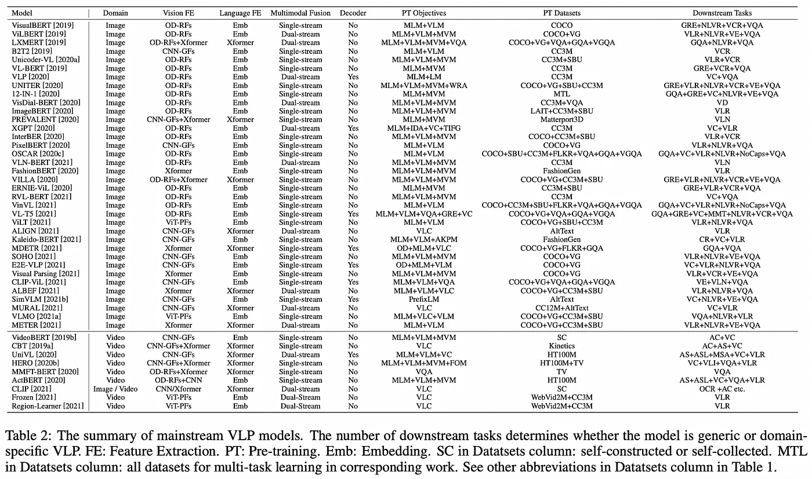

来源:[https://arxiv.org/pdf/2202.09061.pdf](https://arxiv.org/pdf/2202.09061.pdf)

如果有一个扩展，我希望看到这个调查，是更深入地包括最近的多模态作品，如依赖提示，如[多模态少数镜头学习与冻结语言模型](https://arxiv.org/abs/2106.13884)，我们在以前的博客帖子中强调了这一点。

## [5。设计有效的稀疏专家模型](https://arxiv.org/abs/2202.08906)

*Barret Zoph、Irwan Bello 等人*

**❓为什么→** 专家混合(moe)是我们的另一个经常性话题:扩展到更多的参数，降低推理的计算成本。如果你正在考虑建造一个巨大的 MoE，不用再找了，你已经找到了你的指南。

**💡关键见解→**MoEs 的关键概念很简单:在推理过程中，只通过模型中的子路径发送输入，这样，在每一步中只使用一小部分模型参数。不过，通常情况下，细节决定成败，几个设计选择是成功建造和训练大型 MoE 的关键。本设计指南深入探讨了以下关键方面:

*   稳定训练:在稳定性和质量权衡之间通常有一个权衡-使用确保稳定性的优化技术，如正则化或梯度裁剪，通常会损害最终模型的性能。如何避免这个问题？他们推出一款新颖的*路由器 z-loss。*
*   优化下游任务的性能:虽然 moe 在大型数据集领域表现出色，但在优化时，它们的性能有时会比密集任务差。为什么会这样，如何避免？
*   设计 MoE 体系结构:选择专家数量和路由机制的容量因子。
*   关于令牌如何通过 moe 路由的模型行为的定性探索。

该指南最终形成了一个 269B MoE 稀疏模型(稳定可转移专家混合模型或 ST-MoE-32B ),该模型在一组不同的自然语言基准上实现了最先进的性能。

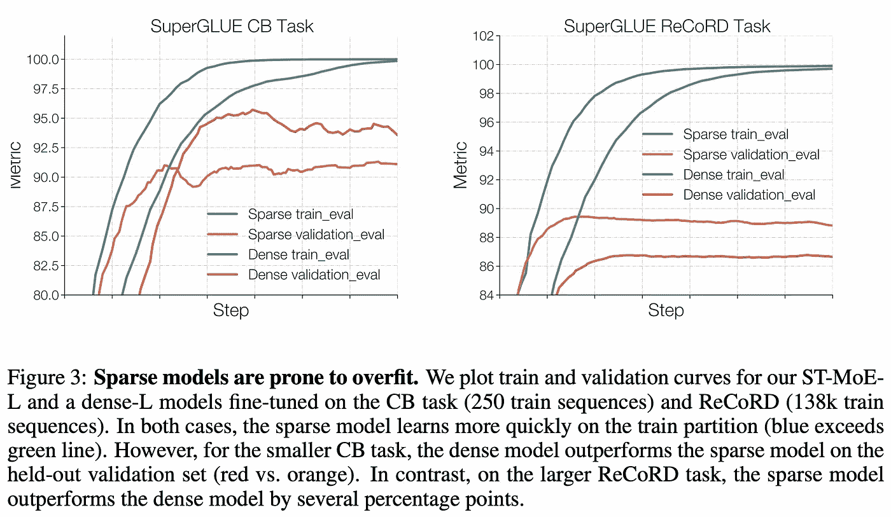

来源:https://arxiv.org/pdf/2202.08906.pdf

## [6。无反向传播的梯度](https://arxiv.org/abs/2202.08587)

*阿特拉姆·居内什·巴丁等人*

**❓为什么→** 什么？没有反投影的渐变？击球手出局了吗为什么会有人想要那个？👇

**💡关键见解→** 有限差分是一种逼近函数导数的数值方法:向右一点，向左一点求值，并估计它在该点的变化率。然而在多维空间中，*导数*变成了一个梯度(一个向量),事情变得有点复杂。在非常宽泛的范围内，本文提出了一种依赖于有限差分的梯度估计方法:对参数维度中的随机向量(扰动向量)进行采样，利用每个随机向量的有限差分来估计梯度，并对它们进行平均，以获得梯度的无偏估计。

直观地，而不是在整个神经网络中对链式法则进行分析推导；当正向传递完成时，每个参数相对于其相邻参数的梯度(在参数值处评估)可以通过此数值程序进行估计。

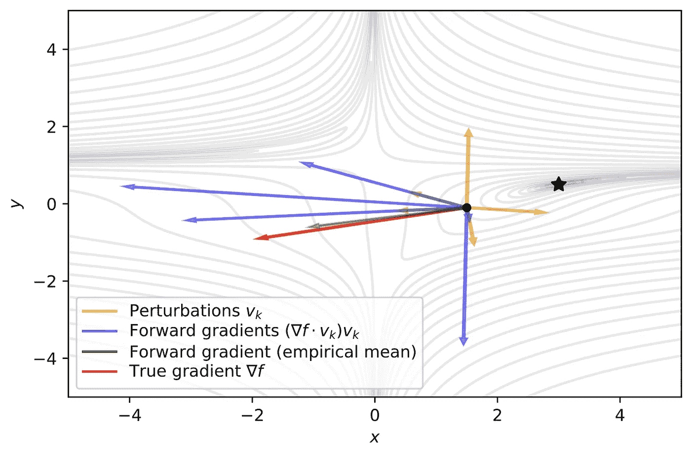

来源:[https://arxiv.org/pdf/2202.08587.pdf](https://arxiv.org/pdf/2202.08587.pdf)

作者称之为前向梯度，并从理论上证明了一些良好的性质，如它的无偏性，并展示了一些玩具的例子，梯度下降可以如何成功地应用这一技术。

现在你可能会问:我们为什么要这样做？backprop 不就好了吗？首先，与 backprop 相比，这种方法在相似的内存需求下实现了稍好的运行时计算成本。但也许更重要的是:反向传播经常被神经科学阵营批评为生物学上不合理，因为神经元*不具备* *以“反向 mode"⁵* ”进行通信的能力(也就是没有反向连接)。这是朝着生物学上合理的学习机制迈出的一步吗？作者暗示这可能是事实，尽管这肯定需要进一步的调查。

如果你想更深入地研究这种方法，但对所用的技术不太熟悉，我发现罗伯特·库伯勒在 TDS 上发表的这篇[解释者博客文章非常有用。同时期的 ICLR 2022 论文也提出了类似的方法:](https://towardsdatascience.com/papers-simplified-gradients-without-backpropagation-96e8533943fc)[通过方向梯度下降进行学习](https://openreview.net/forum?id=5i7lJLuhTm)。

## [7。等级感知者](https://arxiv.org/abs/2202.10890)

*作者若昂·卡雷拉等人*

**❓为什么→** 统治他们的架构都升级了。

**💡关键见解→** 这是 Perceiver⁹的新版本，它是一种基于转换器的方法，可以应用于任意形式的长序列(高达 100k！)的表征:视觉、语言、视听任务。

这是一个概念上简单的下一步，它显示了输入给感知者的序列如何以一种不可知的方式被分块，分别处理，然后成功合并，作者称之为“引入局部性”处理。下面你可以看到这个过程的概览图。

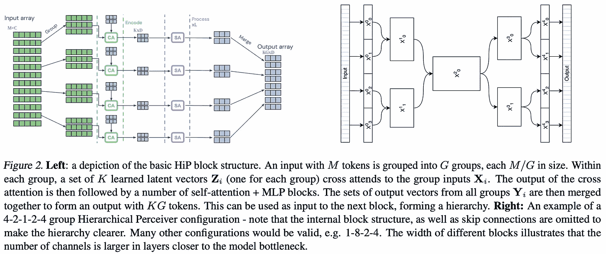

来源:[https://arxiv.org/pdf/2202.10890.pdf](https://arxiv.org/pdf/2202.10890.pdf)

与以前的方法相比，这种方法的主要优点是可以向模型提供更高分辨率的输入。有趣的是，这篇论文解释说，对于编码位置嵌入，手工傅立叶位置嵌入比学习位置嵌入效果更好，这与单峰文本或视觉应用不同。

结果显示在图像分类、视听分类和语义分割上的竞争性能(但不一定是最先进的);但是这些结果仍然依赖于一些特定领域的数据扩充。完全模态不可知 ML 的梦想还很遥远，这似乎是朝着正确方向迈出的一步。

## [8。Block-NeRF:可扩展的大场景神经视图合成](https://arxiv.org/abs/2202.05263)

*作者马修·坦西克等人*

**❓为什么→** 神经辐射场(nerfs)自从在 eccv 2020⁸.[推出以来，其受欢迎程度显著提高这是下一个重要的步骤，展示了如何将该技术应用于大型场景。](https://www.matthewtancik.com/nerf)

**💡关键见解→** NeRFs 是一种技术，它利用神经网络对给定几个示例(即图像)的场景的新视图的生成进行参数化。这种技术已经在广泛的场景中显示出非常有前途的照片真实感效果。

然而，到目前为止，这些成功仅限于小场景，其中单个模型可以生成所有视图。block-NeRF——这项工作提出的方法——是 NeRF 的一种变体，它允许将场景分成更小的块，这些块可以独立训练，然后合并以生成来自任意大环境(如城市)的场景视图。

在这种情况下，几个视频将比一千个单词更有价值，所以用[他们令人印象深刻的演示让自己兴奋吧！](http://waymo.com/research/block-nerf)

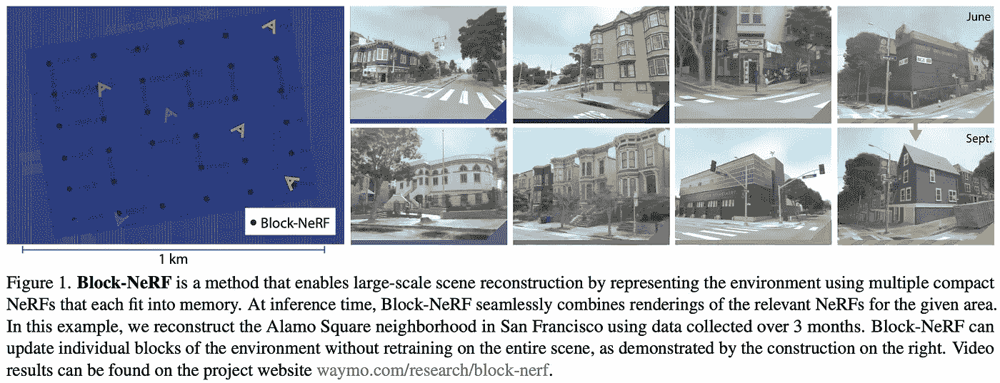

来源:[https://arxiv.org/pdf/2202.05263.pdf](https://arxiv.org/pdf/2202.05263.pdf)

## [9。跨越机器学习三个时代的计算趋势](https://arxiv.org/abs/2202.05924)

*海梅·塞维利亚等人*

**❓为什么→** 摩尔定律处理不了多光子过程吗？最近，是的。

**💡关键见解→** 本文从训练计算的角度提供了人工智能进展的历史概述，确定了 3 个独立的时代:前深度学习、深度学习和大规模时代(见下图)。这种分析是基于识别 123 个里程碑式的 ML 系统，并标注训练它们需要多少计算。

TL；每个时代的灾难恢复都体现了计算需求的指数级增长有多快:

*   预深度学习:训练计算大约每 21 个月翻一番。
*   深度学习:训练计算大约每 6 个月翻一番。
*   大规模时代:训练计算大约每 10 个月翻一倍，尽管与 2016 年 AlphaGo 的前几个模型相比，它的计算要求要高得多。

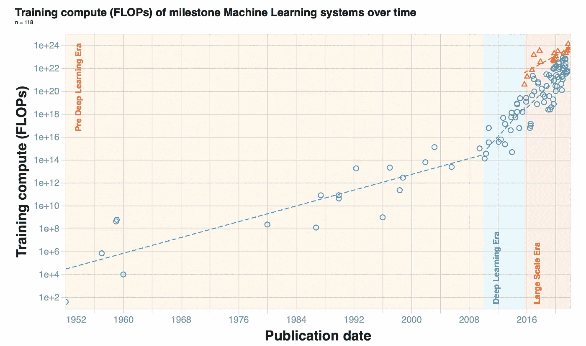

来源:[https://arxiv.org/pdf/2202.05924.pdf](https://arxiv.org/pdf/2202.05924.pdf)

虽然这些类别在一定程度上是任意的，但它们仍然有兴趣预测计算可用性将如何在未来几年塑造 ML 的进步:现在人工智能的扩展速度比运行它的芯片快，普通 GPU 不再像 10 年前那样，大规模分布式处理、超级计算机和更专业的人工智能加速器正在成为关键的驱动因素和限制因素！进步的象征。

## 10。通过约束聚类学习离散表示，以进行有效和高效的密集检索

*作者:詹、毛家信、、郭家凤、马。*

**❓why→**WSDM(信息检索)大会最佳论文奖。

**💡关键见解→** 密集检索的关键限制之一是，为了执行嵌入快速最近邻搜索，需要将这些嵌入保存在 RAM 中。这可能很快变得代价高昂:例如，*仅*100 万个 32 位浮点维度的嵌入就需要大约 4GB，因此超出这个数量级一两个数量级——这并非不可想象——可能需要服务器上的大量内存或分片索引，这也会带来不必要的复杂性和成本。

提出了一种新的基于可微约束聚类的文档嵌入量化机制，在不牺牲性能的情况下实现了高压缩比。如下图所示，他们的量化方法(RepCONC)在所有压缩比下都是 *Pareto 优势*于现有方法。

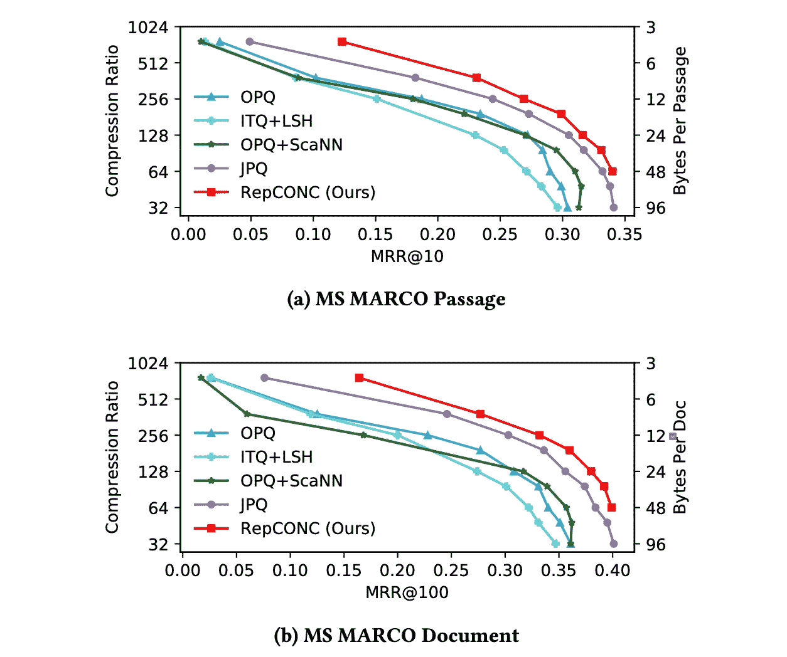

来源:[https://arxiv.org/pdf/2110.05789.pdf](https://arxiv.org/pdf/2110.05789.pdf)

我们的月度评选到此结束；如果你想了解最新的研究[加入我们即将于 2022 年 3 月 4 日星期五举行的网络研讨会](https://zoom.us/webinar/register/4516329472829/WN_eN_jspyBSLm8sdP0nkpoHw)，在我们的 YouTube 频道上观看[之前的版本，并在 Twitter](https://www.youtube.com/channel/UCUPgoukZXbAG5PPEjX_qkUA/videos) [@zetavector](https://twitter.com/ZetaVector) 上关注我们，敬请关注下一期！

*参考文献:*

*【1】“*[*用结构化状态空间高效建模长序列*](https://arxiv.org/abs/2111.00396) *”，作者:Albert Gu，Karan Goel 和 Christopher Ré，2020。*

*【2】*[*【DiffWave:音频合成的通用扩散模型*](https://arxiv.org/abs/2009.09761) *】作者:孔志峰、魏平、黄佳吉、和布莱恩·卡坦扎罗，2020。*

*[3]“使用冻结语言模型的多模态少数镜头学习”，Maria Tsimpoukelli、Jacob Menick、Serkan Cabi、S. M. Ali Eslami、Oriol Vinyals 和 Felix Hill，2021 年。*

*【5】*[*反向传播与大脑*](https://www.nature.com/articles/s41583-020-0277-3) *【作者:蒂莫西·p·莉莉卡普、亚当·桑托罗、卢克·马里斯、科林·j·阿克曼和杰弗里·辛顿，2020。*

*【6】“*[*自回归实体检索*](https://arxiv.org/abs/2010.00904) *”作者尼古拉·曹德、戈蒂埃·伊萨卡、塞巴斯蒂安·里德尔和法比奥·彼得罗尼，2021。*

*【7】*[*自然问题:问答研究的一个标杆*](https://research.google/pubs/pub47761/) *《汤姆·科维亚特科夫斯基等人 2019。*

*【8】*[*NeRF:将场景表示为用于视图合成的神经辐射场*](https://arxiv.org/abs/2003.08934)*”Ben milden hall 等人 2020 年*