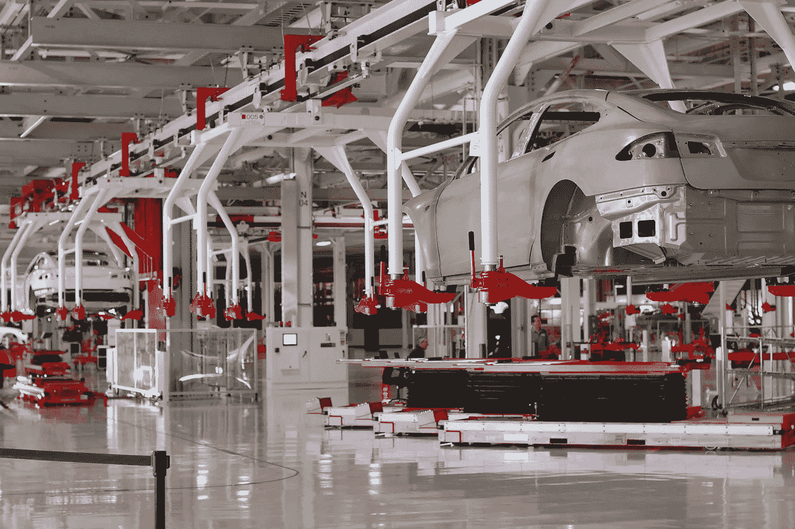

# 把灯打开！

> 原文：<https://pub.towardsai.net/turn-the-light-back-on-31536faafcfd?source=collection_archive---------4----------------------->

## [人工智能](https://towardsai.net/p/category/artificial-intelligence)，[科技](https://towardsai.net/p/category/technology)

## 从乌托邦式的熄灯工业 4.0 到现实的人工智能增强制造

图片来自[维基共享资源](https://commons.wikimedia.org/wiki/File:Tesla_Factory,_Fremont_(CA,_USA)_(8763129679).jpg)

我童年的朋友马可和我一样，在意大利海滨城市蒙法尔科内出生和长大。他在离威尼斯五十英里远的地中海最北端的城市造船厂工作。他的工作？建造豪华游轮——一些世界上最大的游轮。马可是历史悠久的工匠的后代，他们的血统可以追溯到中世纪的威尼斯造船者。与他的祖先不同，马可的大部分工作依赖于他的手工技能，并由今天的数字辅助工具增强。在他的案例中，一台高噪音生产线上的笔记本电脑。

套用一个老的工业 4.0 笑话，我曾经告诉马可未来的超级自动化造船厂*“…将只需要两个员工:一只看门狗和你，被雇来喂狗。”*

马尔科没有理会那个笑话。他并不担心我和我在波士顿的同事们正在构建的人工智能(AI)会很快取代他，而且有充分的理由。没有人工智能(包括机器人、无人机和人工智能驱动的自动化)得到测试，更不用说部署和取代他日常工作的大部分了。

从历史上看，制造商一直在努力创造依赖于可预测、有弹性、永不停息的机器的设施。一个没有讽刺意味的过程，既然制造业这个词的拉丁词根，其实就是 *manu* (手) *factum* (造)。

但事情在 2019 年开始好转，并进入 2020 年，许多制造商仍然对新冠肺炎措手不及。社交距离和其他限制暴露了加速采用人工智能和自动化等创新技术以保持运营正常运行的需求。

随着制造商将这一紧急情况转化为具体的行动项目，“熄灯制造”宣言——一种自动化程度如此之高的生产设施，因为周围没有人需要看到，所以不需要灯光——与 2020 年日常生产运行的现实之间的差距是不言而喻的。在日常实践中，人类仍然负责。

那么制造商在寻找什么呢？一系列具体的前进步骤，远离一个在今天的紧急情况下太遥远而无关紧要的未来。我们已经在 2020 年看到了一种趋势，这种趋势将持续到 2021 年，制造商将继续接受工业 4.0 计划，但心中有非常具体的目标。

例如，随着工业物联网(IIoT)通过地板上的传感器和摄像头收集大量数据，制造商可以实施基于人工智能的解决方案，以理解现有的、容易生成的数据。然后，这可以用来产生见解，帮助他们在竞争中保持领先地位。例如，由廉价相机收集的视觉数据可以在多个阶段提高生产线上产品的质量，从原材料一直到最终交付、码垛和装运。

随着越来越多的制造商寻求优化生产，积极的消息在等待着他们。与几十年来占主导地位的传统机器视觉不同，人工智能解决方案，如视觉检查和质量控制中使用的解决方案，可以应用于更多的操作场景。例如，在食品生产环境中，基于视觉的人工智能可以通过几十张图像进行训练，以了解“好的成分”是什么样的，并在出现污染物时提醒操作员，或者在生产线的另一端，确保正确的产品被正确包装并运送到正确的托盘中。

在市场上的工业 4.0 人工智能解决方案中，公司将选择便宜和轻量级的解决方案，而不是更复杂和昂贵的解决方案，主要是因为 2020 年给所有人带来的经济困难。纯软件、现有硬件、优势和快速投资回报都将是获胜解决方案的关键词和特征，这些解决方案将在未来几个月内部署到食品和饮料、电子产品、消费品等多个行业，以及钢铁生产等重工业。

一天下来，我不会把灯关在我的朋友马可身上。专业化的工人、嘈杂的生产线和笔记本电脑将继续存在。我注定要帮助他，而不是创造一个数字版本的马可，让他去照顾狗，设计人工智能软件来增强和增加他的工作能力，并把他的“眼睛和大脑”放在他否则负担不起或没有时间部署的地方。

需要雇其他人来喂那只看门狗！