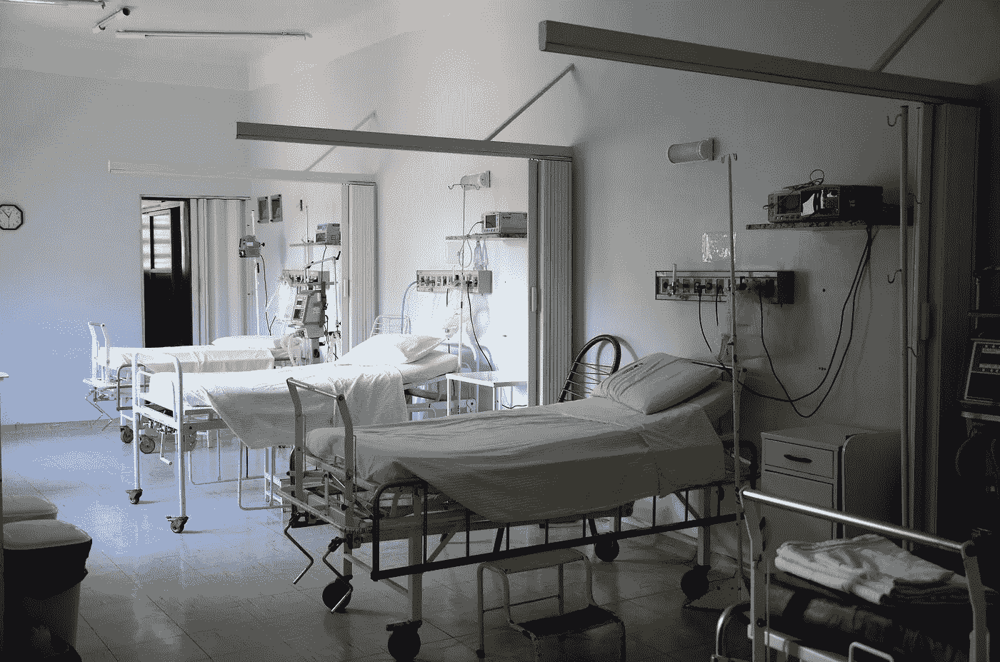
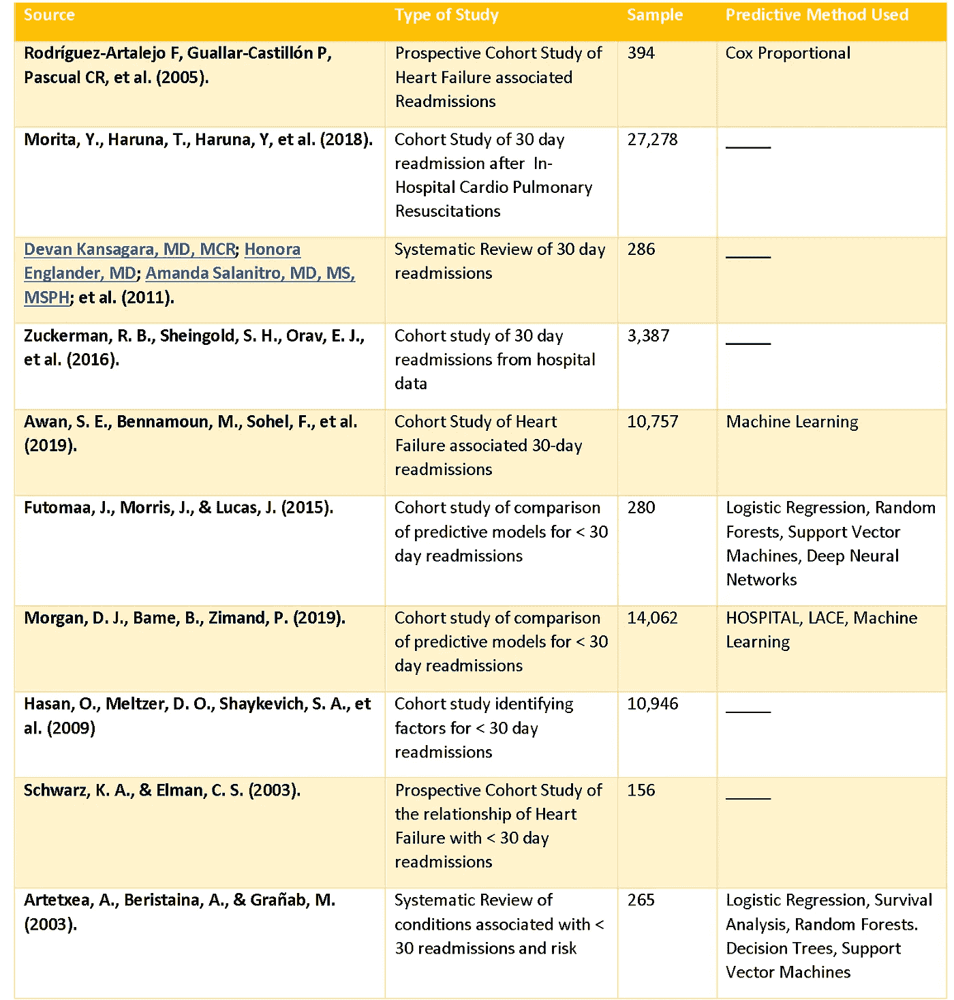
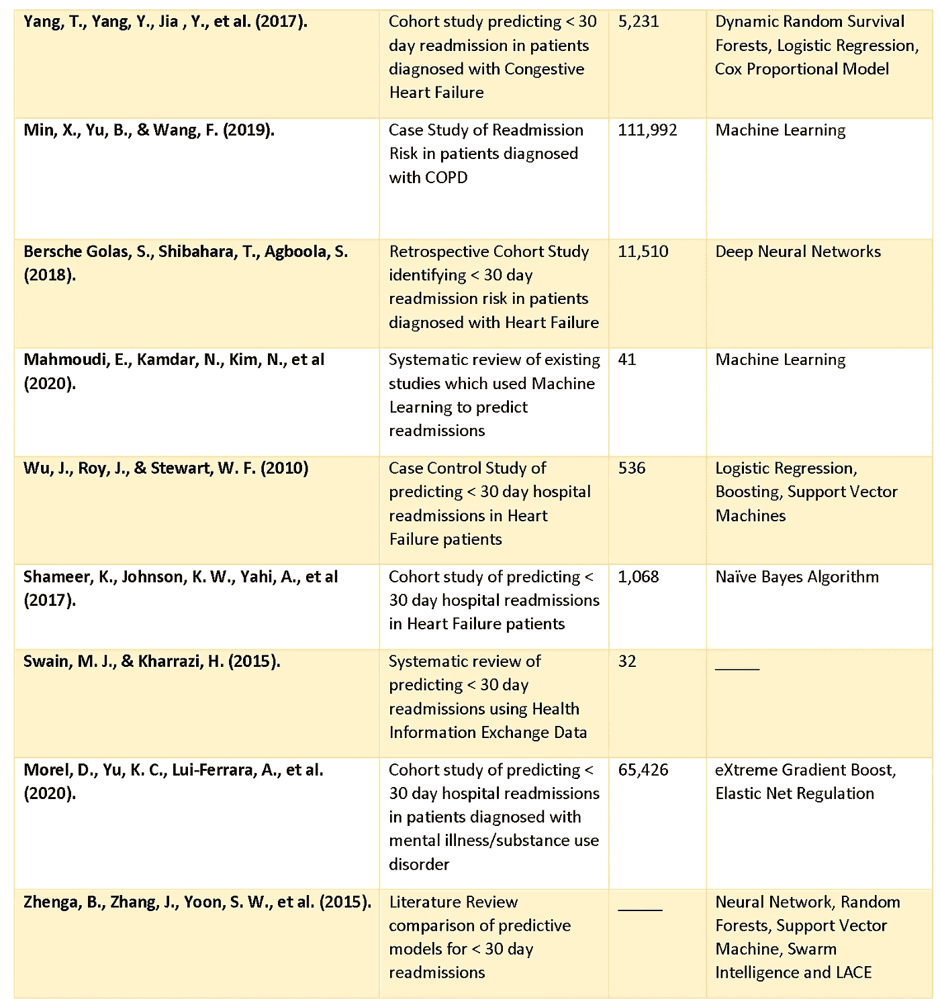
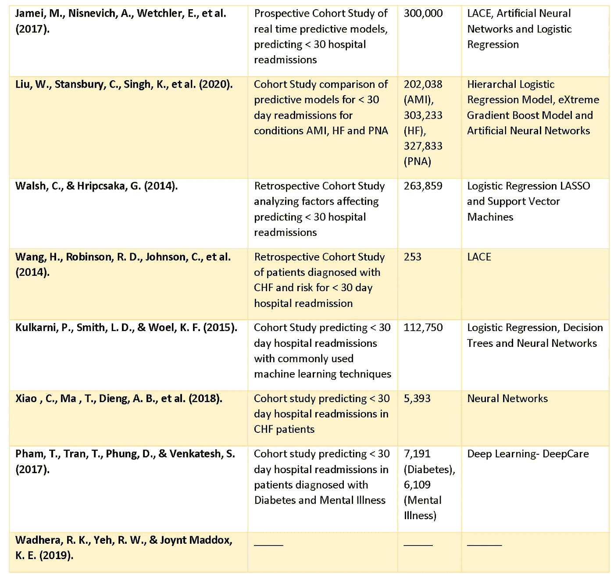

# 使用预测建模技术预测医院再入院

> 原文：<https://pub.towardsai.net/use-of-predictive-modeling-techniques-to-predict-hospital-readmissions-7b12e9f6194e?source=collection_archive---------4----------------------->

## [机器学习](https://towardsai.net/p/category/machine-learning)

## 医疗保健中的机器学习

照片由 [Pixabay](https://www.pexels.com/@pixabay) 在[像素](https://www.pexels.com/photo/bed-empty-equipments-floor-236380/)上拍摄

医院再入院，尤其是计划外的医院再入院对医疗保健行业来说是昂贵的。医疗保险和医疗补助服务中心(CMS)报告称，由于再次住院，每年的医疗保健支出为 170 亿美元。CMS 概述了具有频繁住院/再住院高风险的慢性疾病，作为 2010 年医院再住院减少计划的一部分。

EHR 技术的兴起有助于跟踪和捕获患者数据，特别是那些属于“高风险”再入院类别的患者。考虑到 CMS 对慢性病的概述和 EHR 技术的使用，为预测再入院的可能性问题做好了准备。

预测再入院的准确性因预测建模技术而异。预测再入院已经从标准的医院管理风险评估(如 LACE)发展到机器学习技术。机器学习技术从逻辑回归的基线模型变化到更高级和复杂的模型，如深度神经网络。

这篇文献综述的目的是讨论最常用的预测模型策略及其在预测医院再入院中的准确性。

用于搜索相关文章的数据库有:阿德尔菲大学图书馆在线数据库(OneSearch)、PubMed、谷歌学术、ScienceDirect、Wiley 在线图书馆以及《英国医学杂志》、《新英格兰医学杂志》、JAMA Network、Springer Link 和 PLOS One。找到了 35 篇与关键词匹配的文章，但是在审查了文章的类型(即相关性、文章撰写的年份——超过 20 年撰写的文章被排除在外，未经同行评审的文章也被排除在外)之后，文章的范围缩小到 27 篇。

总体共识是深度神经网络优于传统的预测建模技术，如 LACE 和机器学习(逻辑回归)。要改进预测模型，还有很多东西需要学习。卫生保健是复杂的，系统不是一刀切的，有必要考虑到病人的健康状况和影响卫生保健结果的其他因素。

社会和经济等因素在医疗保健结果中发挥作用。已知这些因素通常被排除在预测建模技术/策略之外，然而，研究表明这些因素对医疗保健结果和预测建模技术有影响。

医疗保健中预测建模的未来是一个能够将患者作为一个整体来考虑的系统，同时考虑患者的社会和经济障碍/状况，以改善患者的预测。

## **简介**

在美国，医院再入院继续占医疗保健支出的很大一部分。根据医疗保险和医疗补助服务中心(CMS)的说法，许多再入院被认为是可以避免和预防的。频繁的再入院表明缺乏高质量的护理，不良的出院计划，以及大量的其他社会和经济因素可能会影响再入院率。

CMS 于 2010 年制定了“减少医院再入院计划”( HRRP ),旨在减少频繁的医院再入院。该计划的重点是，如果患者在出院后 30 天内再次入院，且再次入院被认为是可预防或可避免的，则减少医疗保险支付。医疗保险支付将减少 3%。

CMS 概述了被视为高风险再入院的健康状况，呼吁改善入院时的服务和优质护理的协调。高危疾病包括慢性阻塞性肺疾病(COPD)、心力衰竭(HF)、急性心肌梗死(AMI)、肺炎、冠状动脉旁路移植术(CABG)和选择性初次全膝关节置换术/全髋关节置换术(TKA/THA)。

风险模型最终被用来预测再次住院的风险。预测再入院的准确性因预测建模技术而异。这篇文献综述将讨论最常见的预测模型策略和预测医院再入院的准确性。

**方法论**

进行研究包括搜索几个数据库以及直接的医学期刊搜索。用于搜索相关文章的数据库有:阿德菲大学图书馆在线数据库(OneSearch)、PubMed、谷歌学术、ScienceDirect、Wiley 在线图书馆以及《英国医学杂志》、《新英格兰医学杂志》、JAMA Network、Springer Link 和 PLOS One。在搜索相关文献时，使用的主要关键词是"医院再入院"、"频繁再入院"、"预测建模医院再入院"、"预测建模医疗保健"、"慢性健康状况"、"机器学习"、"深度神经网络"、" LACE "和"人工智能"。然后对每篇文章进行简要综述，以确定趋势/模式，并进一步帮助组织文献。

每篇文章都是在 Zotero 参考管理工具的帮助下保存和跟踪的。搜索找到了 35 篇与关键词匹配的文章，然而在审查了文章类型(即相关性、文章撰写年份-文章撰写时间> 20 年被排除在外，未经同行评审的文章也被排除在外)后，文章的范围缩小到 27 篇。每篇文章都有简短的评论和文章的文字摘要。选择的文章集中在医院再入院的背景、医疗保健中与预测建模相关的风险/益处以及目前使用的预测建模技术。

然后按照时间顺序组织这些文章，从医院再入院减少计划的背景及其意义开始(这包括以前进行的系统综述)。然后，该组织继续应对与预测建模以及经常使用的预测建模技术相关的挑战。

以解决更复杂的预测建模技术的最新文章结束-深度神经网络和递归神经网络，因为深度学习代表了医疗保健中预测建模的未来。下表反映了作为文献综述一部分的资料来源，包括研究类型、样本量和预测建模方法的分类。主要使用的资料来源是队列研究(前瞻性和回顾性)，包括以前就预测再住院主题进行的系统综述。

作者创建的表格

作者创建的表格

作者创建的表格

**文献综述**

该研究旨在确定与再入院和频繁住院相关的共同主题。在研究的中心，发现的共同主题是被视为高风险再入院或频繁住院的健康状况，以及降低再入院率的预测模型。

回顾了 27 篇文章，其中大部分将健康状况、心力衰竭作为再入院的原因。再入院的重点时间范围是出院后 30 天内的再入院。在努力减少再入院的过程中，预测建模技术已经走在了医疗保健行业的前列。

卫生保健行业已经寻求各种方法来预测医院再入院，以努力遵守医疗保险和医疗补助服务中心(CMS)医院再入院减少计划(HRRP)。未能遵守 CMS 制定的标准的医疗保健机构——频繁的“可预防的”再住院将受到处罚并减少医疗保险报销。最高 3%的预扣款项。通过所进行的研究，发现了几种常用于预测医院再入院的预测建模方法(LACE、逻辑回归、支持向量机、Cox 比例模型、随机森林、极端梯度推进和深度神经网络)。其他模型如朴素贝叶斯算法、群体智能、生存分析、动态随机生存森林和医院也有提及，但被排除在文献综述之外。

## **预测建模方法**

*蕾丝预测评估工具*

LACE 是医院常用的风险再入院评估工具，被认为是医疗保健行业的标准工具。该工具考虑了与再入院相关的常见因素，形成了首字母缩写词 LACE。

**L=停留时间**

**A=入院时的敏锐度**

**C=共病**

**E=急诊就诊**

完成评估工具后，计算分数以确定再次入院的风险。10 分或更高的分数将确定患者具有再次入院的高风险。

*逻辑回归模型*

逻辑回归是一种机器学习(ML)预测建模技术，并且是更广泛使用的 ML 技术之一。与其他 ML 技术相比，逻辑回归是最不复杂的，这是它被广泛使用的原因。逻辑回归用于分析数据集和建立变量之间的关系。逻辑回归的因变量是二元的，用于回答简单的问题，如是/否问题。

*支持向量机*

支持向量机也称为 SVM，是一种 ML 预测建模技术，其中该算法专注于定位决策边界和分类数据点。数据点是支持向量。决策边界也称为超平面，可以采用直线或三维平面的形式。数据点离超平面的距离可以很小，也可以很大。距离的大小决定了概化误差的水平。

*考克斯比例模型*

Cox 比例模型也称为 Cox 比例风险模型，是另一种常用的预测建模技术。Cox 比例模型是一种常用于医疗保健分析的回归模型。进行的分析也称为生存分析，用于根据收集的信息预测特定事件发生的结果或概率。结果被称为危险率，影响结果的因素被称为协变量。

*随机森林*

随机森林模型是一种最大似然预测建模技术，它利用决策树簇对数据进行分类。每个单独的聚类生成一个预测。最常见的生成预测用作模型的整体预测。

*极端梯度推进*

极端梯度提升也称为 XGBoost，是另一种利用决策树和梯度提升的 ML 预测建模技术。与随机森林相比，梯度增强涉及更小和“弱”的决策树。XGBoost 通过“修剪”决策树，删除不相关的信息，扩展了这种建模技术。

*深度神经网络*

深度神经网络(DNN)也称为人工神经网络(ANN ),是更复杂的最大似然预测建模技术之一。模拟人脑的生物结构，DNN 不同于传统的最大似然方法，因为所用的算法是分层结构的，基本上形成了“大脑”或人工神经网络(ANN)。使用人工神经网络，算法结构能够从数据中学习，并做出独立的决策和预测。

## **缺点和限制**

上述每种预测建模技术都有其优点和缺点。本文前面提到的 LACE 指数模型被许多机构广泛用于确定计划外再住院的风险。

与 ML 技术相比，蕾丝简单易懂。LACE 的一个关键点是，它考虑到了并存病，而不是只关注一种慢性健康状况。研究表明，LACE 在预测急诊室就诊人数方面可能比入院人数表现更好。

LACE 评分> 10 分并不意味着再次入院，尽管再次入院的风险已经确定。曲线下面积(AUC)决定测试的准确性，接近 1 的测试代表准确的结果，而小于等于 0 . 5 的测试被认为是不准确的测试。平均而言，与其他预测建模策略相比，这些研究审查的 LACE AUC 得分明显较低，结果从 59% (0.59)到 62.8% (0.628)不等。与 LACE 指数相比，本文中提到的模型——Cox 比例模型、逻辑回归模型、支持向量机模型、随机森林模型、深度神经网络模型和极端梯度推进模型的精度更高，但精度从 70% (0.7)到 84% (0.84)不等。报告的主要限制是数据的可获得性。EHR 技术直到最近才变得更加主流，在那里访问患者数据可以追溯到大约 15 年前。虽然 EHR 技术已经变得越来越主流，但每个系统各不相同，收集的数据也不统一。

这给数据收集带来了挑战，因为一些系统比其他系统包含更多的患者信息。在为文献综述进行的研究中变得明显的另一个限制是社会经济因素在医院再入院中的影响/作用。患者的保险范围、收入、住房状况都对患者的医疗保健结果产生影响。

## **结论**

回顾本文研究的现有文献，一致认为预测医院再入院仍是一项进行中的工作。我们尚未达到实现超过 90% (0.9)或接近 1 的 AUC 的能力。

有许多因素对预测再入院有影响，最终影响 AUC 结果。数据收集是首要因素。进行的研究表明，社会和经济因素在再入院中发挥了作用，但这一信息通常不包括在数据收集中。

数据收集的来源、EHR 系统各不相同，从一个 EHR 收集的数据组成可能与从另一个 EHR 系统收集的数据有很大差异。作为一种数据更加统一的替代选择，人们越来越多地使用健康信息交换云数据(HIE)来预测再次住院的风险。使用 HIE 云数据为数据收集提供了更大的样本池。HIE 是一个包含机构、医院、诊所、初级保健办公室的网络，它们共享数据，以改善提供者之间的护理协调和沟通。

在收集的文章中提到的各种 ML 预测建模技术，建议 DNN 提出最准确的再入院预测。然而，准确率达不到 90% (0.9)。DNN 的准确 AUC 百分比从 70% (0.7)到 84% (0.84)不等。

需要对产生更高结果的例子进行进一步的研究。逻辑回归仍然是最常用的机器学习预测建模技术，因为它最不复杂，也最容易理解。然而，随着医疗保健变得越来越明显，它是复杂的，因为没有一个尺寸适合所有人。研究还表明，与患有多种共病的患者相比，使用机器学习技术预测医院再入院对单一慢性健康状况的预测准确率更高。

总的来说，需要进一步的研究来确定以超过 90%(±0.9)的准确率预测再入院是否可行。如前所述，关于再次入院，必须考虑一系列因素。EHR 技术的增加以及 HIE 的使用对于确定患者再次入院的风险至关重要。

机器学习是一个有前途的选择，然而，仍然有改进的空间。预测建模的未来前景包括对患者数据的一致访问，理想情况下，数据是统一的，不会因系统而异。未来展望还包括将患者作为一个整体来考虑——包括社会经济因素以及共病情况(精神健康、物质滥用等),并根据收集的信息生成风险评分。

# 参考

Kulkarni，p .，Smith，L. D .，& Woel，K. F. (2015 年 4 月 16 日)。评估再住院的风险以改善医疗实践。*医疗保健管理科学*，291–299。doi:https://doi-org . lib proxy . adelphi . edu/10.1007/s 10729-015-9323-5

Artetxea，a .，Beristaina，a .，和 Grañ ab，M. (2018 年)。医院再入院风险的预测模型:方法的系统回顾。*生物医学中的计算机方法和程序*，49–64 页。doi:https://doi . org/10.1016/j . cmpb . 2018 . 06 . 006

Awan，S. E .、Bennamoun，m .、Sohel，f .、Sanfilippo，F. M .、& Dwivedi，G. (2019)。基于机器学习的心力衰竭再入院或死亡预测:选择正确模型和正确指标的意义。 *ESC 心脏衰竭*，428–435。doi:https://doi . org/10.1002/EHF 2.12419

贝尔舍·戈拉斯，t .柴原，Agboola，h . Otaki，j .佐藤，t .。。杰特瓦尼，K. (2018)。预测心力衰竭患者 30 天再入院风险的机器学习模型:对电子病历数据的回顾性分析。 *BMC 医学信息学和决策*。doi:https://doi . org/10.1186/s 12911-018-0620-z

Cox 比例风险模型。(未注明)。检索自 sth da . com:[http://www . sth da . com/English/wiki/Cox-proportional-hazards-model #:~:text = The % 20 Cox % 20 proportional % 2d hazards % 20 model，one % 20 or % 20 more % 20 predictor % 20 variables。](http://www.sthda.com/english/wiki/cox-proportional-hazards-model#:~:text=The%20Cox%20proportional%2Dhazards%20model,one%20or%20more%20predictor%20variables.)

Futomaa，j .，Morris，j .，& Lucas，J. (2015)。早期再入院预测模型的比较。*生物医学信息学杂志*，229–238 页。doi:https://doi . org/10.1016/j . jbi . 2015 . 05 . 016

甘地，R. (2018 年 6 月 7 日)。*支持向量机——机器学习算法简介*。检索自 towards data science . com:[https://towards data science . com/support-vector-machine-introduction-to-machine-learning-algorithms-934 a 444 FCA 47](https://towardsdatascience.com/support-vector-machine-introduction-to-machine-learning-algorithms-934a444fca47)

Hasan，d . o . Meltzer，s . a . Shaykevich，C. M .，Kaboli，P. J .，Auerbach，A. D .。。Schnipper，J. L. (2010 年)。普通内科患者的再住院:一个预测模型。*普通医学杂志*，211–219。doi:https://doi . org/10.1007/s 11606-009-1196-1

健康相关生活质量是心力衰竭患者再次住院和死亡的预测因素。(2005). *Arch Intern Med* ，1274–1279。doi:10.1001/archente

Jamei，m .，Nisnevich，a .，Wetchler，e .，Sudat，s .，和 Liu，E. (2017 年)。使用人工神经网络预测 30 天再住院的全因风险。 *PLoS ONE* 。doi:https://doi . org/10.1371/journal . pone . 0181173

坎萨加拉博士、英格兰德博士和萨拉尼托博士(2011 年)。再住院的风险预测模型:一项系统综述。贾马，1688–1698 年。doi:10.1001/jama

刘，w .，斯坦斯伯里，c .，辛格，k .，瑞安，A. M .，苏库尔，d .，马哈茂迪，e .。。Nallamothu，B. K. (2020 年)。使用嵌入医学代码的人工神经网络预测 30 天的再入院。 *PLoS ONE* 。doi:https://doi . org/10.1371/journal . pone . 0221606

Mahmoudi，e .，Kamdar，n .，Kim，n .，Gonzales，g .，Singh，k .，和 Waljee，A. K. (2020)。使用电子病历开发和验证再住院风险预测模型:系统性。 *BMJ* 。doi:http://dx . doi . org/10.1136 BMJ . m958

闵，x，于，b .，，王，f .(2019 . 2 . 20)。使用机器学习对来自患者索赔数据的医院再入院风险进行预测建模:一项关于慢性阻塞性肺疾病的案例研究。科学报告。doi:https://doi . org/10.1038/s 41598-019-39071-y

莫尔德五世(2019 年 4 月 7 日)。XGBoost 算法:愿她统治多久！检索自 towards data science . com:[https://towards data science . com/https-medium-com-vishalmorde-xgboost-algorithm-long-she-may-rein-edd 9 f 99 be 63d](https://towardsdatascience.com/https-medium-com-vishalmorde-xgboost-algorithm-long-she-may-rein-edd9f99be63d)

莫莱尔，d，余，K. C .，卢伊-费拉拉，a，-昔拉，A. J .，J =库尔茨，S. G .，&塔巴克，Y. P. (2020)。预测精神或物质使用障碍患者的再入院:一种机器学习方法。*国际医学信息学杂志，139* 。doi:https://doi . org/10.1016/j . ijmedinf . 2020.104136

摩根，D. J .，巴姆，b .，齐曼德，p .，杜利，p .，托姆，K. A .，哈里斯，A. D .。。梁，于(2019)。评估机器学习与预测医院再入院的标准预测规则。 *JAMA 网开*。doi:doi:10.1001/jamanetwook . 2019.0348

森田，t，春日，春日，y，中根，e，山治，y，林，h。。。伊诺科，M. (2019)。美国住院心肺复苏后 30 天再入院的发生率、预测因素、原因和费用。*欧洲复苏委员会*，19–25。doi:https://doi . org/10.1016/j . resursive . 2018 . 12 . 001

Pham，t .，Tran，t .，Phung，d .，& Venkatesh，S. (2017 年 5 月)。从病历预测医疗保健轨迹:一种深度学习方法。生物医学信息学杂志，218–229 页。doi:https://doi . org/10.1016/j . jbi . 2017 . 04 . 001

施瓦茨，K. A .，&埃尔曼，C. S. (2003 年 3 月至 4 月)。心力衰竭患者再住院预测因素的识别。*心&肺*，88–89。doi:https://doi . org/10.1067/mhl . 2003.15

SHAMEER，k .，JOHNSON，K. W .，YAHI，a .，MIOTTO，r .，LI，l .，RICKS，d .。。J. T .杜德利(2017)。使用电子病历范围的机器学习对医院再入院率进行预测建模:一项使用西奈山心力衰竭队列的案例研究。*生物计算*，276–287。doi:https://doi . org/10.1142/9789813207813 _ 0027

m . j . swain 和 h . Kharrazi(2015 年)。基于健康信息交换数据的 30 天再入院预测模型的可行性。*国际医学信息学杂志，85* (12)，1048–1056。doi:https://doi . org/10.1016/j . ijmedinf . 2015 . 09 . 003

Wadhera，R. K .，Yeh，R. W .，& Joynt Maddox，K. E. (2019 年)。医院再入院减少计划——是时候重启了。《新英格兰医学杂志》，2289–2291。

c .沃尔什和 g .赫里普萨卡(2014 年 12 月)。数据来源、队列选择和结果定义对 30 天再住院风险预测模型的影响。生物医学信息学杂志，418–426 页。doi:https://doi . org/10.1016/j . jbi . 2014 . 08 . 006

王、罗宾逊、约翰逊、泽纳罗萨、杰斯瓦尔、吉时利和德莱尼(2014 年 8 月 7 日)。使用 LACE 指数预测充血性心力衰竭患者的再入院。 *BMC 心血管疾病*。doi:https://doi-org . lib proxy . adelphi . edu/10.1186/1471-2261-14-97

沃森，K. (2019 年 7 月 19 日)。*医疗保健领域的预测分析*。从德勤网站检索:[https://www2 . Deloitte . com/us/en/insights/topics/analytics/predictive-analytics-health-care-value-risks . html # ethics-and-moral-hazards-in-pred](https://www2.deloitte.com/us/en/insights/topics/analytics/predictive-analytics-health-care-value-risks.html#ethics-and-moral-hazards-in-pred)

什么是 HIE？(未注明)。检索自 health it . gov:[https://www . health it . gov/topic/health-it-and-health-information-exchange-basics/what-HIE](https://www.healthit.gov/topic/health-it-and-health-information-exchange-basics/what-hie)

*什么是逻辑回归？*(未标明)。从 Statisticssolutions.com 检索:[https://www . statistics solutions . com/what-is-logistic-regression/](https://www.statisticssolutions.com/what-is-logistic-regression/)

吴，罗伊，j .，，斯图尔特，魏文峰(2010)。使用 EHR 数据的预测模型:挑战、策略和机器学习方法的比较。*医疗保健*，106–113。doi:doi:10.1097/MLR . 0b 013 e 3181 de 9 e 17

肖，c，马，t，迪昂，A. B .，布莱，D. M .，，王，f .(2018 . 4 . 9)。通过临床概念的深度上下文嵌入进行再入院预测。 *PLOS 一人*。doi:https://doi . org/10.1371/journal . pone . 0195024

杨，杨，贾，李，(2019)。基于医疗索赔数据的入院动态预测。 *BMC 医学信息学和决策*。doi:https://doi . org/10.1186/s 12911-019-0734-y

(2019 年 6 月 12 日)。*了解随机森林——算法如何工作，为什么如此有效*。检索自 towards data science . com:[https://towards data science . com/understanding-random-forest-58381 e 0602d 2](https://towardsdatascience.com/understanding-random-forest-58381e0602d2)

b .阿正、j .张、Yoon s . w、Lam s . s .、Khasawneh m .、和 poran ki s .(2015 年)。使用元试探法和数据挖掘对医院再入院进行预测建模。*专家系统及其应用*，7110–7120。doi:https://doi . org/10.1016/j . eswa . 2015 . 04 . 066

Zuckerman，R. B .，Sheingold，S. H .，Orav，E. J .，Ruhter，j .，& Epstein，A. M. (2016 年)。再入院、观察和医院再入院减少计划。《新英格兰医学杂志》，1543-1551 年。