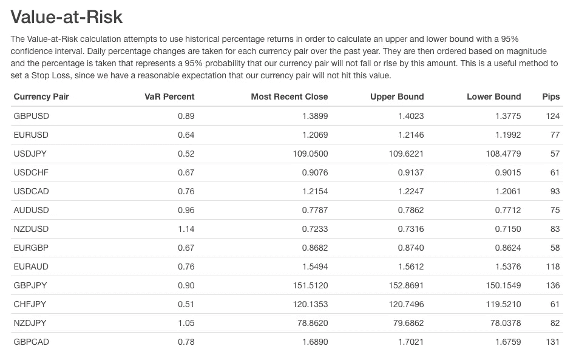

# 使用 Excel 计算外汇市场的风险价值

> 原文：<https://pub.towardsai.net/using-excel-to-calculate-value-at-risk-for-the-forex-markets-8596e2c5f583?source=collection_archive---------2----------------------->

## [数据可视化](https://towardsai.net/p/category/data-visualization)

[洛伊克·莱雷](https://unsplash.com/@loicleray?utm_source=unsplash&utm_medium=referral&utm_content=creditCopyText)在 [Unsplash](https://unsplash.com/s/photos/risk?utm_source=unsplash&utm_medium=referral&utm_content=creditCopyText) 上拍摄的照片

VaR 代表风险价值。这是任何形式交易的一个非常重要的组成部分，因为它是在任何时间点量化单一资产或整个投资组合风险的直接方法。使用 VaR 建模，我们可以定义投资组合中的损失可能性，并使用它来创建代表风险和安全情绪的不同资产集合。如果我们对某些经济体感到乐观，我们可以开始投资风险池中的资产。如果你认为经济正走向低迷，我们可能会寻找更安全的投资。有了 VaR，我们可以不断地关注当我们引入和移除不同的资产时，损失的概率和损失的程度是如何动态变化的。

本文将概述使用 VaR 作为在每日时间框架内对交易应用止损的方法(如果市场对我们不利，在与我们的已下单交易相反的方向上的价格来管理我们的损失)，但它将在任何你想使用的时间框架内工作。这个方法归功于大卫·卡利和他的书*外汇基本面分析。*

## 计算

在我们进入如何使用这个方法之前，我们需要解决 VaR 是如何表示的。通常，资产或投资组合的风险值是*“y %,表示该资产/投资组合在规定的时间段内将至少下跌 x%”*。例如，我们可能会说，使用我们对欧元兑美元每日时间框架的分析，我们已经计算出该货币对有 5%的机会下跌至少 2.12%。这个数字可以作为一个置信区间，所以如果我们决定购买欧元美元，我们可以将止损设置在买入价以下 2.12%，我们认为市场只有 5%的机会达到这个数字。

有多种方法可以确定这个百分比。本文将涉及历史方法。本质上，我们将使用历史价格来发现“异常”的每日百分比变化，并将这些值的最小值设置为我们的 VaR 模型止损数字。在 Excel 中的计算如下:

1.  下载历史每日价格数据集
2.  计算每日收盘价的百分比变化->(当前行-前一行)/前一行或(B3-B2)/B2
3.  将这些值复制到相邻的列，因为我们不能对计算字段进行排序
4.  按升序对该字段进行排序
5.  计算置信区间需要多少行。这是通过将数据集中的行数乘以 100-CI 来实现的，其中 CI 是您的置信区间。例如，假设我们有一年的数据，252 个工作日，我们想计算 95%的置信区间。我们会将它计算为 252 *(100–95)= 12.6≈13
6.  对于 95%的置信区间，将第 13 行的绝对%变化值作为您的 VaR 止损数字

我在 5 月中旬为自己的研究运行这个计算时，附上了一个结果的图像，只是为了让您可以看到输出应该是什么样子的模板。

下面是使用 1 年历史价格的主要和次要对的 95%置信区间，假设正负百分比变化对称。

作者图片

为了让您通过一个示例场景来了解如何使用这一点，假设我们想在周一早上市场一开盘就在 GBPUSD 进行买入交易。我们最近的收盘价是 1.3899，所以让我们假设这是我们在周一买入的价格。我们可以使用下限作为我们的止损，它是 1.3775，比最近的收盘价低 0.89%。根据历史表现，我们认为 GBPUSD 有 95%的可能性不会在周一的交易中跌至这一水平。

这种计算方法没有什么问题。自然，这是一个相当粗糙的计算止损的方法，因为它依赖于过去的行为与未来的行为相联系。虽然我们不能假设这是真的，但我们可以假设的是，有了足够的数据点，我们仍然可以识别异常的交易日，并以此来估计我们的价格界限。正是我们使用的大量数据点帮助我们提供更准确的界限，因为虽然我们无法预测准确的日常行为，但我们可以创建一个框架来识别异常表现，并使用它来构建我们的交易。

然而，如果你在重大经济消息发布的当天进行交易，那么边界的质量可能没有那么严格，因为高度意外的消息有能力大幅波动市场。这就是为什么大多数专业投资者建议散户交易者避免在公告日交易，因为这有能力让你很快停止交易。

值得注意的是，这种方法不会告诉你市场在一天中的预期走向。仅仅因为我们有一个上限和下限，并不意味着我们可以买入或卖出。我们的经济调查仍然必须和实际进入交易的时间一起进行。假设我们的其他分析是正确的，这个例子中 VaR 的目的纯粹是帮助我们理解什么样的止损能给我们成功交易的机会。