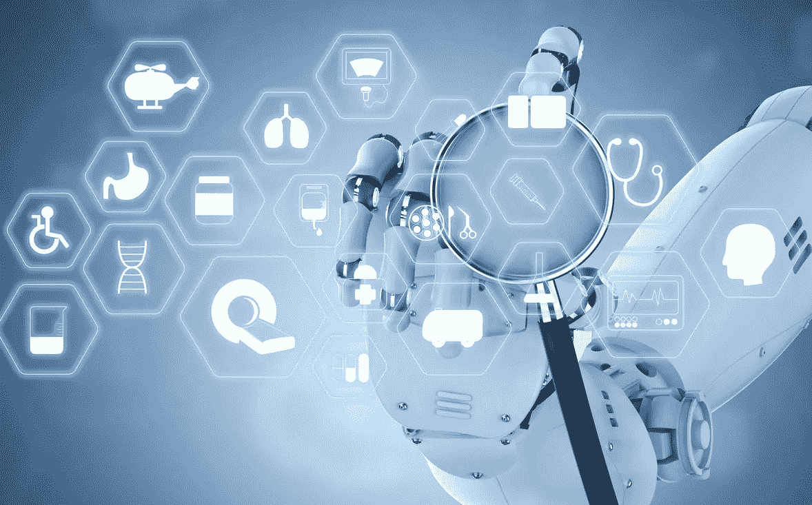

# 利用自然语言处理改进超视距雷达和循证医学中微量元素的识别和提取

> 原文：<https://pub.towardsai.net/using-nlp-to-improve-pico-element-identification-and-extraction-for-slrs-and-evidence-based-d3d5052ee720?source=collection_archive---------1----------------------->

## [自然语言处理](https://towardsai.net/p/category/nlp)

虽然“循证医学”(EBM)一词最早出现在 20 世纪 90 年代早期的印刷品中，但这种现在流行的临床实践方法的历史可以追溯到更早。18 世纪中叶，苏格兰海军医生詹姆斯·林德(James Lind)[在几组患病的水手身上试验了基于柑橘的坏血病疗法。有证据表明，可以笼统地称为 EBM 的东西可以一直追溯到古希腊。](https://www.ncbi.nlm.nih.gov/books/NBK390299/)

相比之下，现代的循证医学方法——将医学决策建立在系统性文献综述([SLR](https://www.capestart.com/resources/blog/nlp-aided-systematic-literature-review-why-its-needed-and-how-it-works/))中总结的证据基础上，而系统性文献综述本身是基于对特定医学状况治疗的随机对照试验([RCT](https://www.ncbi.nlm.nih.gov/pmc/articles/PMC6235704/#:~:text=Randomized%20controlled%20trials%20(RCT)%20are,between%20an%20intervention%20and%20outcome.))的分析——仍然相对较新。但它正在快速发展，尤其是当医疗专业人员面临呈指数级增长的数据量时:根据 RBC Capital Markets 的数据，医疗保健数据约占全球数据量的 30 %,到 2025 年将以每年 36%的速度增长。

医疗保健数据的爆炸式增长在一定程度上导致了 PICO 模型的大规模采用，用于从 RCT 中开发特定的临床问题。PICO 是一种助记符，代表:

1.  **P** 人口/问题:解决相关人口的特征以及疾病或紊乱的具体特征
2.  **I** 干预:解决初级干预(包括治疗、程序或诊断测试)以及任何风险因素
3.  **C** 比较:比较任何新的干预措施与主要干预措施的效果
4.  **O** utcome:衡量干预的结果，包括改善或副作用

PICO 帮助循证医学从业者开发精确的临床问题和可搜索的关键词来回答这些问题，考虑到上述数据量，它是一个关键的工具。但是这通常非常耗时，并且需要高水平的专业技能和医学领域知识。正如我们在[之前的博客](https://www.capestart.com/resources/blog/nlp-aided-systematic-literature-review-why-its-needed-and-how-it-works/)中所指出的，单反相机需要庞大的专家团队，平均需要超过 1000 个小时才能完成——在许多情况下，特定研究问题的开发可能会占用这些时间的很大一部分。大多数微微搜索涉及[几个步骤](https://www.ebsco.com/sites/g/files/nabnos191/files/acquiadam-assets/7-Steps-to-the-Perfect-PICO-Search-White-Paper_0.pdf)，包括问题形成、关键词识别、搜索策略制定、搜索执行、文献综述。这还没有考虑到我们之前提到的越来越多的医疗保健数据:[根据 Nye 等人的](https://www.ncbi.nlm.nih.gov/pmc/articles/PMC6174533/)统计，2015 年每天大约有 100 份 RCT 手稿被发表，而且这个数字从那以后几乎肯定会增长。

机器学习(ML)和自然语言处理(NLP)可以帮助促进从这个浩瀚的信息海洋中自动识别微微元素。这有助于循证实践者更快更准确地开发精确的研究问题，加速整个 SLR(和 EBM)过程。

## 皮可识别和提取的自动化

因为大量可用的原始证据变得太具有挑战性，以至于无法手工处理，研究人员正在尝试基于 NLP 技术自动完成这些任务。事实上，快速增长的医疗保健数据量[意味着](https://www.ncbi.nlm.nih.gov/pmc/articles/PMC6174533/)“医生几乎不可能知道对于给定的患者群体和条件，哪种医疗干预是最好的。”更大的挑战是，RCT 结果通常以非结构化自由文本的形式发布，而不是易于通过 SQL 和其他标准技术进行分析或查询的结构化数据。

正是这最后一个挑战使得 NLP 成为自动化微微元素识别和提取的合适工具。[写道](https://www.ncbi.nlm.nih.gov/pmc/articles/PMC5065023/) Wallace et al .【此外，自动化的 PICO 识别可以加快系统综述的数据提取，在系统综述中，综述者手动提取要报告和合成的结构化数据

但是根据 Kang 等人的说法，以前使用支持向量机(SVM)和条件随机场(CRF)的尝试已经停止，部分原因是“缺乏公开可用的带注释的语料库”用于训练，以及缺乏可用的工具来执行命名实体识别(NER)和信息检索(IR)。

然而，随着最近 ML 和 NLP 的快速发展，这种情况正在发生变化，包括深度学习、神经网络的出现，以及越来越多的用于训练和评估的公共标注语料库。Kang 等人认为 biLSTM-CRF 模型在的 PICO 相关应用中特别有效，并补充说，NLP 中[迁移学习](https://www.aclweb.org/anthology/N19-5004/)的出现有助于解决“对训练神经网络的大数据的高需求”

## NLP-自动化微微识别和提取的示例

在这些进步中，Nye 等人在 2018 年初发布的 [EBM-NLP](https://ebm-nlp.herokuapp.com/) 至关重要，这是一个由 5000 篇描述临床 RCT 的丰富注释的医学文章摘要组成的语料库。EBM-NLP 特别适合微微元素提取，因为它考虑了试验人群特征、干预措施、比较器和结果，使得访问相关数据比过去少得多(尽管围绕训练和评估用于微微识别和提取的 NLP 模型的数据可用性的问题仍然存在)。尽管存在这些挥之不去的问题，许多研究人员在过去几年中还是取得了重大进展:

*   Bui et al. (2016) [开发了](https://www.sciencedirect.com/science/article/pii/S1532046416301514)一个基于 NLP 的系统，该系统自动总结全文科学文章，并分析它们的微微值和单反相关数据元素。与人类书面摘要相比，该模型显示了更好的召回率(91.2%对 83.8%)和相关句子的密度(59%精度对 39%)。
*   Wallace et al. (2016) [提出了](https://www.ncbi.nlm.nih.gov/pmc/articles/PMC5065023/)一种使用有监督远程监督(SDS)加速 PICO 全文文章证据合成的方法。这种方法使用大型半结构化语料库(Cochrane 系统综述数据库，或 [CDSR](https://www.cochranelibrary.com/cdsr/reviews) )来“学习从描述 RCT 的全文文章中自动提取与 PICO 元素相关的句子”。
*   Kang 等人(2019)创建了一个[开源](https://github.com/Tian312/PICO_Parser) PICO 语句提取工具，使用 PICO 元素的 NER、统一医疗语言系统(UMLS)编码和 XML 输出来处理 RCT。虽然只使用小数据集进行训练，但它实现了“比在更大语料库上训练的传统机器学习模型更好的性能”，证明了在不需要大量训练数据的情况下为 PICO 应用程序开发 NLP 模型是可能的。
*   Brockmeier 等人(2019) [使用 Nye 等人的公开可用语料库训练了](https://bmcmedinformdecismak.biomedcentral.com/articles/10.1186/s12911-019-0992-8)一个 NER 模型，将该模型实现为递归神经网络(RNN)，并将其应用于医学摘要，以识别和提取微微元素。“在特定微微语境中标记的单词的出现被用作相关性分类模型的附加特征，”作者解释道。“机器学习辅助筛选的模拟用于评估具有和不具有微微特征的相关性模型所节省的工作…包含微微特征提高了 20 个集合中 15 个集合的性能指标，并在某些系统审查中获得了实质性收益。”
*   Jin 等人(2020 年)提出了一种新的深度学习模型，以识别基于双 LSTM 和条件随机场架构的微微元素，但增加了一个额外的双层，“以便可以收集周围句子的上下文信息，以帮助推断当前句子的解释。”研究人员还提议使用[对抗训练](https://en.wikipedia.org/wiki/Adversarial_machine_learning)和[无监督预训练](https://arxiv.org/abs/1905.01278)来启动模型，而不是使用大型语料库。在基准数据集上的测试中，该模型比以前的最佳模型高出 5.5%至 7.9%。代码可在[这里](https://github.com/jind11/Deep-PICO-Detection)获得。
*   Marshall 等人(2020)开发了 [Trialstreamer](https://trialstreamer.robotreviewer.net/) ，这是一个自动查找和分类 RCT 的系统。它已经发展成为一个公共可用的带注释的数据库，包含来自 PubMed 和世界卫生组织国际临床试验注册平台的 70 多万个 RCT。系统提取 PICO 元素的自由文本描述，将它们映射到标准化医学主题标题( [MeSH](https://www.nlm.nih.gov/mesh/meshhome.html) )词库。研究人员写道，在 2020 年的前五个月，该系统平均每天能够对 142 项 RCT 进行分类和索引。

## 自然语言处理在微微识别和提取中的前景

PICO 是循证实践者的一个重要工具，用于评估 RCT 的相关性，以制定具体和可回答的研究问题(和相关关键词)，但它可能非常耗时，容易出现人为错误，并需要大量的流程和医学专业知识。考虑到正在创建的相关医疗保健数据量快速增长，手动搜索和识别微微元素也变得越来越困难。

NLP 对皮科元素识别和提取的承诺意味着这些从业者在扫描文献中的皮科元素时可以获得同样好或更好的结果，但需要更少的人工劳动。 [CapeStart](https://www.capestart.com/) 的机器学习工程师、数据科学家和主题专家可以通过一系列以医疗保健为重点的 NLP 和数据注释解决方案，从预训练的 NLP 模型和模型开发到用于模型训练的预注释数据集，帮助您进行下一次系统的文献综述和 PICO 流程。