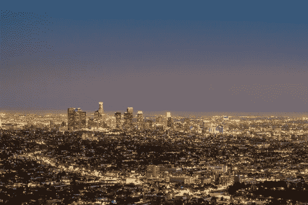

# 发动一场对抗光污染的战争来拯救世界——机器学习将会有所帮助

> 原文：<https://pub.towardsai.net/waging-a-war-against-light-pollution-to-save-the-world-machine-learning-is-all-set-to-help-774922b2d083?source=collection_archive---------4----------------------->

## [技术](https://towardsai.net/p/category/technology)

光污染是一种众所周知的现象，由于其对包括人类在内的所有生物物种的危害速度惊人，这种现象正在全球范围内引起广泛关注。如果不进行有效的监测和控制，它会被证明是危险的。

*唯一的一个好迹象是，如果我们每个人都开始有所作为，尽最大努力减少污染，这种污染是可以逆转的，这与许多其他形式的污染不同。因此，在这种情况下，仅仅意识到这个问题是不够的，相反，需要采取行动。*

资料来源 Saad Chaudhry 拍摄的 Unsplash 照片

**什么是光污染？**

> 光污染是在超过最佳阈值的区域中不明智或不需要或过度使用人造光。

组件包括:

眩光——过度或不必要的亮度，导致暂时的眩目效应或视觉干扰。例如来自对面的汽车的远光。

天空辉光——由于光线散射而使夜空变亮。

*   光线侵入——光线落入不需要的区域。
*   杂乱——过多的光源组合通常会造成混乱、分散注意力，并可能导致事故。例如街灯设计不良的道路。

来源 unsplash Mike Labrum 上的图片

**对包括人类在内的生物的危害**

1.它扰乱了昼夜循环，因为夜空给人一种日光的错觉，通过干扰生物(动物、昆虫、鸟类、水生物种和植物)的繁殖、营养、睡眠、抵御捕食者等模式，危及它们。

2.人造光导致小海龟死亡，因为海龟生活在海洋中，但晚上在海滩上孵蛋。通过探测海洋上空的自然光，这种孵化蛋中的婴儿找到了通往大海的路。但是在人造光的存在下，它们被朝着相反的方向驱动，而不是朝着大海的方向。

3.夜间迁徙的鸟类利用月亮和星星的自然光。人造光导致他们失去方向，偏离城市的摩天大楼，使他们相撞而死。

4.人造光导致候鸟在预定的迁徙季节之前迁徙，并使它们过早或过晚迁徙。这实际上剥夺了它们筑巢、追踪品种和其他行为所需的理想气候。这严重影响了它们的迁徙模式，进而影响了生态系统。

5.作为鸟类和其他动物食物来源的大量昆虫被人造光吸引，并在接触光源时被杀死。这以危险的方式影响了食物链。

6.过多的光发射/强光浪费能源，导致令人不快的经济和环境影响。

7.不受控制的外部照明造成的天空辉光使星座和银河的可见度下降，使得许多天体难以观察。这可以发展到这样的程度，我们的后代只能在天文馆里看到星星、银河系和星系，而不是用肉眼。

8.夜晚的人造光会对人类健康产生负面影响，增加肥胖、心率加快和心悸、抑郁、睡眠障碍、糖尿病、乳腺癌等风险，并扰乱我们的生物钟。

9.夜晚暴露在人造光特别是蓝光下会抑制褪黑激素的产生，而褪黑激素对增强免疫系统至关重要，并有助于降低胆固醇，支持甲状腺、胰腺和许多其他腺体的功能。

**解决问题的方法**

> 唯一的解决办法是恢复我们祖先时代的自然黑暗的天空，或者至少接近它。

这可以通过以下措施之一来实现

a.实施某些法规以限制人工照明的使用，并倡导正确的使用机制。

在这个方向上有很多牵引力，全球专家和监管机构正忙于制定规则和标准。

b.通过数学和机器学习模型进行测量和预测。

人们通常认为，如果某样东西可以被测量，那么它也可以被监测和控制。但是只有测量是不够的，使用机器学习模型进行预测也是必要的一部分，以便可以在现在和未来对其进行监测和控制。

**了解实施步骤—技术方面**

> 光污染的建模基本上是一个辐射传输问题。

1.专家和研究人员使用辐射转移(电磁辐射形式的能量转移)来捕捉大气中光污染的散射和传播。

2.辐射传输数学模型考虑了多种传播参数，如光谱反射率、障碍物、大气条件等，用于计算。考虑的另一个重要参数是所考虑的特定区域的人口。

3.所有这些参数都用于使用所需算法和技术开发机器学习模型。

4.对机器学习和数学模型进行详细的分析和超调，以获得期望的功效。

5.这些 ML 模型然后方便地确定一个区域是否有光污染。

6.一次只针对一个特定区域。

7.使用这些开发的模型，捕捉天空亮度水平和光污染水平的区域的数字和图形地图被创建。

8.一旦每个特定区域的贡献和地图都准备好了，就可以对它们求和，从而得到整个区域的夜空亮度和光污染的总贡献。

9.获取的结果是外推的，即预测是为了获得未来趋势，显示未来几年的天空会是什么样子。

> 主要目标是研究、监测和预测不同城镇(城市、郊区和农村地区)的光污染程度。
> 
> 这一结果完整地显示了未来几年不同地区的光污染前景，以便可以事先采取纠正措施来抑制光污染或减轻光污染的影响。

**结论**

毫无疑问，光污染是有害的，需要加以控制。因此，现在是采取行动拯救未来的时候了。尤其是像人工智能和人工智能这样的技术在我们手中，现在是时候利用这些技术的核心，将世界从这种可怕的现象中拯救出来。

我们要做的一项更重要的工作是传播意识，因为许多人仍然不知道或不了解光污染及其负面影响。我们必须确保越来越多的人理解并采取必要的措施来保护自然的夜晚/黑暗的天空。

感谢阅读！！！