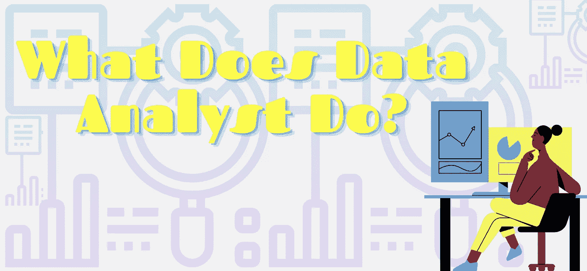

# 数据分析师是做什么的？—完整的职业指南

> 原文：<https://pub.towardsai.net/what-does-a-data-analyst-do-complete-career-guide-8ceaed513e6?source=collection_archive---------3----------------------->

我们生活在一个科技日益发达的世界，每一秒钟都被信息轰炸。每个企业都会收集数据，无论是客户营销数据、销售数据、物流数据还是运输成本。

从某种意义上说，这都是生意的一部分。似乎随着越来越多的数据在任何地方产生，明智地处理这些数据的技术也在增加。在这种情况下，数据分析变得很重要，因为它与手头的情况有关。数据分析有助于企业和组织将原始的非结构化数据转化为有用的信息，用于做出关键决策。数据分析是发展最快的领域之一，不言而喻，它是最热门的职业之一。

作为一名专业人士，你喜欢注重细节、有条理，并成为结构化环境的一部分吗？你喜欢与数据和数字打交道吗？这也是你喜欢做的事情吗？你可能会对数据分析师的职业感兴趣。然后，至关重要的是，你要了解分析专家每天是如何工作的，以及你如何为自己在这个不断发展的领域取得成功做好准备。

当您通读这篇文章时，您将对什么是数据分析有一个透彻的了解，并且您还将发现关于数据分析师的所有必要信息——他们的工作角色、数据分析师的类型、他们需要的技能和能力以及他们挣的工资。

下面是数据分析的快速介绍。

**什么是数据分析？**

在我们深入研究数据分析师做什么之前，回答一个问题很重要:什么是数据分析？正如您可能已经从它的名字中猜到的那样， [**数据分析**](https://www.interviewbit.com/data-analyst-interview-questions/) 基本上是通过使用不同的方法和商业智能工具来清理、分析和解释数据以揭示重要见解的过程，这些方法和工具将有助于更好地理解数据并基于数据做出更好的决策。数据分析师的工作是通过系统地搜索数据中的模式和关系，发现并传达基于数据的有用见解。分析数据通常是一个多步骤的过程，需要经历五次迭代:

*   决定你要分析什么数据。
*   收集和提取数据。
*   清理提取的数据，为分析做准备。
*   对数据进行分析
*   分析和解释结果

**数据分析师是做什么的？**

对于中小型企业来说，数据分析是一种很好的方式，可以帮助他们深入了解所服务的客户及其运营情况，并发现解决业务问题的机会。分析师的角色包括花费大量时间处理数据，但也包括向公司领导层和其他利益相关者传达调查结果，以帮助他们做出明智的决策。总的来说，数据分析师通过他们的工作为组织提供洞察，这些工作对企业如何向前发展和长期增长具有重大影响。利用他们的技术专长，他们将能够确保数据的高质量和准确性。

**数据分析师的日常任务和职责**

*   分析数据以评估信息的质量和重要性。
*   协助设计、开发、维护和增强数据系统和数据库，包括解决编码错误和其他数据相关问题。
*   收集主要和次要的数据来源，并以机器可读的格式重新组织它们。
*   使用统计工具分析数据集，特别注意模式和趋势，可用于执行诊断和预测分析。
*   为领导者提供报告，有效地传达基于相关数据的趋势、模式和预测，以便他们能够做出明智的决策。
*   为工程师、程序员和经理提供实际帮助，帮助他们发现流程改进的机会、修改系统并制定计划来增强数据治理流程，从而提高公司的整体绩效。

**数据分析师使用什么工具？**

数据分析领域采用各种[工具和技术](https://www.spiceworks.com/tech/big-data/articles/data-analysis-tools/)来协助收集、分析和解释组织收集的数据。这些工具包括:

*   微软优越试算表
*   谷歌床单。
*   结构化查询语言
*   数据库和数据管理系统，如 MySQL、Apache Hadoop 等。
*   特定于行业的数据分析工具，如 Tableau、Microsoft Power BI
*   r 或者[Python](https://www.scaler.com/topics/python/)
*   统计分析系统
*   Jupyter 笔记本

**数据分析师的类型**

技术的快速进步导致可以收集的信息的类型和数量呈指数增长，因此收集、整理和分析这些数据已经成为我们生活中几乎每个方面日益重要的技能。

*   **业务分析师:**执行数据分析，以发现业务洞察并改进业务流程。通过识别业务流程问题，提高营销、人力资源和组织结构等部门的生产率并降低成本。
*   **商业智能分析师:**通过分析数据和其他可用信息，帮助企业做出明智的商业决策。通常，他们的任务是获取、清理和分析与公司销售、收入、市场情报或消费者参与度相关的数据，以便在分析中使用。
*   **医疗保健分析师:**根据从各种来源收集的数据进行数据分析，以改善医疗保健效果。最终，他们必须专注于改善患者护理、降低运营成本和简化运营以实现更高的效率。
*   市场研究分析师:收集并评估消费者和竞争对手的数据，以确定产品未来的销售前景。他们提供的信息有助于企业了解顾客想要什么商品，谁会买，以及他们会付多少钱。
*   **运筹学分析师:**专业的问题解决者，具备高级问题解决技术的工作知识，如数据挖掘、统计分析和数学建模。专注于寻找能够显著提高组织和企业的效率和有效性以及降低其成本和费用的解决方案。
*   **情报分析师:**分析信息和数据，以便识别和缓解可能的安全问题。对于综合信息和制定行动计划的分析师来说，他们必须能够进行良好的研究，理解信息，并彻底分析数据。

**数据分析师所需的技能**

为了让数据分析师有效地获取、测量、组织和分析数据，他们必须具备很强的数学和统计技能。他们还应具备:

*   使您能够收集、查看和分析信息的分析技能。
*   能够以统计的方式测量和分析数据的数学技能。
*   技术技能，包括可视化技能、软件和脚本语言，
*   Excel 技能，数据库语言知识等。，来组织和呈现数据。
*   非技术技能，如优秀的人际交往能力、清晰地交流复杂概念的能力、创造性解决问题的能力和批判性思维能力。

此外，数据分析师需要有坚实的业务知识和专业技能基础，包括决策能力、解决问题的技巧和时间管理技巧。此外，对于数据分析师来说，有一双关注细节的眼睛是至关重要的，这样才能确保数据得到很好的分析，并在最大限度提高分析效率的同时将误差降至最低。一旦你掌握了所有你需要的技能，你很快就能满怀信心地投入到这个领域中去。你可以用数据分析做很多事情，它最大的优势之一是它的多功能性，因为你可以在任何地方使用它，无论是金融、医疗保健、政府、电子商务、科学还是你选择的任何其他领域。

**数据分析师挣多少钱？**

在工资方面，数据分析师平均每年可以赚到 60，000 美元到 138，000 美元，这取决于他们的经验水平。在印度，数据分析师的薪资结构因地区而异，从₹342,363/year 到₹1,750,000/yr 不等。正如你从网站的工作列表中看到的，金融和技术公司的职位往往比其他行业的职位工资高得多。作为一名数据分析师，重要的是要记住，你期望的薪水可能会随着许多因素而变化，包括经验水平、技能、地点和你的雇主。

在过去几年中，生成的数据量不断增加，这导致了对数据分析师的[需求不断增加。因此，作为一名数据分析师，一名大学新生的薪水作为起薪似乎是合适的。根据劳工统计局的数据，相关职业近年来也出现了极高的增长率，这表明市场对它们的需求很高。预计从 2020 年到 2030 年，运筹学分析师、市场研究分析师、数学家和统计学家的职位将分别增长 20%以上。](https://timesofindia.indiatimes.com/blogs/voices/the-growing-demand-for-data-fluency-in-workplaces/)

**顶级公司招聘数据分析师**

数据分析师的工作非常抢手，目前全球有超过 8 万个空缺职位。那是相当令人震惊的，不是吗？几乎每个行业都发现数据分析是一个有价值的工具，这就是为什么它在这些年来变得如此广泛。随着技术进步的到来，数据分析师的工作描述正在扩展到广泛的专业领域，如电子商务、医疗保健、商业、金融和营销。全球雇佣数据分析师最多的公司如下:

*   谷歌
*   脸谱网
*   Flipkart
*   亚马孙
*   网飞
*   Genpact
*   苹果
*   直觉
*   埃森哲
*   Tech Mahindra
*   塔塔咨询服务公司
*   凯捷印度私人有限公司
*   思科系统等。

**结论**

如今，我们生活的几乎每一个方面都围绕着技术，通过各种方式收集、分析和解释数据来解决业务问题。数据分析师在组织的成长和成功中发挥着关键作用，这也是他们如此受雇主追捧的原因。数据分析师的任务不仅仅是处理数据，而且要复杂得多。通过这样做，这些人能够在极其广泛的不同行业中工作，包括但不限于商业、医学、金融、科学、刑事司法、政府和许多其他行业。因此，数据分析师成为世界上需求量最大的工作之一，并受到世界上所有大型公司和组织的青睐，这一点也不奇怪。在不久的将来，数据分析师的工资和津贴很可能会突飞猛进，所以要做好准备。

如果您刚刚开始数据分析，我们已经涵盖了您需要了解的一切。在本文中，我们讨论了数据分析师做什么，他们需要的技能，数据分析师使用的工具，数据分析师的类型，以及他们的收入。随着经验的积累，你可能会扩展到其他领域，比如机器学习、数据工程或数据建模，甚至专攻一个领域。