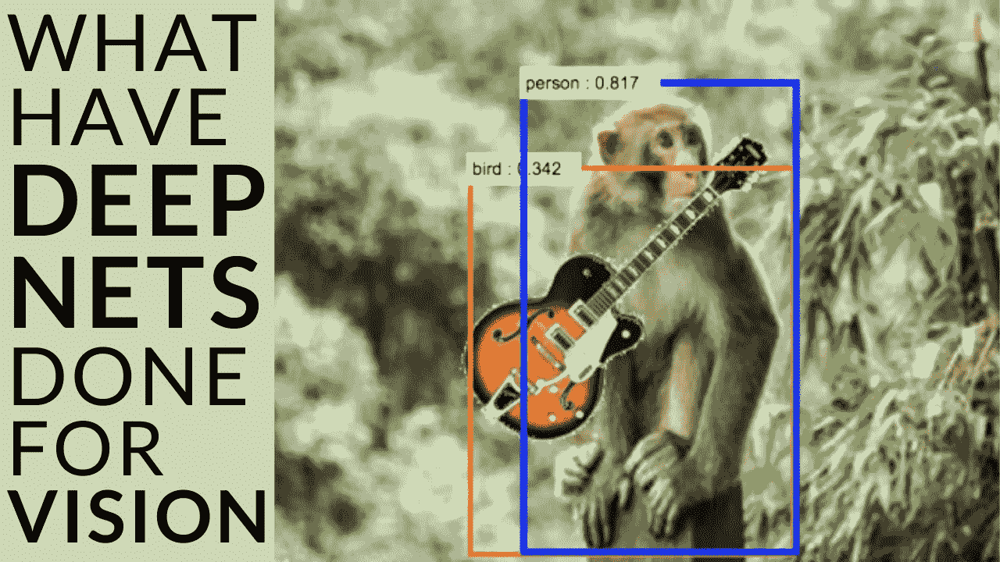
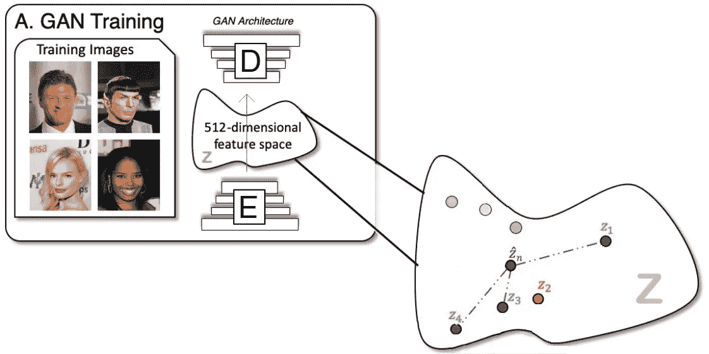
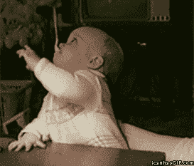
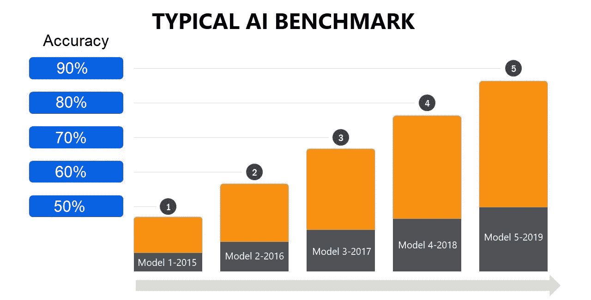
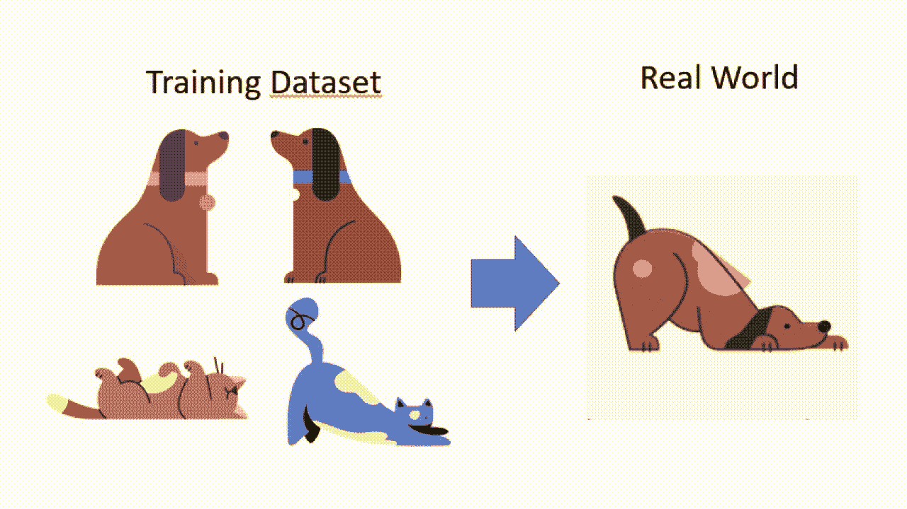

# AI 为计算机视觉做了什么？

> 原文：<https://pub.towardsai.net/what-has-ai-done-for-computer-vision-3748f5958e07?source=collection_archive---------2----------------------->

## [数据可视化](https://towardsai.net/p/category/data-visualization)

## 关于当前深度网络的一切，他们为视觉应用做了什么。他们的成功和局限。

> 原载于 [louisbouchard.ai](https://www.louisbouchard.ai/ai-in-computer-vision/) ，前两天在[我的博客](https://www.louisbouchard.ai/tag/artificial-intelligence/)上看到的！

图片由作者提供。

听听这个故事

如果你点击了这篇文章，你肯定对计算机视觉应用感兴趣，比如图像分类、图像分割、物体检测。这些都是“基本的”计算机视觉任务。更受欢迎的 CV 应用程序可能会让您想起:人脸识别、图像生成，甚至是风格转换应用程序，您可以在其中转换图片的风格。在这里，你可以想象一个 Snapchat 过滤器，你的脸的“风格”被转换成卡通或其他东西。你可能已经知道，随着我们计算机能力的不断增长，这些应用中的大多数现在都是使用类似的深度神经网络来实现的，我们通常称之为“人工智能模型”。在这些不同的视觉应用中使用的深度网络之间存在一些差异，但是它们使用由 Yann LeCun 在 1989 年引入的相同的卷积基础。主要的区别是我们的计算能力来自最近的 GPU 的进步。

[LeNet，(LeCun 等人，1989)](http://yann.lecun.com/exdb/publis/pdf/lecun-98.pdf)

## 卷积神经网络简介

顾名思义，快速浏览一下架构，卷积是一个过程，其中原始图像或视频帧(计算机视觉应用中的输入)使用滤波器进行卷积，检测图像的重要小特征，如边缘。网络将自动学习检测重要特征的过滤器值，以匹配我们想要的输出，例如作为分类任务的输入发送的特定图像中的对象名称。

使用 3 x 3 过滤器的卷积。图片来自 [Irhum Shafkat](https://medium.com/@irhumshafkat) 。经允许重新发布。

这些过滤器通常是 3×3 或 5×5 像素的正方形，允许它们检测边缘的方向:左、右、上或下。就像你在这张图片中看到的一样，卷积的过程在滤镜和它所面对的像素之间产生了一个点积。它基本上只是所有滤镜像素与相应位置的图像像素值相乘的总和。然后，它向右走，再次这样做，卷积整个图像。完成后，这些卷积后的要素将为我们提供第一个卷积层的输出。我们称这个输出为特征图。我们对许多其他过滤器重复该过程，得到多个特征图——卷积过程中使用的每个过滤器一个。拥有一个以上的特征地图给了我们关于图像的更多信息。尤其是我们可以在培训中学习到的更多信息，因为这些过滤器是我们在任务中要学习的内容。这些特征地图都被发送到下一层作为输入，以再次产生许多其他更小尺寸的特征地图。我们进入网络越深，由于卷积的性质，这些特征图变得越小，并且这些特征图的信息变得越一般。直到它到达网络的末端，具有关于图像包含什么的非常一般的信息，分布在许多特征地图上，其用于分类或构建潜在代码，以在 GAN 架构的情况下表示图像中存在的信息，从而基于该代码生成新的图像，我们称之为*编码信息*。

甘训练与潜在空间表征。图片由作者提供。

在图像分类的例子中，简单地说，我们可以说在网络的末端，这些小的特征地图包含关于每个可能类别的存在的信息，告诉你它是狗、猫、人等等。当然，这是超级简化的，还有其他步骤，但我觉得这是对深度卷积神经网络内部发生的事情的准确总结。

如果你一直关注我的文章和帖子，你会知道深度神经网络一次又一次地被证明是极其强大的，但它们也有我们不应该试图隐藏的弱点和弱点。正如生活中的所有事情一样，深网有长处也有短处。虽然优势被广泛分享，但后者往往被公司甚至最终被一些研究人员忽略或抛弃。

## 深层网络——优势和劣势

在本文中，我将讨论艾伦·l·尤耶(Alan L. Yuille)和刘晨曦[1]最近发表的一篇论文，该论文旨在公开分享关于视觉应用深度网络的一切，它们的成功以及我们必须解决的局限性。此外，就像我们自己的大脑一样，我们仍然没有完全理解它们的内部工作方式，这使得深度网络的使用更加有限，因为我们无法最大限度地发挥它们的优势，限制它们的弱点。正如 o .霍伯特所说，

> 它就像一张路线图，告诉你汽车可以行驶到哪里，但不告诉你汽车实际行驶的时间和地点。[1]

这是他们论文中讨论的另一点。也就是说，计算机视觉算法的未来是什么？你可能会想，改善计算机视觉应用的一种方法是更好地了解我们自己的视觉系统，从我们的大脑开始，这就是为什么神经科学对人工智能来说是如此重要的领域。事实上，当前的深度网络与我们自己的视觉系统惊人地不同。首先，人类可以通过利用我们的记忆和已经获得的知识，从最少的例子中学习。我们还可以利用我们对世界及其物理属性的理解进行推理，这是深网所做不到的。1999 年 Gopnik 等人解释说，婴儿更像是微小的科学家，他们通过进行实验和寻求现象的因果解释来理解世界，而不是像当前的深网一样简单地从图像中接收刺激。

人类要健壮得多，因为我们可以很容易地从任何角度识别一个物体，它的纹理，我们可能遇到的遮挡，以及新的上下文。作为一个具体的例子，你可以想象当你登录一个网站时，你总是要填写的烦人的验证码。这个验证码是用来检测机器人的，因为当有像这样的遮挡时，它们是可怕的。

正如你在这里看到的，深网被所有的例子愚弄了，因为丛林环境和猴子通常不会拿着吉他的事实。
发生这种情况是因为它肯定不在训练数据集中。当然，这种确切的情况在现实生活中可能不会经常发生，即使它不在训练数据集中。

[(2021 年)。](https://arxiv.org/abs/1805.04025)【1】

我将展示一些更具体的例子，这些例子更有关联，而且已经发生过。深网也有我们必须突出的长处。他们可以在人脸识别任务上胜过我们，因为直到最近，人类还不习惯在一生中看到超过几千个人。但是深网的这种优势也有局限性，这些面需要是直的、居中的、清晰的、没有任何遮挡等。事实上，该算法无法识别你在万圣节派对上伪装成哈利波特的最好的朋友，他只有眼镜和前额上的闪电。你会立刻认出他并说，“哇，这不是很有创意。看起来你刚刚戴上眼镜”。同样，这样的算法是极其精确的放射科医生…如果所有的设置都与他们在训练中看到的相似，他们将胜过任何人类。这主要是因为即使是最专业的放射科医生一生中也只看过相当少量的 CT 扫描。正如他们所建议的那样，算法的这种优越性也可能是因为它们在为人类做一项低优先级的任务。例如，你手机上的计算机视觉应用程序可以比我们大多数阅读的人更好地识别你花园中的数百种植物，但植物专家肯定可以胜过它(以及我们所有人)。但同样，这种优势伴随着与数据相关的巨大问题，算法需要如此强大。正如他们提到的，也正如我们经常在 Twitter 或文章标题上看到的，由于这些深度网络被训练的数据集，存在偏见，因为

> 算法的好坏取决于评估它的数据集和使用的性能指标。[1]

## 深层网络与人类视觉系统

这种数据集限制带来的代价是，这些深度神经网络远不如我们自己的视觉系统通用、灵活和适应性强。它们不太通用和灵活，因为与我们的视觉系统相反，我们自动执行边缘检测、双目立体、语义分割、对象分类、场景分类和 3D 深度估计，而深度网络只能被训练来完成这些任务中的一项。事实上，只要环顾四周，你的视觉系统就能以极高的精度自动完成所有这些任务，而深网很难在其中一项任务上达到类似的精度。但即使这对我们来说似乎毫不费力，我们一半的神经元都在处理信息和分析正在发生的事情。

即使以目前的网络深度，我们仍然远远没有模仿我们的视觉系统，但这真的是我们算法的目标吗？把它们作为改善我们弱点的工具会更好吗？我不能说。但我确信，我们希望解决可能导致严重后果的深网局限性，而不是忽略它们。在介绍完这些限制之后，我将给出一些具体的例子。深网的最大限制之一是它们依赖于数据。事实上，我们之前提到的深度网络缺乏精确度主要是因为我们用来训练算法的数据和它在现实生活中看到的数据之间的差异。如你所知，一个算法需要看到大量的数据来迭代地改进它被训练的任务。这些数据通常被称为训练数据集。

## 数据依赖问题

弗兰基·查马基在 [Unsplash](https://unsplash.com?utm_source=medium&utm_medium=referral) 上拍摄的照片

训练数据集和真实世界之间的这种数据差异是一个问题，因为真实世界太复杂了，无法在单个数据集中准确表示，这就是为什么深度网络比我们的视觉系统适应性差。在论文中，他们称之为自然图像的组合复杂性爆炸。组合的复杂性来自于自然图像中大量可能的变化，如相机姿态、照明、纹理、材料、背景、物体的位置等。偏差可能出现在数据集缺失的任何复杂程度上。你可以看到，由于所有这些因素，这些大型数据集现在看起来非常小，考虑到只有，比方说，13 个不同的参数，我们只允许每个参数有 1 000 个不同的值，我们很快跳到这个数量的不同图像来代表一个单一的对象:1 0 个⁹.目前的数据集只涵盖了每个对象的众多可能变化中的一小部分，因此错过了它在生产中会遇到的大多数真实世界的情况。

同样值得一提的是，由于图像的种类非常有限，网络可能会找到检测某些物体的捷径，就像我们之前看到的猴子一样。它探测到的是一个人而不是一只猴子，因为它前面有一把吉他。同样，你可以看到它在这里检测的是一只鸟，而不是一把吉他，可能是因为模型从未见过丛林背景的吉他。这是一种称为“过度适应背景环境”的情况，其中算法没有专注于正确的事情，而是在图像本身而不是感兴趣的对象中找到模式。此外，这些数据集都是由照片拍摄的图像构建的。这意味着它们仅覆盖特定的角度和姿态，而不会转移到现实世界中的所有方向可能性。

## 基准

典型的人工智能基准图。图片由作者提供。

目前，我们使用具有最复杂数据集的基准来比较当前的算法并对它们进行评级，如果你还记得，这些算法与现实世界相比是不完整的。尽管如此，在这样的基准测试中，我们通常对 99%的准确率感到满意。首先，问题是这 1%的误差是在基准数据集上确定的，这意味着它与我们的训练数据集相似，因为它不代表自然图像的丰富性。这很正常，因为不可能仅仅用一堆图像来表现现实世界，太复杂了，可能的情况太多了。我们用来测试数据集以确定它们是否准备好部署在现实世界的应用程序中的这些基准并不真正准确地确定它将*实际*执行得有多好，这导致了第二个问题，即它将如何在现实世界中实际执行。

假设基准数据集非常庞大，涵盖了大多数案例，我们真的有 99%的准确率。现实世界中算法失败的 1%的情况会有什么后果？这个数字会表现在误诊、事故、财务失误，甚至更糟的是死亡。
这种情况可能是一辆无人驾驶汽车在一个大雨天，严重影响车辆使用的深度传感器，导致它无法进行许多深度估计。你会把你的生命托付给这个半盲的机器人吗？我想我不会。同样，你会相信一辆无人驾驶汽车会在夜间避开行人或骑自行车的人，而你自己也很难看到他们吗？这些威胁生命的情况非常广泛，几乎不可能在训练数据集中全部出现。
当然，在这里我使用了最相关的应用程序的极端例子，但你可以想象当“完美训练和测试”的算法错误分类你的 CT 扫描导致误诊时，这是多么有害，仅仅因为你的医院在扫描仪中有不同的设置，或者你没有喝正常量的水或染料。任何与你的训练数据不同的东西都可能导致现实生活中的重大问题，即使用来测试它的基准测试表明它是*完美的*。正如已经发生的那样，这可能导致人口统计数据不足的人受到这些算法的不公平对待，甚至更糟。我认为，我们必须专注于算法帮助我们的任务，而不是它们取代我们的任务，只要它们如此依赖数据。

这就引出了他们强调的两个问题，

> (I)如果我们只能在有限的子集上测试这些算法，我们如何有效地测试这些算法以确保它们在这些庞大的数据集中工作？[1]

和

> (II)我们如何在有限大小的数据集上训练算法，以便它们可以在捕捉真实世界的组合复杂性所需的真正巨大的数据集上表现良好？[1]

训练数据集中的多样性与真实图像之间的差异。图片由作者提供。

在论文中，他们建议“重新思考我们的性能基准测试和评估视觉算法的方法。”我完全同意。特别是现在，大多数应用程序都是为现实生活而不是仅仅为学术竞赛而制作的，因此摆脱这些'*学术评估指标'*,创建更合适的评估工具至关重要。我们还必须接受数据偏差的存在，它会导致现实世界的问题。当然，我们需要学会减少这些偏见，但也要接受它们。由于现实世界的组合复杂性，偏见是不可避免的，而现实世界还不能用单一的图像数据集来表示。因此，我们的注意力集中在更好的算法上，即使在这样“不完整”的数据集上训练，也能学会公平，而不是让越来越大的模型试图代表尽可能多的数据，而不是与变形金刚玩文字游戏，
。

即使看起来是这样，这篇论文也不是对当前方法的批评。
相反，这是一篇由与多个学科的其他研究人员讨论激发的观点文章。正如他们所说，

> 我们强调，论文中表达的观点是我们自己的，不一定反映计算机视觉社区的观点。[1]

但我必须说，这是一个迷人的阅读，我的观点非常相似。
他们还讨论了过去 40 年中发生在计算机视觉领域的许多重要创新，值得一读。和往常一样，这篇论文的链接在下面的参考文献中，你一定要读一读。我不能再强调它了！

以更积极的方式结束，我们现在已经进入深度神经网络革命近十年了，这场革命始于 2012 年 AlexNet 在 Imagenet 比赛中的表现。从那以后，我们的计算能力和深度网络架构有了巨大的进步，比如批量规范化、剩余连接和最近的自我关注的使用。研究人员无疑将改进深度网络的架构，但我们不应忘记，除了“更深入…”和使用更多数据，还有其他方法来实现智能模型。当然，这些方法还有待发现。如果你对深度神经网络的历史感兴趣，我写了一篇关于最有趣的架构之一的文章，以及一篇关于深度网络的简短历史回顾。我相信你会喜欢的！

感谢您的阅读！

如果你喜欢我的工作，并想与人工智能保持同步，你绝对应该关注我的其他社交媒体账户( [LinkedIn](https://www.linkedin.com/in/whats-ai/) 、 [Twitter](https://twitter.com/Whats_AI) )并订阅我的每周人工智能[简讯](http://eepurl.com/huGLT5) ！

## 支持我:

*   支持我的最好方式是在[**Medium**](https://medium.com/@whats-ai)**上关注我，或者如果你喜欢视频格式，在[**YouTube**](https://www.youtube.com/channel/UCUzGQrN-lyyc0BWTYoJM_Sg)**上订阅我的频道。****
*   ****支持我在 [**上的工作**](https://www.patreon.com/whatsai)****
*   ****加入我们的 [**Discord 社区:** **一起学 AI**](https://discord.gg/learnaitogether)和*分享你的项目、论文、最佳课程、寻找 Kaggle 队友等等！*****

## ****参考****

****[1]尤耶和刘，2021 年。[深网:他们为视觉做过什么？](https://arxiv.org/abs/1805.04025)。《国际计算机视觉杂志》，129(3)，第 781–802 页，[https://arxiv.org/abs/1805.04025](https://arxiv.org/abs/1805.04025)。****