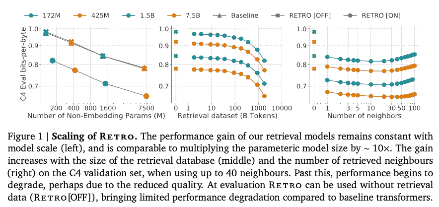
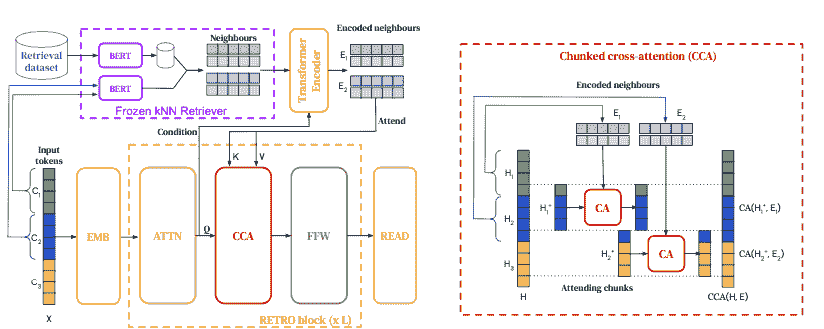

# Deepmind 的基于检索的 transformer (RETRO)是什么&它是如何工作的？

> 原文：<https://pub.towardsai.net/what-is-deepminds-retrieval-based-transformer-retro-how-does-it-work-d155752ffd86?source=collection_archive---------2----------------------->

## [人工智能](https://towardsai.net/p/category/artificial-intelligence)

## Retro 使用少 25 倍的参数获得了与 GPT-3 和侏罗纪-1 相当的性能。

由[亨特·哈里特](https://unsplash.com/@hharritt?utm_source=medium&utm_medium=referral)在 [Unsplash](https://unsplash.com?utm_source=medium&utm_medium=referral) 上拍摄的照片

大约一个月前，Deepmind 发布了一款名为 RETRO 的新变形金刚模型。它有什么特别之处？它使用少 25 倍的参数获得了与 GPT-3 和侏罗纪-1(最大和最好的最先进的语言模型之一)相当的性能。RETRO 中有许多技巧和优化使这成为可能，这些将在本文中以中到高的详细程度进行解释。

首先，我们快速讨论一下构成复古的主要成分有哪些:

1.  一只冷冻的伯特猎犬
2.  可微分编码器
3.  预测标记的分块交叉注意机制[1]

几项研究已经检验了用于语言建模的检索，并且表明大规模[1]语言模型可以使用它来提高它们的性能，因为它们可以在很大程度上记忆部分训练数据。然而，这样做的一个问题是训练和测试数据集之间的泄漏。

“数据泄漏是指**意外地在测试和训练**数据集之间共享信息。通常，当将数据集分成测试集和训练集时，目标是确保两者之间没有数据共享。

来源:[走向数据科学](https://towardsdatascience.com/data-leakage-in-machine-learning-10bdd3eec742#:~:text=Data%20leakage%20refers%20to%20a,is%20shared%20between%20the%20two.)

**什么是复古？**

我们将慢慢了解这些组件的含义。但是，为了快速带来一点上下文，变形金刚是强大的语言模型，它利用注意力[1]将过去的上下文纳入它们的训练和预测中。RETRO 包括到包含 2 万亿令牌的大型文本数据库的连接。追溯从将输入序列分割成多个部分开始，然后从数据库中抓取[1]与该部分最相似的标记，以改进对当前部分的预测。

论文中展示的一个有趣的分析是追溯时会发生什么。我们通常在语言模型中看到的是，模型越大越好。例如，GPT 3(可能是最著名的语言模型)大约有 175 个参数。但是必须有一个点，增加参数的数量并不会带来更好的性能(收益递减)。

来源: [**复古纸**](https://arxiv.org/abs/2112.04426https://arxiv.org/abs/2112.04426)

**检索增强型架构**

键值数据库由一组文本标记构成。在训练期间，密钥是在整个数据库上冻结的 BERT [1]嵌入。RETRO 然后根据预先指定的 k 最近邻值检索一组令牌。编码器-解码器架构也有助于将这些令牌集合检索到模型的预测中[1]。

来源: [**复古纸**](https://arxiv.org/abs/2112.04426https://arxiv.org/abs/2112.04426)

追溯的一个重要部分是检索和分组机制。由于数据库中的令牌数量惊人地庞大，因此必须高效地将它们检索成块。来自输入的每个 n-记号被分成预定大小的块序列[1]，并且每个块用来自数据库的一组 k 个邻居记号来扩充。然后构建似然估计函数，该函数测量 u-组块[1]的第 I 个标记仅依赖于先前看到的标记和来自先前组块的信息的概率。

## 主要复古款

复古的主要风格是编码器-解码器转换器架构[1]，它将检索到的令牌编码到一组邻居中。在我们进入下一部分之前，我们首先要解释什么是“交叉注意”。交叉注意屏蔽了一个模型中的特征，然后用于在另一个模型中突出显示提取的特征。在 transformers 中，当关注从一个嵌入生成的查询，而键和值从另一个嵌入生成时，使用交叉关注。这不同于自我关注，在自我关注中，查询、键和值是从相同的嵌入中生成的。

编码检索过程将 k 个邻居的每个块编码到双向变换器中。编码器的输出包括每个邻居的索引和通过交叉注意层的每个组块的激活[1]。所有的邻居被并行编码，并且编码器被冻结以避免在每次训练迭代中重新计算整个数据库的嵌入。

这个过程的下一部分是分块的交叉注意，我们把一个中间的激活分成块。组块包含最后一个标记的嵌入和前一组标记的嵌入。然后并行计算邻居间的注意力。

该论文的作者还声称，使用这种检索数据库系统可以非常方便地更新训练数据集，而不必重新训练模型。大型语言模型的重新训练非常昂贵，因此在这种情况下，简单地更新数据库中的标记就足够了。他们还建议在需要更新模型语言的情况下使用这种方法，以避免语言模型中常见的隐私、安全和公平问题。

## 结果

我不会深究这些结果，因为它们可以在报纸上看到，我只是简单地概述一下。该模型在几个著名的文本数据集上进行评估，包括 C4、Wikitext103、策展语料库、Lambda & the Pile [1]。

至于模型缩放，模型从 1.5 亿个参数缩放到 70 亿个参数。在该参数范围内，RETRO 优于基线变压器模型，他们观察到进一步的改进不会降低性能。

他们还对检索数据库进行了缩放实验，并发现模型的性能得到了改善。

## 结论

就我个人而言，我认为检索数据库连接是一种改进底层系统的软件工程技巧，而不是机器学习技巧，我喜欢经典软件工程概念可以用于促进机器学习模型的想法。它还允许一个新的改进领域，例如，从数据库中检索的速度，数据库的大小，存储在数据库中的数据的压缩，等等…我不认为他们会在这些细节上修修补补。

看到更小尺寸的模型表现出色也很棒，因为社区中更多的数据科学家可以运行更小尺寸的模型，对它们进行实验，给出总体反馈，甚至可能改进它们(顺便说一下，这对简历是一个很好的补充)！

**参考文献:**

**[**复古纸**](https://arxiv.org/abs/2112.04426https://arxiv.org/abs/2112.04426)**