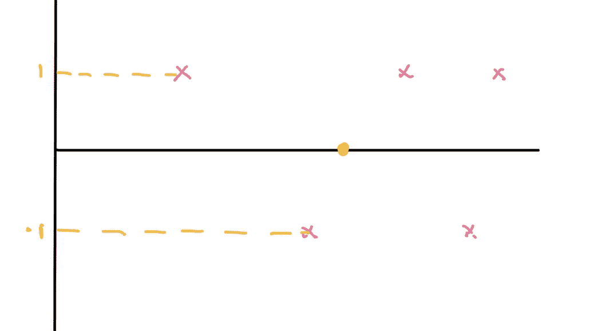

# 什么是归纳偏差？

> 原文：<https://pub.towardsai.net/what-is-inductive-bias-2d1a9dd9f11c?source=collection_archive---------0----------------------->

## 做出假设对训练模型有好处吗？

学习算法的**归纳偏差**(也称为**学习偏差**)是一组假设，学习者使用这些假设来预测它没有遇到的给定输入的输出——维基百科

在机器学习和人工智能领域，存在许多偏差，如选择偏差、过度概括偏差、采样偏差等。在这篇文章中，我们将讨论归纳偏差，没有它学习将是不可能的。在数据集中，为了获得洞察力或预测输出，我们应该知道我们在寻找什么。为了使学习成为可能，我们应该对数据本身做出一些假设，这就是所谓的归纳偏差。

我们先通过一个例子来理解归纳偏差背后的直觉。

2D 空间中训练集的分布

上图说明了属于数据集的数据点，其中红色点属于训练集，绿色点是测试点。这是基于 x 轴上显示的特征对 x 轴上的点属于类别“-1”还是类别“1”的二元分类。考虑我们的数据空间由 100 个数据点组成。

现在，为了找到绿点的标签，如果我们不知道关于这个标签的任何信息，并且不能做出任何假设，那么我们将剩下两个⁰⁰函数来生成绿点的标签。即使我们能够删除不满足我们的训练集的函数，我们仍然会留下 2⁹函数，其中一半会预测“-1”作为标签，另一半会预测“1”作为标签。如果我们假设目标函数应该是常数 1 或常数 0，那么在查看训练样本之后，我们可以说目标函数应该是常数 1。

在上面的场景中，我们观察到了两个极端，一个是没有归纳偏差，因此学习是不可能的，另一个是有很强的归纳偏差，因此我们能够用较少的训练数据得出结论。但在现实世界的场景中，我们将处于中间位置，随着更大的训练数据集，我们将有一些归纳偏差。

> 在真实世界的机器学习场景中，我们必须为特定应用的假设找到一个好的函数空间。例如，当我们获得一个用于回归或分类的数据集时，基于我们对训练数据的理解，我们应该能够选择将对给定数据进行正确建模的模型。这些假设被称为归纳偏差

举一个更实际的例子，在火车上，一个工程师、一个科学家和一个数学家去苏格兰，他们看到一只黑色的羊，工程师马上说苏格兰所有的羊都是黑色的，但是物理学家反驳说不，苏格兰有些羊是黑色的。数学家被这些对话惹恼了，他说在苏格兰至少有一只羊至少有一边是黑色的。这些人中的每一个都代表了不同水平的归纳偏差，我在第一个例子中提到过，工程师有很强的归纳偏差，而数学家没有归纳偏差，而科学家有一些归纳偏差。问题是，如果你对苏格兰的羊没有任何想法，你认为谁是对的。

> “即使在观察到物体的频繁或不断的联系之后，我们也没有理由对任何超出我们经验的物体做出任何推论。”休谟

在机器学习中，我们违反了休谟的说法，因为我们正在将我们在训练数据上观察到的模式推广到测试数据，这就是所谓的归纳偏差。所以没有归纳偏差，学习就不可能。

你们中的一些人可能已经听说过没有免费的午餐定理，它指出

> “如果所有真函数的可能性相等，那么没有任何学习算法比其他算法更好”

这意味着，如果我们对必须建模的数据没有任何假设，那么我们就无法选择最佳目标函数。