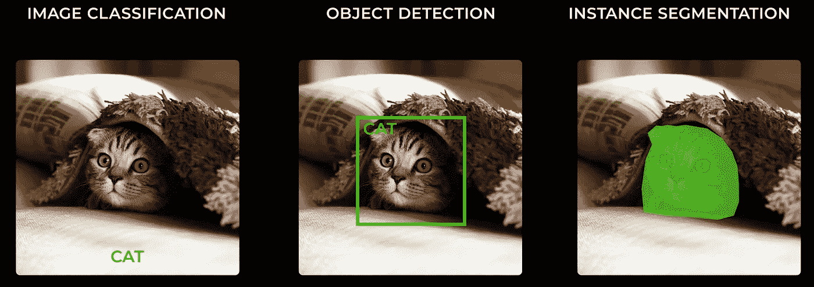
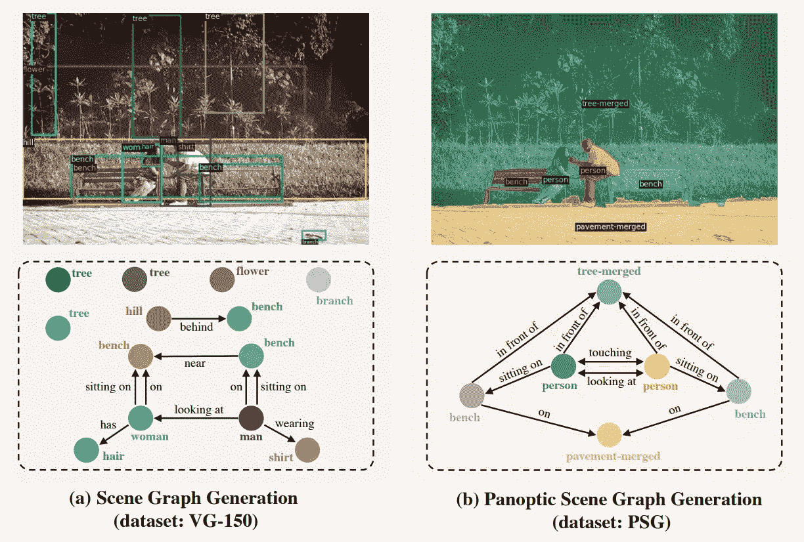
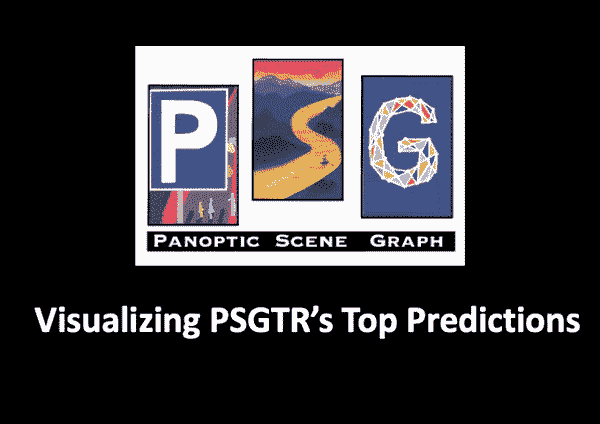
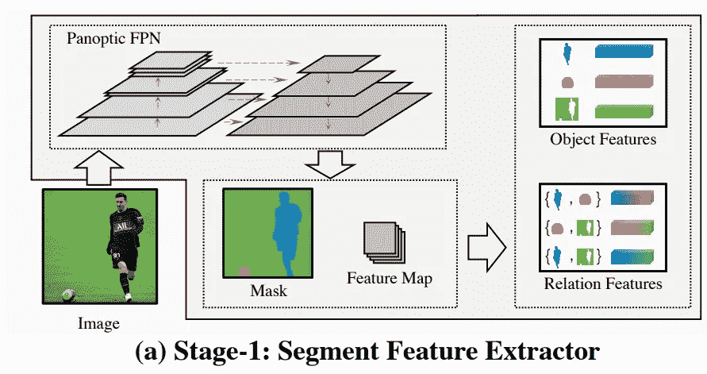

# 什么是全景场景图生成(PSG)？

> 原文：<https://pub.towardsai.net/what-is-panoptic-scene-graph-generation-psg-d266d00d7583?source=collection_archive---------2----------------------->

## PSG——人工智能的新挑战

> 最初发表于 [louisbouchard.ai](https://www.louisbouchard.ai/psg/) ，前两天在[我的博客上读到的！](https://www.louisbouchard.ai/psg/)

## 观看视频

你可以使用人工智能来识别图像中的内容，比如找出是否有猫。如果有一个，你可以使用另一个人工智能来找到它在图像中的位置。你可以非常精确地找到它。这些任务被称为图像分类、对象检测，最后是实例分割。

然后，你可以构建很酷的应用程序，从图像中提取你的猫，并将其放入一个有趣的礼品卡或 meme 中。但是如果你想要一个理解场景和图像的应用程序呢？不仅能够识别是否有物体，物体在哪里，还能识别发生了什么。你不想识别商店里是否有顾客，但你可能想识别有问题的顾客是否在偷你的东西。使用这种监控手段在道德上是否正确是你需要考虑的另一个问题。

尽管如此，假设我们专注于发现一个场景或一张特定的图片中发生了什么。在这种情况下，您需要使用一个称为场景图形生成的任务(下图，左图)，其中使用边界框来检测对象，如前面的对象检测所示，然后使用对象检测来创建一个图形，其中包含每个对象与其他每个对象的关系。它基本上会试图理解场景中所有主要物体发生了什么。它工作得很好，找出了图像的这些主要特征，但有一个大问题。它依赖于边界框的准确性，完全忽略了背景，而背景对于理解正在发生的事情或至少给出一个更真实的摘要来说往往是至关重要的。

图 1:场景图生成(a. SGG 任务)对全景场景图生成(b. PSG 任务)。(a)中的现有 SGG 任务使用基于边界框的标签，这通常是不准确的-被边界框覆盖的像素不一定属于带注释的类-并且不能完全捕捉背景信息。相比之下，在(b)中提出的 PSG 任务提供了更全面和清晰的场景图形表示，具有更准确的对象定位，并包括与背景(称为素材)的关系，即树木和路面。”图片由杨等人提供，2022: PSG。

相反，你可能想使用这个新的任务称为全景场景图形生成，或 PSG(上图，右)。PSG 是一个新的问题任务，旨在基于全景分割而不是包围盒来生成图像或场景的更全面的图形表示。更精确的东西，考虑到图像的所有像素，就像我们看到的。

这个任务的创建者不仅发明了它，他们还创建了一个数据集和一个基线模型来测试你的结果，这真的很酷。这项任务有很大的潜力，因为理解图像中发生的事情对机器来说是非常有用和复杂的，即使人类是自动完成的。它为机器带来了某种必要的智能，使 Snapchat 这样的酷而有趣的应用程序成为一种产品，你可以用它来节省时间或满足需求，比如理解你的猫何时想玩，并使用机器人自动与它玩耍，这样它就不会一直感到无聊。

全景场景图生成。杨等剪辑，2022: PSG。

理解一个场景真的很酷，但是机器怎么能做到呢？

嗯，你需要两样东西:一个数据集和一个强大的模型。我们知道我们有数据集，因为他们为我们建立了它。第二件事:如何从这个数据集中学习？或者换句话说，如何建立这个人工智能模型，它应该做什么？有多种方法可以解决这个问题，我邀请您阅读他们的论文以了解更多信息。这里有一种方法。

但首先，请给我几秒钟时间来做我自己的赞助商，并谈谈我们的社区！既然你正在读这篇文章，我知道你会喜欢它，因为它基本上是为你而写的。

当然，我们有 [YouTube 社区](https://www.youtube.com/channel/UCUzGQrN-lyyc0BWTYoJM_Sg)，你一定要加入。例如，我很想知道你是否认为这个任务对 AI 社区有意思。

我也想分享我们的不和谐社区，[一起学 AI](https://www.louisbouchard.ai/learn-ai-together/)。

这是一个与任何技能水平的人工智能爱好者联系的地方，找到学习的人，找到工作的人，问你的问题，甚至找到有趣的工作机会。我们正在组织许多非常酷的活动和问答，就像我们目前正在与 Deepmind 和 OpenAI 的 MineRL 组织者合作的活动。链接在下面的描述中，我很乐意看到你加入我们并在那里交换！

## 什么是全景场景图生成？

“在第一阶段，对于每一个东西/东西对象，全景 FPN [32]产生一个分段掩模，它具有最紧密的边界框，以裁剪出对象特征。相关对象的联合可以产生关系特征。”图片由杨等人提供，2022: PSG。

正如我们所说，模型需要找到图像每个像素的类别，这意味着它必须识别图像的每个像素。模型的第一阶段(上图)将对此负责。这将是一个名为全景 FPN 的模型，已经训练好对每个像素进行分类。这样的模型在网上已经有了，而且相当强大。它将获取一个图像，并返回我们称之为遮罩的东西，每个像素都与一个现有的对象相匹配，比如这个例子中的球、人或草。您现在有了分割，并且知道了图像中的内容和位置。如果你不熟悉这样一个模型是如何工作的，我邀请你阅读我写的一篇文章，其中讨论了类似的方法，比如[这个](/this-ai-can-colorize-your-black-white-photos-with-full-photorealistic-renders-deoldify-bf1eed5cb02a)。下一步是找出这些物体发生了什么。

图 3:使用全景 FPN 的两阶段 PSG 基线。a)在第一阶段，对于每个事物/东西对象，全景 FPN [32]用其最紧密的边界框产生一个分割掩模，以裁剪出对象特征。相关对象的并集可以产生关系特征。b)在第二阶段，提取的对象和关系特征被任何现有的 SGG 关系模型输入，以预测关系三元组图片由杨等人提供，2022: PSG。

在这里，你已经知道这是一个人在球场上踢足球，但机器实际上并不知道。它唯一知道的是有一个人、一个球和一个充满自信的领域，但它什么都不懂，也不能像我们一样轻松地将点点滴滴联系起来。我们需要第二个模型(上图，右图),训练它来获取这些物体，并找出它们为什么在同一张照片中。这是场景图生成步骤，其中模型将学习如何使用从第一阶段提取的信息将涵盖多种可能的对象关系的单词和概念的字典与场景中的对象进行匹配，学习如何用每个其他对象来构造对象。

瞧！

你最终会得到一个清晰的图表，你可以用它来构建句子和段落，涵盖你的图像中发生的事情。你现在可以在你的下一个应用程序中使用这种方法，并给你的方法一些智商分数，让它更接近智能！

如果你想了解更多关于这项新任务的信息，我强烈邀请你阅读下面链接的文章。

谢谢你一直读到最后，下周我会带着另一篇令人惊叹的论文来看你，祝贺作者被 ECCV 2022 录取，我也会参加的！

## 参考

杨，杨，杨，郭，周，张，刘，2022。全景场景图生成。 *arXiv 预印本 arXiv:2207.11247* 。
代码:[https://github.com/Jingkang50/OpenPSG](https://github.com/Jingkang50/OpenPSG)项目页面(PSG 数据集):[https://psgdataset.org/](https://psgdataset.org/)试一试:[https://replicate.com/cjwbw/openpsg](https://replicate.com/cjwbw/openpsg)，[https://huggingface.co/spaces/ECCV2022/PSG](https://huggingface.co/spaces/ECCV2022/PSG)