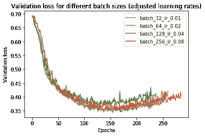
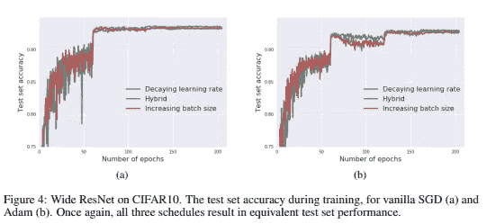
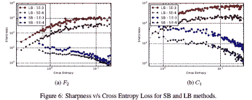
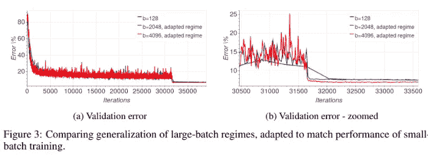
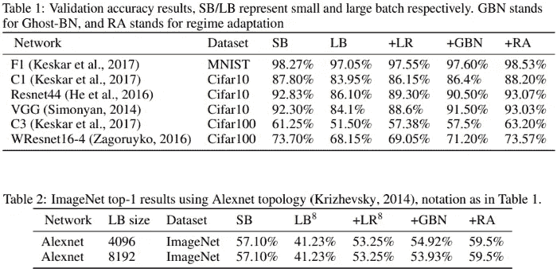

# 批量大小对模型学习有什么影响？

> 原文：<https://pub.towardsai.net/what-is-the-effect-of-batch-size-on-model-learning-196414284add?source=collection_archive---------0----------------------->

## 为什么这很重要

批量是机器学习中最重要的超参数之一。超参数指定了在更新内部模型参数之前必须处理多少样本。这可能是确保您的模型发挥最佳性能的最重要的措施之一。对于不同的批量大小如何影响 ML 工作流程的不同部分，已经进行了大量的研究，这不足为奇。当谈到批量大小和监督学习时，本文将重点介绍一些重要的研究。我们将研究批量大小如何影响性能、培训成本和泛化能力，以全面了解该过程。

# 培训绩效/损失

批量大小，对我们来说是最重要的指标，与模型损失有着有趣的关系。让我们从最简单的方法开始，检查批量大小是唯一变量的模型的性能。

*   橙色:64 码
*   蓝色:尺码 256
*   紫色:尺码 1024

这清楚地表明，增加批量会降低性能。但事情没那么简单。为了补偿增加的批量，我们需要改变学习速率。当我们尝试这样做时，会得到以下结果。

在这种情况下，所有的学习代理似乎提供完全相同的结果。事实上，增加批量似乎可以最大限度地减少验证损失。但是，请记住，这些结果非常接近，有些变化可能与样本噪声有关。因此，对此进行过多解读并不是一个明智的想法。

**结论:没有大的影响(只要相应调整学习率)。**

# 一般化

当给定新的未知数据时，模型的适应和执行能力被称为泛化。这一点至关重要，因为您的训练数据不太可能包含与您的应用程序相关的所有类型的数据分布。

这是我们注意到显著变化的领域之一。大批量和小批量训练方法之间的推广差异已经被广泛研究。根据常识，增加批量会降低学习者的概括能力。根据“深度学习的大批量训练:泛化差距和尖锐最小值”研究的作者，大批量技术往往会导致模型陷入局部最小值。较小的批次被认为更有可能推出局部最小值并发现全局最小值。如果你想进一步了解这篇论文[，请阅读这篇文章](/geekculture/why-small-batch-sizes-lead-to-greater-generalization-in-deep-learning-a00a32251a4f)。

但这并没有结束。“训练更长，推广更好:弥合神经网络大批量训练中的推广差距”研究旨在缩小批量之间的推广差距。作者提出了一个直截了当的主张:

> 根据这一前提，我们进行了测试，以证明“泛化差距”是由少量更新而不是大量更新造成的，并且可以通过改变训练制度来完全避免。

模型更新的次数称为更新次数。这是合理的。根据定义，具有两倍批处理大小的模型将以一半的更新遍历数据集。原因很简单，他们的论文很吸引人。如果我们能够在不增加更新次数的情况下消除泛化差距，我们可以在获得更好性能的同时节省资金。

作者采用了一种改变的训练计划来让大批量的学习者赶上小批量的学习者。在下表中，他们总结了他们的发现:

这无疑令人激动。如果我们能够在不显著增加费用的情况下消除或极大地减少这些方法中的泛化差距，后果将是巨大的。如果你想要这篇文章的分类，请在评论/文本中告诉我。我会把这篇论文放在我的待办事项清单上。

**结论:较大批量的弱泛化。但是，这是可以补救的。**

# 费用

大批量方法在这一点上翻转了脚本。当涉及到计算能力时，它们往往表现得更好，因为它们需要更少的更新。利用这一点作为它的优化基础之一,“Don't Decay LR…”的作者能够将他们的训练持续时间减少到 30 分钟。

但这不是影响结果的唯一因素。这是我最近才发现的。我被文章中的一个评论震惊了，“[将 TensorFlow 缩放到每秒 3 亿次预测。](https://medium.com/geekculture/learnings-from-scaling-tensorflow-to-300-million-predictions-per-second-333d9488d0c1)“作者声称，通过增加批量，他们能够将培训支出削减一半。这很有道理。在处理大数据时，这些考虑变得更加重要。

幸运的是，成本方面非常简单。

**结论:更大的批量导致更少的更新和数据移动，从而降低计算成本。**

# 裁决

正如我们所见，批量大小在模型训练过程中至关重要。因此，您经常会遇到使用不同批量训练的模型。很难马上预测出满足您需求的理想批量。然而，有一些趋势可能会帮你节省时间。如果成本紧张，LB 可能是一个不错的选择。当你关心概括和需要快速得到一些东西时，SB 可以派上用场。

请记住，本文只关注监督学习。如果你使用不同的技术(比如对比学习)，事情可能会改变。更大的批量+更多的纪元似乎对对比学习有很大帮助。机器学习是一个艰难的领域，有很多东西要学。