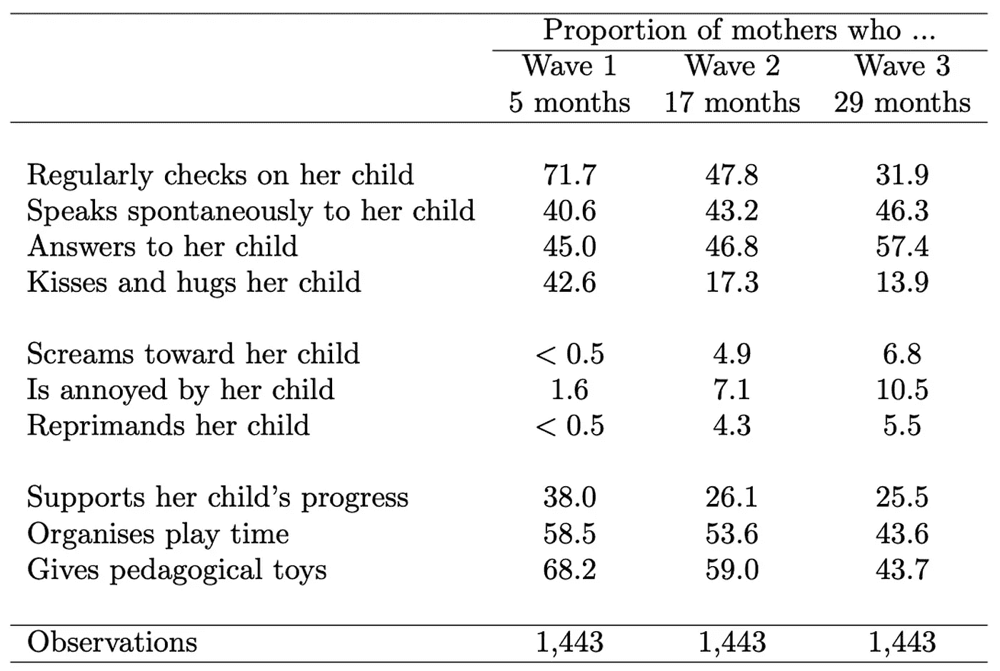
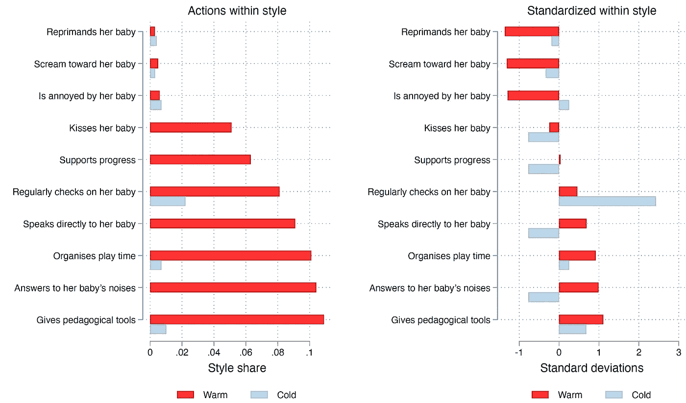
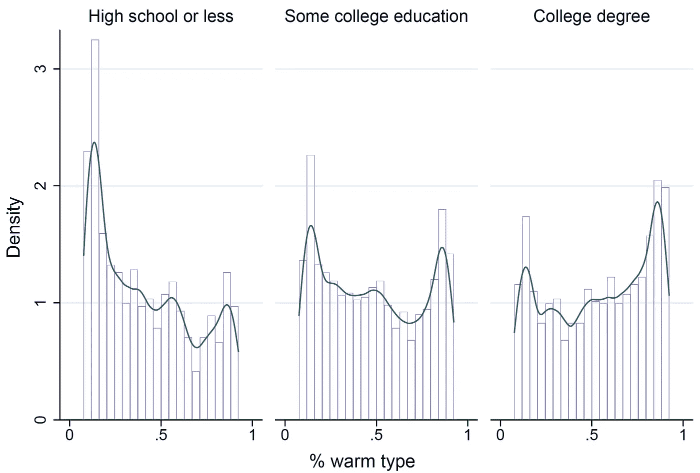
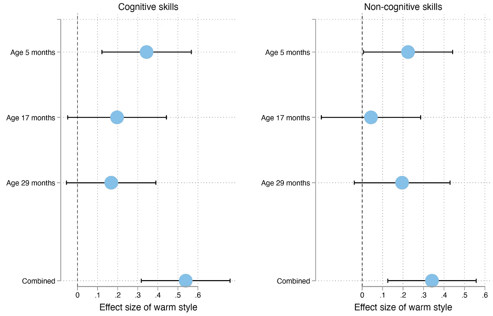
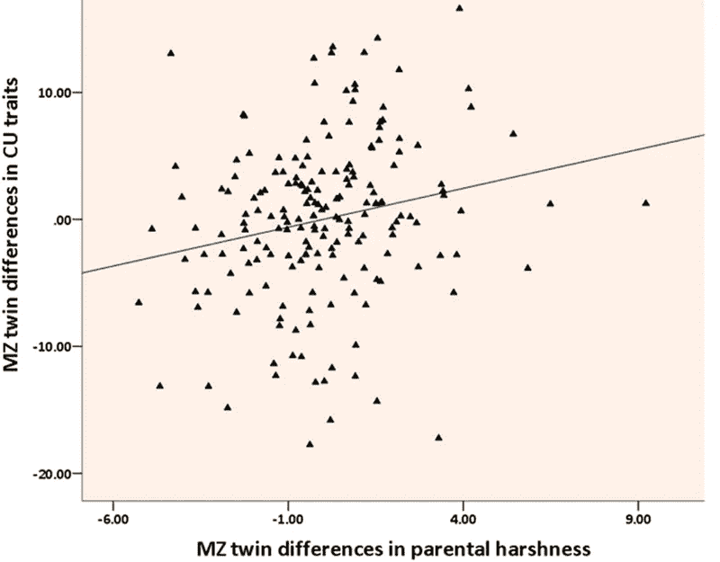

# 你是哪种父母？

> 原文：<https://pub.towardsai.net/what-kind-of-parent-are-you-8c58a7c93ca?source=collection_archive---------2----------------------->

来源:作者照片

## 一个 AI 模型能告诉你哪种育儿方式最适合你的孩子吗？

我是三个女儿的父亲，她们聪明、聪明、健康、有魅力，有独特的个性、独立的水平和缺点。

我必须承认，在现代社会，为人父母变得越来越具有挑战性和令人困惑。今天的孩子接触到来自外部世界的大量刺激和冲动，这对父母来说很难理解。

我应该灵活还是严格，我发现自己一直在想。我是应该“学敌之区”，向现代主义屈服，还是应该坚定而严厉？

我是合适的父母吗？我该如何抚养你的孩子？你每天给你的孩子读书吗？我花了多少时间和他们在一起？

父母的早期参与对孩子的发展有着巨大的影响。

然而，确定各种养育方式的影响仍然很困难，部分原因是缺乏数据，或者是因为自我报告的调查项目容易出现报告偏差。这就是 AI 现在要来帮助我们的地方。

最近，我有机会阅读并深入研究了一篇非常有趣的研究论文，作者是克里斯托夫·劳和 T2，论文名为“**如何衡量养育方式？**“在那里，他们将育儿分为两种风格，“**”**”和“**”冷，“**”使用无监督的机器学习模型应用于一组从五个月到两岁多的加拿大儿童。

他们发现**“温暖”父母的孩子在以后的生活中有更高的认知和非认知分数。**

# **养育不仅仅是耐心。**

**根据研究，父母的教养方式对孩子的技能发展和父母参与他们的生活一样重要。**

**为了探索育儿风格和儿童发展之间的联系，研究人员依靠特别的印象或先前的研究将育儿的复杂性限制在几个基本活动上。首先，养育方式是一个与激励相关的战略决策。**

**我们如何在不依赖先入为主的观念的情况下量化父母的教养方式，例如，当给孩子读书被证明对孩子的技能发展有很强的预测力时？**

**两位研究人员采用了一种数据驱动的方法来确定现有的育儿方式的类型，以及哪些是最突出的，采用了计算语言学的模型。**

**机器学习算法的第一个目标是从单词的共现中学习，并围绕它们创建主题。**

**例如，关于养育风格，假设从事一种活动的父母可能更有可能从事另一种特定活动，并且由于父母行为的共同出现，算法将学习识别两种或更多种养育风格。**

****

**表中的百分比概述了受访者在年度 QLSCD 访谈中的表现以及与孩子的互动。在面谈期间，调查员评估行为。资料来源:Rauh，C 和 L Renee (2022)，"[如何测量父母教养方式？](https://cepr.org/active/publications/discussion_papers/dp.php?dpno=17326)》，CEPR 讨论论文第 17326 期。**

# **育儿方式的数据驱动分析**

**研究人员使用了**魁北克儿童发展纵向研究** (QLSCD)，这是一个由加拿大魁北克省具有代表性的家庭样本组成的综合小组，这些家庭的孩子出生于 1997 年 10 月至 1998 年 7 月之间。在目标儿童 5 个月、17 个月和 29 个月大时，获得了母亲行为的三波数据。**

**该数据集的一个好处是，普查员捕捉的是母亲对子女的行为，而不是自我报告的调查项目。在每次面谈后，调查员记录十个变量，表明母亲是否实施了特定的行为。**

**因此，研究结果不太可能因为母亲对自己孩子行为的负面评价而产生偏差。**

**他们对妈妈们的三次采访整理出了一份清单，列出了十项活动以及妈妈们参与每项活动的比例。有两件事值得注意:**

*   **一般来说，父母更可能通过表扬孩子的努力或给他们拥抱和亲吻来鼓励他们，而不是对他们大喊大叫或被激怒。**
*   **第二，随着孩子年龄的增长，有一种明显的倾向于更具惩罚性和更少帮助的行为，尽管这种不平衡在所有三次调查中都有发生。**

****

**左栏描述了两种育儿哲学中每一种的行动份额。通过将平均值设置为 0，标准偏差设置为 1，右边的面板显示了该动作在一种样式中的标准化重要性。资料来源:Rauh，C 和 L Renee (2022)，[如何测量父母教养方式？](https://cepr.org/active/publications/discussion_papers/dp.php?dpno=17326)，《CEPR 讨论会论文集》第 17326 页。**

# **识别养育方式**

**Blei 等人在 2003 年创建了一个名为**潜在狄利克雷分配(LDA)** 的模型，用于对文本进行主题分类，该模型被用于对父母教养方式进行分类。**

**在最近的研究中，经济学家利用 LDA 来识别政治信仰和关键的 CEO 行为。在这种情况下，父母根据每次父母活动的可能性被分为两种养育方式。**

**因为系统将每种风格的百分比分配给数据集中的双亲，从双亲可能结合两种类型的意义上来说，分类不是“严格的”。**

**如上图所示，父母教养行为的分布是将父母教养分为 A 和 B 两种类型的结果。红色条柱代表养育方式 A，而蓝色条柱代表养育方式 B，两者都显示特定行为的频率。**

**左侧显示了一个主题内十个动作中每个动作的可能性。父母应该把他们的教育方式看作是一个罐子，他们从中汲取行为和决定。**

**闭上眼睛，一个按照风格 A 来实践育儿的母亲会从红色条中选择一个活动。她可能会画最宽的线；例如，她可能会给她的孩子一个教育项目或对她的婴儿的噪音作出反应。另一方面，瓮中蓝色条的适度大小可能会阻止具有 B 型养育方式的母亲画出任何动作。**

**换句话说，不作为是 B 型父母的标志。研究人员根据这些行为的分布，将父母教养方式 A 分为**【温暖】**，将父母教养方式 B 分为**【寒冷】**。**

**图中右侧的面板显示了一种养育方式下特定活动的标准化相对发生率。例如，慈爱的母亲不太倾向于责备或吼他们的孩子。如果有的话，冷漠的父母只担心他们孩子的幸福。**

****

**核心密度由实线表示，而透明条显示采用温暖而非冷漠的育儿方式的概率。每个亲本在样本中代表三次，这是一个混合样本。资料来源:Rauh，C 和 L Renee (2022)，[如何测量父母教养方式？](https://cepr.org/active/publications/discussion_papers/dp.php?dpno=17326)，《CEPR 讨论会论文集》第 17326 页。**

# **所有的父母都有相同的可能性采取温暖的育儿方式吗？**

**研究人员研究了温暖育儿与父母和家庭特征之间的关系，为这个话题提供了答案。**

**这篇研究文章展示了基于母亲教育的育儿方法是如何分布的。只有高中文凭或更低学历的母亲更有可能采取冷漠的育儿方式。**

**图表左边的质量是一个线索。对于拥有大学学位的妈妈来说，情况正好相反，这可以在右边的面板中看到。**

**对于受过高等教育的母亲来说，这种分布向右转移，她们更有可能选择温暖的育儿方式，根据研究，有更多孩子和年轻女性的父母更有可能采取冷漠的育儿方式。**

**这项研究还表明，父母的养育方式会发生变化。虽然有一些坚持——温暖风格的母亲更有可能坚持下去，凉爽风格的母亲更有可能坚持下去——但随着孩子年龄的增长，也有系统的变化。**

**育儿实践通常会变得更加严厉。另一个显著的变化是，在孩子 29 个月大的时候，从统计数据来看，男孩更有可能经历冷漠的育儿方式，但在 5 个月大的时候，女孩和男孩的育儿方式没有区别。**

****

**当一个孩子六岁时，测试认知和非认知能力的六个测试的第一个因素被采用。分数以平均值 0 和标准偏差 1 标准化。窄线表示 90%的置信区间。资料来源:Rauh，C 和 L Renee (2022)，"[如何测量父母教养方式？](https://cepr.org/active/publications/discussion_papers/dp.php?dpno=17326)》，CEPR 讨论论文第 17326 期。**

# **父母的教养方式会影响孩子获得技能的方式吗？**

**由于缺乏外源性变异，这项研究无法明确地解决这个问题，但我们可以检查接触到特定育儿哲学的青少年是否随着年龄的增长具有更高的技能水平。**

**该研究对 6 岁时的认知测试结果(如数学或逻辑)和非认知测试结果(如行为障碍或多动)的总结措施进行了仔细检查。**

**我们可以在图中看到如何在每个年龄分别测量父母教养方式之间的联系(上图),以及三年来产生的方式的综合测量，以显示温暖的父母教养对 6 岁时标准化技能评估的影响。(底部)。**

**根据研究结果，我们可以得出这样的结论:在五个月大时经历完全温暖的父母教养方式的儿童，与经历完全冷漠的父母教养方式的儿童相比，认知技能高出 0.3 个标准差以上，非认知技能高出 0.2 个标准差以上。**

**尽管在孩子六岁的时候，父母的教养方式与结果的差距最大，但是在孩子五个月大的时候，这种影响比在 17 岁和 29 个月大的时候更大。这证明了对幼儿的投资尤其重要的观点。**

**此外，总体来说，养育方式和结果之间的关联甚至更强。例如，温暖的养育与三分之一标准差的非认知技能收益和超过一半标准差的认知技能收益相关。**

****

**根据父母的严厉程度，双胞胎之间的攻击性和 CU 特征有所不同，父母虐待程度更高的双胞胎具有更高的攻击性和更多的 CU 特征。父母温暖的双胞胎表现出较低的 CU 特征，表明父母温暖的差异如何与 CU 特征的差异特别相关。在低收入家庭中，父母严厉程度的差异和儿童攻击性的差异之间的关联更大，但这些影响不会因儿童的性别、年龄或家庭收入而减少。。来源:养育是冷酷无情的性格和攻击性的环境预测因素:一项单卵双胞胎差异研究— [链接](https://pubmed.ncbi.nlm.nih.gov/30522741/)**

# **关于为人父母的冷漠的两个词**

**肤浅的感觉，缺乏同理心，和无罪感。经历过父母冷漠或严厉对待的孩子有可能患上这种疾病。**

**2018 年，宾夕法尼亚大学、密歇根大学和密歇根州立大学的研究人员对 227 对同卵双胞胎进行了一项研究，发现父母在与每个孩子的关系中的行为略有变化，这可能与反社会倾向的出现有关。**

**鉴于不能完全排除遗传因素，因此不存在父母责任，但作者相信，有了这些数据，就有可能向家庭建议更好的教育课程。**

**宾夕法尼亚大学心理学家**丽贝卡·沃勒**的这项研究名为“**养育是冷酷无情的性格和攻击性的环境预测因素:单卵双胞胎差异研究**”，发表在美国儿童和青少年精神病学学会期刊**上，是一系列心理和社会研究中的最新研究，旨在确定成年人的行为在多大程度上受其教养的影响，以及在多大程度上是由于遗传倾向。****

**过去，人们认为无法感受同理心、强烈情绪或内疚等特征——用专业术语来说，这些品质被称为冷酷无情的特征——有生物学基础，并且独立于发展过程中经历的刺激而形成。**

**然而，进一步的研究驳斥了这种说法，导致许多专业人士现在认为，养育子女——以及整个环境背景——有助于发展一个人的性格。**

**尤其是沃勒，他之前已经探索了将冷酷无情的性格发展与养育联系起来的各个方面，首先在父母和亲生子女之间建立了研究。(因此具有遗传联系)，然后是父母和收养子女之间(没有遗传联系)。**

**即使在那时，已经出现了儿童某些态度的责任不能完全取决于遗传，即使这不能被完全排除。**

**沃勒和来自密歇根大学和密歇根州立大学的同事决定观察拥有同卵双胞胎的家庭，以便更好地了解父母对未来反社会行为的影响，因为从相同的 DNA 出发，父母的差异会很明显。**

**来自 227 个家庭的 454 名 6 到 11 岁的孩子参与了这项研究，他们有一对同卵双胞胎。**

**父母被要求完成一份调查问卷(有 50 个项目)，以评估他们家庭的氛围，并评估他们对每个孩子的热情或严格程度。**

**根据父母的反应，孩子的任何反社会行为也被检查。作者声称，在分析了所有数据后，他们确信父母的养育——而不仅仅是基因——导致了无感情无情的危险区域的形成。**

**这些发现证明了父母育儿实践中哪怕是最小的变化都很重要。有证据表明，基因起着重要的作用，影响着父母和孩子的态度(例如，一个充满爱心和同理心的父母可以通过与孩子的冷漠相冲突来抑制他的热情)。**

**这是另一个例子，说明数据驱动的研究如何使专家修改以前有效的育儿计划，以包括针对老茧——非情感品质——的特定疗法。**

****

# **结论**

**鉴于数据的可用性越来越大，使用人工智能和机器学习来改善我们对现代世界中“有效”的育儿类型的理解，有越来越多的价值。**

**除了研究结果之外，任何父母的目标都应该是为他们的孩子提供一个牢固的纽带，并帮助我们的孩子形成一个安全的依恋，让他们的父母成为一个安全的基础，让孩子可以自信和安全地探索世界，并欢迎孩子回家。**

**我相信一个平衡的育儿方法应该让我们的孩子与我们有一个强大的纽带，信任、同情、权威、保护和自我价值与更健康的发展携手并进。**

**此外，令人震惊的是，现在我们可以使用多少工具来教会我们与孩子互动的新技能，并每天给我们几次从错误中学习的机会。**

**我们可以挑战传统智慧，通过采用数据驱动的方法找到成功育儿的新模式。**

**我父母没有那样的东西！**

# **你可能想读的其他文章。**

*   **今年，这 9 篇研究论文正在改变我对人工智能的看法。**
*   **我们正在见证人工智能的下一次进化吗？**
*   **[通过数字技术展望我们孩子的未来](https://medium.com/swlh/envisioning-our-childrens-future-through-the-digital-technology-5a121bde070f)**
*   **[机器人介绍(给模拟父母和数字孩子)](https://medium.com/illumination-book-chapters/introduction-to-a-i-robotics-and-coding-for-parents-dc893b8fdf84)**
*   **[你学习 AI、机器学习、数据科学最印象深刻的 Youtube 频道](https://medium.com/p/486c1b41b92a)。**
*   **[这些是最好的 Youtube 频道，你可以在那里免费学习 PowerBI 和数据分析](https://medium.com/p/8f8eb434b48d)。**
*   **[人工智能能否成为数学家发现的新助推器？](https://medium.com/tech-cult-heartbeat/can-artificial-intelligence-be-a-new-booster-for-mathematicians-discoveries-7369a8c43a36)**
*   **[5 家利用人工智能革新招聘的公司](https://medium.com/p/9a70986c7a7e)。**
*   **[你必读的 5 本关于 AI 的惊艳书籍](https://medium.com/p/4db9646e0807)。**

# **链接、资源和参考资料**

*   **[幼儿发展政策:证据和研究议程](https://voxeu.org/article/early-years-child-well-being-and-role-public-policy)**
*   **丽贝卡·沃勒**
*   **[养育是冷酷无情的性格和攻击性的环境预测因素:一项单卵双胞胎差异研究](https://www.sciencedirect.com/science/article/abs/pii/S0890856718318677#!)**
*   **[CEO 行为与企业绩效](https://sekhansen.github.io/pdf_files/jpe_2020.pdf)。**
*   **[潜在狄利克雷分配](https://www.jmlr.org/papers/volume3/blei03a/blei03a.pdf)。**
*   **[Erla Sif sveinsdóttir—skem man . is](https://skemman.is/bitstream/1946/26004/2/MAritger%C3%B0_ErlaSifSveinsdo%CC%81ttir.pdf)。**
*   **家庭选择和儿童发展。**
*   **[魁北克儿童发展纵向研究基金会](https://fondationchagnon.org/en/supported-initiatives/resources/eldeq/)。**
*   **[公民的两极分化有多严重？从头开始衡量意识形态](https://papers.ssrn.com/sol3/papers.cfm?abstract_id=3154431)**
*   **[虎妈和直升机父母:育儿方式的经济学](https://voxeu.org/article/economics-parenting)**
*   **儿童时间的分配如何影响认知和非认知发展。**
*   **[*《父母陷阱:如何停止让父母超载，修复我们的不平等危机*](https://mitpress.mit.edu/books/parent-trap) 》，麻省理工出版社。**
*   **[给孩子读书:人生的一个开端](https://voxeu.org/article/reading-children-head-start-life)，Kalb，G 和 J van Ours (2013)。**
*   **[关于社会流动性和教育作用的十三个经济事实](https://www.brookings.edu/research/thirteen-economic-facts-about-social-mobility-and-the-role-of-education/)。**
*   **[家庭背景下的社会化:亲子互动](https://www.scienceopen.com/document?vid=480aba1c-b694-4d5c-b00c-63bb6766b138)，麦科比、E 和 J·马丁(1983 年)**
*   **[如何测量父母教养方式](https://cepr.org/active/publications/discussion_papers/dp.php?dpno=17326)？-劳赫，C 和 L 雷尼(2022)。**