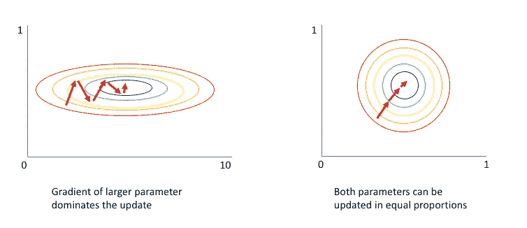
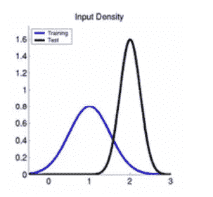
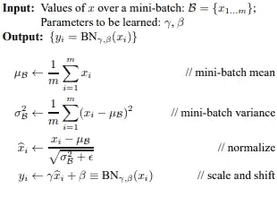
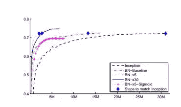

# 为什么批量标准化很重要？

> 原文：<https://pub.towardsai.net/why-batch-normalization-matters-4a6d753ba309?source=collection_archive---------1----------------------->

## 理解批处理规范化的工作原理及其直观的优雅。

批处理规范化(BN)从一开始就已经成为最先进的权利。它使我们能够选择更高的学习速率，甚至对深度神经网络使用 sigmoid 激活函数。它通过抵消内部协变量偏移来解决梯度消失和梯度爆炸问题。

让我们一个一个地看一下这些术语，并理解为什么 BN 很重要？

# 1.正常化

在输入到机器学习或深度学习模型之前，对数字特征进行归一化，以便数据可以变得与规模无关。

x _ new =(x _ old-x _ min)/(x _ max-x _ min)

在神经网络的情况下，一般来说，它们加快了优化过程，从而加快了训练。关于为什么在训练神经网络之前需要标准化的更多细节，点击[这里](https://towardsdatascience.com/why-data-should-be-normalized-before-training-a-neural-network-c626b7f66c7d)。

来源:https://www.jeremyjordan.me/batch-normalization/

# 2.内部协变量移位

关于神经网络的快速复习——在训练神经网络时，数据点被输入到训练网络中。然后计算期望值和网络输出值之间的误差。然后使用各种技术进行优化，如 SGD、AdaDelta、AdaBoost、Adam 等。

在神经网络的情况下，它们是使用输入网络的成批数据来优化的。如果训练和测试数据有不同的来源，如果它们会有不同的分布。这些输入批次可以具有不同的分布，即，与样本(即，考虑的整个数据集)的均值和方差略有不同的均值和方差。

神经网络各层的权重在训练时更新。这意味着激活函数在整个训练过程中会发生变化，然后这些权重被送入下一层。现在，当下一批(或一组输入)的输入分布不同时，神经网络被迫根据变化的输入批进行改变和适应。因此，当参数值随着新的输入批次不断变化时，训练神经网络变得更加复杂。这种变化的参数值通过要求较低的学习速率和更仔细的优化而减慢了训练过程。我们将 [*内部协变量移位*](https://arxiv.org/pdf/1502.03167.pdf) 定义为由于训练期间网络参数的变化而导致的网络激活分布的变化。更多[细节](https://arxiv.org/pdf/1502.03167.pdf)参考原文。

来源:[http://iwann . ugr . es/2011/pdf/invited talk-FHerrera-iwann 11 . pdf](http://iwann.ugr.es/2011/pdf/InvitedTalk-FHerrera-IWANN11.pdf)

批处理规范化是内部协变量移位的解决方案，使优化不太关心初始化。

# 3.解决内部协变量转移

众所周知，如果损失函数经过[白化](http://yann.lecun.com/exdb/publis/pdf/lecun-98b.pdf)——即线性变换，均值和单位方差为零，并且去相关，则损失函数会更快收敛。这种增白过程可以在训练的每一步或固定的时间间隔进行。如果输入数据批次已经被白化(在每个训练步骤或一些间隔)，这将是解决内部协变量偏移的一个步骤。但问题是这样的。

*摘自原* [*论文*](https://arxiv.org/pdf/1502.03167.pdf) *:*

> 我们可以考虑在每个训练步骤或某个时间间隔白化激活，或者通过直接修改网络，或者通过改变优化算法的参数，以取决于网络激活值(Wiesler 等人，2014；赖科等人，2012 年；Povey 等人，2014 年；Desjardins & Kavukcuoglu)。然而，如果这些修改与优化步骤穿插在一起，则梯度下降步骤可能试图以需要更新归一化的方式来更新参数，这降低了梯度步骤的效果。例如，考虑一个输入为 u 的图层，该图层添加了学习偏差 b，并通过减去在训练数据上计算的激活的平均值来归一化结果:XB = x E[x]其中 x = u + b，X = {x1…N }是在训练集上的 x 的值的集合，E[x]=(1/N)*sum(x)针对整个训练数据 x。如果梯度下降步骤忽略 e[x]对 b 的依赖性，则它将更新 b ← b + ∆b，其中那么 u+(b+∏b)-E[u+(b+∏b)]= u+b E[u+b]。因此，对 b 的更新和随后的归一化变化的组合不会导致层的输出发生变化，因此也不会导致损失。随着训练的继续，b 将无限增长，而损失保持不变。如果标准化不仅集中而且缩放激活，这个问题会变得更糟。我们已经在初始实验中根据经验观察到这一点，其中当在梯度下降步骤之外计算归一化参数时，模型爆炸。

为了解决这种方法的问题，我们确保对于任何参数值，网络产生具有期望分布的激活，因为它将允许损失函数的梯度考虑归一化。此外，可以看出，每层的白化会使训练更加复杂。

因此，我们做了两个假设来简化优化过程。1.我们没有将输入要素和输出一起白化，而是分别使用平均值 0 和方差 1 对要素进行归一化。对数据集中存在的所有 d 维分别进行这种归一化。

第一个是，不是联合白化层输入和输出中的激活，我们将通过使每个标量特征具有 0 的均值和 1 的方差来独立地归一化每个标量特征。对于具有 d 维输入的层，x = (x (1)。。。x(d))，我们将独立地归一化每个维度。2.对于随机梯度训练中的所有小批量，对平均值和方差值进行估计。

因为我们在随机梯度训练中使用小批量，每个小批量产生每个激活的均值和方差的估计。这样，用于归一化的统计量可以完全参与梯度反向传播。

但是简单地标准化图层会改变图层所代表的内容。为了解决这个问题，我们确保网络中插入的转换可以表示身份转换。为此，我们引入了两个参数γ (k)，β(k)，这两个参数可以对每个激活 x (k)的数据集进行缩放和归一化。现在，最好的部分是这些参数可以在训练过程中与原始模型参数一起学习。

# 4.批量标准化

让我们考虑一个规模为 m 的小批量 B。由于我们的简化，我们独立地标准化激活。所以，为了清楚起见，我们取一个激活 x(k ),去掉 k。小批量中有 m 个值。

设归一化值为 xb(从 1 到 m)，其线性变换为 y(从 1 到 m)。这个缩放的 y 被缩放并移动到下一层。

现在让我们看看整个批处理规范化算法。在算法中，*ε*是添加到小批量方差的常数，用于数值稳定性。

批处理规范化不会单独处理每个训练示例。实际上，BNγ，β(x)既取决于训练样本，也取决于数据集中的其他样本。

# 5.为什么批量标准化很重要？

批处理规范化会正则化模型。批量标准化还能够实现更高的学习速率，从而更快地收敛损失函数。在某种程度上，它不同于下降，下降会减少过度拟合。但是对于批量标准化图层，没有必要丢弃。此外，批处理规范化消除了 L2 正则化的需要。

[批量标准化的性能比较](https://arxiv.org/pdf/1502.03167.pdf)

# 6.结论

这篇博客解释了批量标准化的机制，以及它如何处理内部协变移位。它也给人一种直觉，说明增白过程是如何简单地不起作用，以及使其起作用所需的操作。

# 7.参考

1.  【https://arxiv.org/pdf/1502.03167.pdf 
2.  [https://www.jeremyjordan.me/batch-normalization/](https://www.jeremyjordan.me/batch-normalization/)
3.  [https://ml explained . com/2018/01/10/an-intuitive-explain-why-batch-normalization-really-works-normalization-in-deep-learning-part-1/](https://mlexplained.com/2018/01/10/an-intuitive-explanation-of-why-batch-normalization-really-works-normalization-in-deep-learning-part-1/)
4.  [https://krat zert . github . io/2016/02/12/understanding-the gradient-flow-through-the-batch-normalization-layer . html](https://kratzert.github.io/2016/02/12/understanding-the-gradient-flow-through-the-batch-normalization-layer.html)
5.  https://towardsdatascience . com/trainings-of-batch-norm-in-tensor flow-and-sanity-checks-for-training-networks-e86c 207548 c8

https://www.linkedin.com/in/aman-s-32494b80/