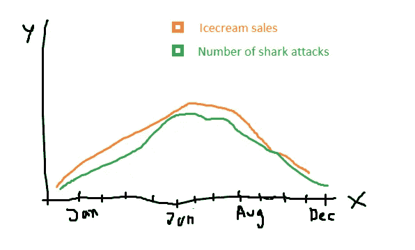

# 客户为什么会离开？

> 原文：<https://pub.towardsai.net/why-do-customers-leave-dc2e68932daa?source=collection_archive---------6----------------------->

[Icons8 团队](https://unsplash.com/@icons8?utm_source=medium&utm_medium=referral)在 [Unsplash](https://unsplash.com?utm_source=medium&utm_medium=referral) 上的照片

## 预测分析

## 客户流失的数据科学:寻找因果关系，而不是相关性

C 顾客离开；他们因为各种各样的原因离开。预测谁将离开是很困难的。更难预测 ***他们为什么*** 离开。

流失预测一直是数据科学社区中一个有趣的研究问题。对于企业来说，预测客户流失不是一件小事；留住现有客户比获得新客户更划算。

考虑到**客户终身价值(CLV)** ，投资留住客户是明智之举，不亚于吸引新客户所需。

但是预测客户流失到底需要什么呢？

在数据科学中，这种情况经常发生——手边有一把锤子，所有东西看起来都像钉子。我们很快就失去了大局。

数据科学家经常被客户数据集和算法所困扰(*锤子！).以至于他们对推动客户决策的真正因素视而不见。他们不问问题。取而代之的是，将一个数据集接收到机器中，然后等待奇迹般的准确性指标出现。有句话这么说——**垃圾进垃圾出！***

放下锤子，我们可以问一个简单的问题——顾客为什么离开？是因为市场上有更好的产品吗？或者他们离开是因为他们找到了更好的价格？或者是糟糕的客户服务？可能是全部，也可能是一个都没有。直到我们提出正确的问题并找到答案，我们才会知道。

那么，顾客为什么会离开呢？

所有的企业都了解他们的顾客，通常比顾客满意的还要多。他们以各种可能的方式对客户进行细分。

但客户数据只讲述了故事的一半。另一半来自业务本身。价格是否过高？客服很可怕吗？还是竞争对手提供了更好的套餐？这些都是预测客户离开可能性的相关问题。

我不是说不可能根据客户的年龄、收入、性别、在公司的任期等来预测客户流失。素食者比素食者更有可能取消有线电视服务吗？

也许吧！但这不是他们离开的原因。**关联！=因果关系。****冰淇淋的销售在夏季达到高峰，这也是鲨鱼袭击的高峰期。但是冰淇淋销售不会引起鲨鱼攻击。**

****

**相关性并不意味着因果关系(插图:作者)**

**特定年龄的客户可能与更高的流失概率相关。但是他们的年龄并不是客户流失的决定性因素。**或者也许是吧！**找出这种真实的关系是超越相关性和思考因果关系的全部意义。**

****那么，数据科学的教训是什么？**每位顾客都是独一无二的，他们对产品或服务的体验也是如此。数据科学家希望数据驱动的决策，但并不是所有的心理、行为现象都只能通过客户数据来解释或理解。**

**有时所需要的只是把锤子丢在身后，问正确的问题来寻找真相！**