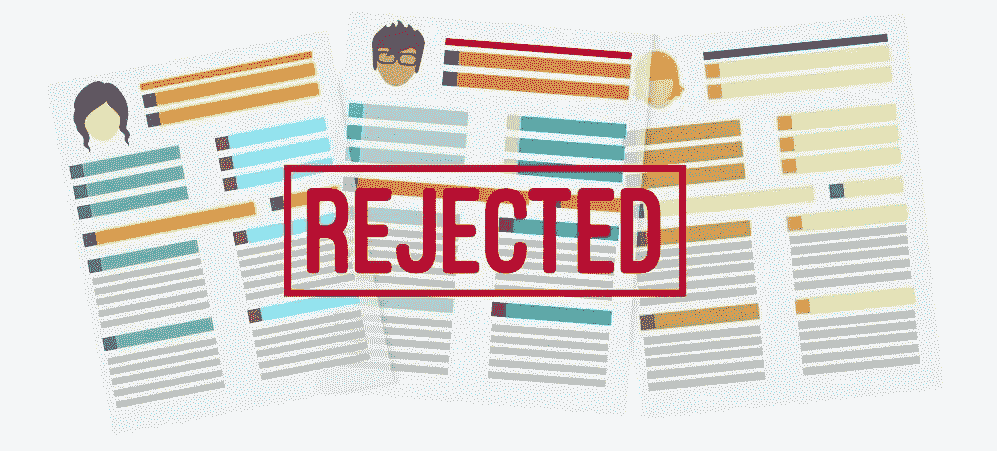

# 为什么你的数据科学简历没有给你带来面试机会？

> 原文：<https://pub.towardsai.net/why-is-your-data-science-resume-not-getting-you-interviews-4df281865061?source=collection_archive---------0----------------------->

## 在筛选了成千上万份简历后，这里有几件事非常重要

数据科学招聘现在非常疯狂。如此多的公司和组织想要雇用数据科学家，如此多的人进入就业市场声称拥有数据科学技能。

我知道这听起来像是高需求和高供应，但让它变得混乱的是，公司往往不太清楚他们到底需要一名数据科学家，即使他们知道，他们也不太确定如何验证候选人是否具备这些技能。

候选人向自己展示证书、文凭和学位，这些证书、文凭和学位来自一系列令人眼花缭乱的教育机构，从常春藤联盟机构到家庭式辅导机构。他们还声称自己能够胜任许多编程语言，尽管他们在做出这些声明时经常会延伸“胜任”的定义。

在筛选了数千份数据科学简历后，我可以告诉你，如果你正在寻找一个新的数据科学职位，你可以做一些事情来让自己的生活变得更轻松。做这些事情会帮助你避免面试那些你永远得不到工作机会的职位，也会帮助你在那些你有资格的职位上展示你的技能。

## 1.不要声称精通两种以上的语言，因为很可能事实并非如此

真正精通一门编程语言需要时间和投资。对一门语言完全自信需要几年时间。培养对第二语言的信心会增加更多的时间和投入。能够流利地在两种语言之间转换也需要努力。

因此，当我收到简历时，人们只是列出五种或十种不同的语言，没有区分他们的技能水平，我会认为他们对所有语言都知之甚少。

十有八九，你的潜在雇主希望你精通一门语言——无论是一门特定的语言还是任何相关的语言——所以要诚实地说出你对哪门语言最熟悉、最流利。试着列出不超过两种你认为自己“精通”的语言。然后，如果你想列出其他人，这很好，但他们的标签不同，以便审查者可以告诉你，你并没有声称自己擅长一切。

## 2.链接到你的代码例子来证明你的技能

目前数据科学招聘中最大的差距之一是人们说他们能做的和他们实际能做的之间的差异。评论家和面试官会很快对人们的说法冷嘲热讽，因为他们浪费了大量的时间去面试那些说法与现实不符的人。

有一种方法可以克服这一点，那就是实际提供你的作品的例子，比如分享你已经开发的应用程序的链接，或者在 Github 上保存你已经编写的可以公开分享的代码。这可以让评估者看到你迄今为止所做的工作是否符合该职位的入门级要求或期望，并大大有助于让他们确信你的技能符合你的要求。

这当然意味着你需要定期照料你的数据科学花园。把你的代码放到 Github 上，保持干净、整洁、注释良好，并创建易于导航和理解的 repos。这将是你在以后的数据科学生活中需要掌握的一项重要技能，所以现在就做这项投资是很好的。

## 3.参与公共/开源编码工作，建立一个投资组合

如果你做的所有工作都是专有的，如果你不得不在求职申请中向他人展示你的工作，这就给你带来了一个问题。参与一些开源工作，比如帮助开发 Python 或 R 包，或者编写和发布你自己的学习或分析项目，将有助于你建立自己的可共享工作组合。

这样做也是一个好主意，因为数据科学社区喜欢开源活动和工作共享。你的一些面试官看到你参与其中会很兴奋，这将为你赢得额外的荣誉，这可能有助于他们在你和另一个候选人之间做出决定。这是一个很好的习惯，即使在你被雇佣后也要保持，因为参与社区是学习新技能和跟上发展的最好方式。

所以如果你想知道为什么你的简历没有被选中，很有可能是因为你没有做这些事情。我强烈建议你开始遵循这些建议，因为它们会帮助你自助。祝你好运——外面太疯狂了！