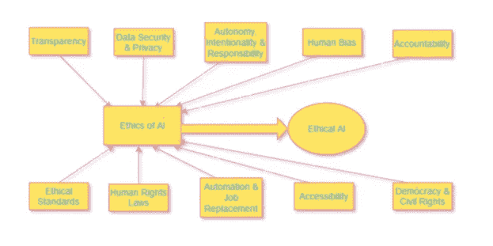
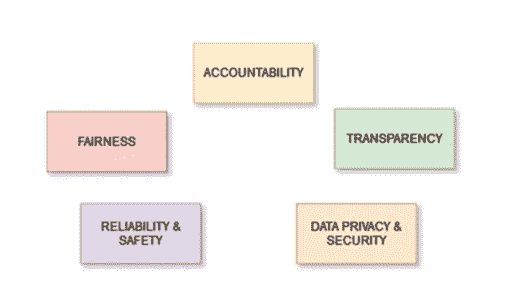
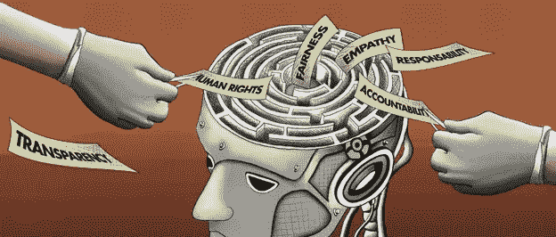
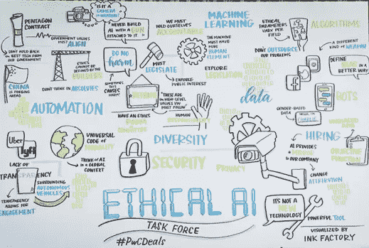
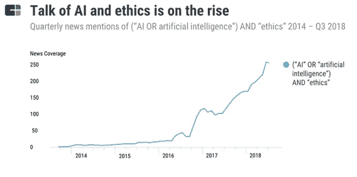

# 伦理 AI 头像为什么会诞生？

> 原文：<https://pub.towardsai.net/why-was-ethical-ai-avatar-born-699d6cc67072?source=collection_archive---------4----------------------->

## [人工智能](https://towardsai.net/p/category/artificial-intelligence)

人工智能伦理:构建伦理人工智能的框架

人工智能(AI)被科技界的许多人视为一场变革浪潮。

但这肯定会带来一系列挑战和问题。

事实上，这让我们提出了这样的问题——

未来 AI 会开车带我们到处跑吗？

或者

AI 会为我们打仗吗？

或者

人工智能会负责人类医疗保健吗？

或者

AI 会为我们做农业吗？

还有很多。

这些问题几乎是无限的，永无止境的，并说服人们将他们的想法从人工智能系统的功能能力转移到这些强大系统背后的安全和道德。这里的主要挑战是建立一个具有人类共同利益和伦理考虑的系统。

这里要理解的最基本的事情是——我们希望这些系统最终实现什么，并相应地进行设计。

道德人工智能框架组件

**人工智能发展的三大关注点在于:**

**1。** **隐私和监视，**

**2。** **偏见和歧视，**

**3。** **正确的判断和责任**

为了解决所有这些问题，**伦理人工智能化身**诞生了。

## **什么是伦理 AI？**

**“道德人工智能”意味着以透明、负责任的方式采用人工智能，这意味着它应该与法律、法规、规范、客户期望和社会价值观保持一致。伦理人工智能应该能够防范任何偏见和歧视，不正确的判断，并在一定程度上尊重隐私。**

****

**来源—[https://revisitaidees . cat/en/thinking-about-ethics-in-the-ethics-of-the-ethics-of-ai/](https://revistaidees.cat/en/thinking-about-ethics-in-the-ethics-of-ai/)**

**让我描述几个人工智能的用例，这将使你理解潜在的严重的伦理问题。**

## **伦理人工智能的例子:医疗保健**

**在医疗保健领域，从业者是人工智能的早期采用者，但其患者参与、护理提供和人口健康容易出现偏见和侵犯数据隐私等问题。**

**社会中的偏见反映在历史健康数据中，如果不加以纠正，可能会导致人工智能系统做出有偏见的决定。例如，根据所报告的研究人群的种族构成和性别划分，谁可以优先获得医疗保健管理服务会带来弊端，并且是歧视的原因。**

**人工智能的伦理考量是如何形成的，以解决上述医疗保健问题？**

**FDA 正在制定额外的法规合规性以减少偏差，并严格要求公司监控并定期报告其算法的真实性能。公司不断被引导确保他们在客户和合作伙伴、数据团队的组成以及收集的数据方面做出选择，以帮助最大限度地减少偏差。**

**谷歌健康的一个例子是致力于乳腺癌的事先筛查和检测，它不仅虔诚地提高了性能，同时将成本降低了 10 倍，并验证了算法在不同临床环境中的性能，而且还进行了大量投资，以确保算法在不同种族群体中公平地执行。**

## **伦理人工智能的例子:自动驾驶汽车**

**想象一下，一辆刹车失灵的自动驾驶汽车全速驶向一位 80 多岁的老人和一个 10 岁的孩子。稍微偏离一点，一个人就能得救。这一次，汽车的算法必须做出决定，而不是人类司机。**

**谁会被选中，老人还是孩子？**

**这个问题没有正确的答案，纯粹是一个伦理困境，这表明了伦理人工智能的重要性。**

****伦理人工智能应该如何解决上述自动驾驶汽车问题？****

**该算法应该高效地做出受控决定，以避免撞到街头行人/行人，并降低车内人员的风险。因此，责任和控制变得非常重要。现有的机构，如监督车辆安全的国家公路运输安全协会，在这种道德的人工智能业务中发挥着广泛的作用。**

## **伦理人工智能的例子:法院**

**司法系统中的人工智能被认为可以比法官更好、更快、更有效地评估案件和运用司法。它可以提供帮助，因为机器可以比人类更好地评估和权衡相关因素，利用其速度和大数据摄取能力。但是，所做的决定是否没有任何偏见和主观性，这是一个很大的伦理问题。**

**有许多道德挑战:**

**1.AI 工具和算法缺乏透明度。**

**2.人工智能不是中立的，决策容易受到不准确、歧视和基于初始水平的人类数据的偏见的影响。**

****伦理人工智能应该如何解决上述法庭问题？****

**需要有一种“紧迫感”来促使立法者采取行动。**

**美国立法者最近推出了算法问责法案，如果完全执行，可以解决已知的问题，如算法偏见以及隐私和安全问题。**

**虽然道德人工智能发挥着重要作用，但环境在所有层面也很重要，包括战术层面。例如，在工业制造应用中，道德人工智能侧重于安全和可靠性，而在面向消费者的行业或公共服务中，无差别和公平优先。**

****

**来源-纽约州纽约市-11 月 01 日:2018 年 11 月 1 日在纽约市举行的 2018 年纽约时报交易会期间，一张关于道德人工智能的海报。(图片由迈克尔·科恩/纽约时报盖蒂图片社提供)**

**当前人工智能技术的另一个担忧是敌对例子的威胁。对抗性的例子通过对人工智能系统的输入数据进行人类几乎看不见的微小改变来操纵它们的行为。出现这种情况主要是因为人工智能算法的工作方式与人脑有着根本的不同。**

**对抗性的例子可能是偶然发生的，或者它们也可能被故意注入到针对关键人工智能系统的有害对抗性攻击中，从而导致安全威胁。**

**欧盟委员会为开发道德和值得信赖的人工智能提出了几项基本要求。**

**它建议人工智能系统应该能够从机器学习退回到基于规则的系统，或者要求人类干预。**

**人为干预需要人在回路系统。**

**你可以通过下面提到的我的一篇早期文章来彻底理解人在回路系统。**

** [## 在机器学习应用中集成人在回路(HITL)是一种必然，而不是一种选择。

### 要整合机器学习中的人在回路(HITL ),首要的是理解 HITL，它需要…

pub.towardsai.net](/integrating-human-in-the-loop-hitl-in-machine-learning-application-is-a-necessity-not-a-choice-f25e131ca84e) 

此外，最终用户应该知道他们正在使用的人工智能系统的可信度和总体可靠性。

为了防止对某些群体的不公平偏见，指导方针还建议人工智能开发者确保他们的人工智能系统的数据集包罗万象。

如果我们现在不采取行动，建立有道德的人工智能，那么未来的影响可能比人们意识到的要严重得多。我们应该继续努力，最大限度地建立道德的人工智能。

来源—[https://devopedia.org/ethical-ai](https://devopedia.org/ethical-ai)

## 最后的想法

采用道德的人工智能原则对于所有人工智能驱动的技术的健康发展至关重要，行业的自我监管将比任何其他努力都更有效。

这些基于人工智能的决策需要被解释和持续监控。数据是所有 AI 系统的燃料，消费者数据的收集和使用需要仔细跟踪，尤其是在大型商业系统中。

随着越来越多的消费者和企业意识到道德人工智能的重要性，这些类型的保护措施将在未来几年变得更加普遍。

感谢阅读！！！

你可以在媒体上跟踪我

LinkedIn: [Supriya Ghosh](https://www.linkedin.com/in/supriya-ghosh)

推特: [@isupriyaghosh](https://twitter.com/isupriyaghosh)**