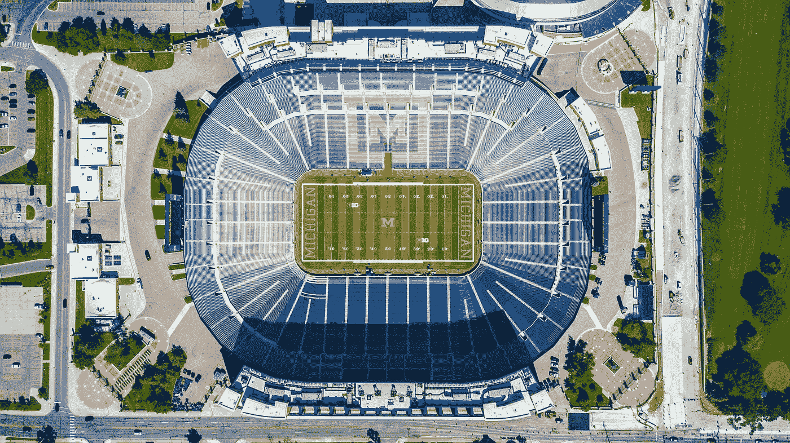

# 为什么传统的数据科学家会学习人工神经网络技术？

> 原文：<https://pub.towardsai.net/why-would-a-traditional-data-scientist-learn-ann-technology-898b5b0786b?source=collection_archive---------4----------------------->

## 把安的重要性展现在 GOFAI 之上

亚历克斯·默茨在 [Unsplash](https://unsplash.com/s/photos/classical-verus-ann?utm_source=unsplash&utm_medium=referral&utm_content=creditCopyText) 上拍摄的照片

数据科学领域始于统计学家在数据分析领域做出的重大贡献。当时所有的机器学习模型都是基于纯统计技术，并且在某种程度上可能使用数学公式。我们今天想到的问题是，这个 go fai(Good Old fashied AI)能否满足当今世界对 AI 的期望。这种传统的机器学习模型开发有哪些局限性？我现在将提出这些限制，以展示 ANN(人工神经网络)技术的优势，以及为什么现代数据科学家需要学习它。

# 当今世界对人工智能的期望

你能想象一个传统的数据科学家通过使用他经过验证的统计模型来开发自动驾驶汽车吗？可以用 GOFAI 开发 Alexa 和 Siri 吗？这些人工智能的应用之所以成为现实，完全是因为人工神经网络技术。如果我们没有 DNN(深度神经网络)，谷歌翻译应用程序将仍然是原始的，网飞也不可能为我们提供关于它今天做什么的建议。

考虑对象检测或人脸识别的情况。几个成功的对象检测模型，如 YOLO，快速 R-CNN，HOG 等，在数千和数百万张图像上进行训练。现在，你要求一个传统的数据科学家通过使用他的统计技术来开发这样一个人工智能应用程序。非常确定和明显的答案是否定的。其次，这些算法甚至无法处理如此大量的数据。

所以，让我们试着去理解 ANN 是如何解决这个问题的。

# 安是什么？

ANN，顾名思义，是大脑神经网络在计算机程序中的代表。像人脑一样，人工神经网络可以通过一些初始启动进行自我学习。这就像我们成年人教我们的孩子如何踢足球。随着更多的练习和对策略的更好理解，孩子最终会成为冠军。

我们用我们的人工网络观察到类似的现象。我们的网络可以用一个小数据集学习，当我们向它提供越来越多的数据时，它会不断改进。在对象检测的情况下，从有限的一组图像开始训练模型。该模型的成功率最初很低，但是当你给它提供更多的图像时，它的准确性就会增加。

现在，让我们试着理解安/DNN 与传统 ML 的不同之处。

# 安在戈费上空

GOFAI 将整个模型开发分为三个主要类别:回归、分类和聚类。所有这些都基于经过充分研究的统计技术。现在，看看安。

我相信你们都知道人工神经网络的架构。该架构包括输入层、输出层和两者之间的几个隐藏层。你——一个数据科学家，一个架构师决定隐藏层数。每层包括几个节点(相当于一个神经元)。作为架构师，您决定每一层的激活功能。激活函数决定何时激发神经元(节点)。您可以选择激活功能，如 sigmoid、tanh、ReLU、Leaky-ReLU 和 Softmax。

我们通过使用反向传播在几个时期内训练网络。在每次迭代中，我们调整每一层的节点权重。为了决定调整权重的方向，我们使用优化和损失函数。我们有多种优化函数可供选择，例如简单梯度下降、随机梯度下降、小批量梯度下降、momentum、adagrad、RMSProp、AdaDelta 和 Adam。

回归和分类所使用的损失函数集是不同的。在回归中，选择 MAE、MSE 或 Huber。在分类上，选择是——二元交叉熵、铰链、多类交叉熵、备用多类交叉熵。

作为一名数据科学家，您只需为您的网络选择一个优化和损失函数。如果选择没有产生令人满意的结果(模型的准确性)，尝试其他功能。我们反复训练网络，直到您达到可接受的准确度水平，此时准确度曲线在多个时期内变平。

您一定已经注意到，整个 ANN 模型开发非常简单，只需要以下三个步骤:

1.  设计架构—层数和每层中的节点数
2.  决定最优化和损失函数
3.  在多个时期训练模型，直到准确度分数饱和

现在，将这与 GOFAI 进行对比，在 go fai 中，你可以在机器学习的每个类别中选择几个算法。对于回归和分类，我们有几种算法可用，作为一名数据科学家，您需要很好地理解这些算法，以决定使用哪一种。或者，您可以使用 AutoML 等工具来自动化整个算法选择过程，并在数据集上生成集成模型。如果谈到聚类，这对数据科学家来说是一项艰巨的任务。如果我可以参考我之前关于集群的[帖子](https://towardsdatascience.com/clustering-a-daunting-task-for-a-data-scientist-5c7f362ccfb8)，你会明白整个集群过程有多复杂。

也就是说，人工神经网络技术肯定更简单，更有前途。是不是意味着要抛弃 GOFAI？

# GOFAI 死了吗？

这个问题的答案是否定的。当你没有足够的数据来训练神经网络模型时，你会回到 GOFAI。在数据隐私规定范围内为模型训练收集数据是最艰巨的任务。因此，很多时候，我们不得不处理中小型数据集，在这种情况下，您不能简单地考虑使用人工神经网络方法进行模型开发。人工神经网络需要庞大的数据集和繁重的计算资源。训练 ANN 模型可能需要几个小时甚至几天的时间。在聚类等领域，人工神经网络无法提供解决方案。所以 GOFAI 没有死。然而，作为一名数据科学家，你需要学习人工神经网络来解决人工智能需要解决的新问题。

# 学习 ANN 技术需要什么？

我上面描述的人工神经网络体系结构很简单。建筑师设计了许多复杂的架构——仅举几个例子:CNN、GAN、RNN、LSTM、变形金刚和 GAN。他们开发每个架构时都有特定的目的。作为一名架构师，您需要理解这些概念和每个概念的目的，以决定使用什么体系结构来解决您的特定问题。如果您基于上述内容设计自己的体系结构，培训将需要大量的资源和时间。

行业巨头已经消耗了大量资源，在庞大的数据集上训练这种模型。幸运的是，他们已经将这些模型公之于众——包括免费使用和商业使用。对于 NLP 开发，您可以选择模型——word 2 vec、Glove、Transformers、BERT 和 GPT。对于图像应用程序，你可以使用任何像 ResNet，VGG16，Inception V3，MobileNet 和 YOLO。数据科学家可以根据自己的目的扩展这些预先训练好的模型。这使得使用人工神经网络技术更加简单。

我现在给你一些使用人工神经网络技术的好处。我还将讨论一些有助于保持 GOFAI 重要性的缺点。

# 人工神经网络的优点/缺点

为了学习预测器和目标之间的非线性关系，传统的数据科学家不得不付出很多努力。相对而言，人工神经网络技术可以轻松地学习非线性和复杂的关系，而不需要数据科学家付出额外的努力。人工神经网络可以处理巨大的数据集，这对 GOFAI 来说是一个严重的限制。虽然一些 GOFAI 算法训练可以并行化，但这不是默认的。分配训练对于安来说是很正常的。人工神经网络的另一个主要优点是内在的特征工程能力。它会自动提取特征。

在缺点方面，ANN 在计算上比 GOFAI 更昂贵。与 GOFAI 相比，它需要更大的数据集。设计性能良好的网络是一项挑战。一些自动化工具，如 AutoKeras、Blobcity AI 和其他工具，可以为数据集设计优化的网络。一个主要的缺点是可解释性。神经网络的功能就像一个黑匣子。你不知道它为什么会有一定的输出。

因此，作为一名数据科学家，这两种技术都很重要。

# 结束语

从上面的讨论中你可以清楚地看到，GOFAI 和 ANN 这两种技术解决了一系列截然不同的人工智能问题。GOFAI 无法解决 ANN 所取得的成就。你不能在 GOFAI 已经建立的地区使用 ANN。如果你属于在统计学和数学方面有很强背景的备受尊敬的传统数据科学家，不要简单地忽视人工神经网络技术。您肯定需要它来应对现代数据世界的挑战。

> 在我即将出版的新书[思考数据科学](https://link.springer.com/book/9783031023620)中，我从数据科学家的角度用了两大章来讲述人工神经网络技术。为了更深入地学习人工神经网络，我向你推荐我的另一本书，[人工神经网络与 TensorFlow 2](https://link.springer.com/book/10.1007/978-1-4842-6150-7) 。

 [## 通过我的推荐链接加入 Medium

### 阅读 Poornachandra Sarang(以及媒体上成千上万的其他作家)的每一个故事。您的会员费直接…

medium.com](https://medium.com/@profsarang/membership)