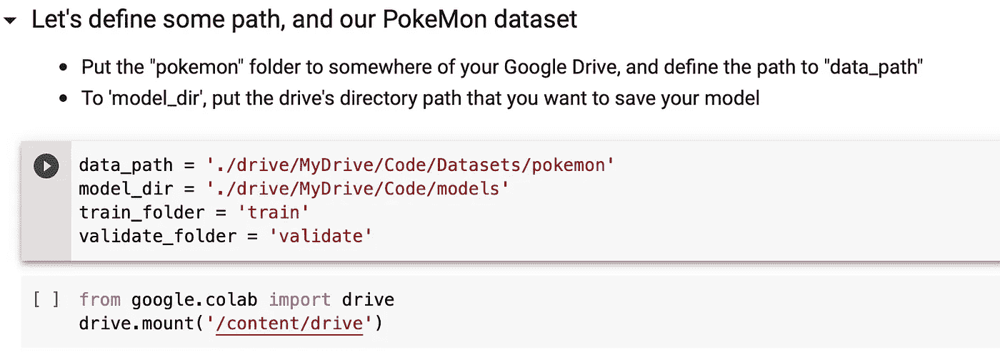
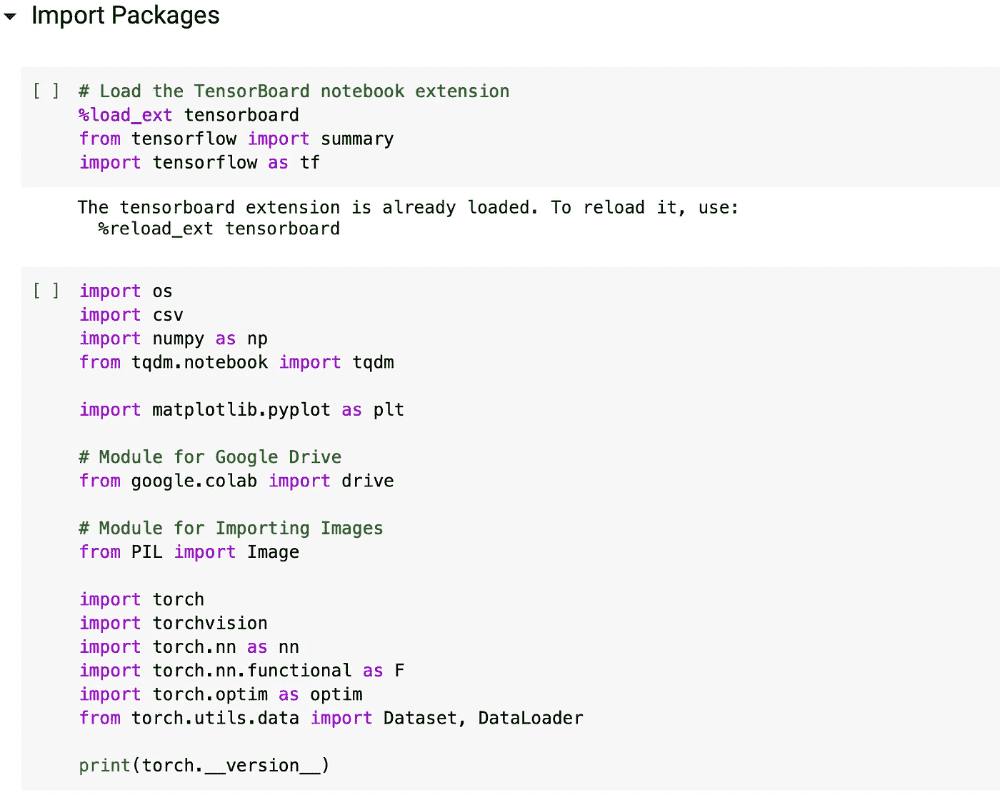
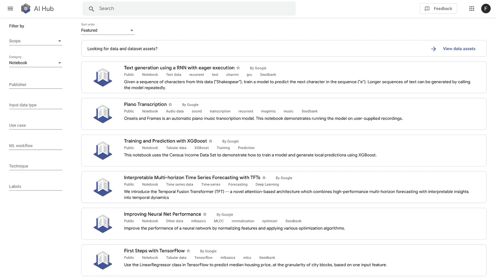

# 为什么应该使用 Google Colab 进行机器学习项目

> 原文：<https://pub.towardsai.net/why-you-should-use-google-colab-for-machine-learning-projects-1d15d747b692?source=collection_archive---------4----------------------->

## [机器学习](https://towardsai.net/p/category/machine-learning)，[编程](https://towardsai.net/p/category/programming)

## Google Colab 如何在专注于重要事情的同时增强程序员的体验。

照片由[奥斯丁·迪斯特尔](https://unsplash.com/@austindistel?utm_source=medium&utm_medium=referral)在 [Unsplash](https://unsplash.com?utm_source=medium&utm_medium=referral) 上拍摄

oogle Colab 是一个非常棒的工具，几乎可以让每个人都有最先进的机器学习体验。Colab 被构建为在浏览器中运行 Python 代码，该浏览器具有高度集成的机器学习工具和库，如 Tensorflow 或 PyTorch。你不需要强大的机器，也不需要深入理解每行代码背后的每一个理论步骤。如果你已经是机器学习领域的专家，Google Colab 也可以为你提供一些重要的改进。免费使用 GPU 是你可以依赖的一个很好的功能，而显卡对于加速机器学习模型的训练过程是必不可少的。

# 1 —谷歌云环境中的 Jupyter 笔记本

Google Colab sheet 实际上是一个运行在 Google Cloud 环境中的 [Jupyter 笔记本](https://jupyter.org)。这意味着您的代码被存储为一个**。Google Drive 文件夹中的 ipynb** 文件。您可以使用任何支持 Jupyter Notebook 的编辑器在本地访问该文件。因此，您的代码不仅可以在 Google Colab 中运行，还可以在您选择的任何 IDE 或编辑器中运行。

此外，在代码行之间添加文本段落从未如此简单明了。这就是原因，许多教育机构已经将 Google Colab 作为他们教授机器学习的主要工具。

作者截图。

另一个值得注意的特性是简化的调试过程。Google Colab 允许在一个单元内执行代码片段，并将所有内容存储在其 RAM 中，而不是在一次迭代中运行全部代码。一旦它没有错误地运行并提供了预期的输出，就可以继续下一个单元。

# 2 —团队合作

代码嵌入在谷歌云环境中，因此它和其他谷歌工具一样可以共享。与使用 Google Docs 或 Google Presentation 时一样，您可以与贡献者共享链接。然后，任何具有写权限的人都可以修改、更正甚至扩展您的代码。这开辟了一种新的方法，可以对同一段代码进行结对编程或一起工作，甚至是在同一时间。

# 3 —性能

说到性能，本地笔记本电脑可以与谷歌的服务进行激烈竞争。你的代码会被运行在谷歌机器上的**图形处理单元(**GPU)和**张量处理单元** (TPUs)加速，而你甚至不用支付一分钱。这使得拥有低预算笔记本电脑的人(尤其是学生)在尝试不同东西的同时，仍然可以从事令人兴奋的机器学习项目。

另一方面，科学家变得越来越独立，尤其是在家庭办公的日子里。他们不一定要到办公室在本地工作站上进行编程，而是可以使用几乎每台连接互联网的计算机在任何他们想去的地方工作。

# 4-没有本地库

每个程序员都知道这一点，初学者经常不得不与之斗争:如果您使用不同的库版本处理不同的项目，库和依赖项会很快导致混乱和麻烦。例如，你的一个同事让你在你的机器上试一下他的代码，仔细检查一下，依赖性就开始失控了。然后，您的代码编辑器找不到正确的版本，即使您已经安装了它。突然，pip 无法卸载您 5 秒前刚刚安装的库，您必须手动删除所有内容。总之，如果没有完美划分的虚拟环境，混乱很快就会让你烦恼。

作者截图。

这个时代终于随着 Google Colab 的出现而告一段落。您可以在代码文件中定义每个库及其版本，而无需处理包并安装它们。在极少数情况下，你的库还没有预装，你可以用“*添加它！pip 安装"*命令*。*

# 5 —谷歌人工智能中心

谷歌的人工智能中心提供了无数机器学习的例子。从教程到简单的实现，你可以找到几乎每一种你正在寻找的机器学习算法。对于那些还没有在特定类型的机器学习算法上花太多时间，但热衷于接触它的人来说，这是完美的。然后，算法的修改可以解决你的问题。

作者截图。

# 6 —版本控制

初学者经常为他们代码的正确版本而挣扎。终端中的 Git 命令，如“stash”、“commit”或“merge”，对于新手来说可能是难以应付的，对于专家来说也是令人烦恼的。Google Colab 摆脱了这一过程，只需简单的两次点击，你的代码就可以保存到 Git。

# 结论

Google Colab 是一个非常棒的工具，尤其是在教育领域。模板可以轻松共享，同时每个人都可以单独使用它们。另一方面，团队合作从未如此简单。只需邀请您的好友加入您的工作，甚至生活在同一个文件。

然而，这也有一个重要的缺点。要获得最佳的谷歌协作体验，你需要依靠你的谷歌硬盘。换句话说，如果你使用的是免费版本，你的内存限制为 15 GB。最近发生在我身上的是，我通过建立几个 CNN 模型超越了这一点。

在牢记这一限制的同时，值得尝试一下 Google Colab！

*你使用 Google Colab 的体验如何？还是还是更喜欢在本地工作？*