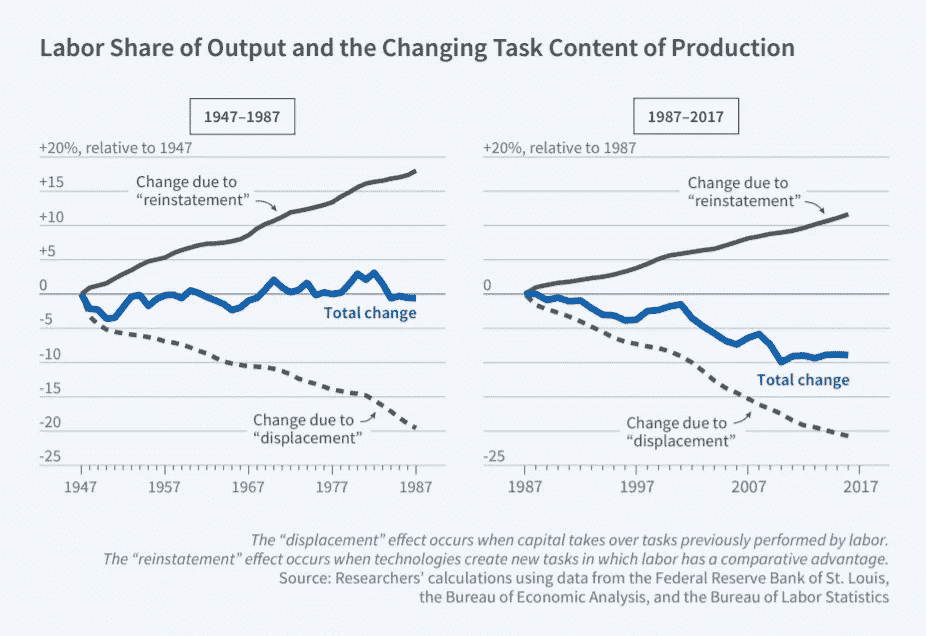

# 机器人会抢走你的工作吗？大概是的。

> 原文：<https://pub.towardsai.net/will-robots-take-your-job-probably-yes-72ad0c49aa69?source=collection_archive---------2----------------------->

## [意见](https://towardsai.net/p/category/opinion)，[技术](https://towardsai.net/p/category/technology)

照片由[亚历克斯·科特利亚斯基](https://unsplash.com/@frantic?utm_source=medium&utm_medium=referral)在 [Unsplash](https://unsplash.com?utm_source=medium&utm_medium=referral) 上拍摄

人类总是处于生产和经济学的中心，而经济学是通过生产创造出来的。没人敢打赌这可能是另一种方式。生活的每一个概念都建立在人类——劳动——是函数的固定输入的假设上，因此所有其他变量都暴露在变化中。随着人类的进步，人类用尽了优化变量的方法，并形成了新型的技术。那么，如果这种优化生产的新方式需要人类去激活会怎么样呢？

在十八世纪，工业化重塑了人们对生产的理解，开创了全球的新时代。建立一种更快速的生产商品的方式，并把工业转向更有利可图的领域，导致贸易被拖入更广阔的领域。效率和生产率的提高以及运输的便利性(铁路、蒸汽机等)。)导致经济增长。这个时代有许多其他独特的后果，但总的来说，它提高了生活质量，给我们的社会在生产过程中一个固定的位置。

利用迄今为止最流行的经济体系——资本主义——经济增长的意外增长产生了一些社会成本，因为它没有得到监管机构和国家的适当管理(主要是因为 Acemoglu 和 Robinson(2012)在*Why Nations fails*中提出的“排他性”机构)。生产商品和经济增长的有效方式导致“劳动力”术语被分为“高收入”和“低收入”群体，这将导致社会冲突，我将这简单地称为社会中的收入不平等。

直到 20 世纪 90 年代末，即使是“低收入”群体也会在生产函数中找到自己的位置，这一点仍然是毫无疑问的——无论条件可能如何——公司和行业都在资助研究，考虑固定的劳动力投入，并充当完美的现状支持者

毕竟，在技术创新之初，经济功能适应得很好，并从创新中受益。由于经济增长，生产变得更有效率，新公司开始出现。因此，到目前为止，从劳工的角度来看，一切似乎都是合理和积极的。

然而，经济学家和科学家之间已经讨论了两个论点。技术创新带来的效率提升会继续增加社会财富吗？还是技术创新会改变生产函数，导致劳动力内部失业？

换句话说，机器人会取代我们的工作吗？

我将从两个最流行的观点来探讨这个问题:

[1]创新和技术的兴起创造了人们可以为之工作的新部门和新领域，因此对就业产生了互补效应

[2]技术和人工智能(尤其是在 2000 年后)正在取代工作岗位，并导致位移、替代效应。

我想和你们分享一些数据，这些数据可以帮助我们更好地检验这两种效应，这样我们就可以模拟未来。

根据 Acemoglu 和 Restrepo (2019 年)的研究，由于“恢复”和“位移”引起的变化相互平衡，导致 1947-1987 年期间总变化在 5%的范围内。然而，技术和其他因素的不可抑制的创新导致位移的变化加快，并逆转了总的变化方向，有利于所谓的“机器人”

从 2003 年开始，产出中的劳动份额超过了 5%的下限，并继续大幅下降。

在不久的将来，我们将看到一些令人兴奋的关于人工智能和新技术产品的消息，这些产品使我们的生活变得更容易。很明显，每个人都会以某种方式享受这些活动。但不幸的是，“机器人将取代我们的工作”的神话可能是真的。

技术和创新对我们的生活有许多其他积极的影响，但在“人类”创造的经济中，使人类失去活力？这真的是我们能处理的事情吗？

显然，从长远来看，这场潜在的灾难会有赢家，一如既往。在这个时代，垄断性科技公司和许多其他个体户将有机会获得更大的发展。“普通士兵”呢？各州足以在全国范围内提供(或分配)这样的财富吗？

因此，即使机器人不能取代人类(我认为我们有足够的证据证明它们会)，机器人至少会对人类劳动产生绝对的影响，因此对人类历史产生绝对的影响。

Acemoglu 博士和雷斯特雷波博士(2019 年)。自动化和新任务:技术如何取代和恢复劳动力。

Acemoglu 博士和 Robinson j . a .(2012 年)。*为什么国家会失败:权力、繁荣和贫困的起源*。