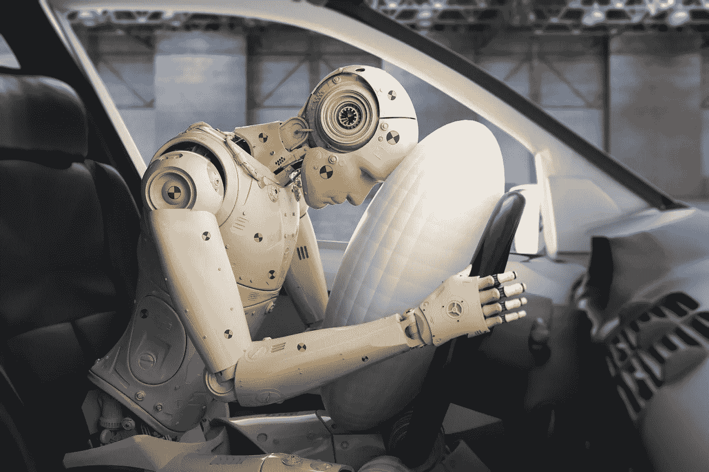

# 自动驾驶汽车真的会减少事故吗？

> 原文：<https://pub.towardsai.net/will-self-driving-cars-really-reduce-accidents-9834fcb088b8?source=collection_archive---------3----------------------->

## [自动驾驶汽车](https://towardsai.net/p/category/self-driving-cars)

照片:PhonlamaiPhoto / iStockPhoto

NHTSA 网站关于自动驾驶汽车的[部分](https://www.nhtsa.gov/technology-innovation/automated-vehicles)以一些引人注目的统计数据开始:

*   2018 年，美国有 36，560 人死于机动车事故
*   90%的机动车事故是由驾驶员失误造成的

此外，根据该网站的说法，今天的紧急制动和行人检测等驾驶辅助技术已经在拯救生命。我绝对相信这是真的。

但我与 NHTSA 意见相左的地方是，我们应该因此抛开谨慎，允许完全自主(即无人驾驶)的自动驾驶汽车在未经充分测试的情况下进入我们的街道和公路。

# 数据原教旨主义

有一种心理学现象被称为**数据原教旨主义**，这个术语是由麻省理工学院教授 Kate Crawford 创造的，她研究人工智能对社会的影响。数据原教旨主义指的是假设计算机说真话的倾向。

当我在耶鲁大学做博士后时，一位教授带着一群学生去贝尔蒙特公园观看纯种赛马。第一场比赛前，他站在看台前，做了一个关于残障的讲座。当然，看台上所有的纽约专家都翻了翻白眼，互相推搡:这家伙懂什么叫差点？然而，当教授拿出一些写在绿色和白色电脑打印纸上的笔记时(这是在 1979 年)，专家们停止了笑声，围过来听他要说什么。关键是人们经常假设计算机总是正确的。

在无人驾驶汽车的情况下，这可能是一个致命的错误。除了我们倾向于错误地假设计算机总是正确的，还有非常好的理由质疑自动驾驶汽车将防止事故的假设。

# 边缘案例

2009 年，机长萨利·苏伦伯格(Sully Sullenberger)刚刚驾驶飞机升空，一群加拿大鹅就拔掉了发动机。飞机距离地面只有 2900 英尺，在飞机撞上地面之前，苏伦伯格和他的副驾驶只有几分钟的机动时间。他们没有接受过这种特定场景的培训；他们只能运用一些基本的规则和常识。为了决定最佳行动方案，他们考虑了乘客在各种坠机方案中幸存的可能性、地面人员受伤的可能性(救援车辆可以很快到达)以及许多其他因素。然后他们英勇地降落在哈德逊河，155 名乘客全部生还，无人受伤。

飞行员接受广泛的训练，但不可能针对每种可能的情况对他们进行训练。对于那些边缘情况——与他们的训练相似但不完全相似的情况——他们必须运用他们的常识和推理能力。

汽车司机也是如此。佛罗里达州克利尔沃特的一名高中生注意到一名妇女在汽车行驶时癫痫发作。这名[学生将她的车](http://www.wtsp.com/article/news/clearwater-senior-saves-seizing-driver-with-heroic-car-crash/67-aebb4a34-2eea-4fc2-bb69-4254b804c4a2)停在了这名女子的车前，没有受伤，只有轻微的保险杠损坏。

我们大多数人在开车时都遇到过意想不到的现象:一只鹿窜上了高速公路。洪水使道路难以或无法通行。一棵树倒了，挡住了路。汽车接近事故现场或施工区。一块巨石落在山路上。一段新沥青没有线条。你注意到或怀疑有黑冰。当你试图爬上结冰的山坡时，汽车可能会打滑。我们都有自己的故事。

我们在驾校并不了解所有这些可能的边缘情况。相反，我们使用我们的常识推理技能来预测行动和结果。如果我们听到附近有冰淇淋车的声音，我们知道要注意朝卡车跑去的孩子。当气温低于 32 度，路上有降水，我们正在下山，我们知道我们需要开得很慢。当我们看到前面的车突然转向，知道司机可能喝醉了或在发短信，我们就会改变驾驶行为。如果一只鹿穿过马路，我们会留意另一只鹿，因为我们的常识告诉我们它们是一家人一起旅行的。当我们看到后面有“超宽负载”标志的卡车时，我们知道要保持安全距离，并格外小心地超过车辆。当我们看到一个球弹到街上时，我们会放慢速度，因为一个孩子可能会跑到街上去追它。如果我们在路上看到一大张纸，我们知道我们可以开车碾过它，但如果我们看到一个大的轮胎碎片，我们知道停下来或绕过它。

没有人知道如何在汽车或计算机中构建常识推理。因为自动驾驶汽车缺乏处理这些意外情况的常识推理能力，所以它们的制造商只有两种选择。他们可以尝试收集人类遇到罕见现象的数据，并使用机器学习来建立能够学习如何单独处理每一种现象的系统。或者他们可以尝试预测每一种可能的情况，并创建一个传统的程序，将这些现象的视觉系统识别作为输入，并告诉汽车在每种情况下应该做什么。对于制造商来说，预测每一种极端情况是很困难的，甚至是不可能的。在企业校园里缓慢行驶的穿梭车也许是可能的，但对于自动驾驶的消费车辆来说，这是很难想象的。

如果汽车不能进行常识性推理来处理所有这些边缘情况，它们怎么能像人类一样驾驶呢？这会造成多少事故？

# 无人驾驶汽车看起来不像人

计算机视觉系统容易出现错误的分类，它们可能会以人们不会被愚弄的方式被愚弄。例如，[研究人员向](http://robbreport.com/motors/cars/hackers-manipulate-teslas-50-mph-2900057/)展示了限速标志的微小变化可能会导致机器学习系统认为该标志显示的是 85 英里/小时，而不是 35 英里/小时。同样，一些中国[黑客欺骗](https://www.cnbc.com/2019/04/03/chinese-hackers-tricked-teslas-autopilot-into-switching-lanes.html)特斯拉的自动驾驶仪改变车道。在这两种情况下，这些微小的变化愚弄了汽车，但没有愚弄人，一个坏演员可能会设计出类似的方法来迷惑汽车或卡车，使其驶离道路或进入障碍物。自动驾驶汽车感知世界的差异导致的担忧远远超出了黑客的范畴。例如，在现实世界驾驶中，许多[特斯拉车主报告说](http://markets.businessinsider.com/news/stocks/trees-are-wreaking-havoc-on-uber-self-driving-car-software-2018-11-1027759300)阴影，例如树枝，经常被他们的汽车视为真实物体。在优步测试车撞死行人的案例中，汽车的物体识别软件首先将行人分类为未知物体，然后是车辆，最后是自行车。我不知道你怎么想，但如果车辆不能 100%准确地识别行人，我宁愿不作为行人或司机上路！

# 安全与交通堵塞

事故只是一个问题。2020 年初，莫斯科举办了无人驾驶汽车[比赛](http://urgentcomm.com/2020/02/18/russian-wake-up-call-from-winter-autonomous-vehicle-av-trials/)。开始后不久，一辆车在红绿灯处熄火了。人类司机会思考这种边缘情况，并决定绕过熄火的汽车。然而，无人驾驶汽车都没有做到这一点，随后发生了三个小时的交通堵塞。我们不希望自动驾驶汽车发生碰撞，但我们也不希望它们每次遇到障碍时都停下来阻碍交通。

高速公路安全保险研究所分析了 5000 起车祸，发现如果自动驾驶汽车不比人类驾驶得更慢、更谨慎，它们只会防止三分之一的撞车事故。如果制造商让汽车开得更慢，结果将是在任何给定的时间点都有更多的汽车上路。这将使我们许多道路上已经非常拥挤的情况更加严重。

# 我们需要测试，而不是假设

NHTSA 似乎准备假设自动驾驶车辆，并允许它们在没有安全证明的情况下上路。不仅仅是 NHTSA。[佛罗里达州法规 316.85](https://flsenate.gov/Laws/Statutes/2018/0316.085) 明确允许自动驾驶汽车的运行，并明确规定驾驶员在自动驾驶汽车中不需要注意路况(例如，驾驶员可以看电影)。它还明确允许自动车辆操作，甚至无需驾驶员在场。除了非自动驾驶汽车的安全要求之外，没有要求制造商通过安全测试。每当汽车、卡车、公共汽车或出租车公司决定他们准备好了，他们就可以自由测试和销售无人驾驶汽车。我在佛罗里达有一栋房子，这让我害怕。许多其他州也在鼓励推出没有安全标准的自动驾驶汽车。

我认为，NHTSA 已经成为数据原教旨主义的牺牲品，并在自驾车比人类司机更安全的错误假设下运营。这很可能导致不必要的事故和交通堵塞。相反，NHTSA 应该要求进行安全测试，证明这些车辆实际上比人类驾驶员更安全。