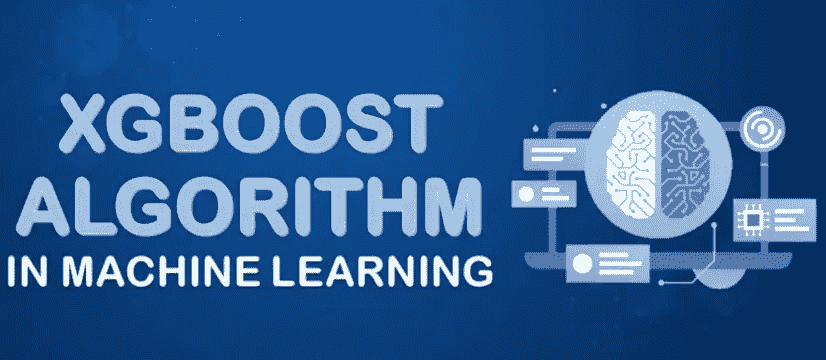
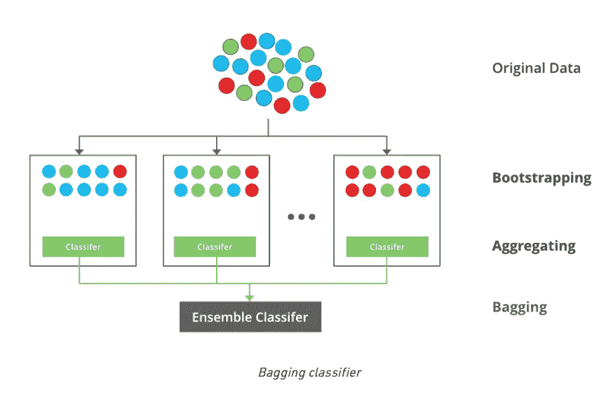
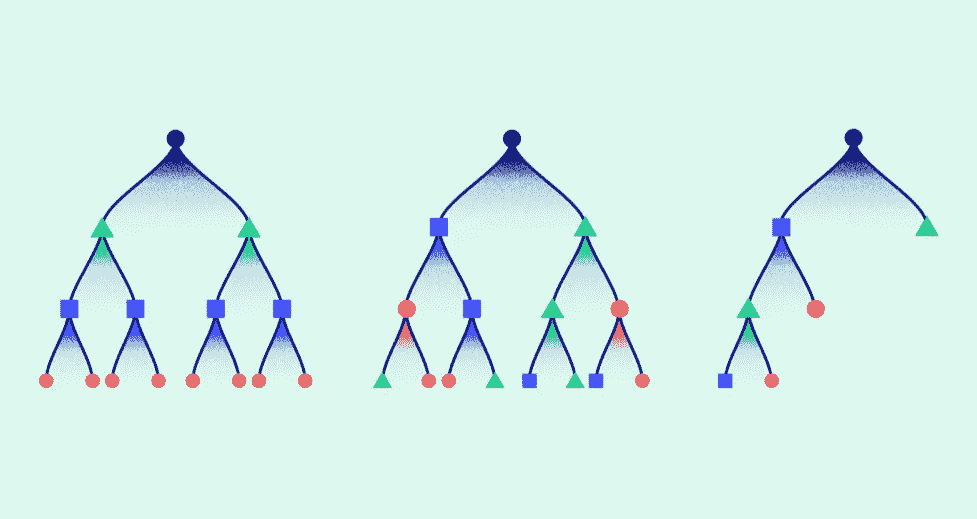
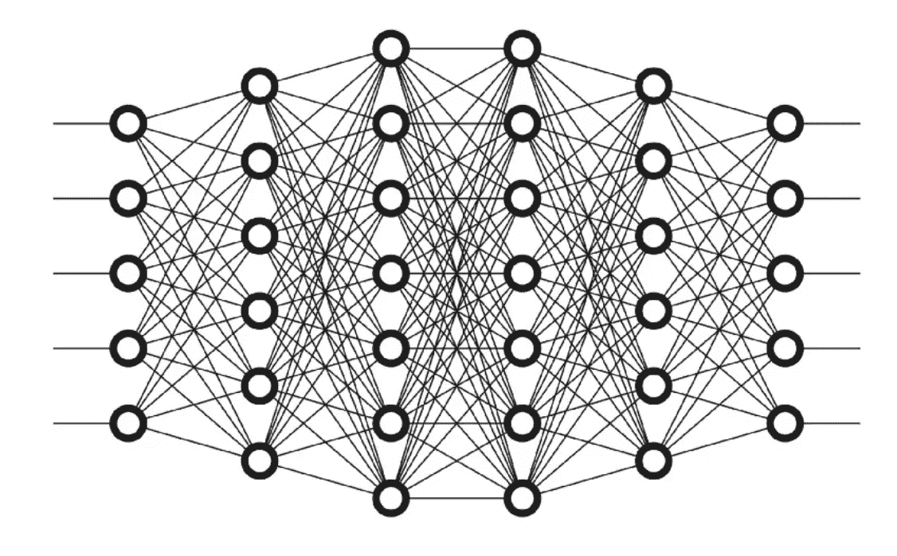
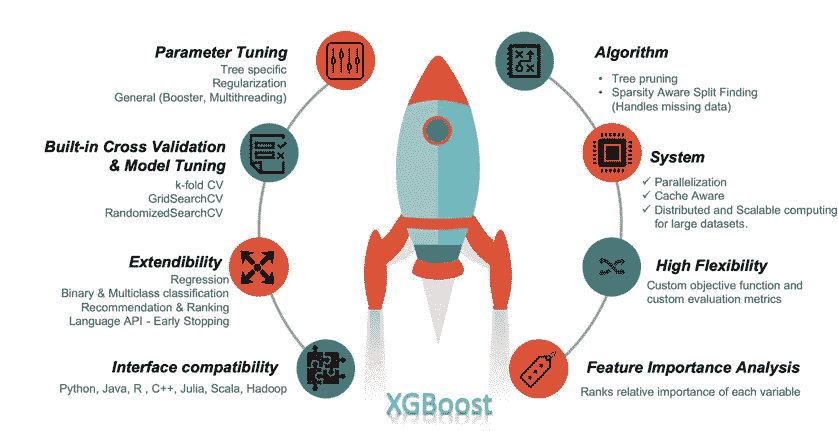
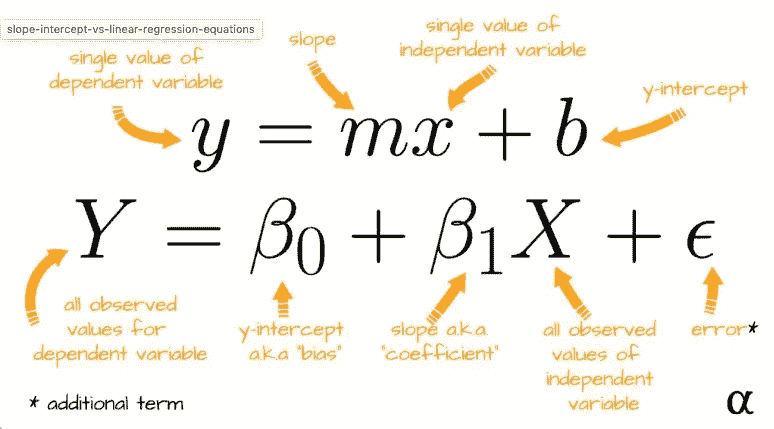

# XGBoost:它在机器学习方面的当前能力和用例

> 原文：<https://pub.towardsai.net/xgboost-its-present-day-powers-and-use-cases-b4cac3d6e1d5?source=collection_archive---------1----------------------->

由 Unsplash 的[附身摄影](https://unsplash.com/@possessedphotography)

用最简单的话来说，XGBoost 就是一棵排序用的序列树。

# 关于 XGBoost 的一些关键事实

> *1。它自动学习输入的模型(通常是特征)，然后拟合一个新的模型(这就是这种方法被称为梯度增强的原因。)*
> 
> *2。它是一种集成学习算法，使用梯度下降框架作为构建梯度下降估计器的基础。梯度增强与梯度下降方法相关联，并且是性能最好的集成方法之一，因为它能够产生准确的结果。*
> 
> *4。它带来了许多性能调整超参数，封装了一个集成学习器的组件，即使在最小的调整下也能很好地执行。*
> 
> *5。从一开始，它就部署了许多性能调整退出，这使它不太适合分类器/回归器算法，但可以很容易地与任何其他算法集成。*
> 
> *6。它配备了许多性能调整提升超参数，这使它成为一个更难掌握的算法。不过，通过调整学习率、决策树的深度和决策树的宽度，并保留其他参数的默认设置，可以很容易地缓解这一问题。*

来自[https://www . nau kri . com/learning/articles/xgboost-algorithm-in-machine-learning/](https://www.naukri.com/learning/articles/xgboost-algorithm-in-machine-learning/)

# XGBoost 支持和允许什么

> *1。梯度增强的一部分，是一种用于梯度下降的机器学习技术，它使用梯度下降算法来构建梯度而不是行梯度，输出是梯度的估计值。*
> 
> *2。这是一种高度优化的算法，通过硬件加速实现了并行化和缓存感知。这是通过内核架构的硬件优化和添加硬件优化技术来实现的，例如核外计算和处理器优化以提高其速度。*
> 
> *3。它具有极强的可移植性，包含了一个框架，使得开发人员可以更容易地在多种编程语言上构建和运行，如 Python、R、C++、Java、Scala、Julia、Perl 等。*
> 
> *4。它配备了几个性能调整超参数(有些因库而异)，使其成为一个通用的算法。尽管如此，只要调整 max_depth 参数(稍后我将通过树修剪更具体地解决这个问题)、神经网络中低方差权重的分布以及决策树本身的深度，就可以获得良好的性能。*

来自 https://www.geeksforgeeks.org/xgboost/[的](https://www.geeksforgeeks.org/xgboost/)

# XGBoost 中的装袋和增压

梯度推进在 Kaggle 非常受欢迎，并取得了成功。通过集成学习(其中输入序列的每个独立分量与目标序列的相应独立分量相结合以形成最终输出)在算法上追求的途径提高了初始结果的概率，从而增加了最终输出是正确输出的机会。

XGBoost 是一种加权分位数草图算法，它使用梯度增强决策树作为其整体实现的基础。要理解 XGBoost 中的加权分位数草图，可以从装袋开始。

**Bagging** 是梯度推进决策树的一种实现；它使用梯度提升决策树作为构建的基础，然后将前一个决策树的特征权重添加到各个决策树的加权和中。这增加了最终决策树的方差，并使其更有可能给出最优解。

**Boosting** 是一组使用梯度下降框架高效构建数据集的梯度加权分位数草图的算法。由于其高度可伸缩性和高效性，升压在许多情况下都非常有效。

在我们试图理解 boosting 的作用之前，让我们先来理解它的组件以及它们是如何组合在一起的。推进包括建立一个所有可能的行动结果的数据集，然后评估每个结果的相对重要性。为了实现输出，我们可以设计元估计器来比较原始数据集的所有组合的相对优点。然后，这些元估计量集合起来，给出原始数据集所有组合的相对价值的最终排名。具体到关于最终排名的后半部分，这是我们开始知道它是如何被称为:梯度推进决策树的地方。

来自[https://analyticsindiamag . com/xgboost-internal-working-to-make-decision-trees-and-deduct-predictions/](https://analyticsindiamag.com/xgboost-internal-working-to-make-decision-trees-and-deduce-predictions/)

# 梯度推进

下面，我打算给出梯度增强的一些应用的简短列表。一般来说，梯度推进是一种更一般形式的推进的特例(如前面提到的梯度推进机器),并配备了几个速度增强功能，使其成为一个更高性能的算法。

1.**图像分类:**通过这个用例的实现，该算法通过将无损基本分类器与有损估计器相结合，自动生成图像的无损表示。这种无损表示可以通过使用内部或外部分裂寻找算法来实现。在内部情况下，内部分裂查找算法通过压缩输入数据来实现。在外部情况下，算法通过使用神经网络来实现。由于它涉及到内部案例和外部案例的链接和整合，因此通过组合多个基本学习算法来解决问题，算法性能的改善是显著的。

2.**人脸验证:**基于这个用例，算法的目标是通过将无损基本分类器与基于基本分类器的所有单独输入的权重的估计器相结合，自动生成人脸的无损表示。这可以通过使用内部或外部分裂查找算法来实现。在内部情况下，内部拆分查找算法是通过根据原始数据集中最左侧条目的值对该条目进行加权来实现的。在外部情况下，该算法也通过激活神经网络来实现。具体到改进，作为基于内部和外部情况的这种特定激活来组合基本学习算法的结果，算法性能再次是显著的。

3.**实例的即时分类和评级:**对于这个用例，算法的目标是为输入数据集的每个新实例生成一个即时分类器/回归器，然后为每个单独的实例生成一个最终分类器/回归器。这可以通过使用内部或外部分裂查找算法来实现。在内部情况下，使用神经网络实现算法。这通过利用网络的并行处理架构显著地提高了算法性能。

4. **Bootstrap Aggregating:** 通过这种算法方法，通过从原始训练数据集中随机抽取并替换 *N 个*样本(或数据)来生成初始样本数据。然后，将初始样本数据乘以训练集的大小，以获得最终样本数据。这部分称为初始样本量。这一部分可以手动完成，也可以借助 Scikit-learn 内置的 Bagging 分类器等库实现自动化。这部分被称为装袋密度，因为它是用于构建最终预测的初始和最终样本的比率。

5.**树修剪:**在这个算法中，目标是通过以连续的方式添加节点来减少输出的方差。这一部分可以手动完成，也可以在库的帮助下自动完成，比如 Scikit-learn 内置的 Max_depth 参数的实现。这部分被称为 max_depth 参数，因为它限制了树中最深节点的深度。简单地说，树修剪是梯度下降算法的一种形式，其中梯度下降算法与学习算法相结合以获得最终输出。

6.**最短路径优先法:**该算法使用最短路径原则来构建树。它从查找数据集中所有最左侧节点的最低共同祖先(CECA)开始。这个 CECA 然后被馈送到后端学习算法，该算法预测具有最高成功概率的结果。

来自[https://www . freecodecamp . org/news/want-to-know-how-deep-learning-works-heres-a-quick-guide-for-every one-1 adeca 88076/](https://www.freecodecamp.org/news/want-to-know-how-deep-learning-works-heres-a-quick-guide-for-everyone-1aedeca88076/)

# 深度学习和梯度提升的集成

深度学习已经成为一项重要的技术和无所不包的主题。随着其在计算机视觉、自然语言处理和迁移学习应用方面的最新进展，显然需要以灵活、快速和高效的方式编写深度学习模型，以使其更具竞争力(并最终更容易适应构建和部署)。进入，梯度推进机(GBM)，梯度推进的实现，在速度和性能上都大放异彩。

深度学习是一种对结构化数据执行人工神经网络(ANN)的技术，它使用梯度下降算法来构建每个单个神经元的加权梯度的梯度势。然后，梯度势被传递到算法的后续层，该算法将梯度势与前一层的结果相结合，以生成最终输出。在我们试图用通俗的术语理解这意味着什么之前，让我们试着理解它的组成部分，以及它们是如何组合在一起成为 DL 算法的。例如，在梯度推进的情况下，我们需要理解梯度和脊状下降之间的区别。梯度下降是它背后的第一个原则，第二个原则是执行它的时间步长。一般来说，两者的区别在于，使用梯度下降时，每次迭代的权重保持不变，并且迭代次数随着每次迭代而增加

深度学习(DL)模型正在与其他算法集成，例如(1)支持向量机(SVM)；(2)梯度增强；(3)四层化和池化。

> *1。梯度推进:这是另一种经常与 SVM 集成的算法，但它不要求存储或获取算法的现有见解。它的工作原理是将前一层的渐变与当前层的渐变相结合。当我们沿着这个梯度前进时，在这个梯度的帮助下，前一层中的误差变得淡化了。这有助于克服数据中固有的差异。*
> 
> *2。池化和四化:这些算法借助彼此的不足而相互改进。简而言之，第一种算法在确定最终输出时将权重添加到结果向量的末端，而第二种算法将权重添加到结果向量的中间和末端。*
> 
> *3。树修剪:计算机视觉、自然语言处理和迁移学习应用的最新进展中反映的算法。今天更是如此，由于各种原因，树修剪已经成为一种常用的技术，它是几乎所有现代 ML 实现中最受欢迎的部分之一。因此，当我需要在分布式加权分位数草图算法的基础上快速构建高性能分类器/回归器时，和/或当我想要在梯度树修剪算法的基础上构建高性能分类器/回归器时，梯度下降是我在 ML 工具箱中首先要做的事情之一。*

来自[https://dzone . com/articles/xgboost-a-deep-dive-into-boosting](https://dzone.com/articles/xgboost-a-deep-dive-into-boosting)

# XGBoost 的力量

它可以处理缺失值和正则化方法，这是大多数其他算法所不具备的；因此，这些使它更加通用和高效。此外，XGBoost 可以处理数据不是很大以至于可以存储在一列中的情况。这使得它更具可扩展性。

这里有一个简单的例子来说明算法是如何工作的。假设我们有数据集；我们从数据集中随机抽取 *N* 个例子(或数据)，其中 *N* 是数据集的大小。这些示例与原始数据集具有相同的一致性(表示)。然后，我们根据这些示例训练模型，并将其性能与原始数据集进行比较。如果模型表现达到预期标准或预期结果，我们就有理由认为模型擅长学习数据集的特征。

## XGBoost 实现了能够处理缺失值的实现，这是大多数其他算法的主要缺点之一，可伸缩性，而不仅仅是时间效率，对于 XGBoost 的采用来说是非常有前途的。

首先，我们来了解一下分类和回归模型的区别。回归模型基于这样一个前提，即有两个主要因素影响特定事件的最终结果(我将在不偏离这个信息丰富的模式的情况下反复重复):(1)样本的特征和(2)导致特定结果的根本原因。这些因素中的每一个都可以分为两组，一组是样本的特征，另一组是潜在的原因。这些因素可以分类如下:

> *1。* ***认知能力:*** *这是指个体对数据进行推理并预测最终结果的能力。它可以分为两部分，一部分是认知能力，另一部分是潜在原因。*
> 
> *2。* ***动机*** *:指个人研究数据和进行分析的动机。它可以分为两部分，一部分是个人研究数据的动机，另一部分是潜在的原因。*
> 
> *3。* ***决策树:*** *这些都是决策树，创建它们是为了预测特定事件的最终结果。它们是通过从数据集中随机抽取并替换* N *个示例(如数据，如之前通过* n *所示)来创建的，其中* N *是数据集的大小。然后将这些决策树与原始数据集进行比较，选出优胜者。这被称为终结概率。*
> 
> *4。* ***交叉验证*** *:这是一种通过确保得到的样本量至少与原始样本量一样大来减少最终结果方差的技术。这通过抵消随机化引入的任何偏差来减少最终结果的方差。*
> 
> *5。* ***交叉验证准确度:*** *这是指交叉验证程序可以纠正原始样本量错误的准确度。这可以分为两部分，一部分是原始样本量的准确性，另一部分是根本原因。*

来自[slope-intercept-vs-linear-regression-equations.jpg](https://www.alpharithms.com/simple-linear-regression-modeling-502111/)

# 一个例子:回归模型

在这种情况下，我们可以将二叉决策树表示为一个梯度推进机器。梯度增压机可分为两大类，固定式和动态式。顾名思义，基本学习算法用于梯度增强算法的训练，而参数调整和迭代改进方法用于结果预测的评估。这种方法的主要缺点是计算成本高。然而，这很容易通过使用并行处理和使用分布式加权分位数草图算法来缓解。

通过使用具有相似性的案例，我们可以在梯度推进框架上部署一个回归模型。我们将使用分布式加权分位数草图算法作为该算法的基础。在该算法中，我们通过使用分布式加权分位数草图算法以自顶向下的方式绘制复杂的数据结构来模拟它。这种自顶向下的方法考虑了树修剪算法的深度优先方法和深度最后方法。这产生了一种更加有效和快速的树修剪方法。

为了理解算法组件以及它们是如何组合成分布式加权分位数草图算法的:

**Bootstrap** :具体到通过其算法管道来定义这一点，基本学习算法是围绕在训练集的帮助下从原始数据集构建集成(或加权)样本的思想而构建的。然后，该集合被馈入结果数据集，并且将结果数据集的结果梯度预测与原始训练集进行比较。这种比较练习有助于算法随着每次迭代而改进。

**采样和平均**:这是任何算法中最重要和最广泛使用的部分之一，通常通过对数据进行平均或采样来减少结果输出的方差(variance)。简单来说，这是对前面所有步骤的输出进行加权平均的过程。这有助于显著减少最终输出的差异。

**并行化和缓存块**:这是算法正则化级别的增强。它增加了一次性处理不适合内存的数据的能力；这种实现可以通过将数据存储在压缩列中来完成(作为一个例子)。

Kaggle 引用 XGBoost 作为“结构数据最精确的建模技术”；你可以通过这个链接直接从 Kaggle 获取 XGBoost 的教程:【https://www.kaggle.com/code/alexisbcook/xgboost/tutorial。

这里可以找到更深层次的探索:[https://arxiv.org/pdf/1603.02754.pdf](https://arxiv.org/pdf/1603.02754.pdf)