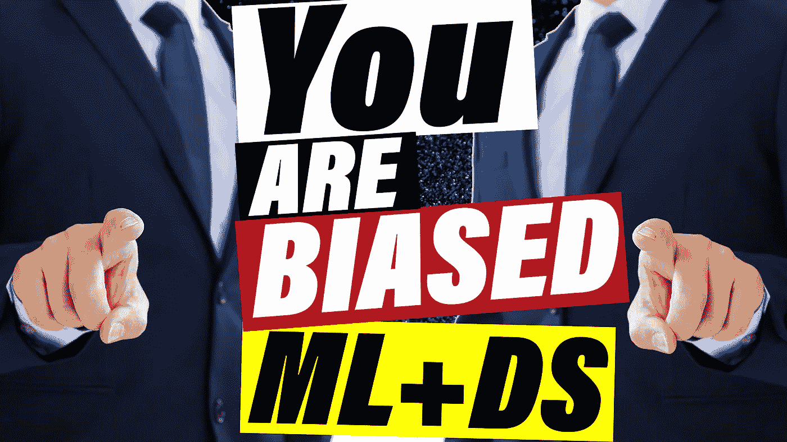

# 你有偏见！

> 原文：<https://pub.towardsai.net/you-are-biased-8637cdc1fb38?source=collection_archive---------0----------------------->

## [数据科学](https://towardsai.net/p/category/data-science)

## 认知偏见如何伤害你的机器学习

图片由作者创建，背景图片的许可由[作者](https://elements.envato.com/man-finger-pointing-forwards-LGNGKCJ)通过 Envato 元素持有

当我告诉你世界上每天有 0.0003%的人死于饥荒，而不是那么多，你是什么感受？让我们重新定义一下，每天世界上每 10000 人中有 3 人死于饥荒。如果说每天有 25000 人死于饥荒，那就更糟了。也许当我说每分钟有 17 人死于饥荒时，你会完全理解这实际上有多可怕。

实际上，所有的数字都同样可怕，但我们的大脑不会这样处理它们。数字还不错。它们有助于正确看待事物，但也可以用来扭曲你的世界观，让你认为某件事的风险比实际高或低得多。

下次你收到统计数据时，问问自己，如果没有相关的数字，这句话的意思是否相同。作为一名数据科学家，你当然也可以在下一次演讲中利用这一点，改写句子。

## 介绍

作为一名数据科学家，如何处理生活中的偏见？没有什么是你能做到完美的，但是一小步可以走很长的路。似乎每个人都有偏见——这是有道理的，新闻中有太多关于多样性问题和科学、技术和工程偏见的痛苦和苦难。这篇文章代表了我对你作为一名数据科学家可以做些什么来最小化你自己的偏见的最佳看法，并希望为他人提供一些价值。

> 只是有时候停下来，再想想这是否真的是你在寻找的真相

**两个免责声明:我绝不是完美的，我可能自己也犯了很多这样的错误，却从来没有意识到。此外，如果您还不是一名出色的数据科学家，这些建议将非常有用。但即便如此，还是有必要不时提醒自己这些偏见——你可能会学到并重新发现你曾经拥有的习惯。**

# **1.框架效应**

**提出问题的方式会影响你对解决方案的想法。如果医生告诉你，不做手术，你的存活几率是 95%，你可能会觉得很棒，不需要做手术。相反，如果他告诉你，如果不做手术，你有 5%的可能会死，你的情绪反应会大不相同，你会立即想到死亡的风险，更有可能完成手术。即使它只是把你的存活率从 95%提高到 97%。**

**我在文章开头给出的介绍性例子是类似问题的另一个例子。你能做什么？每当你碰到一些包含百分比的东西时，一定要把百分比转换成 100-X 和绝对数字，把数字转换成所有可能的格式，这样你的大脑就不会那么容易被愚弄。**

# **2.确认偏差**

**我们都通过自己的眼睛过滤自己的经历。**确认偏见**是以确认或支持某人先前信念的方式搜索、解释、偏爱和回忆信息的倾向。很难摆脱确认偏见，因为我们甚至没有意识到我们正在这样做。我们质疑并仔细检查与我们的信念不符的信息，但却欣然接受并记住与之相符的数据。**

**在你的日常生活中，可能会受到你心情的影响。当你给某人写信时，如果他们没有立即回复，你会认为在信心不足的一天他们不想给你写信，而在平常的一天，他们可能很匆忙，没有时间马上回复。**

**在你的职业生涯中，确认偏差可能会表现为你把所有不符合你的假设的事情都视为异常值。换句话说，你相信某个结果，然后你强迫一切都符合那个解释。你可能会到处扔数学，直到一切都有意义了。历史上最著名的例子可能是这个托勒密体系的例子，它是在公元前 150 年左右发展起来的，它以地球是宇宙中心的假设开始，并从那里计算轨迹。**

**这显然比仅仅接受地球围绕太阳转要复杂得多。但是，他们那个时代的一些最聪明的人开始提出一个极其复杂的数学系统来证实他们的信念。**

**你可以通过定期查看舒适区之外的数据并保持开放的心态来降低这样做的风险。此外，在得出结论之前，试着检查所有的事实，并积极寻找可能有不同意见或专业背景的人。**

# **3.相关性不是因果关系**

**嗯，我想你已经听过很多次了。100%不阅读媒体上的数据科学文章的人会死，这是真的，但这并不意味着你会获得永生，或者会吗？**

**尤其是在数据科学领域，当查看巨大的相关矩阵时，某些东西总是与某些东西相关，这并不意味着一个是另一个的原因。请记住，要对你的机器学习模型产生的结果持怀疑态度，因为你的模型肯定不会产生这样的结果。我亲身经历的最怪异的例子是，我正在研究的一个 NLP 模型，如果文本中的下一个单词以大写字母开头，是的，让我们称之为人工智能，那么患病的几率确实会增加 50%。在更仔细地看了这个问题之后，我意识到一些专业的医生总是把单位(毫克、毫升、公斤)写得很大，而其他的则不是。**

**科学界的一个著名例子是 1999 年，当时流行媒体大量讨论了“开着灯睡觉的儿童更有可能患近视”的说法。然而，后来的研究发现，事实确实并非如此。相反，近视的父母和近视的孩子之间有很大的联系。俄亥俄大学的研究指出，近视的父母更有可能不关灯。**

**你可能已经注意到了，这是一个陷阱。许多非常聪明的人已经陷入，我能给你的唯一建议是停下来，再想想这是否真的有意义，如果你持怀疑态度，进行额外的测试。**

## **4.沉没成本谬论**

**沉没成本谬误是指你因为已经投入的时间和/或金钱而继续投资。如果有人开始读一本书，他们会读完它，即使它很糟糕，因为他们想证明他们最初决定要读它。**

**在你的商业生活中，当你为一个机器学习模型编写了大量代码时，这种情况可能会发生，在内心深处，你可能知道它并不像预期的那样工作，但因为你已经投入了几个月的时间，你会继续投入时间，并希望所有的努力很快都是值得的。**

**为了避免沉没成本谬论，一定要从你现在所处的位置，用你的新知识重新评估你的项目，不要感情用事地抓住已经完成的工作不放。避免类似“我们已经走了这么远了！”。**

## **5.参照效应**

**锚定效应是当你过于依赖你收到的第一条信息。这在谈判中很普遍，如果一个人提到一个数字，另一方可能下意识地倾向于那个数字。当这个概念应用到我们的日常生活中时，我们总是依赖我们得到的第一个解释。**

**假设你和你的数据科学团队讨论了一个你将要开发的新的机器学习模型。你的一个同事立刻说这对神经网络来说是个大问题。既然他这么快就提到了这一点，你的头会立刻转向解释并列出为什么这是正确选择的所有理由。所以你走进这个世界，实现那个神经网络，而从来不看其他东西，但是也许一个随机的森林也可以做得一样好，并且实现起来更容易。也许如果团队的第一个想法是随机森林，你也会这样做。**

**为了避免这样的讨论，请确保在讨论之前让每个人都独立地写下他们的想法，这样不是每个人都会立即接受第一个提出的想法。**

## **5.光环效应**

**当一个想法或一家公司给人留下深刻的第一印象，而这种印象很难在随后变暗时，就会产生光环效应。这就是光环效应。例如，如果你有几个非常成功的应用程序，并拥有数百万用户，你可以很容易地说服你的投资者，其他想法也会一样成功。反过来，这意味着他们给你更多的钱来投资，或者让你围绕它建立一个更大的团队，这将使你更有可能成功。这可能对你有利，也可能对你不利。或者这篇文章给你留下了非常好的第一印象，以至于你立刻认为我的视频一定也很棒。**

**另一个更负面的例子可能是，一些顾问告诉你从一个云提供商换到另一个云提供商可以节省多少钱。每个人都兴奋地开始工作，一旦一些初步的工作已经完成，你开始越来越意识到转变并不容易，可能需要几个月或几年的时间来移动你的代码库。但是由于最初的想法看起来很棒，即使有新的证据，你也无法想象这是个坏主意。在最坏的情况下，沉没成本谬误就会出现，你将面临多年的问题。**

## **结论**

**希望这个讨论让你三思，给你一些心智工具，让你自己意识到自己不完美的生物状态。如果你想要更详细地解释认知偏差的概念以及如何避免它们，我可以强烈推荐《思考，快与慢》这本书。**

**在我作为机器学习工程师和 Python 程序员的职业生涯中，这是我用过的 20 个最重要的包。我确信他们会在你需要的时候帮助你查找可能的解决方案。请务必在下面评论你最喜欢的套餐，这样其他人也可以从你的知识中受益。**

**如果你喜欢这篇文章，我会很高兴在 Twitter 或 LinkedIn 上联系你。**

**一定要看看我的 [YouTube](https://www.youtube.com/channel/UCHD5o0P16usdF00-ZQVcFog?view_as=subscriber) 频道，我每周都会在那里发布新视频。**

**为什么你会后悔在做这个(机器学习)之前训练 ML**